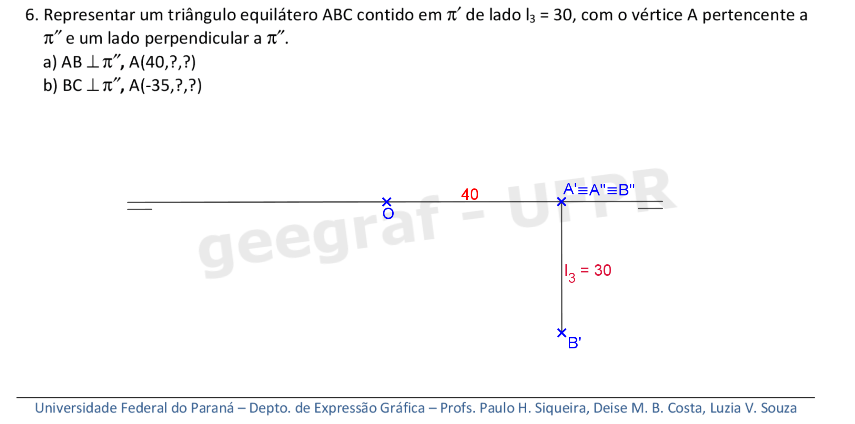
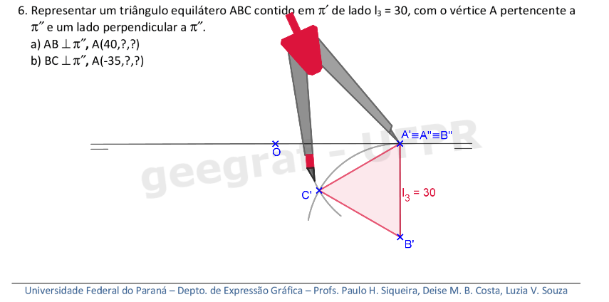
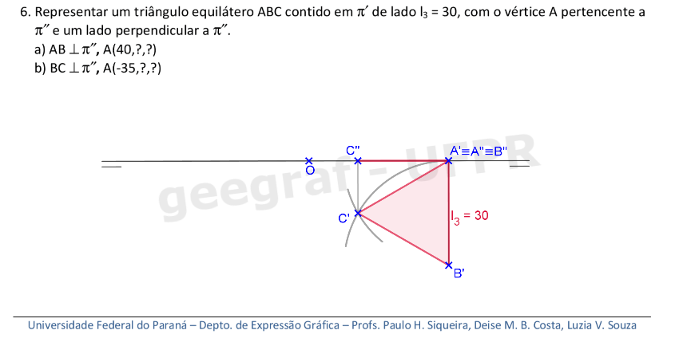
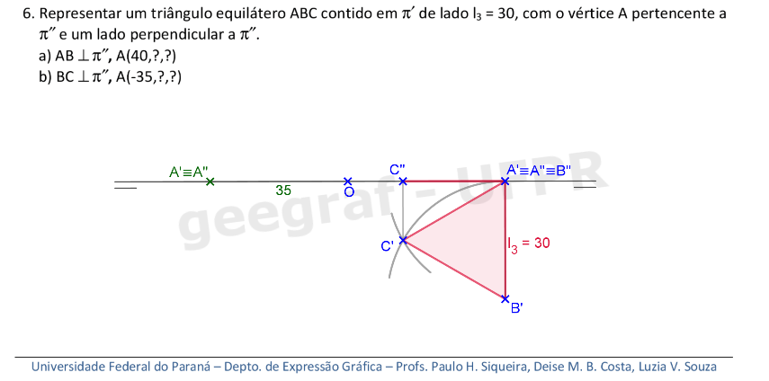
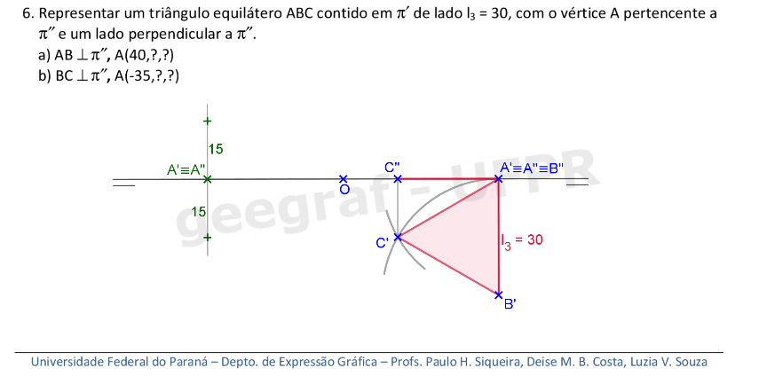
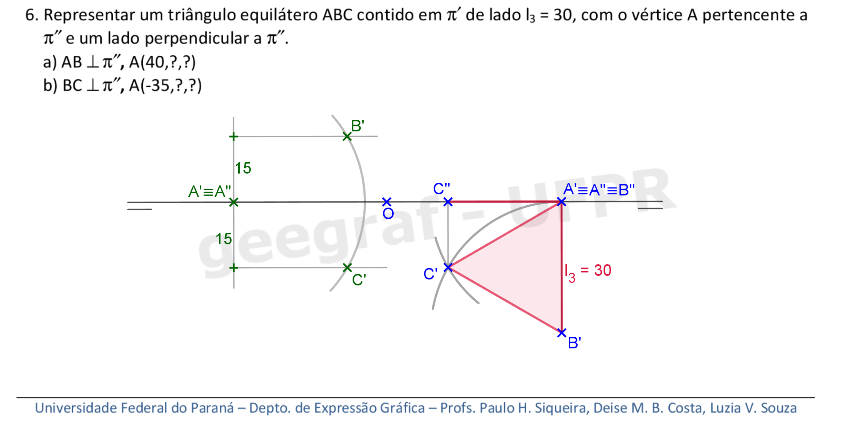
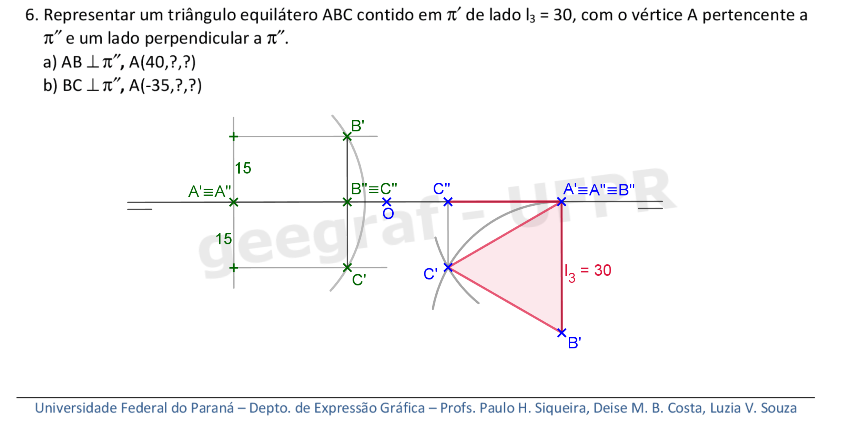
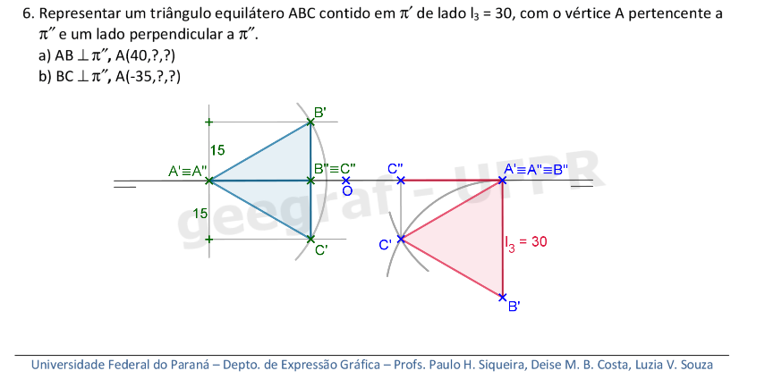
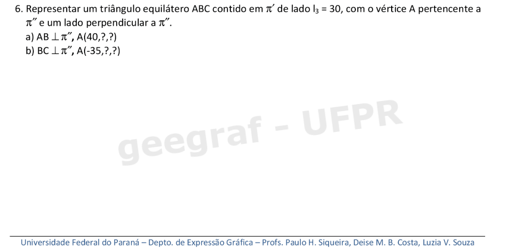

<link rel="stylesheet" href="../../scripts/style.css">

<h2 id="inicio">Respostas do Módulo 2</h2> 
  

Atividade 2.1: exercício 6 da pág. 32

  
  

&#x1f4cf; &#x1f4d0; Resolução

  
Vamos construir as projeções dos triângulos equiláteros usando a propriedade 4 de projeções cilíndricas.

  <ul class="slider">
      <li>
           <input type="radio" id="409" name="sl">
           <label for="409"></label>
           
        <figcaption>No item a, o ponto <b>A</b> tem abscissa 40mm. Como <b>A &isin; &pi;"</b>, então as coordenadas <b>y</b> e <b>z</b> serão nulas, ou seja, <b>A' &equiv; A"</b> sobre a linha de terra. Como <b>AB &perp; &pi;"</b>, podemos construir <b>l3 &perp; x</b>, encontrando a projeção <b>B'</b>.</figcaption>
       </li>
	  <li>
           <input type="radio" id="410" name="sl">
           <label for="410"></label>
           
        <figcaption>Como o triângulo pertence a <b>&pi;'</b>, a primeira projeção está em vg. Pegue com o compasso a medida <b>A'B'</b>...</figcaption>
       </li>
       <li>
           <input type="radio" id="411" name="sl">
           <label for="411"></label>
           
         <figcaption>... e construa os arcos de centros em <b>B'</b>...</figcaption>
       </li>
	   <li>
           <input type="radio" id="412" name="sl">
           <label for="412"></label>
           
         <figcaption>... e <b>A'</b> com raio <b>A'B'</b>. Assim, encontramos a primeira projeção de <b>C</b>.</figcaption>
       </li>
	   <li>
           <input type="radio" id="413" name="sl">
           <label for="413"></label>
           
         <figcaption>A cota de <b>C</b> é nula, pois o triângulo pertence a <b>&pi;'</b>. A primeira projeção fica como o triângulo <b>A'B'C'</b> em vg e a segunda projeção é o segmento <b>A"C"</b>.</figcaption>
       </li>
	   <li>
           <input type="radio" id="414" name="sl">
           <label for="414"></label>
           
         <figcaption>No item b, temos a abscissa -35mm que pode ser marcada à esquerda da origem. Assim, encontramos <b>A' &equiv; A"</b> na linha de terra.</figcaption>
       </li>
	   <li>
           <input type="radio" id="415" name="sl">
           <label for="415"></label>
           
         <figcaption>Como o lado <b>BC &perp; &pi;"</b>, podemos construir uma reta perpendicular à linha de terra que passa por <b>A'</b> e marcar sobre esta reta a metade da medida do lado do triângulo para cima e a metade para baixo da linha de terra.</figcaption>
       </li>
	   <li>
           <input type="radio" id="416" name="sl">
           <label for="416"></label>
           
         <figcaption>Construa as retas paralelas à linha de terra com distância 15mm. Este será o lugar geométrico dos vértices <b>B'</b> e <b>C'</b>.</figcaption>
       </li>
	   <li>
           <input type="radio" id="417" name="sl">
           <label for="417"></label>
           
         <figcaption>Construa o arco de circunferência com centro em <b>A'</b> e raio de 30mm. </figcaption>
       </li>
	   <li>
           <input type="radio" id="418" name="sl">
           <label for="418"></label>
           
         <figcaption>Na interseção do arco com as retas paralelas, encontramos os vértices <b>B'</b> e <b>C'</b>.</figcaption>
       </li>
	   <li>
           <input type="radio" id="419" name="sl">
           <label for="419"></label>
           
         <figcaption>As segundas projeções dos vértices <b>B"</b> e <b>C"</b> coincidem na linha de terra, pois o triângulo tem cotas nulas.</figcaption>
       </li>
	   <li>
           <input type="radio" id="420" name="sl">
           <label for="420"></label>
           
         <figcaption>A primeira projeção fica como o triângulo <b>A'B'C'</b> em vg e a segunda projeção é o segmento <b>A"B"</b>.</figcaption>
       </li>
    </ul>
	
  

  

Atividade 2.2: exercício 2 da pág. 45

  
  

&#x1f4cf; &#x1f4d0; Solução

	

	
	<figcaption></figcaption>
  

