<link rel="stylesheet" href="imagens/style.css">

<h2 id="inicio">Algoritmos, exemplos e aplicações</h2>

Esta página contém os algoritmos e exemplos de algumas Metaheurísticas. Além disso, são mostradas as aplicações destas técnicas em várias áreas da Pesquisa Operacional.

A apostila está disponível no link: <a href="#" target="_blank">apostila de Metaheurísticas</a>

<h3>Redes Neurais Artificiais</h3>

  
Perceptron e Adaline

  
Material da página 1 até a página 19.

   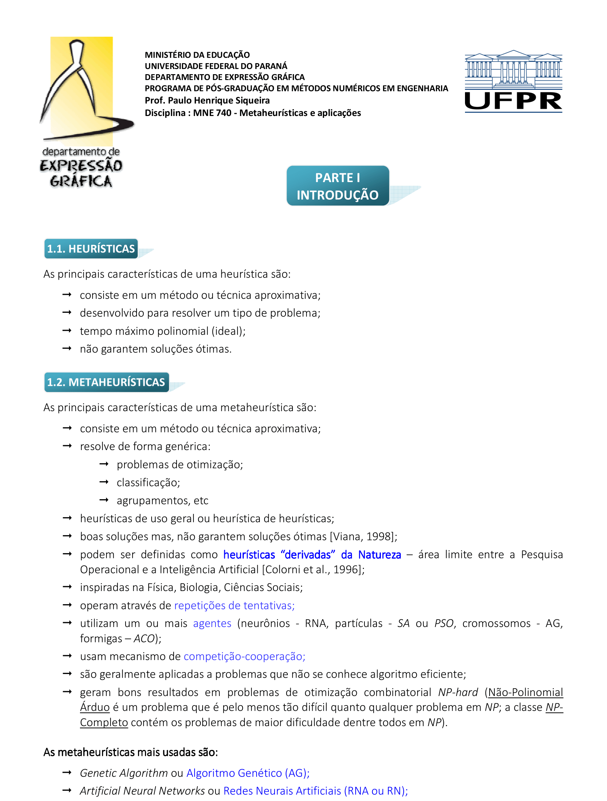
   
<a href="#parte1" class="topo">voltar ao topo</a>

   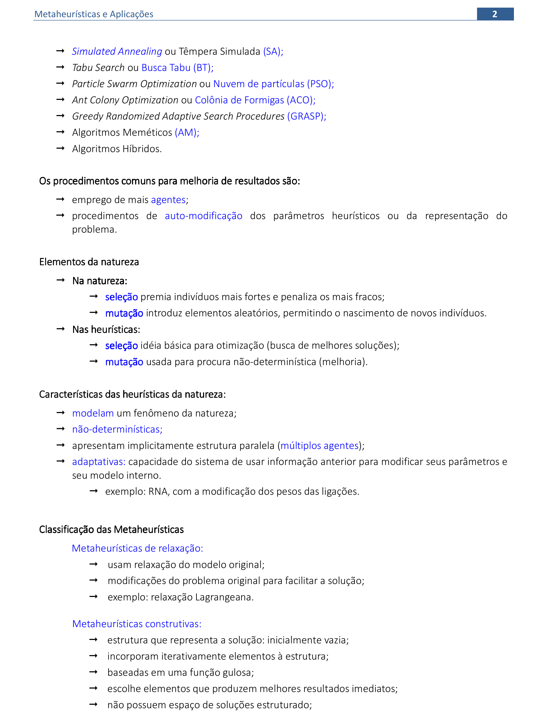
   
<a href="#parte1" class="topo">voltar ao topo</a>

   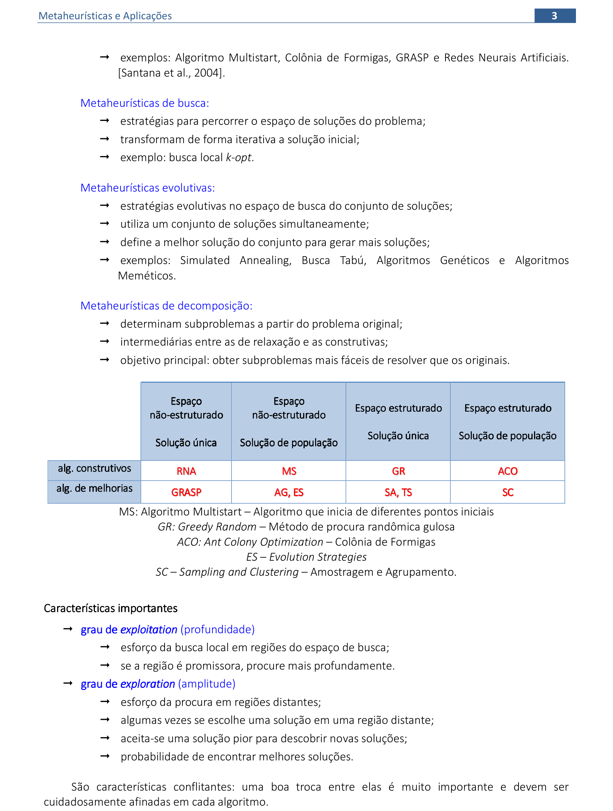
   
<a href="#parte1" class="topo">voltar ao topo</a>

   
   
<a href="#parte1" class="topo">voltar ao topo</a>

   
   
<a href="#parte1" class="topo">voltar ao topo</a>

   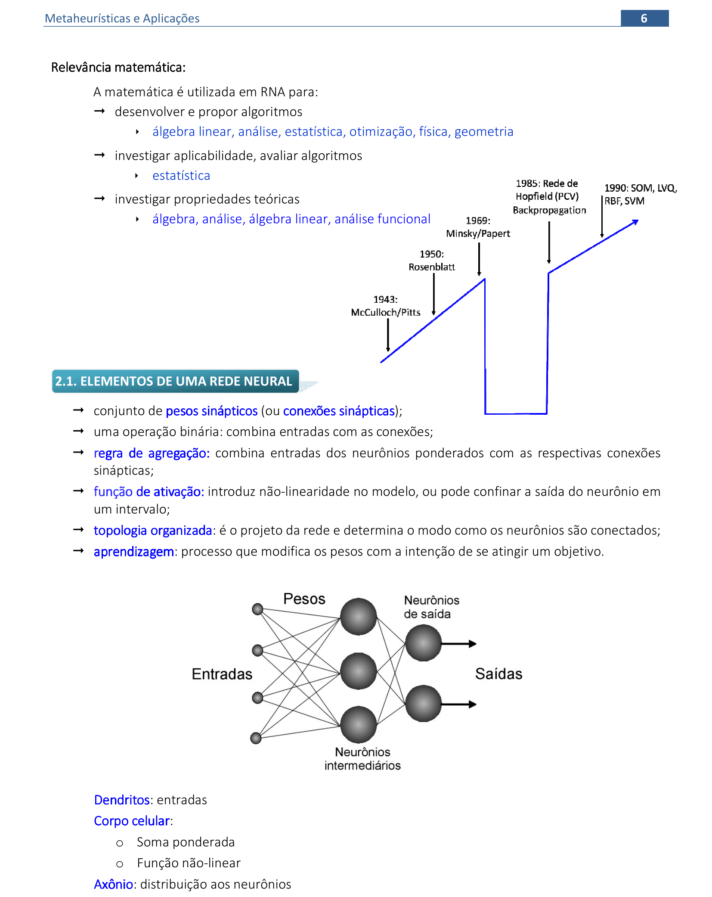
   
<a href="#parte1" class="topo">voltar ao topo</a>

   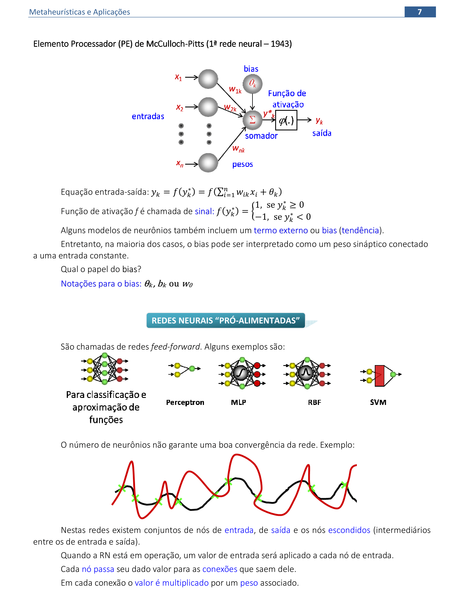
   
<a href="#parte1" class="topo">voltar ao topo</a>

   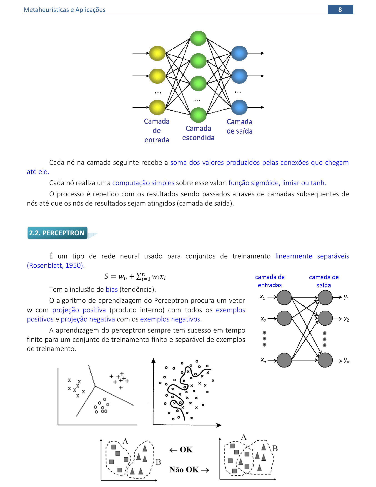
   
<a href="#parte1" class="topo">voltar ao topo</a>

   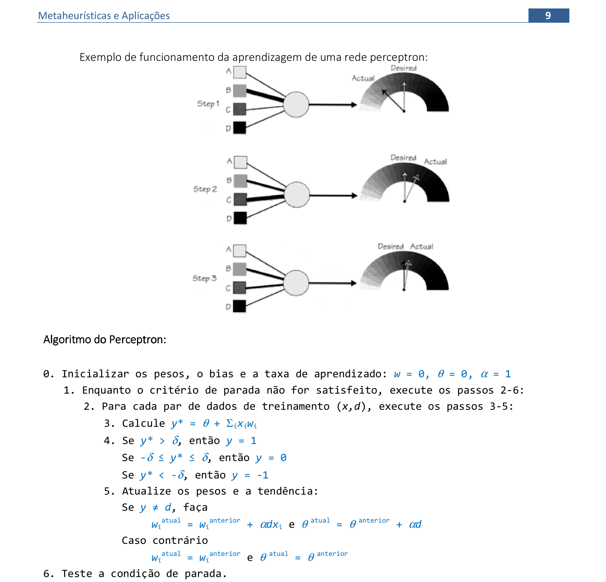
   

&#x1f4c3; Algoritmo comentado

   <figcaption>Algoritmo da Rede Neural Perceptron:
<pre><code>0. Inicializar os pesos, o bias e a taxa de aprendizado: <a alt="vetor de pesos">w = 0</a>, <a alt="bias">&theta; = 0</a>, <a alt="taxa de aprendizagem">&alpha; = 1</a> 
	1. Enquanto o <a alt="critérios de parada mais usados:&#10;número máximo de iterações, erro mínimo alcançado,&#10;ou número máximo de iterações sem modificações nos pesos">critério de parada</a> não for satisfeito, execute os passos 2-6:
		2. <a alt="cada par de treinamento deve ser apresentado à rede">Para cada par de dados de treinamento (x,d)</a>, execute os passos 3-5:
		3. <a alt="calculamos o valor da variável y* sem a função de ativação">Calcule y* = &theta; + &sum;ixiwi</a> 
		4. <a alt="Neste passo, calculamos a função de ativação em y*">Se y* &gt; &delta;, então y = 1</a> 
		   Se -&delta; ≤ y* ≤ &delta;, então y = 0
		   Se y* &lt; -&delta;, então y = -1 
		5. <a alt="A atualização dos pesos só é feita quando a rede erra a classificação">Atualize os pesos e a tendência:</a>
		   Se y ≠ d, faça
		     wiatual = wianterior + &alpha;dxi e &theta;atual = &theta;anterior + &alpha;d 
		   Caso contrário
		     wiatual = wianterior e &theta;atual = &theta;anterior
6. <a alt="Neste passo, podemos calcular o erro quantitativo da rede">Teste a condição de parada.</a>

</code></pre></figcaption>
   

   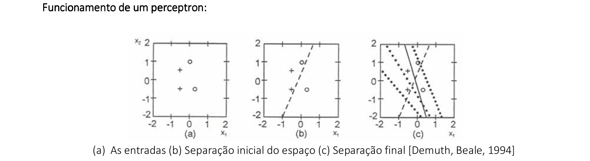
   
<a href="#parte1" class="topo">voltar ao topo</a>

   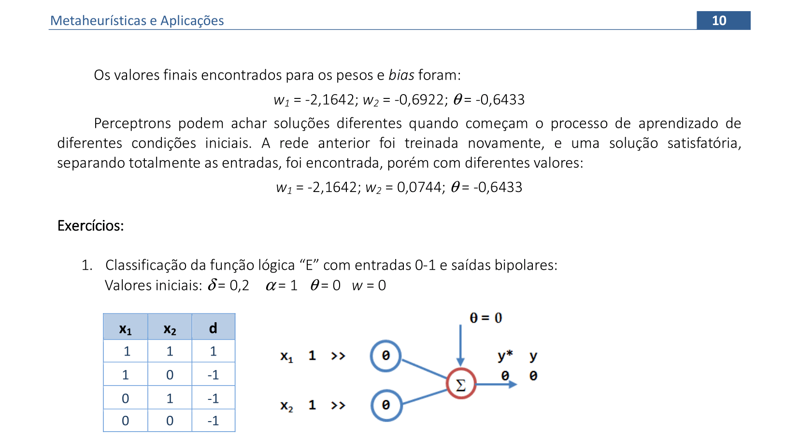
   

&#x1f4c3; Resolução: 1&ordf; e 2&ordf; iterações

	
Vamos acompanhar os cálculos e as interpretações geométricas das 2 primeiras iterações deste exercício da Rede Neural Perceptron.

	  <ul class="slider">
		  <li>
			   <input type="radio" id="001" name="sl" checked>
			   <label for="001"></label>
			   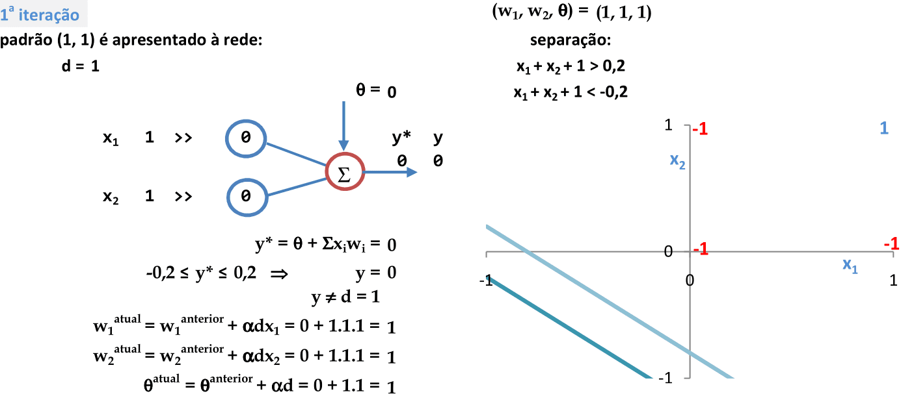
			   <figcaption>Apresentação do primeiro padrão para a rede (x1, x2) = (1, 1). Como y = &theta; + x1w1 + x2w2 = 0 + 1.0 + 1.0 = 0 &ne; d = 1, então os pesos são atualizados (passo 5 do algoritmo).</figcaption>
		   </li>
		   <li>
			   <input type="radio" id="002" name="sl">
			   <label for="002"></label>
			   
			   <figcaption>Os coeficientes de w1, w2 e &theta; definem as equações das retas usadas para a classificação. O parâmetro &delta; cria uma região de indefinição para a classificação.</figcaption>
		   </li>
		   <li>
			   <input type="radio" id="003" name="sl">
			   <label for="003"></label>
			   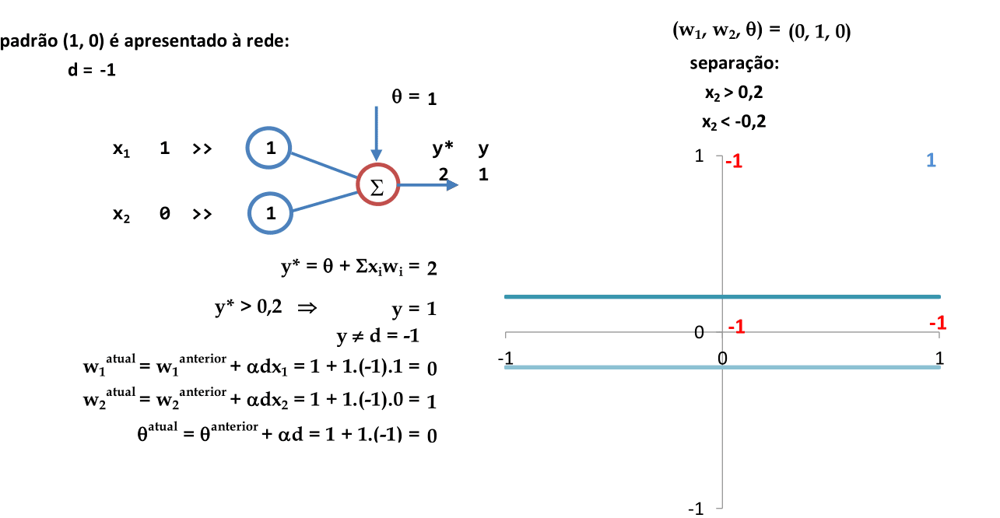
			   <figcaption>Apresentação do segundo padrão para a rede (1, 0). Como y = &theta; + x1w1 + x2w2 = 1 + 1.1 + 0.1 = 2 &ne; d = -1, então os pesos são atualizados.</figcaption>
		   </li>
		   <li>
			   <input type="radio" id="004" name="sl">
			   <label for="004"></label>
			   
			   <figcaption>Note que as equações definidas com os coeficientes de w1, w2 e &theta; ainda não classificam corretamente todos dos padrões.</figcaption>
		   </li>
		   <li>
			   <input type="radio" id="005" name="sl">
			   <label for="005"></label>
			   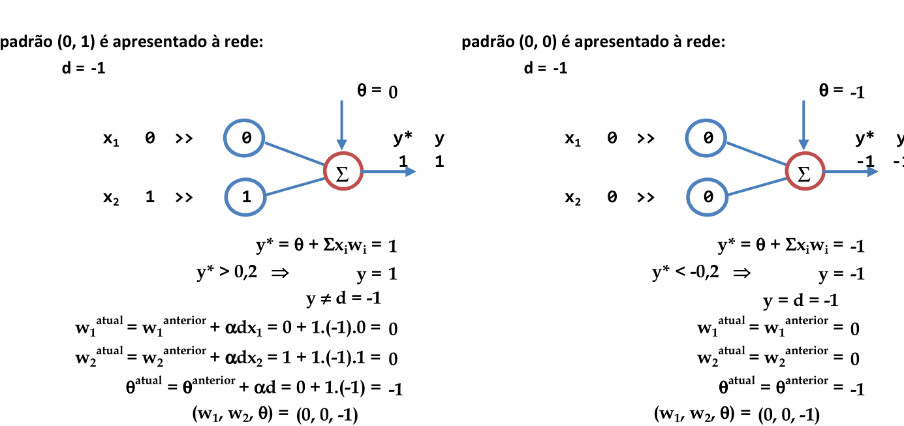
			   <figcaption>Apresentação do terceiro padrão para a rede (0, 1). Como y &ne; d, então os pesos são atualizados. Como os coeficientes das variáveis x1 e x2 ficaram nulos, não temos a interpretação geométrica nesta apresentação de padrões.</figcaption>
		   </li>
		   <li>
			   <input type="radio" id="006" name="sl">
			   <label for="006"></label>
			   
			   <figcaption>Apresentação do último padrão para a rede (0, 0). Como y = d, então os pesos são mantidos. Usando esta combinação de pesos, podemos calcular o erro da primeira iteração.</figcaption>
		   </li>
		   <li>
			   <input type="radio" id="006a" name="sl">
			   <label for="006a"></label>
			   
			   <figcaption>Usamos a combinação de pesos (w1 = 0, w2 = 0, &theta; = -1) da última apresentação de padrões para calcular o erro. Apenas o primeiro padrão está classificado incorretamente: logo, o erro quantitativo nesta primeira iteração é de 25%.</figcaption>
		   </li>
		   <li>
			   <input type="radio" id="007" name="sl">
			   <label for="007"></label>
			   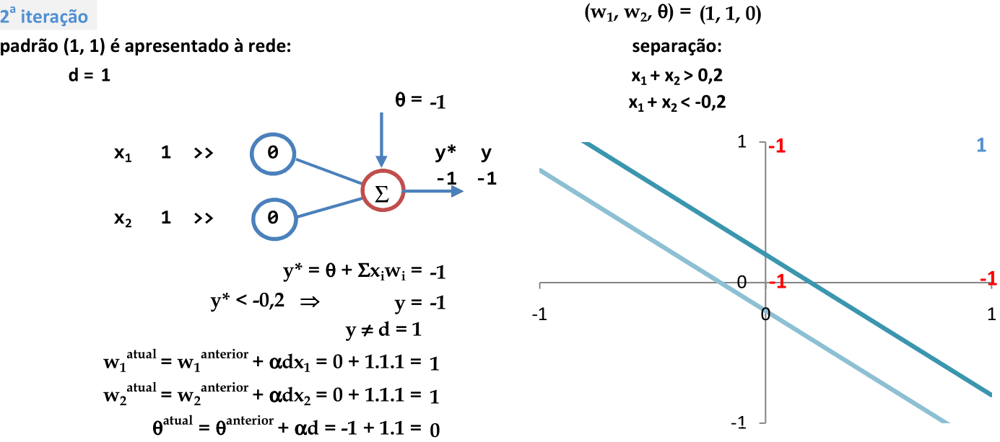
			   <figcaption>Recomeçamos a apresentação de cada padrão para a rede na próxima iteração. O primeiro padrão (1, 1) é apresentado à rede, com a combinação de parâmetros (0, 0, 1). Como y &ne; d, então os pesos são atualizados.</figcaption>
		   </li>
		   <li>
			   <input type="radio" id="008" name="sl">
			   <label for="008"></label>
			   
			   <figcaption>Note que as equações definidas com os coeficientes de w1, w2 e &theta; ainda não classificam corretamente todos dos padrões.</figcaption>
		   </li>
		   <li>
			   <input type="radio" id="009" name="sl">
			   <label for="009"></label>
			   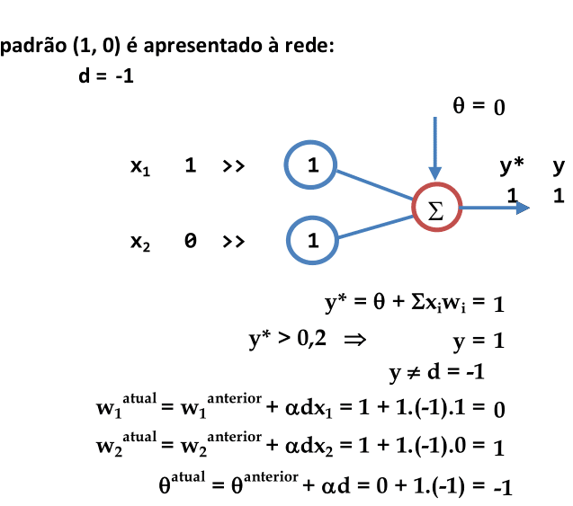
			   <figcaption>Apresentação do segundo padrão para a rede (1, 0). Como y &ne; d, então os pesos são atualizados.</figcaption>
		   </li>
		   <li>
			   <input type="radio" id="010" name="sl">
			   <label for="010"></label>
			   
			   <figcaption>Note que as equações definidas com os coeficientes de w1, w2 e &theta; ainda não classificam corretamente todos dos padrões.</figcaption>
		   </li>
		   <li>
			   <input type="radio" id="011" name="sl">
			   <label for="011"></label>
			   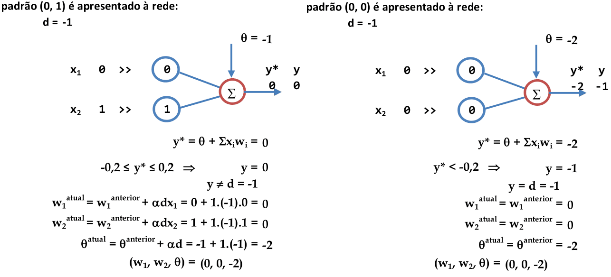
			   <figcaption>Apresentação do terceiro padrão para a rede (0, 1). Como y &ne; d, então os pesos são atualizados.</figcaption>
		   </li>
		   <li>
			   <input type="radio" id="012" name="sl">
			   <label for="012"></label>
			   
			   <figcaption>Apresentação do último padrão para a rede (0, 0). Como y = d, então os pesos são mantidos. Usando esta combinação de pesos, podemos calcular o erro da segunda iteração.</figcaption>
		   </li>
		   <li>
			   <input type="radio" id="012a" name="sl">
			   <label for="012a"></label>
			   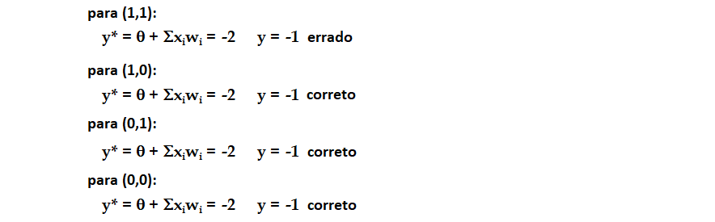
			   <figcaption>Usamos a combinação de pesos (w1 = 0, w2 = 0, &theta; = -2) da última apresentação de padrões para calcular o erro. Apenas o primeiro padrão está classificado incorretamente: logo, o erro quantitativo da segunda iteração é de 25%.</figcaption>
		   </li>
		</ul>
		
  

  

&#x1f4c3; Resolução: 3&ordf; ~ 9&ordf; iterações

	
Vamos acompanhar os resultados e as interpretações geométricas das 7 próximas iterações deste exercício da Rede Neural Perceptron.

	  <ul class="slider">
		  <li>
			   <input type="radio" id="013" name="sl">
			   <label for="013"></label>
			   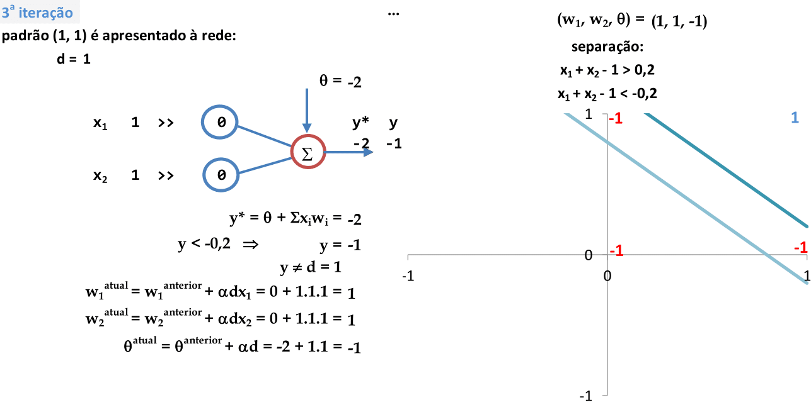
			   <figcaption>Recomeçamos a apresentação de cada padrão para a rede na próxima iteração. O primeiro padrão (1, 1) é apresentado à rede, com a combinação de parâmetros (0, 0, -2). Como y &ne; d, então os pesos são atualizados.</figcaption>
		   </li>
		   <li>
			   <input type="radio" id="014" name="sl">
			   <label for="014"></label>
			   
			   <figcaption>Os coeficientes de w1, w2 e &theta;  definem as equações das retas usadas para a classificação. Note que temos 2 padrões classificados corretamente e os outros 2 na região de indefinição.</figcaption>
		   </li>
		   <li>
			   <input type="radio" id="015" name="sl">
			   <label for="015"></label>
			   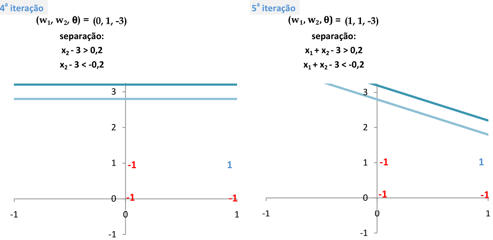
			   <figcaption>Fazendo os cálculos da mesma forma mostrada nas duas primeiras iterações, temos as classificações da quarta e da quinta iteração. Nestes casos, 3 padrões estão classificados corretamente.</figcaption>
		   </li>
		   <li>
			   <input type="radio" id="016" name="sl">
			   <label for="016"></label>
			   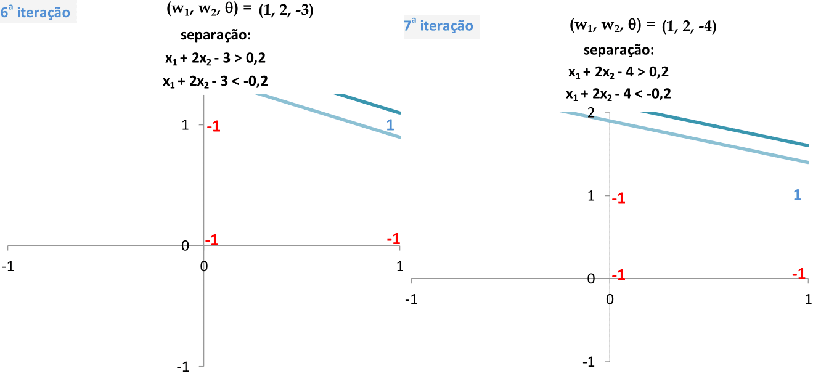
			   <figcaption>Fazendo os cálculos da mesma forma mostrada nas duas primeiras iterações, temos as classificações da sexta e da sétima iteração. Nestes casos, 3 padrões estão classificados corretamente.</figcaption>
		   </li>
		   <li>
			   <input type="radio" id="017" name="sl">
			   <label for="017"></label>
			   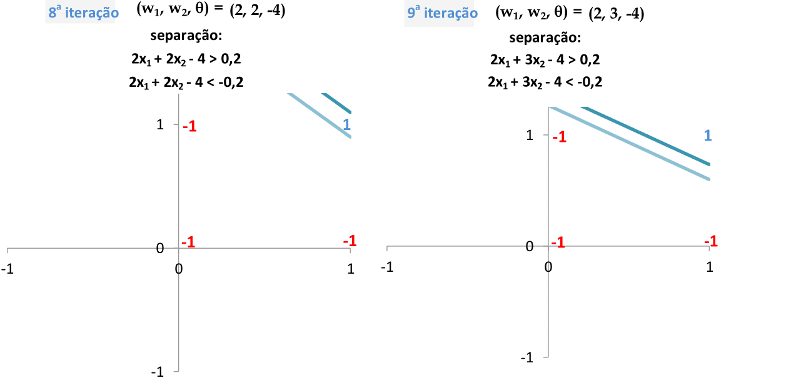
			   <figcaption>Fazendo os cálculos da mesma forma mostrada nas duas primeiras iterações, temos as classificações da oitava e da nona iteração. Os padrões ficam separados corretamente com a combinação de pesos da nona iteração.</figcaption>
		   </li>
		   <li>
			   <input type="radio" id="018" name="sl">
			   <label for="018"></label>
			   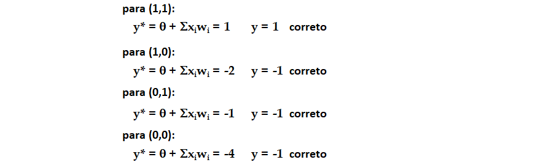
			   <figcaption>Usamos a combinação de pesos (w1 = 2, w2 = 3, &theta; = -4) da última apresentação de padrões para calcular o erro. Todos os padrões estão classificados corretamente. Logo, podemos finalizar o processo de aprendizagem desta Rede Neural.</figcaption>
		   </li>
		</ul>
		
  

  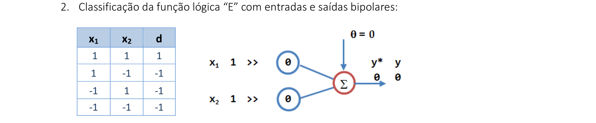
  

&#x1f4c3; Resolução

	
Vamos acompanhar os resultados e as interpretações geométricas deste exercício da Rede Neural Perceptron. Vamos usar entradas e saídas bipolares.

	  <ul class="slider">
		  <li>
			   <input type="radio" id="019" name="sl">
			   <label for="019"></label>
			   
			   <figcaption>O primeiro padrão (1, 1) é apresentado à rede. Como y &ne; d, então os pesos são atualizados.</figcaption>
		   </li>
		   <li>
			   <input type="radio" id="020" name="sl">
			   <label for="020"></label>
			   
			   <figcaption>Usando os coeficientes de w1, w2 e &theta; que definem as equações das retas usadas para a classificação, temos apenas 1 padrão classificado corretamente.</figcaption>
		   </li>
		   <li>
			   <input type="radio" id="021" name="sl">
			   <label for="021"></label>
			   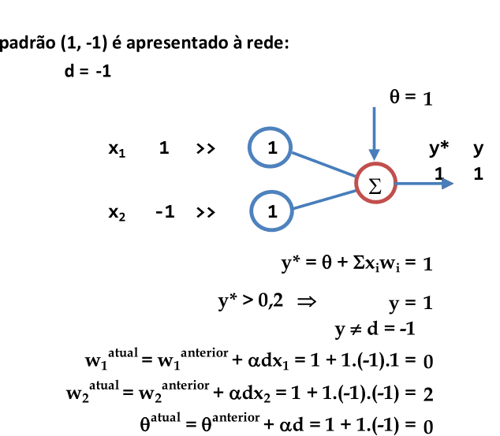
			   <figcaption>O segundo padrão (1, -1) é apresentado à rede. Como y &ne; d, então os pesos são atualizados.</figcaption>
		   </li>
		   <li>
			   <input type="radio" id="022" name="sl">
			   <label for="022"></label>
			   
			   <figcaption>Usando os coeficientes de w1, w2 e &theta; que definem as equações das retas usadas para a classificação, temos 2 padrões classificados corretamente.</figcaption>
		   </li>
		   <li>
			   <input type="radio" id="023" name="sl">
			   <label for="023"></label>
			   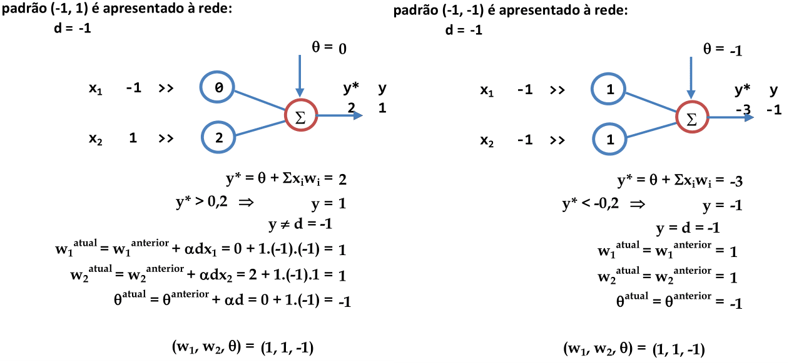
			   <figcaption>O terceiro padrão (-1, 1) é apresentado à rede. Como y &ne; d, então os pesos são atualizados. Na apresentação do último padrão, temos que y = d e os valores dos pesos são mantidos.</figcaption>
		   </li>
		   <li>
			   <input type="radio" id="024" name="sl">
			   <label for="024"></label>
			   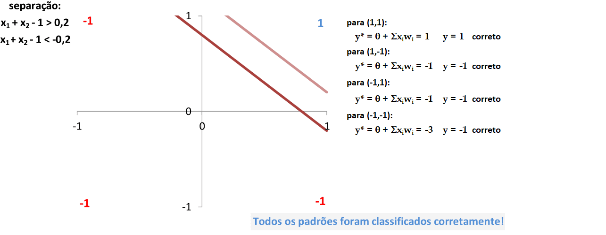
			   <figcaption>Usamos a combinação de pesos (w1 = 1, w2 = 1, &theta; = -1) da última apresentação de padrões para calcular o erro. Todos os padrões estão classificados corretamente. Logo, podemos finalizar o processo de aprendizagem desta Rede Neural.</figcaption>
		   </li>
		</ul>
		
  

  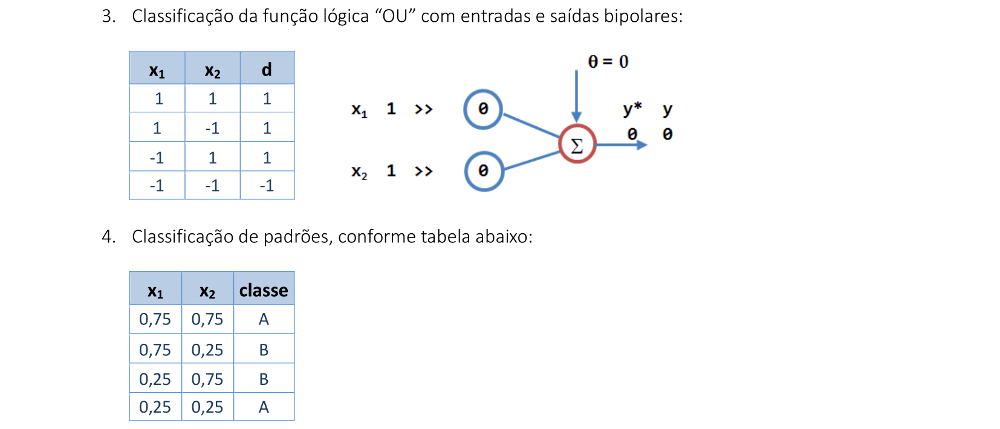
   
<a href="#parte1" class="topo">voltar ao topo</a>

  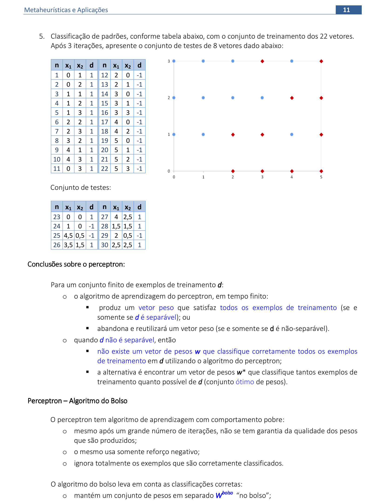
   
<a href="#parte1" class="topo">voltar ao topo</a>

  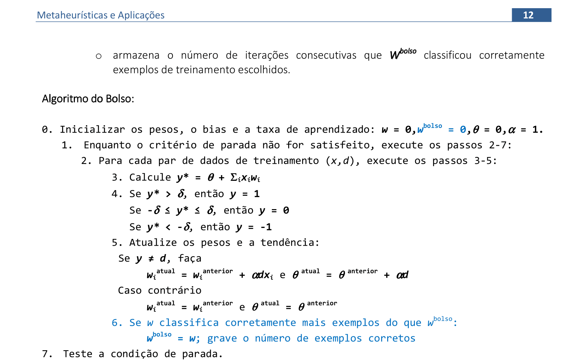
  

&#x1f4c3; Algoritmo comentado

   <figcaption>Algoritmo da Rede Neural Perceptron com bolso:
<pre><code>0. Inicializar os pesos, o bias e a taxa de aprendizado: w = 0, <a alt="vetor de pesos do bolso">wbolso = 0</a>, &theta; = 0, &alpha; = 1 
	1. Enquanto o critério de parada</a> não for satisfeito, execute os passos 2-7:
		2. Para cada par de dados de treinamento (x,d), execute os passos 3-5:
		3. Calcule y* = &theta; + &sum;ixiwi
		4. Se y* &gt; &delta;, então y = 1
		   Se -&delta; ≤ y* ≤ &delta;, então y = 0
		   Se y* &lt; -&delta;, então y = -1 
		5. Atualize os pesos e a tendência:
		   Se y ≠ d, faça
		     wiatual = wianterior + &alpha;dxi e &theta;atual = &theta;anterior + &alpha;d 
		   Caso contrário
		     wiatual = wianterior e &theta;atual = &theta;anterior
		6. <a alt="guardamos no bolso a melhor combinação de pesos&#10;esta tática é muito usada nas Metaheurísticas para não perder bons pesos">Se w classifica corretamente mais exemplos do que wbolso:</a>  
		     wbolso = w; grave o número de exemplos corretos 
6. Teste a condição de parada.
</code></pre></figcaption>
   

   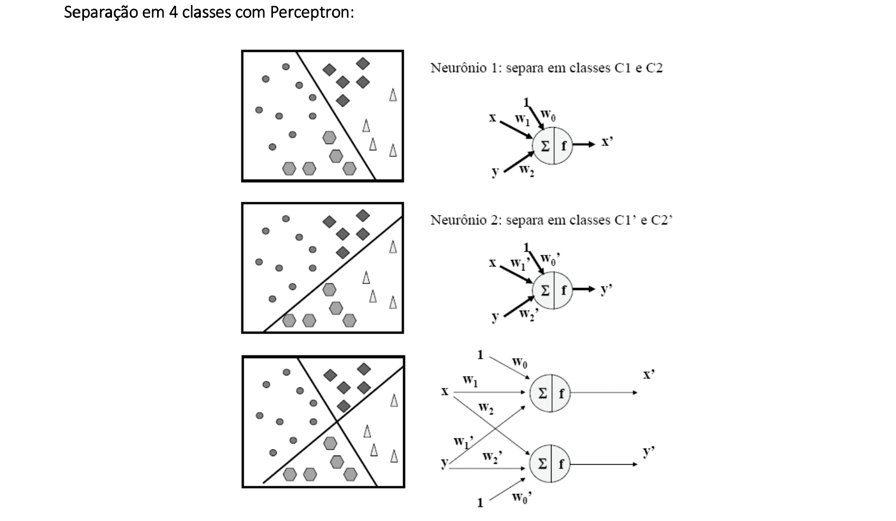
   <figcaption>Para separar os dados em mais classes, podemos inserir mais neurônios na Rede Neural</figcaption>
   
<a href="#parte1" class="topo">voltar ao topo</a>

   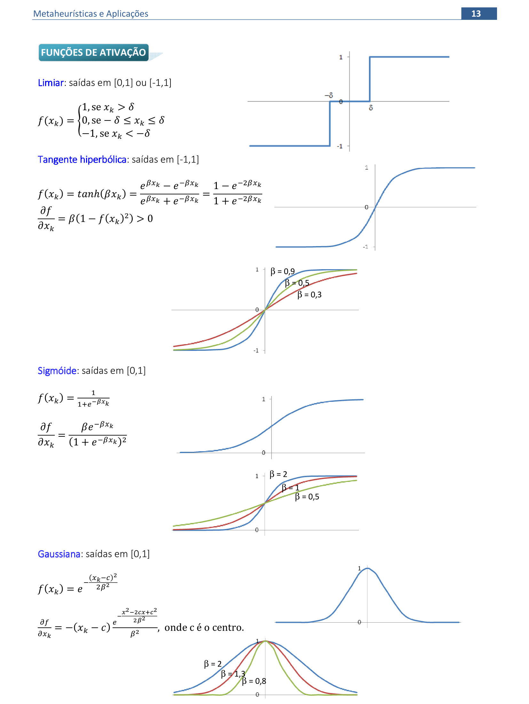
  
<a href="#parte1" class="topo">voltar ao topo</a>

  
   
<a href="#parte1" class="topo">voltar ao topo</a>

  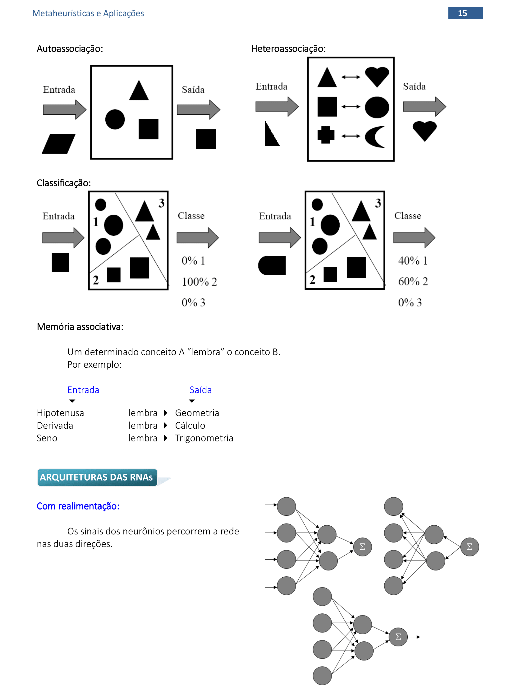
   
<a href="#parte1" class="topo">voltar ao topo</a>

  
  <figcaption>Vamos utilizar a Regra Delta para deduzir as formas de atualizações dos pesos em algumas Redes Neurais. O princípio é sempre de buscar a minimização do erro de classificação de cada Rede Neural Artificial.</figcaption>
   
<a href="#parte1" class="topo">voltar ao topo</a>

  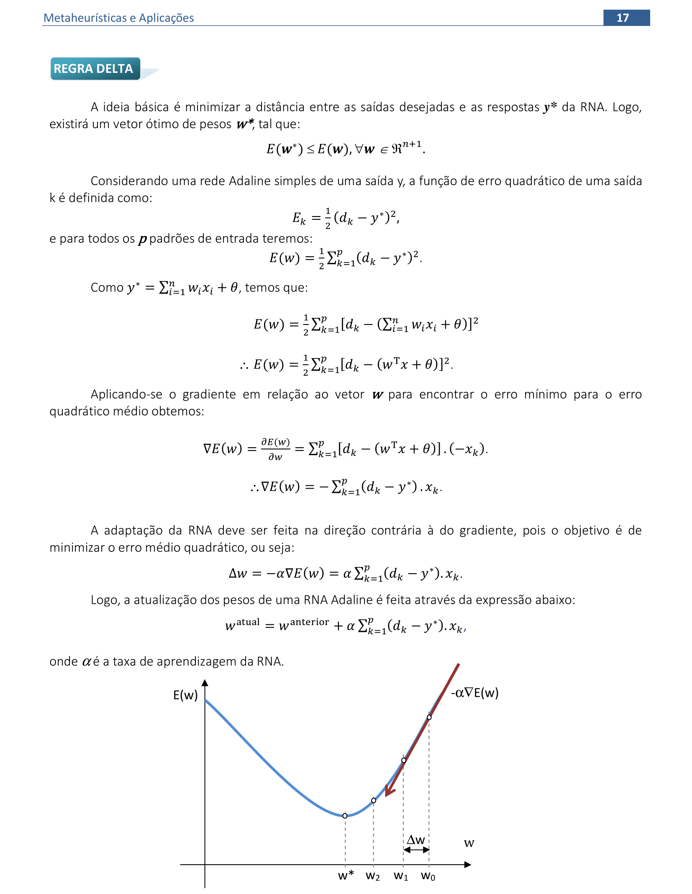
   
<a href="#parte1" class="topo">voltar ao topo</a>

  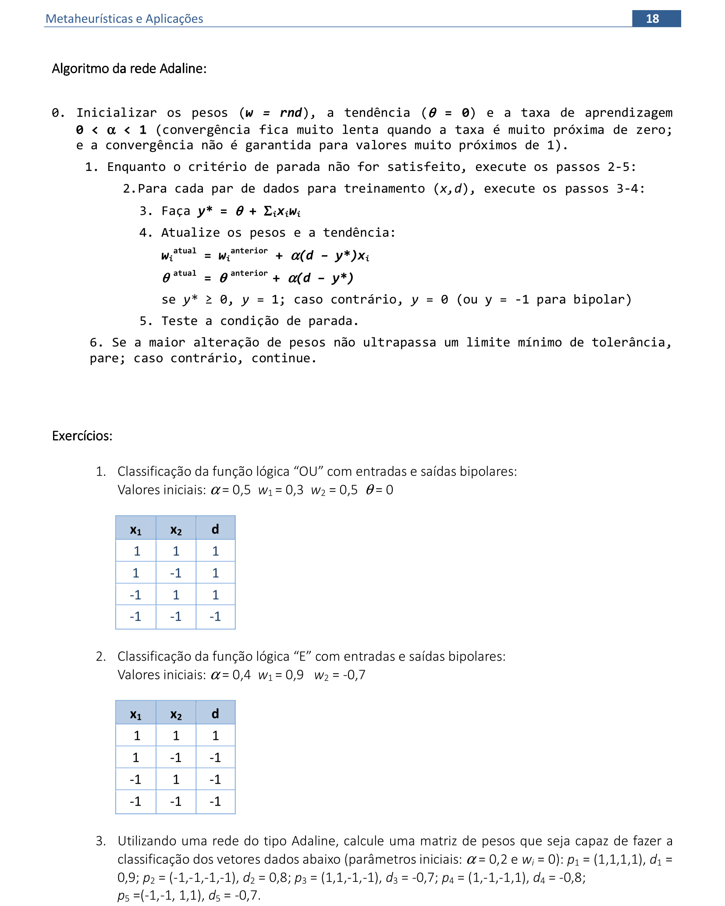
  

&#x1f4c3; Algoritmo comentado

   <figcaption>Algoritmo da Rede Neural Adaline:
<pre><code>0. Inicializar os pesos <a alt="pesos com valores aleatórios">(w = rnd)</a>, a tendência <a alt="bias nulo">(&theta; = 0)</a>
e a taxa de aprendizagem <a alt="taxa de aprendizagem com valor entre 0 e 1">0 &lt; &alpha; &lt; 1</a> (convergência fica muito lenta quando a taxa é muito 
próxima de zero; e a convergência não é garantida para valores muito próximos de 1).
	1. Enquanto o critério de parada não for satisfeito, execute os passos 2-5:
		2. Para cada par de dados para treinamento (x,d), execute os passos 3-4:
			3. Faça <a alt="primeiro calculamos o valor de y*">y* = &theta; + &sum;ixiwi</a> 
			4. <a alt="os pesos e o bias são sempre atualizados">Atualize os pesos e a tendência:</a>
			    wiatual = wianterior + &alpha;(d – y*)xi  
			    &theta;atual = &theta;anterior + &alpha;(d – y*)
			    <a alt="função de ativação do tipo limiar">se y* ≥ 0, y = 1; caso contrário, y = 0 (ou y = -1 para bipolar)</a>
		5. <a alt="podem ser as mesmas condições usadas no Perceptron">Teste a condição de parada.</a> 
	6. Se a maior alteração de pesos não ultrapassa um limite mínimo de tolerância, pare; 
	caso contrário, continue. 
</code></pre></figcaption>
   

  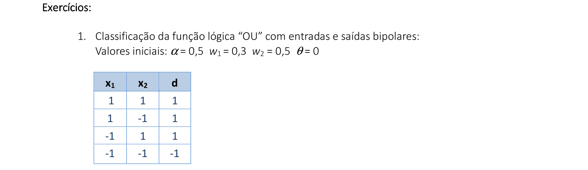
  

&#x1f4c3; Resolução

	
Vamos acompanhar os resultados e as interpretações geométricas deste exercício da Rede Neural Adaline. Vamos usar entradas e saídas bipolares.

	  <ul class="slider">
		  <li>
			   <input type="radio" id="025" name="sl">
			   <label for="025"></label>
			   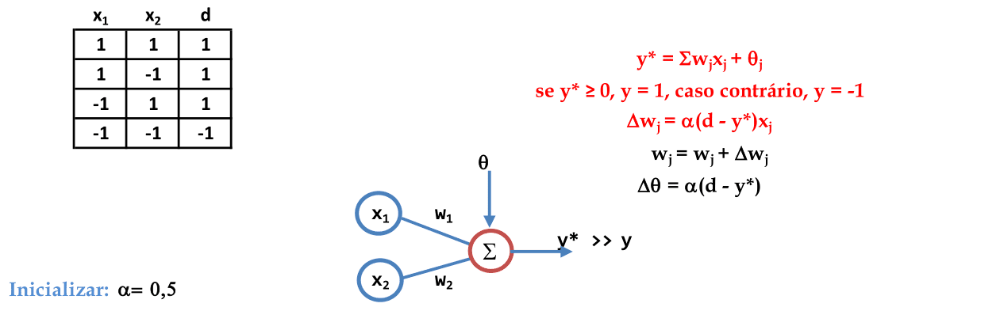
			   <figcaption>A arquitetura da Rede Neural Adaline fica análoga à arquitetura que usamos no caso do Perceptron. O resumo dos cálculos está mostrado nesta imagem. Vamos inicializar com os pesos indicados de w e &theta; e a taxa de aprendizagem &alpha;.</figcaption>
		   </li>
		   <li>
			   <input type="radio" id="026" name="sl">
			   <label for="026"></label>
			   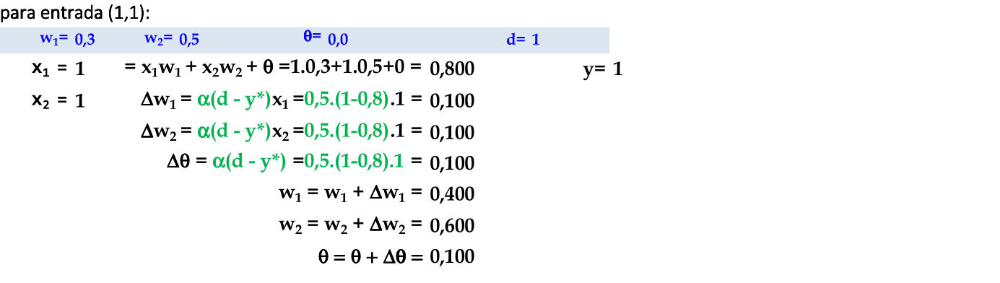
			   <figcaption>O primeiro padrão (1, 1) é apresentado à rede, com a atualização automática dos pesos. Note que o termo &#9651;&theta; é comum na atualização dos pesos w1 e w2; logo, podemos aplicar uma simplificação para estes cálculos.</figcaption>
		   </li>
		   <li>
			   <input type="radio" id="027" name="sl">
			   <label for="027"></label>
			   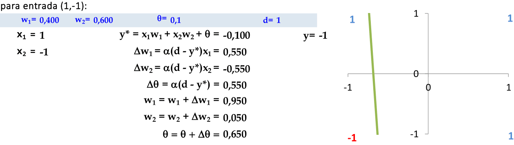
			   <figcaption>O padrão (1, -1) é apresentado à rede, com a atualização automática dos pesos. Note que a simplificação na atualização dos pesos foi aplicada neste passo.</figcaption>
		   </li>
		   <li>
			   <input type="radio" id="028" name="sl">
			   <label for="028"></label>
			   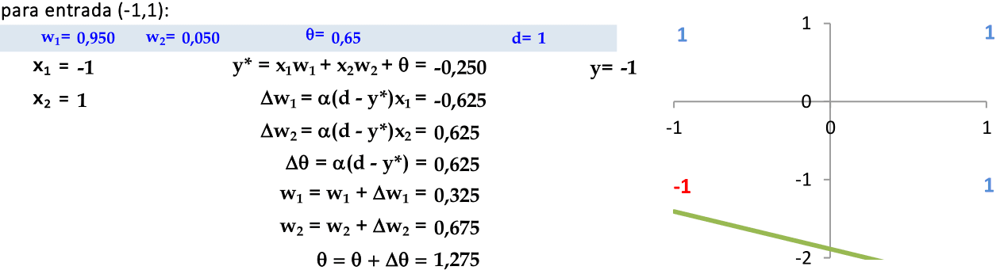
			   <figcaption>O padrão (-1, 1) é apresentado à rede, com a atualização automática dos pesos.</figcaption>
		   </li>
		   <li>
			   <input type="radio" id="029" name="sl">
			   <label for="029"></label>
			   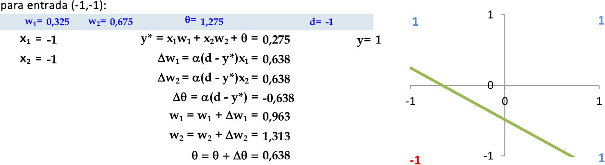
			   <figcaption>O padrão (-1, -1) é apresentado à rede, com a atualização automática dos pesos. Note que a reta com os coeficientes dos pesos classifica todos os padrões corretamente.</figcaption>
		   </li>
		   <li>
			   <input type="radio" id="030" name="sl">
			   <label for="030"></label>
			   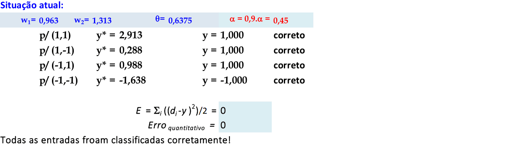
			   <figcaption>Usando a equação do erro, similar à usada para deduzir a Regra Delta, temos que: E = &sum;k((dk - y)2)/2 = (1 - 1)2 + (1 - 1)2 + (1 - 1)2 + (-1 - (-1))2 = 0. O erro quantitativo também fica nulo, logo, podemos finalizar a aprendizagem desta Rede Neural.</figcaption>
		   </li>
		</ul>
		
  

  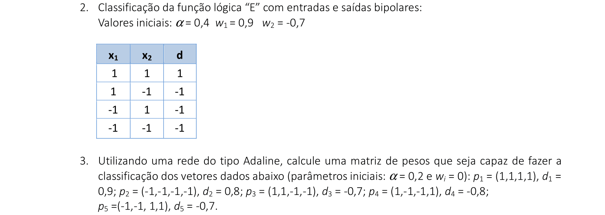
   
<a href="#parte1" class="topo">voltar ao topo</a>

  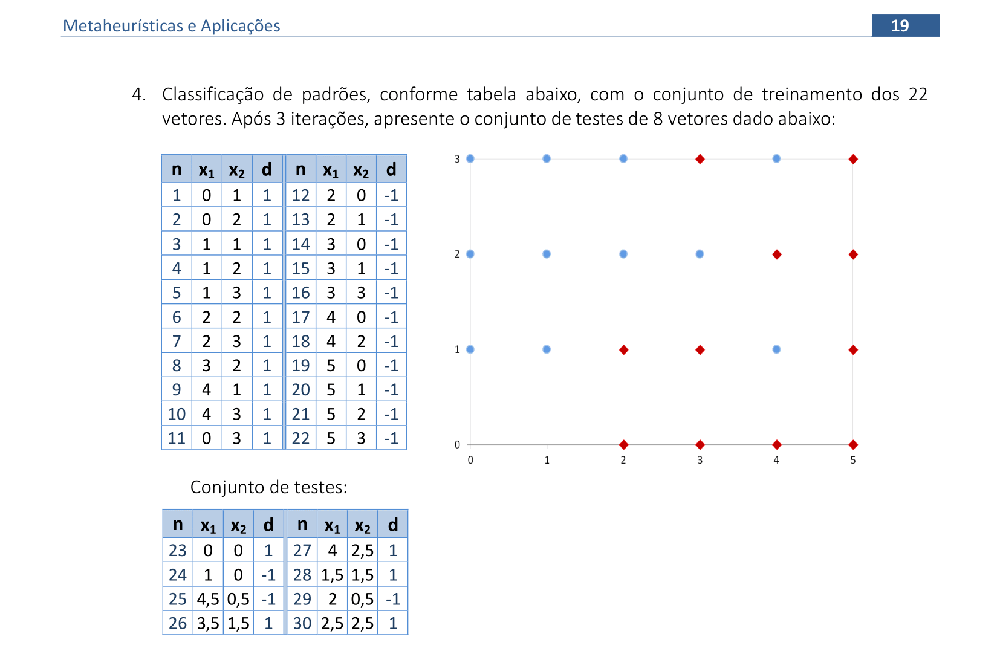
   
<a href="#parte1" class="topo">voltar ao topo</a>

  
Multi Layer Perceptron (MLP)

  
Material da página 19 até a página 40.

  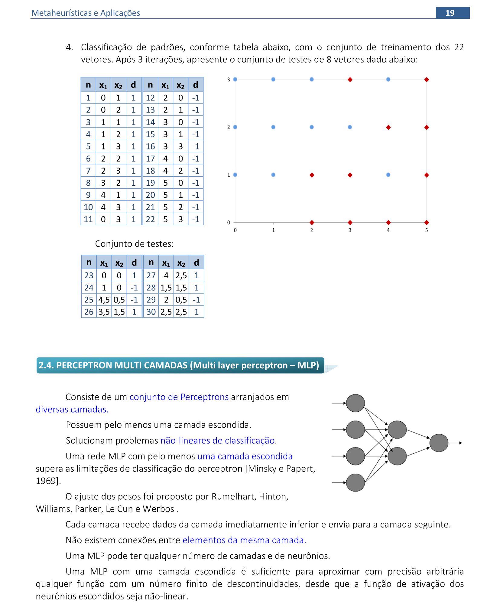
   
<a href="#parte2" class="topo">voltar ao topo</a>

  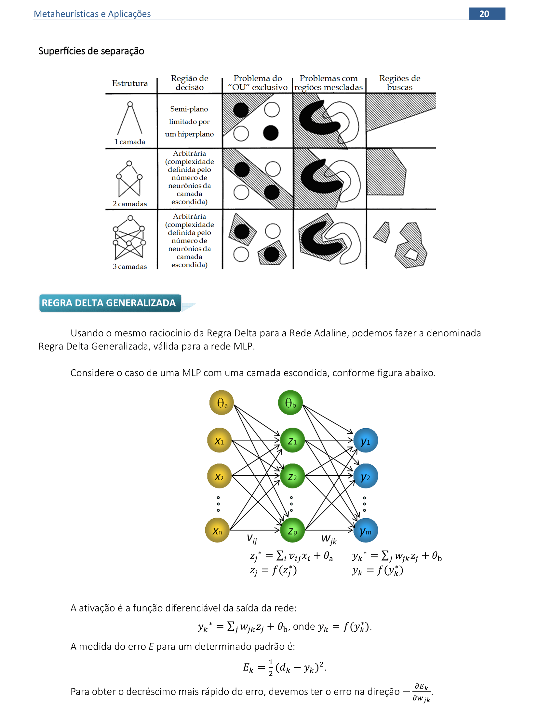
   
<a href="#parte2" class="topo">voltar ao topo</a>

  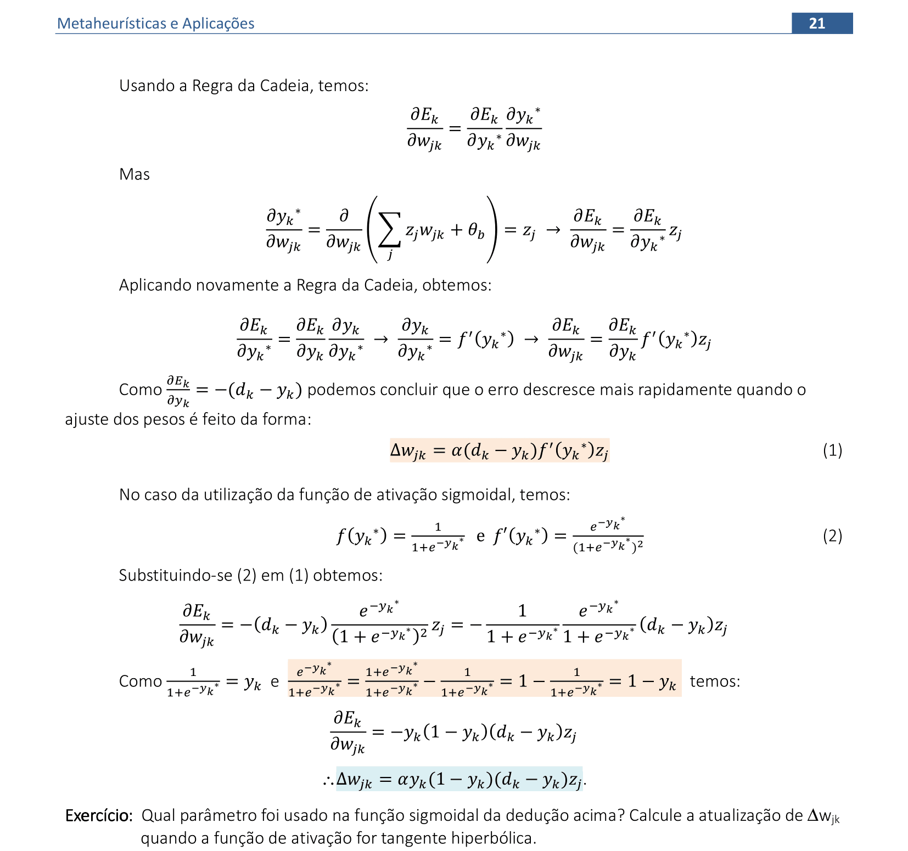
  

&#x1f4c3; Resolução

   <figcaption>
Neste caso, o parâmetro &beta; da função sigmoidal é igual a 1.
    A derivada da função yk = tanh(yk*) com parâmetro &beta; = 1 é y'k = (1 - yk2). 
    Logo, a atualização de pesos w será <b>&#9651;wjk = &alpha;(1 - yk2)(dk - yk)zj</b>.
</figcaption>
   

  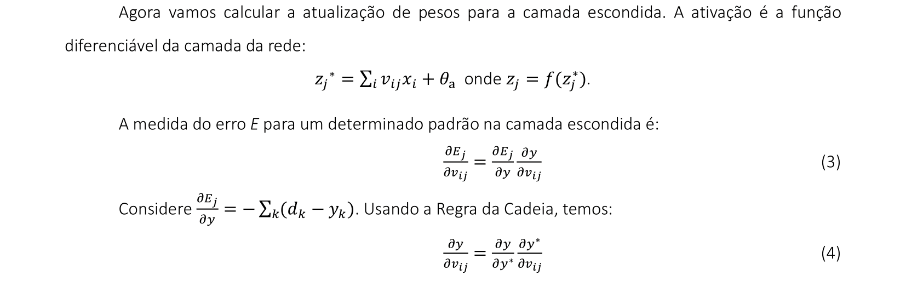
   
<a href="#parte2" class="topo">voltar ao topo</a>

  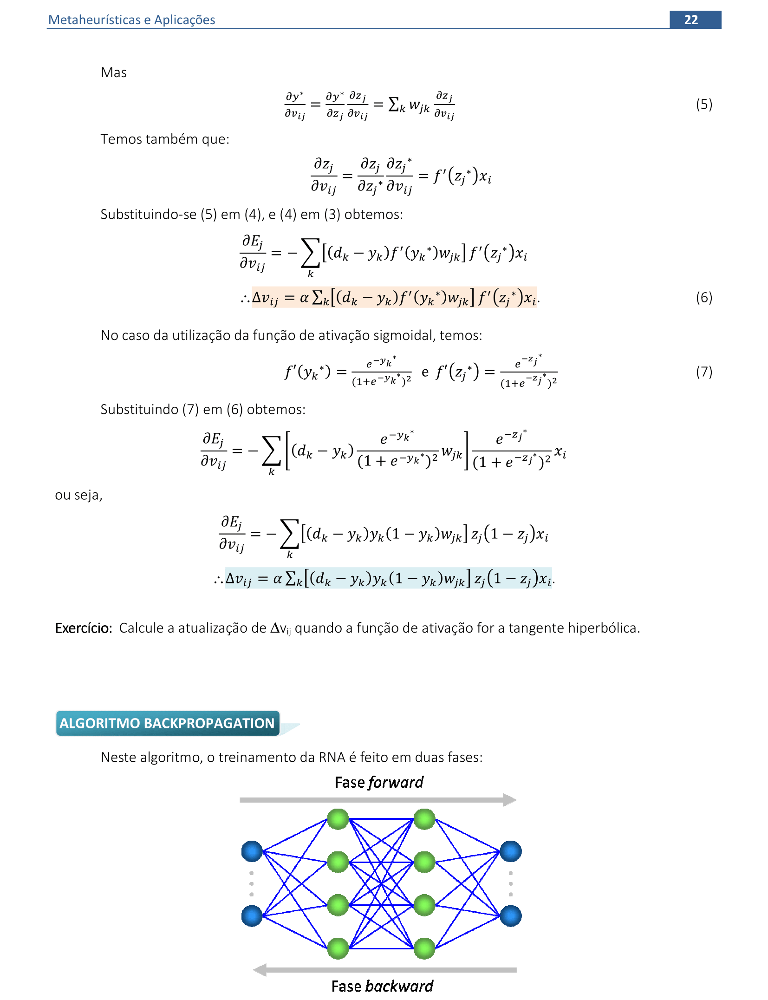
  

&#x1f4c3; Resolução

   <figcaption>
As derivadas das funções yk = tanh(yk*) e zj = tanh(zj*) com parâmetro &beta; = 1 são:
    y'k = tanh(yk*) = (1 - yk2) e z'j = tanh(zj*) = (1 - zj2). 
    Logo, a atualização de pesos v será <b>&#9651;vij = &alpha;&sum;k[(dk - yk)(1 - yk2)wjk](1 - zj2)xi</b>.
</figcaption>
   

  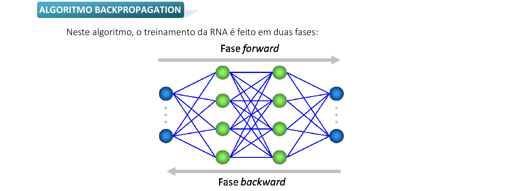
   
<a href="#parte2" class="topo">voltar ao topo</a>

  
   
<a href="#parte2" class="topo">voltar ao topo</a>

  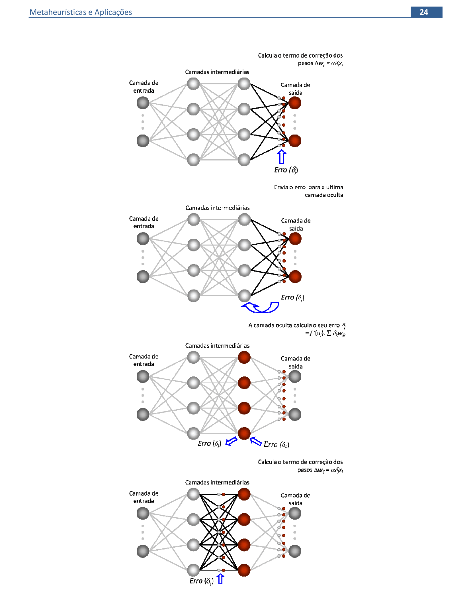
   
<a href="#parte2" class="topo">voltar ao topo</a>

  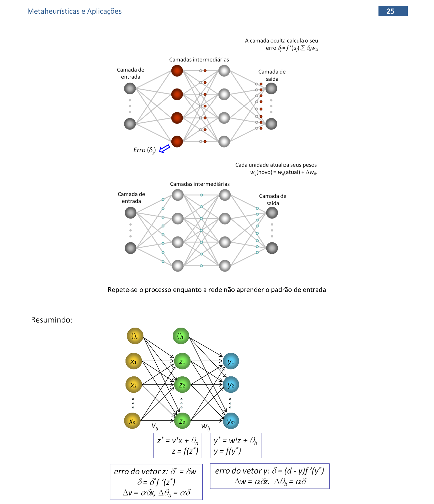
   
<a href="#parte2" class="topo">voltar ao topo</a>

  
  

&#x1f4c3; Algoritmo comentado

   <figcaption>Algoritmo 1 de Rede Neural MLP: 1 camada escondida, funções de ativação sigmoidais, m saídas
<pre><code>0. Inicialize os <a alt="pesos w e bias &theta; com valores aleatórios">pesos das conexões e do bias com valores aleatórios</a>; 
inicialize a taxa de aprendizagem &alpha;. Para cada padrão de entrada, execute os passos de 1 a 3:
	1. <a alt="calculamos as saídas z da camada escondida de cada padrão de entrada&#10;depois, com os valores z encontramos os valores de cada saída yk">Calcule as entradas na camada escondida</a>, e a saída da rede:
	   zj* = &sum;ivijxi + &theta;aj  &rArr;  zj = 1/(1 + e-zj*), onde j = 1, ..., p, i = 1, ..., n
	   yk* = &sum;jwjkzj + &theta;bk  &rArr;  yk = 1/(1 + e-yk*), onde k = 1, 2, ..., m 
	2. <a alt="as correções da camada de saída são feitas antes&#10;os valores encontrados são repassados para a camada escondida (backpropagation)">Calcule as correções das conexões da camada de saída:</a>
	   &#9651;wjk = &alpha;yk(1 – yk)(dk – yk)zj  &rArr;  wjk = wjk + &#9651;wjk 
	   &#9651;&theta;bk = &alpha;yk(1 – yk)(dk – yk)  &rArr;  &theta;bk = &theta;bk + &#9651;&theta;bk 
	3. <a alt="as correções da camada escondida são feitas por último">Calcule as correções das conexões da camada escondida:</a>
	   &#9651;vij = &alpha;&sum;k[(dk – yk)yk(1 – yk)wjk]zj(1 - zj)xi  &rArr;  vij = vij + &#9651;vij 
	   &#9651;&theta;aj = &alpha;&sum;k[(dk – yk)yk(1 – yk)wjk]zj(1 - zj)  &rArr;  &theta;aj = &theta;aj + &#9651;&theta;aj 
	4. <a alt="atualização linear: &alpha; = 0,95.&alpha; ou &alpha; = 0,9.&alpha;">Atualize a taxa de aprendizagem</a>, verifique os erros para todos os padrões de entrada, 
	e teste o <a alt="erro mínimo ou número máximo de iterações">critério de parada.</a>
 
</code></pre></figcaption>
   

   
   

&#x1f4c3; Algoritmo comentado

   <figcaption>Algoritmo 2 de Rede Neural MLP: 1 camada escondida, funções de ativação sigmoidais, 1 saída
<pre><code>0. Inicialize os <a alt="pesos w e bias &theta; com valores aleatórios">pesos das conexões e do bias com valores aleatórios</a>; 
inicialize a taxa de aprendizagem &alpha;. Para cada padrão de entrada, execute os passos de 1 a 3:
	1. <a alt="calculamos as saídas z da camada escondida de cada padrão de entrada&#10;depois, com os valores z encontramos os valores da saída y">Calcule as entradas na camada escondida</a>, e a saída da rede:
	   zj* = &sum;ivijxi + &theta;aj  &rArr;  zj = 1/(1 + e-zj*), onde j = 1, ..., p, i = 1, ..., n
	   y = &sum;jwjzj + &theta;b  &rArr;  y = 1/(1 + e-y*), onde k = 1, 2, ..., m 
	2. <a alt="as correções da camada de saída são feitas antes&#10;os valores encontrados são repassados para a camada escondida (backpropagation)">Calcule as correções das conexões da camada de saída:</a>
	   &#9651;wj = &alpha;y(1 – y)(d – y)zj  &rArr;  wj = wj + &#9651;wj 
	   &#9651;&theta;b = &alpha;y(1 – y)(d – y)  &rArr;  &theta;b = &theta;b + &#9651;&theta;b 
	3. <a alt="as correções da camada escondida são feitas por último">Calcule as correções das conexões da camada escondida:</a>
	   &#9651;vij = &alpha;(d – y)y(1 – y)wjzj(1 - zj)xi  &rArr;  vij = vij + &#9651;vij 
	   &#9651;&theta;aj = &alpha;(d – y)y(1 – y)wjzj(1 - zj)  &rArr;  &theta;aj = &theta;aj + &#9651;&theta;aj 
	4. <a alt="atualização linear: &alpha; = 0,95.&alpha; ou &alpha; = 0,9.&alpha;">Atualize a taxa de aprendizagem</a>, verifique os erros para todos os padrões de entrada, 
	e teste o <a alt="erro mínimo ou número máximo de iterações">critério de parada.</a>
 
</code></pre></figcaption>
   

   
   
<a href="#parte2" class="topo">voltar ao topo</a>

  
  

&#x1f4c3; Algoritmo comentado

   <figcaption>Algoritmo 1 de Rede Neural MLP: 1 camada escondida, funções de ativação tanh, m saídas
<pre><code>0. Inicialize os <a alt="pesos w e bias &theta; com valores aleatórios">pesos das conexões e do bias com valores aleatórios</a>; 
inicialize a taxa de aprendizagem &alpha;. Para cada padrão de entrada, execute os passos de 1 a 3:
	1. <a alt="calculamos as saídas z da camada escondida de cada padrão de entrada&#10;depois, com os valores z encontramos os valores de cada saída yk">Calcule as entradas na camada escondida</a>, e a saída da rede:
	   zj* = &sum;ivijxi + &theta;aj  &rArr;  zj = tanh(zj*), onde j = 1, ..., p, i = 1, ..., n
	   yk* = &sum;jwjkzj + &theta;bk  &rArr;  yk = tanh(yk*), onde k = 1, 2, ..., m 
	2. <a alt="as correções da camada de saída são feitas antes&#10;note que usamos a derivada da função tanh em todas as correções">Calcule as correções das conexões da camada de saída:</a>
	   &#9651;wjk = &alpha;(1 – yk2)(dk – yk)zj  &rArr;  wjk = wjk + &#9651;wjk 
	   &#9651;&theta;bk = &alpha;(1 – yk2)(dk – yk)  &rArr;  &theta;bk = &theta;bk + &#9651;&theta;bk 
	3. <a alt="as correções da camada escondida são feitas por último&#10;note que usamos as derivadas da função tanh">Calcule as correções das conexões da camada escondida:</a>
	   &#9651;vij = &alpha;&sum;k[(dk – yk)(1 – yk2)wjk](1 - zj2)xi  &rArr;  vij = vij + &#9651;vij 
	   &#9651;&theta;aj = &alpha;&sum;k[(dk – yk)(1 – yk2)wjk](1 - zj2)  &rArr;  &theta;aj = &theta;aj + &#9651;&theta;aj 
	4. <a alt="atualização linear: &alpha; = 0,95.&alpha; ou &alpha; = 0,9.&alpha;">Atualize a taxa de aprendizagem</a>, verifique os erros para todos os padrões de entrada, 
	e teste o <a alt="erro mínimo ou número máximo de iterações">critério de parada.</a>
 
</code></pre></figcaption>
  

  
  

&#x1f4c3; Resolução

	
Vamos acompanhar os resultados e as interpretações geométricas deste exercício da Rede Neural Multi Layer Perceptron (MLP). Vamos usar saídas binárias para classificar os padrões de entrada em dois conjuntos: A e B.

	  <ul class="slider">
		  <li>
			   <input type="radio" id="031" name="sl">
			   <label for="031"></label>
			   
			   <figcaption>A arquitetura da Rede Neural deste primeiro exercício fica análoga à arquitetura que usamos nos exemplos Perceptron e Adaline. O resumo dos cálculos está mostrado nesta imagem. Vamos inicializar com os pesos indicados de w e &theta; e a taxa de aprendizagem &alpha; = 1.</figcaption>
		   </li>
		   <li>
			   <input type="radio" id="032" name="sl">
			   <label for="032"></label>
			   
			   <figcaption>O primeiro padrão (0, 2) é apresentado à rede. Calculamos a saída y* e aplicamos a função de ativação sigmóide (pois a saída está no intervalo [0,1]). Note que podemos simplificar a atualização dos pesos, pois o termo &#9651;&theta; é comum nas atualizações dos pesos w1, w2. </figcaption>
		   </li>
		   <li>
			   <input type="radio" id="033" name="sl">
			   <label for="033"></label>
			   
			   <figcaption>O padrão (1, 2) é apresentado à rede, com a atualização automática dos pesos. Aplicando a simplificação de atualização dos pesos, podemos calcular as atualizações para usarmos na próxima apresentação de padrão de entrada.</figcaption>
		   </li>
		   <li>
			   <input type="radio" id="034" name="sl">
			   <label for="034"></label>
			   
			   <figcaption>O padrão (1, 3) é apresentado à rede, com a atualização automática dos pesos. Este é o último padrão de entrada do conjunto com d = 1.</figcaption>
		   </li>
		   <li>
			   <input type="radio" id="035" name="sl">
			   <label for="035"></label>
			   
			   <figcaption>O padrão (2, 1) é apresentado à rede, com a atualização automática dos pesos. Este é o primeiro padrão de entrada do conjunto com d = 0.</figcaption>
		   </li>
		   <li>
			   <input type="radio" id="036" name="sl">
			   <label for="036"></label>
			   
			   <figcaption>O padrão (1, 0) é apresentado à rede, com a atualização automática dos pesos. Este é o último padrão de entrada nesta rede, finalizando a primeira iteração.</figcaption>
		   </li>
		   <li>
			   <input type="radio" id="037" name="sl">
			   <label for="037"></label>
			   
			   <figcaption>Calculamos as saídas y* e y de cada padrão de entrada para encontrarmos o erro desta iteração. A equação do erro é a mesma que foi usada para deduzir a Regra Delta: E = &sum;k((dk - y)2)/2 = 0,937. A interpretação geométrica da MLP pode ser melhor compreendida usando o gráfico em 3 dimensões.</figcaption>
		   </li>
		   <li>
			   <input type="radio" id="038" name="sl">
			   <label for="038"></label>
			   
			   <figcaption>Na segunda iteração, precisamos atualizar a taxa de aprendizagem: &alpha; = &alpha;.0,95. O primeiro padrão (0, 2) é apresentado à rede, com atualização automática dos pesos.</figcaption>
		   </li>
		   <li>
			   <input type="radio" id="039" name="sl">
			   <label for="039"></label>
			   
			   <figcaption>O padrão (1, 2) é apresentado à rede, com atualização automática dos pesos.</figcaption>
		   </li>
		   <li>
			   <input type="radio" id="040" name="sl">
			   <label for="040"></label>
			   
			   <figcaption>O padrão (1, 3) é apresentado à rede, com atualização automática dos pesos.</figcaption>
		   </li>
		   <li>
			   <input type="radio" id="041" name="sl">
			   <label for="041"></label>
			   
			   <figcaption>O padrão (1, 0) é apresentado à rede, com atualização automática dos pesos.</figcaption>
		   </li>
		   <li>
			   <input type="radio" id="042" name="sl">
			   <label for="042"></label>
			   
			   <figcaption>O padrão (2, 1) é apresentado à rede, com atualização automática dos pesos.</figcaption>
		   </li>
		   <li>
			   <input type="radio" id="043" name="sl">
			   <label for="043"></label>
			   
			   <figcaption>Calculamos as saídas y* e y de cada padrão de entrada para encontrarmos o erro desta iteração. A equação do erro é a mesma que foi usada para deduzir a Regra Delta: E = &sum;k((dk - y)2)/2 = 0,859.</figcaption>
		   </li>
		   <li>
			   <input type="radio" id="044" name="sl">
			   <label for="044"></label>
			   
			   <figcaption>Ao final da 10&ordf; iteração, temos esta combinação de pesos. O erro nesta iteração é E = &sum;k((dk - y)2)/2 = 0,222, que representa uma grande redução quando comparada com as duas primeiras iterações.</figcaption>
		   </li>
		</ul>
		
  

  
  

&#x1f4c3; Resolução

	
Vamos acompanhar os resultados e as interpretações geométricas deste exercício da Rede Neural Multi Layer Perceptron (MLP). Vamos usar saídas binárias para classificar os padrões de entrada em dois conjuntos A e B, além de uma camada escondida para acelerar a convergência.

	  <ul class="slider">
		  <li>
			   <input type="radio" id="045" name="sl">
			   <label for="045"></label>
			   
			   <figcaption>A arquitetura da Rede Neural deste exercício tem 3 neurônios na camada escondida. O resumo dos cálculos está mostrado nesta imagem. Vamos inicializar com os pesos indicados de v, w &theta;a e &theta;b e a taxa de aprendizagem &alpha; = 1.</figcaption>
		   </li>
		   <li>
			   <input type="radio" id="046" name="sl">
			   <label for="046"></label>
			   
			   <figcaption>O primeiro padrão (0, 2) é apresentado à rede. Calculamos a saída z* e aplicamos a função de ativação sigmóide (na camada escondida, podemos aplicar a função tanh ou limiar). Com os valores z, calculamos a saída da rede y* com a função de ativação sigmóide.</figcaption>
		   </li>
		   <li>
			   <input type="radio" id="047" name="sl">
			   <label for="047"></label>
			   
			   <figcaption>De acordo com o algoritmo Backpropagation, atualizamos primeiro os pesos da camada de saída w. Podemos simplificar a atualização dos pesos w, pois o termo &#9651;&theta;b é comum nas atualizações dos pesos w. </figcaption>
		   </li>
		   <li>
			   <input type="radio" id="048" name="sl">
			   <label for="048"></label>
			   
			   <figcaption>De acordo com o algoritmo Backpropagation, atualizamos a seguir os pesos da camada de entrada v. Podemos simplificar a atualização dos pesos v, pois os termos &#9651;&theta;a1 &#9651;&theta;a2 e &#9651;&theta;a3 são comuns nestas atualizações de pesos. </figcaption>
		   </li>
		   <li>
			   <input type="radio" id="049" name="sl">
			   <label for="049"></label>
			   
			   <figcaption>O padrão (1, 2) é apresentado à rede, com a atualização automática dos pesos. Aplicando a simplificação de atualização dos pesos, podemos calcular as atualizações para a próxima apresentação de padrão de entrada.</figcaption>
		   </li>
		   <li>
			   <input type="radio" id="050" name="sl">
			   <label for="050"></label>
			   
			   <figcaption>O padrão (1, 3) é apresentado à rede, com a atualização automática dos pesos. Este é o último padrão de entrada do conjunto com d = 1.</figcaption>
		   </li>
		   <li>
			   <input type="radio" id="051" name="sl">
			   <label for="051"></label>
			   
			   <figcaption>O padrão (2, 1) é apresentado à rede, com a atualização automática dos pesos. Este é o primeiro padrão de entrada do conjunto com d = 0.</figcaption>
		   </li>
		   <li>
			   <input type="radio" id="052" name="sl">
			   <label for="052"></label>
			   
			   <figcaption>O padrão (1, 0) é apresentado à rede, com a atualização automática dos pesos. Este é o último padrão de entrada nesta rede, finalizando a primeira iteração.</figcaption>
		   </li>
		   <li>
			   <input type="radio" id="053" name="sl">
			   <label for="053"></label>
			   
			   <figcaption>Calculamos as saídas z* e z para determinar as saídas y* e y de cada padrão de entrada. A equação do erro é a mesma que foi usada para deduzir a Regra Delta: E = &sum;k((dk - y)2)/2 = 0,268. A interpretação geométrica da MLP pode ser melhor compreendida usando o gráfico em 3 dimensões.</figcaption>
		   </li>
		   <li>
			   <input type="radio" id="054" name="sl">
			   <label for="054"></label>
			   
			   <figcaption>Na segunda iteração, precisamos atualizar a taxa de aprendizagem: &alpha; = &alpha;.0,95. O primeiro padrão (0, 2) é apresentado à rede, com atualização automática dos pesos.</figcaption>
		   </li>
		   <li>
			   <input type="radio" id="055" name="sl">
			   <label for="055"></label>
			   
			   <figcaption>No final da 10&ordf;  iteração, temos esta configuração de pesos. O erro nesta iteração é E = &sum;k((dk - y)2)/2 = 0,102.</figcaption>
		   </li>
		</ul>
		
  

   
<a href="#parte2" class="topo">voltar ao topo</a>

  
  

&#x1f4c3; Resolução

	
Vamos acompanhar os resultados e as interpretações geométricas deste exercício da Rede Neural Multi Layer Perceptron (MLP). Vamos usar saídas binárias para classificar os padrões de entrada com duas variáveis de saída y e uma camada escondida.

	  <ul class="slider">
		  <li>
			   <input type="radio" id="056" name="sl">
			   <label for="056"></label>
			   
			   <figcaption>A arquitetura da Rede Neural deste exercício tem 3 neurônios na camada escondida. O resumo dos cálculos está mostrado nesta imagem. Vamos inicializar com os pesos indicados de v, w, &theta;a e &theta;b e a taxa de aprendizagem &alpha; = 1.</figcaption>
		   </li>
		   <li>
			   <input type="radio" id="057" name="sl">
			   <label for="057"></label>
			   
			   <figcaption>O primeiro padrão (-1, -1) é apresentado à rede. Calculamos a saída z* e aplicamos a função de ativação sigmóide (na camada escondida, podemos aplicar a função tanh ou limiar). Com os valores z, calculamos a saída da rede y* com a função de ativação sigmóide.</figcaption>
		   </li>
		   <li>
			   <input type="radio" id="058" name="sl">
			   <label for="058"></label>
			   
			   <figcaption>De acordo com o algoritmo Backpropagation, atualizamos primeiro os pesos da camada de saída w. Podemos simplificar a atualização dos pesos w, pois os termos &#9651;&theta;b1 e &#9651;&theta;b2 são comuns nas atualizações dos pesos w. </figcaption>
		   </li>
		   <li>
			   <input type="radio" id="059" name="sl">
			   <label for="059"></label>
			   
			   <figcaption>De acordo com o algoritmo Backpropagation, atualizamos a seguir os pesos da camada de entrada v. Podemos simplificar a atualização dos pesos v, pois os termos &#9651;&theta;a1 &#9651;&theta;a2 e &#9651;&theta;a3 são comuns nestas atualizações de pesos. </figcaption>
		   </li>
		   <li>
			   <input type="radio" id="060" name="sl">
			   <label for="060"></label>
			   
			   <figcaption>O padrão (-1, 1) é apresentado à rede, com a atualização automática dos pesos. Aplicando a simplificação de atualização dos pesos, podemos calcular as atualizações para a próxima apresentação de padrão de entrada.</figcaption>
		   </li>
		   <li>
			   <input type="radio" id="061" name="sl">
			   <label for="061"></label>
			   
			   <figcaption>O padrão (1, -1) é apresentado à rede, com a atualização automática dos pesos.</figcaption>
		   </li>
		   <li>
			   <input type="radio" id="062" name="sl">
			   <label for="062"></label>
			   
			   <figcaption>O padrão (1, 1) é apresentado à rede, com a atualização automática dos pesos. Este é o último padrão de entrada nesta rede, finalizando a primeira iteração.</figcaption>
		   </li>
		   <li>
			   <input type="radio" id="063" name="sl">
			   <label for="063"></label>
			   
			   <figcaption>Calculamos as saídas z* e z para determinar as saídas y* e y de cada padrão de entrada. A equação do erro é a mesma que foi usada para deduzir a Regra Delta: E = &sum;k((dk - y)2)/2 = 0,753.</figcaption>
		   </li>
		   <li>
			   <input type="radio" id="064" name="sl">
			   <label for="064"></label>
			   
			   <figcaption>Na segunda iteração, precisamos atualizar a taxa de aprendizagem: &alpha; = &alpha;.0,99. O primeiro padrão (-1, -1) é apresentado à rede, com atualização automática dos pesos.</figcaption>
		   </li>
		   <li>
			   <input type="radio" id="065" name="sl">
			   <label for="065"></label>
			   
			   <figcaption>No final da 7&ordf;  iteração, temos esta configuração de pesos. O erro nesta iteração é E = &sum;k((dk - y)2)/2 = 0,523.</figcaption>
		   </li>
		</ul>
		
  

  
   
<a href="#parte2" class="topo">voltar ao topo</a>

  
   
<a href="#parte2" class="topo">voltar ao topo</a>

  
   
<a href="#parte2" class="topo">voltar ao topo</a>

  
   
<a href="#parte2" class="topo">voltar ao topo</a>

  
   
<a href="#parte2" class="topo">voltar ao topo</a>

  
   
<a href="#parte2" class="topo">voltar ao topo</a>

  
   
<a href="#parte2" class="topo">voltar ao topo</a>
 
  
   
<a href="#parte2" class="topo">voltar ao topo</a>

  
   
<a href="#parte2" class="topo">voltar ao topo</a>

  
   
<a href="#parte2" class="topo">voltar ao topo</a>

  
   
<a href="#parte2" class="topo">voltar ao topo</a>

  
   
<a href="#parte2" class="topo">voltar ao topo</a>

  
   
<a href="#parte2" class="topo">voltar ao topo</a>

  
Support Vector Machines, Redes de Bases Radiais e Hebb

  
Material da página 40 até a página 52.

  
  
<a href="#parte3" class="topo">voltar ao topo</a>

  
  
<a href="#parte3" class="topo">voltar ao topo</a>

  
  
<a href="#parte3" class="topo">voltar ao topo</a>

  
  

&#x1f4c3; Resolução

	
Vamos acompanhar os resultados e as interpretações geométricas deste exercício de Support Vector Machine (SVM). A rede deve separar os dados de entrada em duas classes.

	  <ul class="slider">
		  <li>
			   <input type="radio" id="066" name="sl">
			   <label for="066"></label>
			   
			   <figcaption>Utilizando a função de núcleo (1 + xTx), temos o problema de Programação Quadrática apresentado. Os valores de &alpha;i diferentes de zero nos mostram quais serão os vetores suporte: 2, 4 e 6.</figcaption>
		   </li>
		   <li>
			   <input type="radio" id="067" name="sl">
			   <label for="067"></label>
			   
			   <figcaption>Substituindo os valores de x na função de decisão, encontramos a função de 2&ordm; grau. A parábola faz a separação dos dados nas classes 1 e 2.</figcaption>
		   </li>
		</ul>
		
  

  
<a href="#parte3" class="topo">voltar ao topo</a>

  
  

&#x1f4c3; Resolução

	
Vamos acompanhar os resultados e as interpretações geométricas deste exercício de Support Vector Machine (SVM). A rede deve separar os dados de entrada em duas classes.

	  <ul class="slider">
		  <li>
			   <input type="radio" id="068" name="sl">
			   <label for="068"></label>
			   
			   <figcaption>Utilizando a função de núcleo (1 + xTx), precisamos desenvolvê-la para inserir os dados de entrada das variáveis x1 e x2.</figcaption>
		   </li>
		   <li>
			   <input type="radio" id="069" name="sl">
			   <label for="069"></label>
			   
			   <figcaption>Substituindo os valores de x1 e x2 na função de decisão, encontramos os vetores de decisão.</figcaption>
		   </li>
		   <li>
			   <input type="radio" id="070" name="sl">
			   <label for="070"></label>
			   
			   <figcaption>Resolvendo o problema de programação quadrática, todas as variáveis de decisão ficam com os respectivos valores $\mathsf{\alpha_i = {1 \over 8}}$, ou seja, todas as variáveis representam vetores suportes. Substituindo estes valores, temos o vetor w.</figcaption>
		   </li>
		   <li>
			   <input type="radio" id="071" name="sl">
			   <label for="071"></label>
			   
			   <figcaption>A função decisão fica representada por f(x) = &minus;x1x2. Todos os dados de entrada ficam classificados corretamente com a SVM apresentada.</figcaption>
		   </li>
		</ul>
		
  

  
  
<a href="#parte3" class="topo">voltar ao topo</a>

  
  
<a href="#parte3" class="topo">voltar ao topo</a>

  
  
<a href="#parte3" class="topo">voltar ao topo</a>

  
  
<a href="#parte3" class="topo">voltar ao topo</a>

  
  

&#x1f4c3; Algoritmo comentado

   <figcaption>Algoritmo da Rede Neural de bases radiais (RBF):
<pre><code>0. Considere uma base de dados (xi, di), i = 1, 2,..., p, onde xi é um exemplo da base de dados 
   e d é o vetor de saídas desejadas correspondentes.
1. Defina o número <a alt="centros das bases radiais">q de neurônios ocultos (bases radiais)</a>, em geral escolhe-se q &le; n. 
   Selecione aleatoriamente q exemplos do conjunto de dados, e faça a seguinte atribuição:
   uj = xj, j = 1, 2,..., q.
2. Especifique <a alt="raios das bases radiais">o(s) valor(es) do(s) raio(s) da função de base radial</a>, &sigma;j. 
   Cada neurônio pode ter um raio diferente, para termos maior diversificação da RBF.
3. Para cada exemplo da base de dados xi, onde i = 1, 2, ..., p, execute os passos 4 e 5:
	4. Calcule <a alt="função gaussiana de cada neurônio">a ativação de cada neurônio j</a> da camada escondida:
	   &phiv;j = e-1/(2&sigma;2)‖xi&minus;uj‖2 
	5. <a alt="matriz G das ativações dos neurônios">Atribua os valores das ativações dos neurônios</a> na matriz G:
	   Gi,j = &phiv;j, e Gi,q+1 = &theta;
6. Após a apresentação de todos os exemplos, <a alt="vetor de pesos">calcule os pesos da saída:</a>
   w = (GTG)-1GTd
<a alt="dedução do cálculo para o vetor de pesos">Temos essa expressão de w, pois:</a>
   Gw = d  &rArr;  GTGw = GTd  &rArr;  (GTG)-1(GTG)w = (GTG)-1GTd  &rArr;  w = (GTG)-1GTd.
7. <a alt="saída da rede">Calcule a saída de cada exemplo:</a> yk = &sum;j=1q+1wjk&phiv;j. Calcule o erro de classificação.

</code></pre></figcaption>
   

  
  

&#x1f4c3; Resolução

	
Vamos acompanhar os cálculos deste exercício de classificação de padrões com a rede neural Radial Basis Function (RBF). A rede deve separar os dados de entrada em duas classes usando 2 centros.

	  <ul class="slider">
		  <li>
			   <input type="radio" id="072" name="sl">
			   <label for="072"></label>
			   
			   <figcaption>Vamos começar com a apresentação do padrão de entrada (x1, x2) = (0, 2), com &sigma; = $\mathsf{\sqrt {0,5}}$. O resultado da ativação de cada neurônio da camada escondida será guardado na primeira linha da matriz G: g1.</figcaption>
		   </li>
		   <li>
			   <input type="radio" id="073" name="sl">
			   <label for="073"></label>
			   
			   <figcaption>Agora temos as apresentações dos padrões de entrada (1, 2) e (1, 3). O resultado da ativação de cada neurônio da camada escondida será guardado nas linhas da matriz G: g2 e g3.</figcaption>
		   </li>
		   <li>
			   <input type="radio" id="074" name="sl">
			   <label for="074"></label>
			   
			   <figcaption>Agora temos as apresentações dos padrões de entrada (1, 0) e (2, 1). O resultado da ativação de cada neurônio da camada escondida será guardado nas linhas da matriz G: g4 e g5.</figcaption>
		   </li>
		   <li>
			   <input type="radio" id="075" name="sl">
			   <label for="075"></label>
			   
			   <figcaption>Agora podemos calcular o vetor de pesos usando a matriz G. Note que a terceira coluna desta matriz tem valores iguais a 1, pois são as ativações de &theta;. Temos o vetor de pesos calculado da seguinte maneira: w = (GTG)-1GTd.</figcaption>
		   </li>
		   <li>
			   <input type="radio" id="076" name="sl">
			   <label for="076"></label>
			   
			   <figcaption>Podemos calcular as saídas e os erros quadráticos desta rede para os dois primeiros padrões de entrada: y = w1&phiv;1 + w2&phiv;2 + &theta; e Ek = (dk &minus; y)2)/2.</figcaption>
		   </li>
		   <li>
			   <input type="radio" id="077" name="sl">
			   <label for="077"></label>
			   
			   <figcaption>Seguem os cálculos das saídas e os erros quadráticos desta rede mais dois padrões de entrada.</figcaption>
		   </li>
		   <li>
			   <input type="radio" id="078" name="sl">
			   <label for="078"></label>
			   
			   <figcaption>Para finalizar, são mostrados os cáculos da saída e do erro quadrático da rede para o último padrão de entrada. O erro quadrático total desta RBF ficou em E = 0,219.</figcaption>
		   </li>
		</ul>
		
  

  
  

&#x1f4c3; Resolução

	
Vamos acompanhar os cálculos deste exercício de classificação de padrões com a rede neural Radial Basis Function (RBF). A rede deve separar os dados de entrada em duas classes com 3 centros.

	  <ul class="slider">
		  <li>
			   <input type="radio" id="079" name="sl">
			   <label for="079"></label>
			   
			   <figcaption>Vamos começar com a apresentação do padrão de entrada (x1, x2) = (0, 2), com &sigma; = $\mathsf{\sqrt {0,5}}$. O resultado da ativação de cada neurônio da camada escondida será guardado na primeira linha da matriz G: g1.</figcaption>
		   </li>
		   <li>
			   <input type="radio" id="080" name="sl">
			   <label for="080"></label>
			   
			   <figcaption>Agora temos as apresentações dos padrões de entrada (1, 2) e (1, 3). O resultado da ativação de cada neurônio da camada escondida será guardado nas linhas da matriz G: g2 e g3.</figcaption>
		   </li>
		   <li>
			   <input type="radio" id="081" name="sl">
			   <label for="081"></label>
			   
			   <figcaption>Agora temos as apresentações dos padrões de entrada (1, 0) e (2, 1). O resultado da ativação de cada neurônio da camada escondida será guardado nas linhas da matriz G: g4 e g5.</figcaption>
		   </li>
		   <li>
			   <input type="radio" id="082" name="sl">
			   <label for="082"></label>
			   
			   <figcaption>Agora podemos calcular o vetor de pesos usando a matriz G. Note que a quarta coluna desta matriz tem valores iguais a 1, pois são as ativações de &theta;. Temos o vetor de pesos calculado da seguinte maneira: w = (GTG)-1GTd.</figcaption>
		   </li>
		   <li>
			   <input type="radio" id="083" name="sl">
			   <label for="083"></label>
			   
			   <figcaption>Podemos calcular as saídas e os erros quadráticos desta rede para os dois primeiros padrões de entrada: y = w1&phiv;1 + w2&phiv;2 + w3&phiv;3 + &theta; e Ek = (dk &minus; y)2)/2.</figcaption>
		   </li>
		   <li>
			   <input type="radio" id="084" name="sl">
			   <label for="084"></label>
			   
			   <figcaption>Seguem os cálculos das saídas e os erros quadráticos desta rede mais dois padrões de entrada.</figcaption>
		   </li>
		   <li>
			   <input type="radio" id="085" name="sl">
			   <label for="085"></label>
			   
			   <figcaption>Para finalizar, são mostrados os cáculos da saída e do erro quadrático da rede para o último padrão de entrada. O erro quadrático total desta RBF ficou em E = 0,0057.</figcaption>
		   </li>
		</ul>
		
  

  
  

&#x1f4c3; Resolução

	
Vamos acompanhar os cálculos deste exercício de classificação de padrões da função "OU EXCLUSIVO" com a rede neural Radial Basis Function (RBF). Vamos utilizar 2 centros.

	  <ul class="slider">
		  <li>
			   <input type="radio" id="086" name="sl">
			   <label for="086"></label>
			   
			   <figcaption>Vamos começar com a apresentação dos padrões de entrada (x1, x2) = (1, 1) e (-1, 1), com &sigma; = $\mathsf{\sqrt {0,5}}$. O resultado da ativação de cada neurônio da camada escondida será guardado nas duas primeiras linha da matriz G: g1 e g2.</figcaption>
		   </li>
		   <li>
			   <input type="radio" id="087" name="sl">
			   <label for="087"></label>
			   
			   <figcaption>Agora temos as apresentações dos padrões de entrada (-1, -1) e (1, -1). O resultado da ativação de cada neurônio da camada escondida será guardado nas linhas da matriz G: g3 e g4.</figcaption>
		   </li>
		   <li>
			   <input type="radio" id="088" name="sl">
			   <label for="088"></label>
			   
			   <figcaption>Agora podemos calcular o vetor de pesos usando a matriz G. Note que a terceira coluna desta matriz tem valores iguais a 1, pois são as ativações de &theta;. Temos o vetor de pesos calculado da seguinte maneira: w = (GTG)-1GTd.</figcaption>
		   </li>
		   <li>
			   <input type="radio" id="089" name="sl">
			   <label for="089"></label>
			   
			   <figcaption>Podemos calcular as saídas e os erros quadráticos desta rede para os dois primeiros padrões de entrada: y = w1&phiv;1 + w2&phiv;2 + &theta; e Ek = (dk &minus; y)2)/2.</figcaption>
		   </li>
		   <li>
			   <input type="radio" id="090" name="sl">
			   <label for="090"></label>
			   
			   <figcaption>Temos que o erro é igual a ZERO para este problema de classificação usando a RBF de 2 centros.</figcaption>
		   </li>
		</ul>
		
  

  
  
<a href="#parte3" class="topo">voltar ao topo</a>

  
  
<a href="#parte3" class="topo">voltar ao topo</a>

  
  

&#x1f4c3; Algoritmo comentado

   <figcaption>Algoritmo da Rede Neural de Hebb:
<pre><code>0. <a alt="pesos iniciam nulos">Inicialize os pesos wi = 0</a>, onde i = 1, 2, ..., n
	1. <a alt="atualização de pesos parecida com a do Perceptron">Para cada par de treinamento (x,d),</a> faça:
	2. wiatual = wianterior + &alpha;xidi 
	   &theta;iatual = &theta;ianterior + &alpha;di 
	3. <a alt="calculamos a saída y*">Faça y* = wixi + &theta;,</a> onde i = 1, 2, ..., n
4. <a alt="teste de convergência similar ao que usamos no Perceptron e MLP">Teste a convergência.</a> Se necessário, repita os passos 1-3.

</code></pre></figcaption>
   

  
  

&#x1f4c3; Resolução

	
Vamos acompanhar os cálculos deste exercício de classificação de padrões da função "OU" com a rede neural de Hebb, com &alpha; = 1.

	  <ul class="slider">
		  <li>
			   <input type="radio" id="091" name="sl">
			   <label for="091"></label>
			   
			   <figcaption>Vamos começar com a apresentação dos padrões de entrada (x1, x2) = (1, 1) e (1, -1) para a rede. As atualizações dos pesos são automáticas e produzem o vetor (w1, w2, &theta;) = (2, 0, 2).</figcaption>
		   </li>
		   <li>
			   <input type="radio" id="092" name="sl">
			   <label for="092"></label>
			   
			   <figcaption>Continuando a apresentação dos padrões de entrada: (-1, 1) e (-1, -1). As atualizações dos pesos produzem o vetor (w1, w2, &theta;) = (2, 2, 2).</figcaption>
		   </li>
		   <li>
			   <input type="radio" id="093" name="sl">
			   <label for="093"></label>
			   
			   <figcaption>Ao final da 1&ordf; iteração, temos todos os padrões classificados corretamente. Logo, o treinamento pode ser finalizado.</figcaption>
		   </li>
		</ul>
		
  

  
  

&#x1f4c3; Resolução

	
Vamos acompanhar os cálculos deste exercício de classificação de padrões com a rede neural de Hebb, com &alpha; = 1. Precisamos deixar os padrões de entrada no intervalo [-1, 1] para que a rede de Hebb funcione adequadamente.

	  <ul class="slider">
		  <li>
			   <input type="radio" id="094" name="sl">
			   <label for="094"></label>
			   
			   <figcaption>Vamos começar com a apresentação dos padrões de entrada (x1, x2) = (-1, 0.33) e (-0.33, 0.33) para a rede. As atualizações dos pesos são automáticas e produzem o vetor (w1, w2, &theta;) = (-1.33, 0.66, 2).</figcaption>
		   </li>
		   <li>
			   <input type="radio" id="095" name="sl">
			   <label for="095"></label>
			   
			   <figcaption>Continuando a apresentação dos padrões de entrada: (-0.33, 1) e (-0.33, -1). As atualizações dos pesos produzem o vetor (w1, w2, &theta;) = (-1.33, 2.66, 2).</figcaption>
		   </li>
		   <li>
			   <input type="radio" id="096" name="sl">
			   <label for="096"></label>
			   
			   <figcaption>Ao final da 1&ordf; iteração, o vetor de pesos (w1, w2, &theta;) = (-1.66, 2.99, 1). Todos os padrões são classificados corretamente, e o treinamento da rede pode ser finalizado.</figcaption>
		   </li>
		</ul>
		
  

  
  
<a href="#parte3" class="topo">voltar ao topo</a>

  
  
<a href="#parte3" class="topo">voltar ao topo</a>

  
  

&#x1f4c3; Algoritmo comentado

   <figcaption>Algoritmo da Rede Heteroassociativa:
<pre><code>0. <a alt="pesos iniciam nulos">Inicialize os pesos wij = 0</a>, onde i = 1, 2, ..., n, j = 1, 2, ..., m.
	1. Para cada par de treinamento (x,d),</a> faça os passos 2-4:
	2. <a alt="calculamos a saída y*">yj* = &sum;ixiwij</a>
	3. <a alt="calculamos a saída y">Se yj* &gt; 0</a>, yj = 1
	   Se yj* = 0, yj = 0
	   Se yj* &lt; 0, yj = -1
	4. <a alt="atualização de pesos parecida com a do Perceptron">wijatual = wijanterior + &alpha;xidi</a> 
5. <a alt="teste de convergência similar ao que usamos no Perceptron e MLP">Reduza &alpha; e teste a convergência.</a> Se necessário, repita os passos de 1-4.

</code></pre></figcaption>
   

  
  

&#x1f4c3; Resolução

	
Vamos acompanhar os cálculos deste exercício de classificação de padrões com a rede neural Heteroassociativa, com &alpha; = 1.

	  <ul class="slider">
		  <li>
			   <input type="radio" id="097" name="sl">
			   <label for="097"></label>
			   
			   <figcaption>Vamos começar com a apresentação dos padrões de entrada (x1, x2, x3, x4) = (1, 0, 0, 0) e (1, 1, 0, 0) para a rede. As atualizações dos pesos são automáticas e produzem a matriz de pesos indicada wij, com i = 1, 2, 3, 4 e j = 1, 2.</figcaption>
		   </li>
		   <li>
			   <input type="radio" id="098" name="sl">
			   <label for="098"></label>
			   
			   <figcaption>Continuando a apresentação dos padrões de entrada: (0, 0, 0 ,1) e (0, 0, 1, 1). As atualizações dos pesos produzem a matriz de pesos indicada wij, com i = 1, 2, 3, 4 e j = 1, 2.</figcaption>
		   </li>
		   <li>
			   <input type="radio" id="099" name="sl">
			   <label for="099"></label>
			   
			   <figcaption>Multiplicando-se a matriz de pesos W pelos vetores dos dados de entrada, temos o reconhecimento destes padrões. O processo de treinamento desta rede pode ser finalizado.</figcaption>
		   </li>
		</ul>
		
  

  
  
<a href="#parte3" class="topo">voltar ao topo</a>

  
Mapas auto-organizáveis

  
Material da página 53 até a página 66.

  
  
<a href="#parte4" class="topo">voltar ao topo</a>

  
  
<a href="#parte4" class="topo">voltar ao topo</a>

  
  
<a href="#parte4" class="topo">voltar ao topo</a>

  
  
<a href="#parte4" class="topo">voltar ao topo</a>

  
  

&#x1f4c3; Algoritmo comentado

   <figcaption>Algoritmo da Rede de Kohonen:
<pre><code>0. <a alt="pesos iniciam com valores aleatórios">Iniciar os pesos dos n neurônios da rede com valores aleatórios baixos: wij</a>
1. Apresentar cada entrada x para a rede, e executar os passos 2 e 3:
   2. <a alt="cálculo das distâncias das entradas para os pesos dos neurônios">Determinar o neurônio i que possui a menor distância (euclidiana) do peso w com o vetor x.</a>
      di = &sum;j=1n(xj &minus; wij)2
      Este neurônio é denominado “vencedor”.
   3. <a alt="atualização de pesos e dos neurônios vizinhos">Ajustar os pesos do neurônio vencedor e de todos os neurônios que pertencem a uma vizinhança</a> 
      centrada nele, Vi.
      wijatual = wijanterior + &alpha;[xj &minus; wijanterior]
      onde i &isin; Vi.
5. <a alt="diminua a taxa de aprendizagem e o raio de vizinhança">Ajustar a taxa de aprendizado a e o raio de vizinhança.</a> 
   <a alt="teste de parada: quando os pesos têm poucas modificações de uma iteração para outra">Se não existirem mais mudanças substanciais no mapa, pare; caso contrário, volte ao passo 1.</a>

</code></pre></figcaption>
   

  
<a href="#parte4" class="topo">voltar ao topo</a>

  
  

&#x1f4c3; Resolução

	
Vamos acompanhar os cálculos deste exercício de treinamento de uma rede de Kohonen, com &alpha; = 0,5. Temos um mapa com 4 neurônios em formato quadrado, e os dados com valores no intervalo [-1, 1], o que garante a convergência mais rápida da rede.

	  <ul class="slider">
		  <li>
			   <input type="radio" id="100" name="sl">
			   <label for="100"></label>
			   
			   <figcaption>Vamos começar com a apresentação do padrão de entrada A(-0,15; 0,25). Calculamos as distâncias di entre as coordenadas deste padrão e as coordenadas wij dos pesos dos neurônios. O vencedor é o neurônio 2.</figcaption>
		   </li>
		   <li>
			   <input type="radio" id="100a" name="sl">
			   <label for="100a"></label>
			   
			   <figcaption>Neste exemplo, vamos usar o treinamento "hard", que só atualiza o neurônio vencedor.</figcaption>
		   </li>
		   <li>
			   <input type="radio" id="101" name="sl">
			   <label for="101"></label>
			   
			   <figcaption>Na apresentação do padrão de entrada B(-0,2; -0,2), calculamos as distâncias di entre as coordenadas deste padrão e as coordenadas wij dos pesos dos neurônios. O vencedor é o neurônio 3, que é atualizado.</figcaption>
		   </li>
		   <li>
			   <input type="radio" id="102" name="sl">
			   <label for="102"></label>
			   
			   <figcaption>Quando apresentamos o padrão de entrada C(0,2; 0,2), temos que o neurônio vencedor é o 4, que tem seus pesos atualizados.</figcaption>
		   </li>
		   <li>
			   <input type="radio" id="103" name="sl">
			   <label for="103"></label>
			   
			   <figcaption>Quando apresentamos o padrão de entrada D(0,15; 0,25), temos que o neurônio vencedor é o 4, que tem seus pesos atualizados.</figcaption>
		   </li>
		   <li>
			   <input type="radio" id="104" name="sl">
			   <label for="104"></label>
			   
			   <figcaption>Quando apresentamos o padrão de entrada E(-0,2; 0,3), temos que o neurônio vencedor é o 2, que tem seus pesos atualizados.</figcaption>
		   </li>
		   <li>
			   <input type="radio" id="105" name="sl">
			   <label for="105"></label>
			   
			   <figcaption>Quando apresentamos o padrão de entrada F(-0,25; 0,3), temos que o neurônio vencedor é o 2, que tem seus pesos atualizados.</figcaption>
		   </li>
		   <li>
			   <input type="radio" id="106" name="sl">
			   <label for="106"></label>
			   
			   <figcaption>Quando apresentamos o padrão de entrada G(-0,3; -0,2), temos que o neurônio vencedor é o 3, que tem seus pesos atualizados. Finalizamos a primeira iteração.</figcaption>
		   </li>
		   <li>
			   <input type="radio" id="107" name="sl">
			   <label for="107"></label>
			   
			   <figcaption>Na segunda iteração, reduzimos a taxa de aprendizagem &alpha; e apresentamos novamente os padrões de entrada para a rede. O critério de parada é a "convergência" da rede, ou seja, quando os pesos sofrem poucas modificações de uma iteração para outra.</figcaption>
		   </li>
		</ul>
		
  

  
  
<a href="#parte4" class="topo">voltar ao topo</a>

  
  
<a href="#parte4" class="topo">voltar ao topo</a>

  
  
<a href="#parte4" class="topo">voltar ao topo</a>

  
  

&#x1f4c3; Resolução

	
Vamos acompanhar os cálculos deste exercício de treinamento de uma rede de Kohonen para resolver o Problema do Caixeiro Viajante, com &alpha; = 0,5. Temos um mapa com 6 neurônios em formato retangular 2 x 3, e os dados com valores no intervalo [-1, 1], o que garante a convergência mais rápida da rede. O comprimento da rota inicial é igual a 4.

	  <ul class="slider">
		  <li>
			   <input type="radio" id="108" name="sl">
			   <label for="108"></label>
			   
			   <figcaption>Neste caso, vamos usar a vizinhança Gaussiana com a função &Lambda;ii* com as distâncias topológicas dii* entre os neurônios: por exemplo, o neurônio 1 tem distância topológica d12 = 1 ao neurônio 2; já a distância até o neurônio 3 será d13 = 2.</figcaption>
		   </li>
		   <li>
			   <input type="radio" id="109" name="sl">
			   <label for="109"></label>
			   
			   <figcaption>Apresentamos a cidade A(0,1; 0,1) para a rede, e o neurônio vencedor é o 4. Com a vizinhança Gaussiana, usamos a quarta linha e a quarta coluna da matriz de distâncias &Lambda;ii* para atualizar todos os pesos da rede.</figcaption>
		   </li>
		   <li>
			   <input type="radio" id="110" name="sl">
			   <label for="110"></label>
			   
			   <figcaption>O valor da rota com a atualização é de 3,7867. Apresentamos a cidade D(0,8; 0) para a rede, e o neurônio vencedor é o 6. Usamos a sexta linha e a sexta coluna da matriz de distâncias &Lambda;ii* para atualizar todos os pesos da rede.</figcaption>
		   </li>
		   <li>
			   <input type="radio" id="111" name="sl">
			   <label for="111"></label>
			   
			   <figcaption>O valor da rota com a atualização é de 3,5641. Apresentamos a cidade F(0,4; 0,9) para a rede, e o neurônio vencedor é o 2. Usamos a segunda linha e a segunda coluna da matriz de distâncias &Lambda;ii* para atualizar todos os pesos da rede.</figcaption>
		   </li>
		   <li>
			   <input type="radio" id="112" name="sl">
			   <label for="112"></label>
			   
			   <figcaption>O valor da rota com a atualização é de 3,4724. Apresentamos a cidade B(0,2; 0,8) para a rede, e o neurônio vencedor é o 3. Usamos a terceira linha e a terceira coluna da matriz de distâncias &Lambda;ii* para atualizar todos os pesos da rede.</figcaption>
		   </li>
		   <li>
			   <input type="radio" id="113" name="sl">
			   <label for="113"></label>
			   
			   <figcaption>O valor da rota com a atualização é de 3,2547. Apresentamos a cidade C(0,7; 0,7) para a rede, e o neurônio vencedor é o 1. Usamos a primeira linha e a primeira coluna da matriz de distâncias &Lambda;ii* para atualizar todos os pesos da rede.</figcaption>
		   </li>
		   <li>
			   <input type="radio" id="114" name="sl">
			   <label for="114"></label>
			   
			   <figcaption>O valor da rota com a atualização é de 2,9549. Apresentamos a cidade E(0,9; 0,8) para a rede, e o neurônio vencedor é o 1. Usamos a primeira linha e a primeira coluna da matriz de distâncias &Lambda;ii* para atualizar todos os pesos da rede.</figcaption>
		   </li>
		   <li>
			   <input type="radio" id="115" name="sl">
			   <label for="115"></label>
			   
			   <figcaption>O valor da rota com a atualização é de 2,8946. Apresentamos a cidade D(0,8; 0) para a rede, e o neurônio vencedor é o 6. Usamos a sexta linha e a sexta coluna da matriz de distâncias &Lambda;ii* para atualizar todos os pesos da rede.</figcaption>
		   </li>
		   <li>
			   <input type="radio" id="116" name="sl">
			   <label for="116"></label>
			   
			   <figcaption>O valor da rota com a atualização é de 2,8585. O processo continua até que os pesos sofram poucas alterações. Note que o neurônio 5 não está sendo utilizado adequadamente, e as cidade C e E estão competindo pelo neurônio 1. Sugestão: colocar mais neurônios do que o número de cidades.</figcaption>
		   </li>
		</ul>
		
  

  
  
<a href="#parte4" class="topo">voltar ao topo</a>

  
  
<a href="#parte4" class="topo">voltar ao topo</a>

  
  
<a href="#parte4" class="topo">voltar ao topo</a>

  
  
<a href="#parte4" class="topo">voltar ao topo</a>

  
  
<a href="#parte4" class="topo">voltar ao topo</a>

  
  

&#x1f4c3; Resolução

	
Vamos acompanhar os cálculos deste exercício de treinamento de uma rede de classificação LVQ, com &alpha; = 0,1. Temos 3 neurônios que representam 2 classes.

	  <ul class="slider">
		   <li>
			   <input type="radio" id="117" name="sl">
			   <label for="117"></label>
			   
			   <figcaption>Apresentamos o padrão x1 = (0, 0, 1, 1) para a rede, e o neurônio vencedor é o 2, que representa a classe 2. Como o padrão x1 também pertence à classe 2, a atualização é feita como &Delta;w2j = + &alpha;(xj &minus; w2j).</figcaption>
		   </li>
		   <li>
			   <input type="radio" id="118" name="sl">
			   <label for="118"></label>
			   
			   <figcaption>Apresentamos o padrão x2 = (1, 0, 0, 0) para a rede, e o neurônio vencedor é o 3, que representa a classe 2. Como o padrão x2 pertence à classe 1, a atualização é feita como &Delta;w3j = &minus; &alpha;(xj &minus; w3j).</figcaption>
		   </li>
		   <li>
			   <input type="radio" id="118a" name="sl">
			   <label for="118a"></label>
			   
			   <figcaption>Apresentamos o padrão x3 = (0, 1, 1, 0) para a rede, e o neurônio vencedor é o 2, que representa a classe 2. Como o padrão x3 pertence à classe 2, a atualização é feita como &Delta;w3j = + &alpha;(xj &minus; w3j).</figcaption>
		   </li>
		   <li>
			   <input type="radio" id="119" name="sl">
			   <label for="119"></label>
			   
			   <figcaption>Apresentamos o padrão x4 = (1, 1, 1, 0) para a rede, e o neurônio vencedor é o 2, que representa a classe 2. Como o padrão x4 pertence à classe 2, a atualização é feita como &Delta;w4j = + &alpha;(xj &minus; w4j).</figcaption>
		   </li>
		   <li>
			   <input type="radio" id="120" name="sl">
			   <label for="120"></label>
			   
			   <figcaption>No fim da 1&ordf; iteração, temos a matriz de pesos apresentada. Reduzimos o valor de &alpha; e continuamos os cálculos até que a rede tenha uma convergência: poucas alterações de pesos de uma iteração para a outra.</figcaption>
		   </li>
		</ul>
		
  

  
  
<a href="#parte4" class="topo">voltar ao topo</a>

  
Redes Temporais

  
Material da página 66 até a página 80.

  
  
<a href="#parte5" class="topo">voltar ao topo</a>

  
  
<a href="#parte5" class="topo">voltar ao topo</a>

  
  
<a href="#parte5" class="topo">voltar ao topo</a>

  
  
<a href="#parte5" class="topo">voltar ao topo</a>

  
  
<a href="#parte5" class="topo">voltar ao topo</a>

  
  
<a href="#parte5" class="topo">voltar ao topo</a>

  
  
<a href="#parte5" class="topo">voltar ao topo</a>

  
  

&#x1f4c3; Resolução

	
Vamos acompanhar os cálculos deste exercício de treinamento de uma rede temporal MLP, com &alpha; = 1, sem camada escondida.

	  <ul class="slider">
		   <li>
			   <input type="radio" id="121" name="sl">
			   <label for="121"></label>
			   
			   <figcaption>Vamos utilizar os padrões de entrada x para prever 1 passo à frente: (1, 0.9) para prever 0.6; (0.9, 0.6) para prever 0.5; e assim sucessivamente.</figcaption>
		   </li>
		   <li>
			   <input type="radio" id="122" name="sl">
			   <label for="122"></label>
			   
			   <figcaption>Apresentamos o primeiro padrão de entrada para a rede: (1, 0.9).</figcaption>
		   </li>
		   <li>
			   <input type="radio" id="123" name="sl">
			   <label for="123"></label>
			   
			   <figcaption>Apresentamos o padrão de entrada (0.9, 0.6) para a rede.</figcaption>
		   </li>
		   <li>
			   <input type="radio" id="124" name="sl">
			   <label for="124"></label>
			   
			   <figcaption>Apresentamos o padrão de entrada (0.6, 0.5) para a rede.</figcaption>
		   </li>
		   <li>
			   <input type="radio" id="125" name="sl">
			   <label for="125"></label>
			   
			   <figcaption>Apresentamos o padrão de entrada (0.5, 0.3) para a rede.</figcaption>
		   </li>
		   <li>
			   <input type="radio" id="126" name="sl">
			   <label for="126"></label>
			   
			   <figcaption>Apresentamos o padrão de entrada (0.3, 0.2) para a rede.</figcaption>
		   </li>
		   <li>
			   <input type="radio" id="127" name="sl">
			   <label for="127"></label>
			   
			   <figcaption>Apresentamos o último padrão de entrada da rede: (0.2, 0.1).</figcaption>
		   </li>
		   <li>
			   <input type="radio" id="128" name="sl">
			   <label for="128"></label>
			   
			   <figcaption>No final da 1&ordf; iteração, temos o erro quadrático E = 0,521.</figcaption>
		   </li>
		   <li>
			   <input type="radio" id="129" name="sl">
			   <label for="129"></label>
			   
			   <figcaption>Iniciamos a 2&ordf; iteração com a atualização da taxa de aprendizagem, com os cálculos na sequência de apresentação da Série Temporal. </figcaption>
		   </li>
		   <li>
			   <input type="radio" id="130" name="sl">
			   <label for="130"></label>
			   
			   <figcaption>No final da 4&ordf; iteração, temos o erro quadrático E = 0,099.</figcaption>
		   </li>
		</ul>
		
  

  
<a href="#parte5" class="topo">voltar ao topo</a>

  
  

&#x1f4c3; Resolução

	
Vamos acompanhar os cálculos deste exercício de treinamento de uma rede temporal MLP, com &alpha; = 1, sem camada escondida.

	  <ul class="slider">
		   <li>
			   <input type="radio" id="131" name="sl">
			   <label for="131"></label>
			   
			   <figcaption>Vamos utilizar os padrões de entrada t para prever 1 passo à frente: (0.1, 0.2) para prever 0.6; (0.2, 0.3) para prever 0.5; e assim sucessivamente.</figcaption>
		   </li>
		   <li>
			   <input type="radio" id="132" name="sl">
			   <label for="132"></label>
			   
			   <figcaption>Apresentamos o primeiro padrão de entrada para a rede: (0.1, 0.2).</figcaption>
		   </li>
		   <li>
			   <input type="radio" id="133" name="sl">
			   <label for="133"></label>
			   
			   <figcaption>Apresentamos o padrão de entrada (0.2, 0.3) para a rede.</figcaption>
		   </li>
		   <li>
			   <input type="radio" id="134" name="sl">
			   <label for="134"></label>
			   
			   <figcaption>Apresentamos o padrão de entrada (0.3, 0.4) para a rede.</figcaption>
		   </li>
		   <li>
			   <input type="radio" id="135" name="sl">
			   <label for="135"></label>
			   
			   <figcaption>Apresentamos o padrão de entrada (0.4, 0.5) para a rede.</figcaption>
		   </li>
		   <li>
			   <input type="radio" id="136" name="sl">
			   <label for="136"></label>
			   
			   <figcaption>Apresentamos o padrão de entrada (0.5, 0.6) para a rede.</figcaption>
		   </li>
		   <li>
			   <input type="radio" id="137" name="sl">
			   <label for="137"></label>
			   
			   <figcaption>Apresentamos o último padrão de entrada da rede: (0.6, 0.7).</figcaption>
		   </li>
		   <li>
			   <input type="radio" id="138" name="sl">
			   <label for="138"></label>
			   
			   <figcaption>No final da 1&ordf; iteração, temos o erro quadrático E = 0,092.</figcaption>
		   </li>
		   <li>
			   <input type="radio" id="139" name="sl">
			   <label for="139"></label>
			   
			   <figcaption>Iniciamos a 2&ordf; iteração com a atualização da taxa de aprendizagem, com os cálculos na sequência de apresentação da Série Temporal. </figcaption>
		   </li>
		   <li>
			   <input type="radio" id="140" name="sl">
			   <label for="140"></label>
			   
			   <figcaption>No final da 4&ordf; iteração, temos o erro quadrático E = 0,046.</figcaption>
		   </li>
		</ul>
		
  

  
  

&#x1f4c3; Resolução

	
Vamos acompanhar os cálculos deste exercício de treinamento de uma rede temporal MLP, com &alpha; = 1, com uma camada escondida com função sigmoidal.

	  <ul class="slider">
		   <li>
			   <input type="radio" id="141" name="sl">
			   <label for="141"></label>
			   
			   <figcaption>Vamos utilizar os padrões de entrada x para prever 1 passo à frente: (1, 0.9) para prever 0.6; (0.9, 0.6) para prever 0.5; e assim sucessivamente.</figcaption>
		   </li>
		   <li>
			   <input type="radio" id="142" name="sl">
			   <label for="142"></label>
			   
			   <figcaption>Apresentamos o primeiro padrão de entrada para a rede: (1, 0.9).</figcaption>
		   </li>
		   <li>
			   <input type="radio" id="143" name="sl">
			   <label for="143"></label>
			   
			   <figcaption>Apresentamos o padrão de entrada (0.9, 0.6) para a rede.</figcaption>
		   </li>
		   <li>
			   <input type="radio" id="144" name="sl">
			   <label for="144"></label>
			   
			   <figcaption>Apresentamos o padrão de entrada (0.6, 0.5) para a rede.</figcaption>
		   </li>
		   <li>
			   <input type="radio" id="145" name="sl">
			   <label for="145"></label>
			   
			   <figcaption>Apresentamos o padrão de entrada (0.5, 0.3) para a rede.</figcaption>
		   </li>
		   <li>
			   <input type="radio" id="146" name="sl">
			   <label for="146"></label>
			   
			   <figcaption>Apresentamos o padrão de entrada (0.3, 0.2) para a rede.</figcaption>
		   </li>
		   <li>
			   <input type="radio" id="147" name="sl">
			   <label for="147"></label>
			   
			   <figcaption>Apresentamos o padrão de entrada (0.2, 0.1) para a rede.</figcaption>
		   </li>
		   <li>
			   <input type="radio" id="148" name="sl">
			   <label for="148"></label>
			   
			   <figcaption>No final da 1&ordf; iteração, temos o erro quadrático E = 0,036.</figcaption>
		   </li>
		   <li>
			   <input type="radio" id="149" name="sl">
			   <label for="149"></label>
			   
			   <figcaption>Iniciamos a 2&ordf; iteração com a atualização da taxa de aprendizagem, com os cálculos na sequência de apresentação da Série Temporal. </figcaption>
		   </li>
		   <li>
			   <input type="radio" id="150" name="sl">
			   <label for="150"></label>
			   
			   <figcaption>No final da 4&ordf; iteração, temos o erro quadrático E = 0,008.</figcaption>
		   </li>
		</ul>
		
  

  
  

&#x1f4c3; Resolução

	
Vamos acompanhar os cálculos deste exercício de treinamento de uma rede temporal MLP, com &alpha; = 1, com uma camada escondida com função sigmoidal.

	  <ul class="slider">
		   <li>
			   <input type="radio" id="151" name="sl">
			   <label for="151"></label>
			   
			   <figcaption>Vamos utilizar os padrões de entrada t para prever 1 passo à frente: (0.1, 0.2) para prever 0.6; (0.2, 0.3) para prever 0.5; e assim sucessivamente.</figcaption>
		   </li>
		   <li>
			   <input type="radio" id="152" name="sl">
			   <label for="152"></label>
			   
			   <figcaption>Apresentamos o primeiro padrão de entrada para a rede: (0.1, 0.2).</figcaption>
		   </li>
		   <li>
			   <input type="radio" id="153" name="sl">
			   <label for="153"></label>
			   
			   <figcaption>Apresentamos o padrão de entrada (0.2, 0.3) para a rede.</figcaption>
		   </li>
		   <li>
			   <input type="radio" id="154" name="sl">
			   <label for="154"></label>
			   
			   <figcaption>Apresentamos o padrão de entrada (0.3, 0.4) para a rede.</figcaption>
		   </li>
		   <li>
			   <input type="radio" id="155" name="sl">
			   <label for="155"></label>
			   
			   <figcaption>Apresentamos o padrão de entrada (0.4, 0.5) para a rede.</figcaption>
		   </li>
		   <li>
			   <input type="radio" id="156" name="sl">
			   <label for="156"></label>
			   
			   <figcaption>Apresentamos o padrão de entrada (0.5, 0.6) para a rede.</figcaption>
		   </li>
		   <li>
			   <input type="radio" id="157" name="sl">
			   <label for="157"></label>
			   
			   <figcaption>Apresentamos o padrão de entrada (0.6, 0.7) para a rede.</figcaption>
		   </li>
		   <li>
			   <input type="radio" id="158" name="sl">
			   <label for="158"></label>
			   
			   <figcaption>No final da 1&ordf; iteração, temos o erro quadrático E = 0,050.</figcaption>
		   </li>
		   <li>
			   <input type="radio" id="159" name="sl">
			   <label for="159"></label>
			   
			   <figcaption>Iniciamos a 2&ordf; iteração com a atualização da taxa de aprendizagem, com os cálculos na sequência de apresentação da Série Temporal. </figcaption>
		   </li>
		   <li>
			   <input type="radio" id="160" name="sl">
			   <label for="160"></label>
			   
			   <figcaption>No final da 4&ordf; iteração, temos o erro quadrático E = 0,035.</figcaption>
		   </li>
		</ul>
		
  

  
  

&#x1f4c3; Resolução

	
Vamos acompanhar os cálculos deste exercício de treinamento de uma rede temporal MLP, com &alpha; = 1, com uma camada escondida com função tangente hiperbólica.

	  <ul class="slider">
		   <li>
			   <input type="radio" id="161" name="sl">
			   <label for="161"></label>
			   
			   <figcaption>Vamos utilizar os padrões de entrada x para prever 1 passo à frente: (1, 0.9) para prever 0.6; (0.9, 0.6) para prever 0.5; e assim sucessivamente.</figcaption>
		   </li>
		   <li>
			   <input type="radio" id="162" name="sl">
			   <label for="162"></label>
			   
			   <figcaption>Apresentamos o primeiro padrão de entrada para a rede: (1, 0.9).</figcaption>
		   </li>
		   <li>
			   <input type="radio" id="163" name="sl">
			   <label for="163"></label>
			   
			   <figcaption>Apresentamos o padrão de entrada (0.9, 0.6) para a rede.</figcaption>
		   </li>
		   <li>
			   <input type="radio" id="164" name="sl">
			   <label for="164"></label>
			   
			   <figcaption>Apresentamos o padrão de entrada (0.6, 0.5) para a rede.</figcaption>
		   </li>
		   <li>
			   <input type="radio" id="165" name="sl">
			   <label for="165"></label>
			   
			   <figcaption>Apresentamos o padrão de entrada (0.5, 0.3) para a rede.</figcaption>
		   </li>
		   <li>
			   <input type="radio" id="166" name="sl">
			   <label for="166"></label>
			   
			   <figcaption>Apresentamos o padrão de entrada (0.3, 0.2) para a rede.</figcaption>
		   </li>
		   <li>
			   <input type="radio" id="167" name="sl">
			   <label for="167"></label>
			   
			   <figcaption>Apresentamos o padrão de entrada (0.2, 0.1) para a rede.</figcaption>
		   </li>
		   <li>
			   <input type="radio" id="168" name="sl">
			   <label for="168"></label>
			   
			   <figcaption>No final da 1&ordf; iteração, temos o erro quadrático E = 0,037.</figcaption>
		   </li>
		   <li>
			   <input type="radio" id="169" name="sl">
			   <label for="169"></label>
			   
			   <figcaption>Iniciamos a 2&ordf; iteração com a atualização da taxa de aprendizagem, com os cálculos na sequência de apresentação da Série Temporal. </figcaption>
		   </li>
		   <li>
			   <input type="radio" id="170" name="sl">
			   <label for="170"></label>
			   
			   <figcaption>No final da 4&ordf; iteração, temos o erro quadrático E = 0,008.</figcaption>
		   </li>
		</ul>
		
  

  
<a href="#parte5" class="topo">voltar ao topo</a>

  
  

&#x1f4c3; Resolução

	
Vamos acompanhar os cálculos deste exercício de treinamento de uma rede temporal MLP, com &alpha; = 1, com uma camada escondida com função tangente hiperbólica.

	  <ul class="slider">
		   <li>
			   <input type="radio" id="171" name="sl">
			   <label for="171"></label>
			   
			   <figcaption>Vamos utilizar os padrões de entrada t para prever 1 passo à frente: (0.1, 0.2) para prever 0.6; (0.2, 0.3) para prever 0.5; e assim sucessivamente.</figcaption>
		   </li>
		   <li>
			   <input type="radio" id="172" name="sl">
			   <label for="172"></label>
			   
			   <figcaption>Apresentamos o primeiro padrão de entrada para a rede: (0.1, 0.2).</figcaption>
		   </li>
		   <li>
			   <input type="radio" id="173" name="sl">
			   <label for="173"></label>
			   
			   <figcaption>Apresentamos o padrão de entrada (0.2, 0.3) para a rede.</figcaption>
		   </li>
		   <li>
			   <input type="radio" id="174" name="sl">
			   <label for="174"></label>
			   
			   <figcaption>Apresentamos o padrão de entrada (0.3, 0.4) para a rede.</figcaption>
		   </li>
		   <li>
			   <input type="radio" id="175" name="sl">
			   <label for="175"></label>
			   
			   <figcaption>Apresentamos o padrão de entrada (0.4, 0.5) para a rede.</figcaption>
		   </li>
		   <li>
			   <input type="radio" id="176" name="sl">
			   <label for="176"></label>
			   
			   <figcaption>Apresentamos o padrão de entrada (0.5, 0.6) para a rede.</figcaption>
		   </li>
		   <li>
			   <input type="radio" id="177" name="sl">
			   <label for="177"></label>
			   
			   <figcaption>Apresentamos o padrão de entrada (0.6, 0.7) para a rede.</figcaption>
		   </li>
		   <li>
			   <input type="radio" id="178" name="sl">
			   <label for="178"></label>
			   
			   <figcaption>No final da 1&ordf; iteração, temos o erro quadrático E = 0,050.</figcaption>
		   </li>
		   <li>
			   <input type="radio" id="179" name="sl">
			   <label for="179"></label>
			   
			   <figcaption>Iniciamos a 2&ordf; iteração com a atualização da taxa de aprendizagem, com os cálculos na sequência de apresentação da Série Temporal. </figcaption>
		   </li>
		   <li>
			   <input type="radio" id="180" name="sl">
			   <label for="180"></label>
			   
			   <figcaption>No final da 4&ordf; iteração, temos o erro quadrático E = 0,030.</figcaption>
		   </li>
		</ul>
		
  

  
  

&#x1f4c3; Resolução

	
Vamos acompanhar os cálculos deste exercício de treinamento de uma rede temporal RBF, com 2 centros: (1, 0.9) e (0.6, 0.4).

	  <ul class="slider">
		   <li>
			   <input type="radio" id="181" name="sl">
			   <label for="181"></label>
			   
			   <figcaption>Vamos utilizar os padrões de entrada x para prever 1 passo à frente: (1, 0.9) para prever 0.75; (0.9, 0.75) para prever 0.6; e assim sucessivamente. Apresentamos o primeiro padrão de entrada para a rede: (1, 0.9).</figcaption>
		   </li>
		   <li>
			   <input type="radio" id="182" name="sl">
			   <label for="182"></label>
			   
			   <figcaption>Apresentamos os padrões de entrada (0.9, 0.75) e (0.75, 0,6) para a rede.</figcaption>
		   </li>
		   <li>
			   <input type="radio" id="183" name="sl">
			   <label for="183"></label>
			   
			   <figcaption>Apresentamos os padrões de entrada (0.6, 0.55) e (0.55, 0,6) para a rede.</figcaption>
		   </li>
		   <li>
			   <input type="radio" id="184" name="sl">
			   <label for="184"></label>
			   
			   <figcaption>Apresentamos o padrão de entrada (0.6, 0.4) para a rede e podemos calcular os pesos.</figcaption>
		   </li>
		   <li>
			   <input type="radio" id="185" name="sl">
			   <label for="185"></label>
			   
			   <figcaption>Utilizando as 6 linhas da matriz G, calculamos os pesos para a Rede RBF.</figcaption>
		   </li>
		   <li>
			   <input type="radio" id="186" name="sl">
			   <label for="186"></label>
			   
			   <figcaption>Apresentamos os padrões de entrada (1, 0.9) e (0.9, 0.75) para a rede.</figcaption>
		   </li>
		   <li>
			   <input type="radio" id="187" name="sl">
			   <label for="187"></label>
			   
			   <figcaption>Apresentamos os padrões de entrada (0.75, 0.6) e (0.6, 0.55) para a rede.</figcaption>
		   </li>
		   <li>
			   <input type="radio" id="188" name="sl">
			   <label for="188"></label>
			   
			   <figcaption>Apresentamos os padrões de entrada (0.55, 0.6) e (0.6, 0.4) para a rede.</figcaption>
		   </li>
		   <li>
			   <input type="radio" id="189" name="sl">
			   <label for="189"></label>
			   
			   <figcaption>Apresentamos os padrões do conjunto de testes: (0.4, 0.3) e (0.3, 0.2) para a rede.</figcaption>
		   </li>
		   <li>
			   <input type="radio" id="190" name="sl">
			   <label for="190"></label>
			   
			   <figcaption>Temos o erro quadrático desta rede E = 0,0483.</figcaption>
		   </li>
		</ul>
		
  

  
  

&#x1f4c3; Resolução

	
Vamos acompanhar os cálculos deste exercício de treinamento de uma rede temporal RBF, com 2 centros: (0.2, 0.3) e (0.5, 0.6).

	  <ul class="slider">
		   <li>
			   <input type="radio" id="191" name="sl">
			   <label for="191"></label>
			   
			   <figcaption>Vamos utilizar os padrões de entrada t para prever 1 passo à frente: (0.1, 0.2) para prever 0.75; (0.2, 0.3) para prever 0.6; e assim sucessivamente. Apresentamos o primeiro padrão de entrada para a rede: (0.1, 0.2).</figcaption>
		   </li>
		   <li>
			   <input type="radio" id="192" name="sl">
			   <label for="192"></label>
			   
			   <figcaption>Apresentamos os padrões de entrada (0.2, 0.3) e (0.3, 0.4) para a rede.</figcaption>
		   </li>
		   <li>
			   <input type="radio" id="193" name="sl">
			   <label for="193"></label>
			   
			   <figcaption>Apresentamos os padrões de entrada (0.4, 0.5) e (0.5, 0.6) para a rede.</figcaption>
		   </li>
		   <li>
			   <input type="radio" id="194" name="sl">
			   <label for="194"></label>
			   
			   <figcaption>Apresentamos o padrão de entrada (0.6, 0.7) para a rede e podemos calcular os pesos.</figcaption>
		   </li>
		   <li>
			   <input type="radio" id="195" name="sl">
			   <label for="195"></label>
			   
			   <figcaption>Utilizando as 6 linhas da matriz G, calculamos os pesos para a Rede RBF.</figcaption>
		   </li>
		   <li>
			   <input type="radio" id="196" name="sl">
			   <label for="196"></label>
			   
			   <figcaption>Apresentamos os padrões de entrada (0.1, 0.2) e (0.2, 0.3) para a rede.</figcaption>
		   </li>
		   <li>
			   <input type="radio" id="197" name="sl">
			   <label for="197"></label>
			   
			   <figcaption>Apresentamos os padrões de entrada (0.3, 0.4) e (0.4, 0.5) para a rede.</figcaption>
		   </li>
		   <li>
			   <input type="radio" id="198" name="sl">
			   <label for="198"></label>
			   
			   <figcaption>Apresentamos os padrões de entrada (0.5, 0.6) e (0.6, 0.7) para a rede.</figcaption>
		   </li>
		   <li>
			   <input type="radio" id="199" name="sl">
			   <label for="199"></label>
			   
			   <figcaption>Apresentamos os padrões do conjunto de testes: (0.7, 0.8) e (0.8, 0.9) para a rede.</figcaption>
		   </li>
		   <li>
			   <input type="radio" id="200" name="sl">
			   <label for="200"></label>
			   
			   <figcaption>Temos o erro quadrático desta rede E = 0,0574.</figcaption>
		   </li>
		</ul>
		
  

  
  

&#x1f4c3; Resolução

	
Vamos acompanhar os cálculos deste exercício de treinamento de uma rede temporal RBF, com 2 centros: (1, 0.9) e (0.55, 0.6).

	  <ul class="slider">
		   <li>
			   <input type="radio" id="201" name="sl">
			   <label for="201"></label>
			   
			   <figcaption>Vamos utilizar os padrões de entrada x para prever 2 passos à frente: (1, 0.9) para prever (0.75, 0.6); (0.75, 0.6) para prever (0.6, 0.55); e assim sucessivamente. Apresentamos o primeiro padrão de entrada para a rede: (1, 0.9).</figcaption>
		   </li>
		   <li>
			   <input type="radio" id="202" name="sl">
			   <label for="202"></label>
			   
			   <figcaption>Apresentamos os padrões de entrada (0.9, 0.75) e (0.75, 0.6) para a rede.</figcaption>
		   </li>
		   <li>
			   <input type="radio" id="203" name="sl">
			   <label for="203"></label>
			   
			   <figcaption>Apresentamos os padrões de entrada (0.6, 0.55) e (0.55, 0.6) para a rede.</figcaption>
		   </li>
		   <li>
			   <input type="radio" id="204" name="sl">
			   <label for="204"></label>
			   
			   <figcaption>Utilizando as 6 linhas da matriz G, calculamos os pesos para a Rede RBF.</figcaption>
		   </li>
		   <li>
			   <input type="radio" id="205" name="sl">
			   <label for="205"></label>
			   
			   <figcaption>Apresentamos os padrões de entrada (1, 0.9) e (0.9, 0.75) para a rede.</figcaption>
		   </li>
		   <li>
			   <input type="radio" id="206" name="sl">
			   <label for="206"></label>
			   
			   <figcaption>Apresentamos os padrões de entrada (0.75, 0.6) e (0.6, 0.55) para a rede.</figcaption>
		   </li>
		   <li>
			   <input type="radio" id="207" name="sl">
			   <label for="207"></label>
			   
			   <figcaption>Apresentamos o padrão de entrada (0.55, 0.6) para a rede, finalizando o conjunto de treinamento.</figcaption>
		   </li>
		   <li>
			   <input type="radio" id="208" name="sl">
			   <label for="208"></label>
			   
			   <figcaption>Apresentamos os padrões do conjunto de testes: (0.6, 0.5) e (0.5, 0.4).</figcaption>
		   </li>
		   <li>
			   <input type="radio" id="209" name="sl">
			   <label for="209"></label>
			   
			   <figcaption>A rede RBF fica com um erro quadrático E = 0,2205.</figcaption>
		   </li>
		</ul>
		
  

  
  

&#x1f4c3; Resolução

	
Vamos acompanhar os cálculos deste exercício de treinamento de uma rede temporal RBF, com 2 centros: (0.1, 0.2) e (0.4, 0.5).

	  <ul class="slider">
		   <li>
			   <input type="radio" id="211" name="sl">
			   <label for="211"></label>
			   
			   <figcaption>Vamos utilizar os padrões de entrada t para prever 2 passos à frente: (0.1, 0.2) para prever (0.75, 0.6); (0.2, 0.3) para prever (0.6, 0.55); e assim sucessivamente. Apresentamos o primeiro padrão de entrada para a rede: (0.1, 0.2).</figcaption>
		   </li>
		   <li>
			   <input type="radio" id="212" name="sl">
			   <label for="212"></label>
			   
			   <figcaption>Apresentamos os padrões de entrada (0.2, 0.3) e (0.3, 0.4) para a rede.</figcaption>
		   </li>
		   <li>
			   <input type="radio" id="213" name="sl">
			   <label for="213"></label>
			   
			   <figcaption>Apresentamos os padrões de entrada (0.4, 0.5) e (0.5, 0.6) para a rede.</figcaption>
		   </li>
		   <li>
			   <input type="radio" id="214" name="sl">
			   <label for="214"></label>
			   
			   <figcaption>Utilizando as 6 linhas da matriz G, calculamos os pesos para a Rede RBF.</figcaption>
		   </li>
		   <li>
			   <input type="radio" id="215" name="sl">
			   <label for="215"></label>
			   
			   <figcaption>Apresentamos os padrões de entrada (0.1, 0.2) e (0.2, 0.3) para a rede.</figcaption>
		   </li>
		   <li>
			   <input type="radio" id="216" name="sl">
			   <label for="216"></label>
			   
			   <figcaption>Apresentamos os padrões de entrada (0.3, 0.4) e (0.4, 0.5) para a rede.</figcaption>
		   </li>
		   <li>
			   <input type="radio" id="217" name="sl">
			   <label for="217"></label>
			   
			   <figcaption>Apresentamos o padrão de entrada (0.5, 0.6) para a rede, finalizando o conjunto de treinamento.</figcaption>
		   </li>
		   <li>
			   <input type="radio" id="218" name="sl">
			   <label for="218"></label>
			   
			   <figcaption>Apresentamos os padrões do conjunto de testes: (0.6, 0.7) e (0.7, 0.8).</figcaption>
		   </li>
		   <li>
			   <input type="radio" id="219" name="sl">
			   <label for="219"></label>
			   
			   <figcaption>A rede RBF fica com um erro quadrático E = 0,2271.</figcaption>
		   </li>
		</ul>
		
  

  
  
<a href="#parte5" class="topo">voltar ao topo</a>

  
  
<a href="#parte5" class="topo">voltar ao topo</a>

  
  
<a href="#parte5" class="topo">voltar ao topo</a>

  
  
<a href="#parte5" class="topo">voltar ao topo</a>

  
  

&#x1f4c3; Resolução

	
Vamos acompanhar os cálculos deste exercício de treinamento de uma rede recorrente de Elman, com 2 neurônios na camada escondida.

	  <ul class="slider">
		   <li>
			   <input type="radio" id="221" name="sl">
			   <label for="221"></label>
			   
			   <figcaption>Vamos utilizar os padrões de entrada x para prever 1 passo à frente: (1, 0.9) para prever 0.6; (0.9, 0.6) para prever 0.5; e assim sucessivamente.</figcaption>
		   </li>
		   <li>
			   <input type="radio" id="222" name="sl">
			   <label for="222"></label>
			   
			   <figcaption>Apresentamos o padrão de entrada (1, 0.9) para a rede. O peso inicial dos neurônios recorrentes z1(t&minus;1) e z2(t&minus;1) começa com valor 1.</figcaption>
		   </li>
		   <li>
			   <input type="radio" id="223" name="sl">
			   <label for="223"></label>
			   
			   <figcaption>Apresentamos o padrão de entrada (0.9, 0.6) para a rede.</figcaption>
		   </li>
		   <li>
			   <input type="radio" id="224" name="sl">
			   <label for="224"></label>
			   
			   <figcaption>Apresentamos o padrão de entrada (0.6, 0.5) para a rede.</figcaption>
		   </li>
		   <li>
			   <input type="radio" id="225" name="sl">
			   <label for="225"></label>
			   
			   <figcaption>Apresentamos o padrão de entrada (0.5, 0.3) para a rede.</figcaption>
		   </li>
		   <li>
			   <input type="radio" id="226" name="sl">
			   <label for="226"></label>
			   
			   <figcaption>Apresentamos o padrão de entrada (0.3, 0.2) para a rede.</figcaption>
		   </li>
		   <li>
			   <input type="radio" id="227" name="sl">
			   <label for="227"></label>
			   
			   <figcaption>Apresentamos o padrão de entrada (0.2, 0.1) para a rede.</figcaption>
		   </li>
		   <li>
			   <input type="radio" id="228" name="sl">
			   <label for="228"></label>
			   
			   <figcaption>No final da 1&ordf; iteração, temos o erro médio E = 0,137.</figcaption>
		   </li>
		   <li>
			   <input type="radio" id="229" name="sl">
			   <label for="229"></label>
			   
			   <figcaption>Iniciamos a 2&ordf; iteração com a apresentação do padrão (1, 0.9) para a rede.</figcaption>
		   </li>
		   <li>
			   <input type="radio" id="230" name="sl">
			   <label for="230"></label>
			   
			   <figcaption>No final da 7&ordf; iteração, temos o erro médio E = 0,004.</figcaption>
		   </li>
		</ul>
		
  

  
  

&#x1f4c3; Resolução

	
Vamos acompanhar os cálculos deste exercício de treinamento de uma rede recorrente de Elman, com 2 neurônios na camada escondida.

	  <ul class="slider">
		   <li>
			   <input type="radio" id="231" name="sl">
			   <label for="231"></label>
			   
			   <figcaption>Vamos utilizar os padrões de entrada t para prever 1 passo à frente: (1, 2) para prever 0.6; (2, 3) para prever 0.5; e assim sucessivamente.</figcaption>
		   </li>
		   <li>
			   <input type="radio" id="232" name="sl">
			   <label for="232"></label>
			   
			   <figcaption>Apresentamos o padrão de entrada (1, 2) para a rede. O peso inicial dos neurônios recorrentes z1(t&minus;1) e z2(t&minus;1) começa com valor 1.</figcaption>
		   </li>
		   <li>
			   <input type="radio" id="233" name="sl">
			   <label for="233"></label>
			   
			   <figcaption>Apresentamos o padrão de entrada (2, 3) para a rede.</figcaption>
		   </li>
		   <li>
			   <input type="radio" id="234" name="sl">
			   <label for="234"></label>
			   
			   <figcaption>Apresentamos o padrão de entrada (3, 4) para a rede.</figcaption>
		   </li>
		   <li>
			   <input type="radio" id="235" name="sl">
			   <label for="235"></label>
			   
			   <figcaption>Apresentamos o padrão de entrada (4, 5) para a rede.</figcaption>
		   </li>
		   <li>
			   <input type="radio" id="236" name="sl">
			   <label for="236"></label>
			   
			   <figcaption>Apresentamos o padrão de entrada (5, 6) para a rede.</figcaption>
		   </li>
		   <li>
			   <input type="radio" id="237" name="sl">
			   <label for="237"></label>
			   
			   <figcaption>Apresentamos o padrão de entrada (6, 7) para a rede.</figcaption>
		   </li>
		   <li>
			   <input type="radio" id="238" name="sl">
			   <label for="238"></label>
			   
			   <figcaption>No final da 1&ordf; iteração, temos o erro médio E = 0,198.</figcaption>
		   </li>
		   <li>
			   <input type="radio" id="239" name="sl">
			   <label for="239"></label>
			   
			   <figcaption>Iniciamos a 2&ordf; iteração com a apresentação do padrão (1, 2) para a rede.</figcaption>
		   </li>
		   <li>
			   <input type="radio" id="240" name="sl">
			   <label for="240"></label>
			   
			   <figcaption>No final da 7&ordf; iteração, temos o erro médio E = 0,026.</figcaption>
		   </li>
		</ul>
		
  

  
  

&#x1f4c3; Resolução

	
Vamos acompanhar os cálculos deste exercício de treinamento de uma rede recorrente de Jordan, com 2 neurônios na camada escondida.

	  <ul class="slider">
		   <li>
			   <input type="radio" id="241" name="sl">
			   <label for="241"></label>
			   
			   <figcaption>Vamos utilizar os padrões de entrada x para prever 1 passo à frente: (1, 0.9) para prever 0.6; (0.9, 0.6) para prever 0.5; e assim sucessivamente.</figcaption>
		   </li>
		   <li>
			   <input type="radio" id="242" name="sl">
			   <label for="242"></label>
			   
			   <figcaption>Apresentamos o padrão de entrada (1, 0.9) para a rede. O peso inicial do neurônio recorrente y(t&minus;1) começa com valor 1.</figcaption>
		   </li>
		   <li>
			   <input type="radio" id="243" name="sl">
			   <label for="243"></label>
			   
			   <figcaption>Apresentamos o padrão de entrada (0.9, 0.6) para a rede.</figcaption>
		   </li>
		   <li>
			   <input type="radio" id="244" name="sl">
			   <label for="244"></label>
			   
			   <figcaption>Apresentamos o padrão de entrada (0.6, 0.5) para a rede.</figcaption>
		   </li>
		   <li>
			   <input type="radio" id="245" name="sl">
			   <label for="245"></label>
			   
			   <figcaption>Apresentamos o padrão de entrada (0.5, 0.3) para a rede.</figcaption>
		   </li>
		   <li>
			   <input type="radio" id="246" name="sl">
			   <label for="246"></label>
			   
			   <figcaption>Apresentamos o padrão de entrada (0.3, 0.2) para a rede.</figcaption>
		   </li>
		   <li>
			   <input type="radio" id="247" name="sl">
			   <label for="247"></label>
			   
			   <figcaption>Apresentamos o padrão de entrada (0.2, 0.1) para a rede.</figcaption>
		   </li>
		   <li>
			   <input type="radio" id="248" name="sl">
			   <label for="248"></label>
			   
			   <figcaption>No final da 1&ordf; iteração, temos o erro médio E = 0,017.</figcaption>
		   </li>
		   <li>
			   <input type="radio" id="249" name="sl">
			   <label for="249"></label>
			   
			   <figcaption>Iniciamos a 2&ordf; iteração com a apresentação do padrão (1, 0.9) para a rede.</figcaption>
		   </li>
		   <li>
			   <input type="radio" id="250" name="sl">
			   <label for="250"></label>
			   
			   <figcaption>No final da 7&ordf; iteração, temos o erro médio E = 0,003.</figcaption>
		   </li>
		</ul>
		
  

  
  

&#x1f4c3; Resolução

	
Vamos acompanhar os cálculos deste exercício de treinamento de uma rede recorrente de Jordan, com 2 neurônios na camada escondida.

	  <ul class="slider">
		   <li>
			   <input type="radio" id="251" name="sl">
			   <label for="251"></label>
			   
			   <figcaption>Vamos utilizar os padrões de entrada t para prever 1 passo à frente: (1, 2) para prever 0.6; (2, 3) para prever 0.5; e assim sucessivamente.</figcaption>
		   </li>
		   <li>
			   <input type="radio" id="252" name="sl">
			   <label for="252"></label>
			   
			   <figcaption>Apresentamos o padrão de entrada (1, 2) para a rede. O peso inicial do neurônio recorrente y(t&minus;1) começa com valor 1.</figcaption>
		   </li>
		   <li>
			   <input type="radio" id="253" name="sl">
			   <label for="253"></label>
			   
			   <figcaption>Apresentamos o padrão de entrada (2, 3) para a rede.</figcaption>
		   </li>
		   <li>
			   <input type="radio" id="254" name="sl">
			   <label for="254"></label>
			   
			   <figcaption>Apresentamos o padrão de entrada (3, 4) para a rede.</figcaption>
		   </li>
		   <li>
			   <input type="radio" id="255" name="sl">
			   <label for="255"></label>
			   
			   <figcaption>Apresentamos o padrão de entrada (4, 5) para a rede.</figcaption>
		   </li>
		   <li>
			   <input type="radio" id="256" name="sl">
			   <label for="256"></label>
			   
			   <figcaption>Apresentamos o padrão de entrada (5, 6) para a rede.</figcaption>
		   </li>
		   <li>
			   <input type="radio" id="257" name="sl">
			   <label for="257"></label>
			   
			   <figcaption>Apresentamos o padrão de entrada (6, 7) para a rede.</figcaption>
		   </li>
		   <li>
			   <input type="radio" id="258" name="sl">
			   <label for="258"></label>
			   
			   <figcaption>No final da 1&ordf; iteração, temos o erro médio E = 0,017.</figcaption>
		   </li>
		   <li>
			   <input type="radio" id="259" name="sl">
			   <label for="259"></label>
			   
			   <figcaption>Iniciamos a 2&ordf; iteração com a apresentação do padrão (1, 2) para a rede.</figcaption>
		   </li>
		   <li>
			   <input type="radio" id="260" name="sl">
			   <label for="260"></label>
			   
			   <figcaption>No final da 7&ordf; iteração, temos o erro médio E = 0,008.</figcaption>
		   </li>
		</ul>
		
  

  
  
<a href="#parte5" class="topo">voltar ao topo</a>

  
  
<a href="#parte5" class="topo">voltar ao topo</a>

<h3>Outras Metaheurísticas</h3>

  
Busca Tabú

  
Material da página 82 até a página 84.

  
  
<a href="#parte6" class="topo">voltar ao topo</a>

  
  

&#x1f4c3; Algoritmo comentado

   <figcaption>Algoritmo da Busca Tabú:
<pre><code>Faça i = 1 e <a alt="criar uma solução qualquer para o problema">crie aleatoriamente uma solução Si.</a> 
    <a alt="critério de parada: número de iterações">Enquanto iteração_atual &le; max_iterações, faça:</a>
	    iteração_atual = iteração_atual + 1.
        <a alt="modificações na solução atual">Crie uma lista de movimentos M = {m1, m2, ..., mk}.</a>
        <a alt="calcule a função objetivo para cada mudança de M">Calcule a função objetivo do problema Si considerando a aplicação de cada movimento mj &isin; M.</a>
        <a alt="Solução com movimento na lista tabú pode ser aceito eventualmente">Verifique se o critério de aspiração será usado (solução na lista tabu pode ser aceita?).</a>
        Escolha mj &isin; M que produz a melhor solução Si+1, tal que tabu(mj) = 0.
        <a alt="a solução é aceita desde que melhore a solução atual">Se f(Si+1) &le; f(Si), então </a>
           Si = Si+1
           tabu(mj) = 3
           i = i + 1
		Fim
		<a alt="atualização da lista tabú">Atualize a lista tabu: tabu(mq) = tabu(mq) – 1, onde tabu(mq) > 0.
    Fim
Fim

</code></pre></figcaption>
   

  
  
<a href="#parte6" class="topo">voltar ao topo</a>

  
  
  
<a href="#parte6" class="topo">voltar ao topo</a>

  
Título

  
Material da página xx até a página xxx.

  
<a href="#parte7" class="topo">voltar ao topo</a>

  
Título

  
Material da página xx até a página xxx.

  
  
<a href="#parte8" class="topo">voltar ao topo</a>

  
Título

  
Material da página xx até a página xxx.

  
  
<a href="#parte9" class="topo">voltar ao topo</a>

  
Título

  
Material da página xx até a página xxx.

  
  
<a href="#parte10" class="topo">voltar ao topo</a>

<h4>página desenvolvida por:</h4> 

Paulo Henrique Siqueira
  

<b>contato:</b> paulohscwb@gmail.com 

<h4>O desenvolvimento deste material de construções geométricas faz parte do Grupo de Estudos em Expressão Gráfica (GEEGRAF) da Universidade Federal do Paraná (UFPR)</h4>  

 Metaheurísticas e Aplicações de <a xmlns:cc="http://creativecommons.org/ns#" href="https://paulohscwb.github.io/ia/" property="cc:attributionName" rel="cc:attributionURL">Paulo Henrique Siqueira</a> está licenciado com uma Licença <a rel="license" href="http://creativecommons.org/licenses/by-nc/4.0/">Creative Commons - Atribuição-NãoComercial 4.0 Internacional</a>.

<h4>Como citar este trabalho:</h4> 

Siqueira, P.H., "Metaheurísticas e Aplicações". Disponível em: <https://paulohscwb.github.io/ia/>, Janeiro de 2021.

<h4>Referências:</h4>
<ol>
	<li>FAUSETT, L. Fundamentals of Neural Networks. Prentice Hall, 1994.</li>
	<li>HAYKIN, S. Neural Networks – A Compreensive Foundation. Macmillan College Publishing, 1994.</li>
	<li>KOHONEN, T. Self-Organizing Maps. Springer, 1995.</li>
	<li>SILVA, I.N.; SPATTI, D.H.; FLAUZINO, R.A. Redes Neurais Artificiais para engenharia e ciências aplicadas. Artliber, 2010.</li>
	<li>TAFNER, M.A.; XEREZ, M.; RODRÍGUEZ FILHO, I.W. Redes Neurais Artificiais: introdução e princípios da neurocomputação. FURB, 1996.</li>
	<li>BOÇOIS, A., OLIVEIRA, A. A., SIQUEIRA, P. H., TELLES, F. Q. Diagnóstico de Doenças Dermatológicas usando a Rede Neural de Kohonen. In: IX Encontro Nacional de Inteligência Artificial (ENIA 2012), 2012, Curitiba. Proceedings Brazilian Conference on Intelligent Systems, v. 1. p. 1-8, 2012.</li>
	<li>SIQUEIRA, P. H., SCHEER, S., STEINER, M. T. A. Application of the Winner Takes All Principle in Wang’s Recurrent Neural Network for the Assignment problem. Lecture Notes in Computer Science, Berlin, v. 3496, n. 1, p. 731-738, 2005.</li>
	<li>SIQUEIRA, P. H., SCHEER, S., STEINER, M. T. A. A new approach to solve the Traveling Salesman Problem. Neurocomputing (Amsterdam), v. 70, p. 1013-1021, 2007.</li>
	<li>SIQUEIRA, P. H., STEINER, M. T. A., SCHEER, S. Recurrent Neural Network with Soft 'Winner Takes All' principle for the TSP. In: ICNC 2010 - International Conference on Neural Computation, 2010, Valencia. Proceedings of the International Conference on Fuzzy Computation and International Conference on Neural Computation, v. 1. p. 265-270, 2010. </li>
	<li>ROSA, C. R. M. ; STEINER, M. T. A. ; STEINER NETO, P. J. Técnicas de Mineração de Dados aplicadas a um Problema de Diagnóstico Médico. Espacios (Caracas), v. 37, p. 1, 2016.</li>
	<li>TEIXEIRA, L. L., TEIXEIRA JUNIOR, L. A., SIQUEIRA, P. H. Previsões de vazões mensais via combinação híbrida ARIMA_NEURAL com encolhimento e decomposição Wavelet. REVISTA DE ENGENHARIA E TECNOLOGIA, v. 7, p. 144-161, 2015.</li>
	<li>DEMUTH, H., BEALE, M. Neural Network Toolbox User's Guide (For Use with MATLAB), The MathWorks, Inc., MA, USA, 1994.</li>
	<li>SOUTO, M. Multi-layer Perceptrons e Backpropagation. DIMAp/UFRN, 2020. Disponível em: <https://slideplayer.com.br/slide/3258057/></li>
	<li>BENEDIKTSSON, J. A., SWAIN, P. H., ERSOY, O. K. Neural network approaches versus statistical methods in classification of multisource remote sensing data. In: 12th Canadian Symposium on Remote Sensing Geoscience and Remote Sensing Symposium, IEEE, 1989. p. 489-492.</li>
	<li>HEPNER, G., LOGAN, T., RITTER, N., BRYANT, N. Artificial neural network classification using a minimal training set- Comparison to conventional supervised classification. Photogrammetric Engineering and Remote Sensing, v. 56, n. 4, p. 469-473, 1990.</li>
	<li>GORNI, A. A.  Redes  neurais  artificiais  -  uma  abordagem  revolucionária  em  inteligência  artificial. São Paulo, Micro Sistemas, 1993.</li>
	<li>KRÖSE, B., KRÖSE, B., SMAGT, P. An introduction to neural networks, 1993.</li>
	<li>BOSER, B. E., GUYON, I. M., VAPNIK, V. N. A training algorithm for optimal margin classifiers. In: Proceedings of the fifth annual workshop on Computational learning theory, p. 144-152, 1992.</li>
	<li>GAHEGAN, M., WEST, G. The classification of complex geographic datasets: An operational comparison of artificial neural network and decision tree classifiers. In: Third International Conference on GeoComputation, p. 17-19, 1998.</li>
	<li>CORTES, C., VAPNIK, V. Support-vector networks. Machine learning, v. 20, n.3, p. 273-297, 1995.</li>
	<li>POWELL, M. J. D. Radial basis functions for multivariate interpolation: a review. In: J.C. Mason, M.G. Cox (Eds.), Algorithms for Approximation, Clarendon Press, Oxford, 1987</li>
	<li>VIEIRA, F. C., DÓRIA NETO, A. D., COSTA, J. A. F. An Efficient Approach to the Travelling Salesman Problem Using Self-Organizing Maps. International Journal of Neural Systems, London, UK, v. 13, n.2, p. 59-66, 2003</li>
	<li>Le COADOU, BENABDESLEM, K. Optimizing local modeling for times series prediction. International Journal of Computational Intelligence Research, v. 2, n. 1, p. 81-85, 2006.</li>
	<li></li>
<ol>