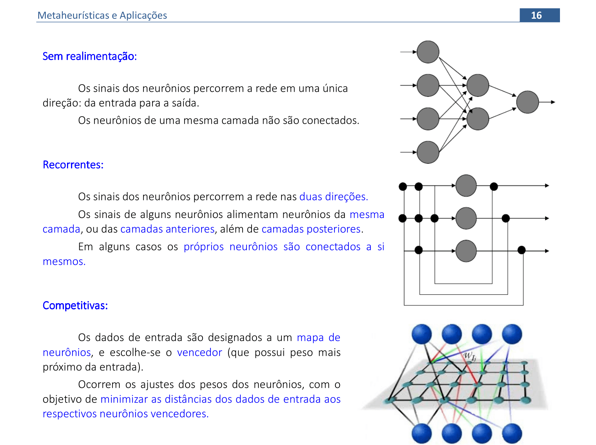

<link rel="stylesheet" href="imagens/style.css">

<h2 id="inicio">Algoritmos, exemplos e aplicações</h2>

Esta página contém os algoritmos e exemplos de algumas Metaheurísticas. Além disso, são mostradas as aplicações destas técnicas em várias áreas da Pesquisa Operacional.

A apostila está disponível no link: <a href="#" target="_blank">apostila de Metaheurísticas</a>

  
Redes Neurais Artificiais

  
Material da página 1 até a página xx.

   
   
<a href="#parte1" class="topo">voltar ao topo</a>

   
   
<a href="#parte1" class="topo">voltar ao topo</a>

   
   
<a href="#parte1" class="topo">voltar ao topo</a>

   
   
<a href="#parte1" class="topo">voltar ao topo</a>

   
   
<a href="#parte1" class="topo">voltar ao topo</a>

   
   
<a href="#parte1" class="topo">voltar ao topo</a>

   
   
<a href="#parte1" class="topo">voltar ao topo</a>

   
   
<a href="#parte1" class="topo">voltar ao topo</a>

   
   

&#x1f4c3; Algoritmo comentado

   <figcaption>Algoritmo da Rede Neural Perceptron:
<pre><code>0. Inicializar os pesos, o bias e a taxa de aprendizado: <a alt="vetor de pesos">w = 0</a>, <a alt="bias">&theta; = 0</a>, <a alt="taxa de aprendizagem">&alpha; = 1</a> 
	1. Enquanto o <a alt="critérios de parada mais usados:&#10;número máximo de iterações, erro mínimo alcançado,&#10;ou número máximo de iterações sem modificações nos pesos">critério de parada</a> não for satisfeito, execute os passos 2-6:
		2. <a alt="cada par de treinamento deve ser apresentado à rede">Para cada par de dados de treinamento (x,d)</a>, execute os passos 3-5:
		3. <a alt="calculamos o valor da variável y* sem a função de ativação">Calcule y* = &theta; + &sum;ixiwi</a> 
		4. <a alt="Neste passo, calculamos a função de ativação em y*">Se y* &gt; &delta;, então y = 1</a> 
		   Se -&delta; ≤ y* ≤ &delta;, então y = 0
		   Se y* &lt; -&delta;, então y = -1 
		5. <a alt="A atualização dos pesos só é feita quando a rede erra a classificação">Atualize os pesos e a tendência:</a>
		   Se y ≠ d, faça
		     wiatual = wianterior + &alpha;dxi e &theta;atual = &theta;anterior + &alpha;d 
		   Caso contrário
		     wiatual = wianterior e &theta;atual = &theta;anterior
6. <a alt="Neste passo, podemos calcular o erro quantitativo da rede">Teste a condição de parada.</a>

</code></pre></figcaption>
   

   
   
<a href="#parte1" class="topo">voltar ao topo</a>

   
   

&#x1f4c3; Resolução: 1&ordf; e 2&ordf; iterações

	
Vamos acompanhar os cálculos e as interpretações geométricas das 2 primeiras iterações deste exercício da Rede Neural Perceptron.

	  <ul class="slider">
		  <li>
			   <input type="radio" id="001" name="sl" checked>
			   <label for="001"></label>
			   
			   <figcaption>Apresentação do primeiro padrão para a rede (x1, x2) = (1, 1). Como y = &theta; + x1w1 + x2w2 = 0 + 1.0 + 1.0 = 0 &ne; d = 1, então os pesos são atualizados (passo 5 do algoritmo).</figcaption>
		   </li>
		   <li>
			   <input type="radio" id="002" name="sl" checked>
			   <label for="002"></label>
			   
			   <figcaption>Os coeficientes de w1, w2 e &theta; definem as equações das retas usadas para a classificação. O parâmetro &delta; cria uma região de indefinição para a classificação.</figcaption>
		   </li>
		   <li>
			   <input type="radio" id="003" name="sl" checked>
			   <label for="003"></label>
			   
			   <figcaption>Apresentação do segundo padrão para a rede (1, 0). Como y = &theta; + x1w1 + x2w2 = 1 + 1.1 + 0.1 = 2 &ne; d = -1, então os pesos são atualizados.</figcaption>
		   </li>
		   <li>
			   <input type="radio" id="004" name="sl" checked>
			   <label for="004"></label>
			   
			   <figcaption>Note que as equações definidas com os coeficientes de w1, w2 e &theta; ainda não classificam corretamente todos dos padrões.</figcaption>
		   </li>
		   <li>
			   <input type="radio" id="005" name="sl" checked>
			   <label for="005"></label>
			   
			   <figcaption>Apresentação do terceiro padrão para a rede (0, 1). Como y &ne; d, então os pesos são atualizados. Como os coeficientes das variáveis x1 e x2 ficaram nulos, não temos a interpretação geométrica nesta apresentação de padrões.</figcaption>
		   </li>
		   <li>
			   <input type="radio" id="006" name="sl" checked>
			   <label for="006"></label>
			   
			   <figcaption>Apresentação do último padrão para a rede (0, 0). Como y = d, então os pesos são mantidos. Usando esta combinação de pesos, podemos calcular o erro da primeira iteração.</figcaption>
		   </li>
		   <li>
			   <input type="radio" id="006a" name="sl" checked>
			   <label for="006a"></label>
			   
			   <figcaption>Usamos a combinação de pesos (w1 = 0, w2 = 0, &theta; = 1) da última apresentação de padrões para calcular o erro. Apenas o primeiro padrão está classificado incorretamente: logo, o erro quantitativo nesta primeira iteração é de 25%.</figcaption>
		   </li>
		   <li>
			   <input type="radio" id="007" name="sl" checked>
			   <label for="007"></label>
			   
			   <figcaption>Recomeçamos a apresentação de cada padrão para a rede na próxima iteração. O primeiro padrão (1, 1) é apresentado à rede, com a combinação de parâmetros (0, 0, 1). Como y &ne; d, então os pesos são atualizados.</figcaption>
		   </li>
		   <li>
			   <input type="radio" id="008" name="sl" checked>
			   <label for="008"></label>
			   
			   <figcaption>Note que as equações definidas com os coeficientes de w1, w2 e &theta; ainda não classificam corretamente todos dos padrões.</figcaption>
		   </li>
		   <li>
			   <input type="radio" id="009" name="sl" checked>
			   <label for="009"></label>
			   
			   <figcaption>Apresentação do segundo padrão para a rede (1, 0). Como y &ne; d, então os pesos são atualizados.</figcaption>
		   </li>
		   <li>
			   <input type="radio" id="010" name="sl" checked>
			   <label for="010"></label>
			   
			   <figcaption>Note que as equações definidas com os coeficientes de w1, w2 e &theta; ainda não classificam corretamente todos dos padrões.</figcaption>
		   </li>
		   <li>
			   <input type="radio" id="011" name="sl" checked>
			   <label for="011"></label>
			   
			   <figcaption>Apresentação do terceiro padrão para a rede (0, 1). Como y &ne; d, então os pesos são atualizados.</figcaption>
		   </li>
		   <li>
			   <input type="radio" id="012" name="sl" checked>
			   <label for="012"></label>
			   
			   <figcaption>Apresentação do último padrão para a rede (0, 0). Como y = d, então os pesos são mantidos. Usando esta combinação de pesos, podemos calcular o erro da segunda iteração.</figcaption>
		   </li>
		   <li>
			   <input type="radio" id="012a" name="sl" checked>
			   <label for="012a"></label>
			   
			   <figcaption>Usamos a combinação de pesos (w1 = 0, w2 = 0, &theta; = -2) da última apresentação de padrões para calcular o erro. Apenas o primeiro padrão está classificado incorretamente: logo, o erro quantitativo da segunda iteração é de 25%.</figcaption>
		   </li>
		</ul>
		
  

  

&#x1f4c3; Resolução: 3&ordf; ~ 9&ordf; iterações

	
Vamos acompanhar os resultados e as interpretações geométricas das 7 próximas iterações deste exercício da Rede Neural Perceptron.

	  <ul class="slider">
		  <li>
			   <input type="radio" id="013" name="sl" checked>
			   <label for="013"></label>
			   
			   <figcaption>Recomeçamos a apresentação de cada padrão para a rede na próxima iteração. O primeiro padrão (1, 1) é apresentado à rede, com a combinação de parâmetros (0, 0, -2). Como y &ne; d, então os pesos são atualizados.</figcaption>
		   </li>
		   <li>
			   <input type="radio" id="014" name="sl" checked>
			   <label for="014"></label>
			   
			   <figcaption>No final da terceira iteração, temos os coeficientes de w1, w2 e &theta; que definem as equações das retas usadas para a classificação. Note que temos 2 padrões classificados corretamente e os outros 2 na região de indefinição.</figcaption>
		   </li>
		   <li>
			   <input type="radio" id="015" name="sl" checked>
			   <label for="015"></label>
			   
			   <figcaption>Fazendo os cálculos da mesma forma mostrada nas duas primeiras iterações, temos as classificações da quarta e da quinta iteração. Nestes casos, 3 padrões estão classificados corretamente.</figcaption>
		   </li>
		   <li>
			   <input type="radio" id="016" name="sl" checked>
			   <label for="016"></label>
			   
			   <figcaption>Fazendo os cálculos da mesma forma mostrada nas duas primeiras iterações, temos as classificações da sexta e da sétima iteração. Nestes casos, 3 padrões estão classificados corretamente.</figcaption>
		   </li>
		   <li>
			   <input type="radio" id="017" name="sl" checked>
			   <label for="017"></label>
			   
			   <figcaption>Fazendo os cálculos da mesma forma mostrada nas duas primeiras iterações, temos as classificações da oitava e da nona iteração. Os padrões ficam separados corretamente com a combinação de pesos da nona iteração.</figcaption>
		   </li>
		   <li>
			   <input type="radio" id="018" name="sl" checked>
			   <label for="018"></label>
			   
			   <figcaption>Usamos a combinação de pesos (w1 = 2, w2 = 3, &theta; = -4) da última apresentação de padrões para calcular o erro. Todos os padrões estão classificados corretamente. Logo, podemos finalizar o processo de aprendizagem desta Rede Neural.</figcaption>
		   </li>
		</ul>
		
  

  

  
  

&#x1f4c3; Resolução

	
Vamos acompanhar os resultados e as interpretações geométricas deste exercício da Rede Neural Perceptron. Vamos usar entradas e saídas bipolares.

	  <ul class="slider">
		  <li>
			   <input type="radio" id="019" name="sl" checked>
			   <label for="019"></label>
			   
			   <figcaption>O primeiro padrão (1, 1) é apresentado à rede. Como y &ne; d, então os pesos são atualizados.</figcaption>
		   </li>
		   <li>
			   <input type="radio" id="020" name="sl" checked>
			   <label for="020"></label>
			   
			   <figcaption>Usando os coeficientes de w1, w2 e &theta; que definem as equações das retas usadas para a classificação, temos apenas 1 padrão classificado corretamente.</figcaption>
		   </li>
		   <li>
			   <input type="radio" id="021" name="sl" checked>
			   <label for="021"></label>
			   
			   <figcaption>O segundo padrão (1, -1) é apresentado à rede. Como y &ne; d, então os pesos são atualizados.</figcaption>
		   </li>
		   <li>
			   <input type="radio" id="022" name="sl" checked>
			   <label for="022"></label>
			   
			   <figcaption>Usando os coeficientes de w1, w2 e &theta; que definem as equações das retas usadas para a classificação, temos 2 padrões classificados corretamente.</figcaption>
		   </li>
		   <li>
			   <input type="radio" id="023" name="sl" checked>
			   <label for="023"></label>
			   
			   <figcaption>O terceiro padrão (-1, 1) é apresentado à rede. Como y &ne; d, então os pesos são atualizados. Na apresentação do último padrão, temos que y = d e os valores dos pesos são mantidos.</figcaption>
		   </li>
		   <li>
			   <input type="radio" id="018" name="sl" checked>
			   <label for="018"></label>
			   
			   <figcaption>Usamos a combinação de pesos (w1 = 1, w2 = 1, &theta; = -1) da última apresentação de padrões para calcular o erro. Todos os padrões estão classificados corretamente. Logo, podemos finalizar o processo de aprendizagem desta Rede Neural.</figcaption>
		   </li>
		</ul>
		
  

  

  
   
<a href="#parte1" class="topo">voltar ao topo</a>

  
   
<a href="#parte1" class="topo">voltar ao topo</a>

  
   
<a href="#parte1" class="topo">voltar ao topo</a>

   
  
<a href="#parte1" class="topo">voltar ao topo</a>

  
   
<a href="#parte1" class="topo">voltar ao topo</a>

  
   
<a href="#parte1" class="topo">voltar ao topo</a>

  
   
<a href="#parte1" class="topo">voltar ao topo</a>

  
   
<a href="#parte1" class="topo">voltar ao topo</a>

  
   
<a href="#parte1" class="topo">voltar ao topo</a>

  
   
<a href="#parte1" class="topo">voltar ao topo</a>

  
Título

  
Material da página xx até a página xxx.

  
  
<a href="#parte2" class="topo">voltar ao topo</a>

  
Título

  
Material da página xx até a página xxx.

  
  
<a href="#parte3" class="topo">voltar ao topo</a>

  
Título

  
Material da página xx até a página xxx.

  
  
<a href="#parte4" class="topo">voltar ao topo</a>

  
Título

  
Material da página xx até a página xxx.

  
  
<a href="#parte5" class="topo">voltar ao topo</a>

  
Título

  
Material da página xx até a página xxx.

  
  
<a href="#parte6" class="topo">voltar ao topo</a>

<h4>página desenvolvida por:</h4> 

Paulo Henrique Siqueira
  

<b>contato:</b> paulohscwb@gmail.com 

<h4>O desenvolvimento deste material de construções geométricas faz parte do Grupo de Estudos em Expressão Gráfica (GEEGRAF) da Universidade Federal do Paraná (UFPR)</h4>  

 Metaheurísticas e Aplicações de <a xmlns:cc="http://creativecommons.org/ns#" href="https://paulohscwb.github.io/ia/" property="cc:attributionName" rel="cc:attributionURL">Paulo Henrique Siqueira</a> está licenciado com uma Licença <a rel="license" href="http://creativecommons.org/licenses/by-nc/4.0/">Creative Commons - Atribuição-NãoComercial 4.0 Internacional</a>.

<h4>Como citar este trabalho:</h4> 

Siqueira, P.H., "Metaheurísticas e Aplicações". Disponível em: <https://paulohscwb.github.io/ia/>, Janeiro de 2021.

<h4>Referências:</h4>
<ol>
	<li></li>
	<li></li>
	<li></li>
	<li></li>
	<li></li>
	<li></li>
	<li></li>
	<li></li>
	<li></li>
<ol>