<link rel="stylesheet" href="imagens/style.css">

<h2 id="inicio">Algoritmos, exemplos e aplicações</h2>

Esta página contém os algoritmos e exemplos das técnicas mostradas na disciplina Metaheurísticas e Aplicações. Além disso, são mostradas as aplicações destas técnicas em várias áreas da Pesquisa Operacional.

A apostila está disponível no link: <a href="parte1/apostila_2020.pdf" target="_blank">apostila de Metaheurísticas</a>

<h3>Redes Neurais Artificiais</h3>

  
1. Perceptron e Adaline

  
Material da página 1 até a página 19.

   
   
<a href="#parte1" class="topo">voltar ao topo</a>

   

		<iframe width="100%" src="https://www.youtube.com/embed/0xIg8RPgL-Y" frameborder="0" allow="accelerometer; clipboard-write; encrypted-media; gyroscope; picture-in-picture" allowfullscreen></iframe>
   

   
   
<a href="#parte1" class="topo">voltar ao topo</a>

   
   
<a href="#parte1" class="topo">voltar ao topo</a>

   

		<iframe width="100%" src="https://www.youtube.com/embed/5Udsy46NMuw" frameborder="0" allow="accelerometer; clipboard-write; encrypted-media; gyroscope; picture-in-picture" allowfullscreen></iframe> 
   

   
   
<a href="#parte1" class="topo">voltar ao topo</a>

   
   
<a href="#parte1" class="topo">voltar ao topo</a>

   
   
<a href="#parte1" class="topo">voltar ao topo</a>

   
   
<a href="#parte1" class="topo">voltar ao topo</a>

   
   
<a href="#parte1" class="topo">voltar ao topo</a>

   

		<iframe width="100%" src="https://www.youtube.com/embed/aCfLD7L7HmQ" frameborder="0" allow="accelerometer; clipboard-write; encrypted-media; gyroscope; picture-in-picture" allowfullscreen></iframe> 
   

   
   

&#x1f4c3; Algoritmo comentado

   <figcaption>Algoritmo da Rede Neural Perceptron:
<pre><code>0. Inicializar os pesos, o bias e a taxa de aprendizado: <a alt="vetor de pesos">w = 0</a>, <a alt="bias">&theta; = 0</a>, <a alt="taxa de aprendizagem">&alpha; = 1</a> 
    1. Enquanto o <a alt="critérios de parada mais usados:&#10;número máximo de iterações, erro mínimo alcançado,&#10;ou número máximo de iterações sem modificações nos pesos">critério de parada</a> não for satisfeito, execute os passos 2-6:
        2. <a alt="cada par de treinamento deve ser apresentado à rede">Para cada par de dados de treinamento (x,d)</a>, execute os passos 3-5:
        3. <a alt="calculamos o valor da variável y* sem a função de ativação">Calcule y* = &theta; + &sum;ixiwi</a> 
        4. <a alt="Neste passo, calculamos a função de ativação em y*">Se y* &gt; &delta;, então y = 1</a> 
            Se -&delta; ≤ y* ≤ &delta;, então y = 0
            Se y* &lt; -&delta;, então y = -1 
        5. <a alt="A atualização dos pesos só é feita quando a rede erra a classificação">Atualize os pesos e a tendência:</a>
            Se y ≠ d, faça
               wiatual = wianterior + &alpha;dxi e &theta;atual = &theta;anterior + &alpha;d 
            Caso contrário
               wiatual = wianterior e &theta;atual = &theta;anterior
6. <a alt="Neste passo, podemos calcular o erro quantitativo da rede">Teste a condição de parada.</a>

</code></pre></figcaption>
   

   
   
<a href="#parte1" class="topo">voltar ao topo</a>

   
   

&#x1f4c3; Resolução: 1&ordf; e 2&ordf; iterações

	
Vamos acompanhar os cálculos e as interpretações geométricas das 2 primeiras iterações deste exercício da Rede Neural Perceptron.

	  <ul class="slider">
		  <li>
			   <input type="radio" id="001" name="sl" checked>
			   <label for="001"></label>
			   
			   <figcaption>Apresentação do primeiro padrão para a rede (<b>x1</b>, <b>x2</b>) = (1, 1). Como <b>y</b> = <b>&theta; + x1w1 + x2w2</b> = 0 + 1.0 + 1.0 = 0 &ne; <b>d</b> = 1, então os pesos são atualizados (passo 5 do algoritmo).</figcaption>
		   </li>
		   <li>
			   <input type="radio" id="002" name="sl">
			   <label for="002"></label>
			   
			   <figcaption>Os coeficientes <b>w1</b>, <b>w2</b> e <b>&theta;</b> definem as equações das retas usadas para a classificação. O parâmetro <b>&delta;</b> cria uma região de indefinição para a classificação.</figcaption>
		   </li>
		   <li>
			   <input type="radio" id="003" name="sl">
			   <label for="003"></label>
			   
			   <figcaption>Apresentação do segundo padrão para a rede (1, 0). Como <b>y</b> = <b>&theta; + x1w1 + x2w2</b> = 1 + 1.1 + 0.1 = 2 &ne; <b>d</b> = -1, então os pesos são atualizados. Note que as equações definidas com os coeficientes <b>w1</b>, <b>w2</b> e <b>&theta;</b> ainda não classificam corretamente todos dos padrões.</figcaption>
		   </li>
		   <li>
			   <input type="radio" id="005" name="sl">
			   <label for="005"></label>
			   
			   <figcaption>Apresentação do terceiro padrão para a rede (0, 1). Como <b>y</b> &ne; <b>d</b>, então os pesos são atualizados. Como os coeficientes das variáveis <b>x1</b> e <b>x2</b> ficaram nulos, não temos a interpretação geométrica nesta apresentação de padrões.</figcaption>
		   </li>
		   <li>
			   <input type="radio" id="006" name="sl">
			   <label for="006"></label>
			   
			   <figcaption>Apresentação do último padrão para a rede (0, 0). Como <b>y</b> = <b>d</b>, então os pesos são mantidos. Usando esta combinação de pesos, podemos calcular o erro da primeira iteração.</figcaption>
		   </li>
		   <li>
			   <input type="radio" id="006a" name="sl">
			   <label for="006a"></label>
			   
			   <figcaption>Usamos a combinação de pesos (<b>w1</b> = 0, <b>w2</b> = 0, <b>&theta;</b> = -1) da última apresentação de padrões para calcular o erro. Apenas o primeiro padrão está classificado incorretamente: logo, o erro quantitativo nesta primeira iteração é de 25%.</figcaption>
		   </li>
		   <li>
			   <input type="radio" id="007" name="sl">
			   <label for="007"></label>
			   
			   <figcaption>Recomeçamos a apresentação de cada padrão para a rede na próxima iteração. O primeiro padrão (1, 1) é apresentado à rede, com a combinação de parâmetros (0, 0, 1). Como <b>y</b> &ne; <b>d</b>, então os pesos são atualizados. Note que as equações definidas com os coeficientes <b>w1</b>, <b>w2</b> e <b>&theta;</b> ainda não classificam corretamente todos dos padrões.</figcaption>
		   </li>
		   <li>
			   <input type="radio" id="009" name="sl">
			   <label for="009"></label>
			   
			   <figcaption>Apresentação do segundo padrão para a rede (1, 0). Como <b>y</b> &ne; <b>d</b>, então os pesos são atualizados. As equações definidas com os coeficientes <b>w1</b>, <b>w2</b> e <b>&theta;</b> ainda não classificam corretamente todos dos padrões.</figcaption>
		   </li>
		   <li>
			   <input type="radio" id="011" name="sl">
			   <label for="011"></label>
			   
			   <figcaption>Apresentação do terceiro padrão para a rede (0, 1). Como <b>y</b> &ne; <b>d</b>, então os pesos são atualizados.</figcaption>
		   </li>
		   <li>
			   <input type="radio" id="012" name="sl">
			   <label for="012"></label>
			   
			   <figcaption>Apresentação do último padrão para a rede (0, 0). Como <b>y</b> = <b>d</b>, então os pesos são mantidos. Usando esta combinação de pesos, podemos calcular o erro da segunda iteração.</figcaption>
		   </li>
		   <li>
			   <input type="radio" id="012a" name="sl">
			   <label for="012a"></label>
			   
			   <figcaption>Usamos a combinação de pesos (<b>w1</b> = 0, <b>w2</b> = 0, <b>&theta;</b> = -2) da última apresentação de padrões para calcular o erro. Apenas o primeiro padrão está classificado incorretamente: logo, o erro quantitativo da segunda iteração é de 25%.</figcaption>
		   </li>
		</ul>
		
  

  

&#x1f4c3; Resolução: 3&ordf; ~ 9&ordf; iterações

	
Vamos acompanhar os resultados e as interpretações geométricas das próximas 7 iterações deste exercício da Rede Neural Perceptron.

	  <ul class="slider">
		  <li>
			   <input type="radio" id="013" name="sl">
			   <label for="013"></label>
			   
			   <figcaption>Recomeçamos a apresentação de cada padrão para a rede na próxima iteração. O primeiro padrão (1, 1) é apresentado à rede, com a combinação de parâmetros (0, 0, -2). Como <b>y</b> &ne; <b>d</b>, então os pesos são atualizados.</figcaption>
		   </li>
		   <li>
			   <input type="radio" id="014" name="sl">
			   <label for="014"></label>
			   
			   <figcaption>Os coeficientes <b>w1</b>, <b>w2</b> e <b>&theta;</b> definem as equações das retas usadas para a classificação. Note que temos 2 padrões classificados corretamente e os outros 2 na região de indefinição.</figcaption>
		   </li>
		   <li>
			   <input type="radio" id="015" name="sl">
			   <label for="015"></label>
			   
			   <figcaption>Fazendo os cálculos da mesma forma mostrada nas duas primeiras iterações, temos as classificações da quarta e da quinta iteração. Nestes casos, 3 padrões estão classificados corretamente.</figcaption>
		   </li>
		   <li>
			   <input type="radio" id="016" name="sl">
			   <label for="016"></label>
			   
			   <figcaption>Fazendo os cálculos da mesma forma mostrada nas duas primeiras iterações, temos as classificações da sexta e da sétima iteração. Nestes casos, 3 padrões estão classificados corretamente.</figcaption>
		   </li>
		   <li>
			   <input type="radio" id="017" name="sl">
			   <label for="017"></label>
			   
			   <figcaption>Fazendo os cálculos da mesma forma mostrada nas duas primeiras iterações, temos as classificações da oitava e da nona iteração. Os padrões ficam separados corretamente com a combinação de pesos da nona iteração.</figcaption>
		   </li>
		   <li>
			   <input type="radio" id="018" name="sl">
			   <label for="018"></label>
			   
			   <figcaption>Usamos a combinação de pesos (<b>w1</b> = 2, <b>w2</b> = 3, <b>&theta;</b> = -4) da última apresentação de padrões para calcular o erro. Todos os padrões estão classificados corretamente. Logo, podemos finalizar o processo de aprendizagem desta Rede Neural.</figcaption>
		   </li>
		</ul>
		
  

  
  

&#x1f4c3; Resolução

	
Vamos acompanhar os resultados e as interpretações geométricas deste exercício da Rede Neural Perceptron. Vamos usar entradas e saídas bipolares.

	  <ul class="slider">
		  <li>
			   <input type="radio" id="019" name="sl">
			   <label for="019"></label>
			   
			   <figcaption>O primeiro padrão (1, 1) é apresentado à rede. Como <b>y</b> &ne; <b>d</b>, então os pesos são atualizados.</figcaption>
		   </li>
		   <li>
			   <input type="radio" id="020" name="sl">
			   <label for="020"></label>
			   
			   <figcaption>Usando os coeficientes de <b>w1</b>, <b>w2</b> e <b>&theta;</b> que definem as equações das retas usadas para a classificação, temos apenas 1 padrão classificado corretamente.</figcaption>
		   </li>
		   <li>
			   <input type="radio" id="021" name="sl">
			   <label for="021"></label>
			   
			   <figcaption>O segundo padrão (1, -1) é apresentado à rede. Como <b>y</b> &ne; <b>d</b>, então os pesos são atualizados.</figcaption>
		   </li>
		   <li>
			   <input type="radio" id="022" name="sl">
			   <label for="022"></label>
			   
			   <figcaption>Usando os coeficientes de <b>w1</b>, <b>w2</b> e <b>&theta;</b> que definem as equações das retas usadas para a classificação, temos 2 padrões classificados corretamente.</figcaption>
		   </li>
		   <li>
			   <input type="radio" id="023" name="sl">
			   <label for="023"></label>
			   
			   <figcaption>O terceiro padrão (-1, 1) é apresentado à rede. Como <b>y</b> &ne; <b>d</b>, então os pesos são atualizados. Na apresentação do último padrão, temos que <b>y</b> = <b>d</b> e os valores dos pesos são mantidos.</figcaption>
		   </li>
		   <li>
			   <input type="radio" id="024" name="sl">
			   <label for="024"></label>
			   
			   <figcaption>Usamos a combinação de pesos (<b>w1</b> = 1, <b>w2</b> = 1, <b>&theta;</b> = -1) da última apresentação de padrões para calcular o erro. Todos os padrões estão classificados corretamente. Logo, podemos finalizar o processo de aprendizagem desta Rede Neural.</figcaption>
		   </li>
		</ul>
		
  

  
  
&#x1f4d1; Atividade 1.1

   
<a href="#parte1" class="topo">voltar ao topo</a>

  
  
&#x1f4d1; Atividade 1.2

  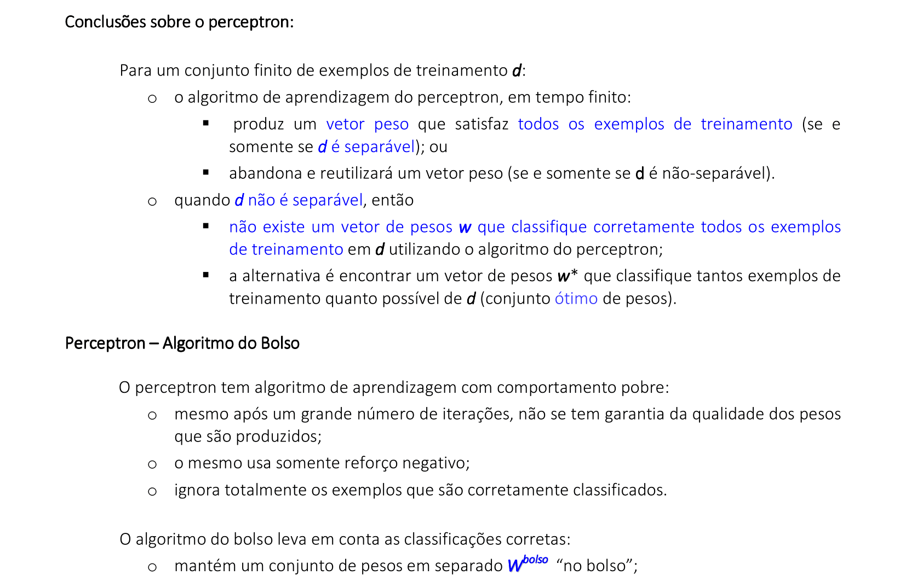
   
<a href="#parte1" class="topo">voltar ao topo</a>

   

		<iframe width="100%" src="https://www.youtube.com/embed/9thR_Ez3ydE" frameborder="0" allow="accelerometer; clipboard-write; encrypted-media; gyroscope; picture-in-picture" allowfullscreen></iframe> 
   

  
  

&#x1f4c3; Algoritmo comentado

   <figcaption>Algoritmo da Rede Neural Perceptron com bolso:
<pre><code>0. Inicializar os pesos, o bias e a taxa de aprendizado: w = 0, <a alt="vetor de pesos do bolso">wbolso = 0</a>, &theta; = 0, &alpha; = 1 
    1. Enquanto o critério de parada</a> não for satisfeito, execute os passos 2-7:
        2. Para cada par de dados de treinamento (x,d), execute os passos 3-5:
        3. Calcule y* = &theta; + &sum;ixiwi
        4. Se y* &gt; &delta;, então y = 1
           Se -&delta; ≤ y* ≤ &delta;, então y = 0
           Se y* &lt; -&delta;, então y = -1 
        5. Atualize os pesos e a tendência:
           Se y ≠ d, faça
             wiatual = wianterior + &alpha;dxi e &theta;atual = &theta;anterior + &alpha;d 
           Caso contrário
             wiatual = wianterior e &theta;atual = &theta;anterior
        6. <a alt="guardamos no bolso a melhor combinação de pesos; esta tática é muito&#10;usada nas Metaheurísticas para não perder boas combinações de pesos">Se w classifica corretamente mais exemplos do que wbolso:</a>  
             wbolso = w; grave o número de exemplos corretos 
7. Teste a condição de parada.
</code></pre></figcaption>
   

   
   <figcaption>Para separar os dados em mais classes, podemos inserir mais neurônios na Rede Neural</figcaption>
   
<a href="#parte1" class="topo">voltar ao topo</a>

   
  
<a href="#parte1" class="topo">voltar ao topo</a>

  
   
<a href="#parte1" class="topo">voltar ao topo</a>

  
   
<a href="#parte1" class="topo">voltar ao topo</a>

  
  <figcaption>Vamos utilizar a Regra Delta para deduzir as formas de atualizações dos pesos em algumas Redes Neurais. O princípio é sempre de buscar a minimização do erro de classificação de cada Rede Neural Artificial.</figcaption>
   
<a href="#parte1" class="topo">voltar ao topo</a>

   

		<iframe width="100%" src="https://www.youtube.com/embed/ea4NyuR68_U" frameborder="0" allow="accelerometer; clipboard-write; encrypted-media; gyroscope; picture-in-picture" allowfullscreen></iframe> 
   

  
   
<a href="#parte1" class="topo">voltar ao topo</a>

  
  

&#x1f4c3; Algoritmo comentado

   <figcaption>Algoritmo da Rede Neural Adaline:
<pre><code>0. Inicializar os pesos <a alt="pesos com valores aleatórios">(w = rnd)</a>, a tendência <a alt="bias nulo">(&theta; = 0)</a>
e a taxa de aprendizagem <a alt="taxa de aprendizagem com valor entre 0 e 1">0 &lt; &alpha; &lt; 1</a> (convergência fica muito lenta quando a taxa é muito 
próxima de zero; e a convergência não é garantida para valores muito próximos de 1).
    1. Enquanto o critério de parada não for satisfeito, execute os passos 2-5:
        2. Para cada par de dados para treinamento (x,d), execute os passos 3-4:
            3. Faça <a alt="primeiro calculamos o valor de y*">y* = &theta; + &sum;ixiwi</a> 
            4. <a alt="os pesos e o bias são sempre atualizados">Atualize os pesos e a tendência:</a>
                wiatual = wianterior + &alpha;(d – y*)xi  
                &theta;atual = &theta;anterior + &alpha;(d – y*)
                <a alt="função de ativação do tipo limiar">se y* ≥ 0, y = 1; caso contrário, y = 0 (ou y = -1 para bipolar)</a>
        5. <a alt="podem ser as mesmas condições usadas no Perceptron">Teste a condição de parada.</a> 
    6. Se a maior alteração de pesos não ultrapassa um limite mínimo de tolerância, pare; 
	caso contrário, continue. 
</code></pre></figcaption>
   

  
  

&#x1f4c3; Resolução

	
Vamos acompanhar os resultados e as interpretações geométricas deste exercício de classificação de padrões usando a Rede Neural Adaline. Vamos usar entradas e saídas bipolares.

	  <ul class="slider">
		  <li>
			   <input type="radio" id="025" name="sl">
			   <label for="025"></label>
			   
			   <figcaption>A arquitetura da Rede Neural Adaline fica análoga à arquitetura que usamos no caso do Perceptron. O resumo dos cálculos está mostrado nesta imagem. Vamos iniciar com os pesos indicados de <b>w</b> e <b>&theta;</b> e a taxa de aprendizagem <b>&alpha;</b>.</figcaption>
		   </li>
		   <li>
			   <input type="radio" id="026" name="sl">
			   <label for="026"></label>
			   
			   <figcaption>O primeiro padrão (1, 1) é apresentado à rede, com a atualização automática dos pesos. Note que o termo <b>&Delta;&theta;</b> é comum na atualização dos pesos <b>w1</b> e <b>w2</b>; logo, podemos aplicar uma simplificação para estes cálculos.</figcaption>
		   </li>
		   <li>
			   <input type="radio" id="027" name="sl">
			   <label for="027"></label>
			   
			   <figcaption>O padrão (1, -1) é apresentado à rede, com a atualização automática dos pesos. Note que a simplificação na atualização dos pesos foi aplicada neste passo para <b>w1</b> e <b>w2</b>.</figcaption>
		   </li>
		   <li>
			   <input type="radio" id="028" name="sl">
			   <label for="028"></label>
			   
			   <figcaption>O padrão (-1, 1) é apresentado à rede, com a atualização automática dos pesos.</figcaption>
		   </li>
		   <li>
			   <input type="radio" id="029" name="sl">
			   <label for="029"></label>
			   
			   <figcaption>O padrão (-1, -1) é apresentado à rede, com a atualização automática dos pesos. Note que a reta com os coeficientes dos pesos classifica todos os padrões corretamente.</figcaption>
		   </li>
		   <li>
			   <input type="radio" id="030" name="sl">
			   <label for="030"></label>
			   
			   <figcaption>Usando a função do cálculo do erro, similar à usada para deduzir a Regra Delta, temos que: <b>E = &sum;k((dk - y)2)/2</b> = ((1 - 1)2 + (1 - 1)2 + (1 - 1)2 + (-1 - (-1))2)/2 = 0. O erro quantitativo também fica nulo, logo, podemos finalizar a aprendizagem desta Rede Neural.</figcaption>
		   </li>
		</ul>
		
  

  
   
<a href="#parte1" class="topo">voltar ao topo</a>

  
  
&#x1f4d1; Atividade 1.3

   
<a href="#parte1" class="topo">voltar ao topo</a>

  
2. Multi Layer Perceptron (MLP)

  
Material da página 19 até a página 40.

  
   

		<iframe width="100%" src="https://www.youtube.com/embed/A6zbFVqCeO8" frameborder="0" allow="accelerometer; clipboard-write; encrypted-media; gyroscope; picture-in-picture" allowfullscreen></iframe>
   

   
<a href="#parte2" class="topo">voltar ao topo</a>

  
   
<a href="#parte2" class="topo">voltar ao topo</a>

  
  

&#x1f4c3; Resolução

   <figcaption>
Neste caso, o parâmetro <b>&beta;</b> da função sigmoidal é igual a 1.
    A derivada da função <b>yk</b> = <b>tanh(yk*)</b> com parâmetro <b>&beta;</b> = 1 é <b>y'k</b> = <b>(1 - yk2)</b>. 
    Logo, a atualização de pesos w será <b>&Delta;wjk = &alpha;(1 - yk2)(dk - yk)zj</b>.
</figcaption>
   

  
   
<a href="#parte2" class="topo">voltar ao topo</a>

  
  

&#x1f4c3; Resolução

   <figcaption>
As derivadas das funções <b>yk</b> = <b>tanh(yk*)</b> e <b>zj</b> = <b>tanh(zj*)</b> com parâmetro <b>&beta;</b> = 1 são:
    <b>y'k</b> = <b>(1 - yk2)</b> e <b>z'j</b> = <b>(1 - zj2)</b>. 
    Logo, a atualização de pesos v será <b>&Delta;vij = &alpha;&sum;k[(dk - yk)(1 - yk2)wjk](1 - zj2)xi</b>.
</figcaption>
   

  
   
<a href="#parte2" class="topo">voltar ao topo</a>

  
   
<a href="#parte2" class="topo">voltar ao topo</a>

  
   
<a href="#parte2" class="topo">voltar ao topo</a>

  
   

		<iframe width="100%" src="https://www.youtube.com/embed/6HC3HJlU7zM" frameborder="0" allow="accelerometer; clipboard-write; encrypted-media; gyroscope; picture-in-picture" allowfullscreen></iframe>
   

   
<a href="#parte2" class="topo">voltar ao topo</a>

  
  

&#x1f4c3; Algoritmo comentado

   <figcaption>Algoritmo 1 de Rede Neural MLP: 1 camada escondida, funções de ativação sigmoidais, m saídas
<pre><code>0. Inicialize os <a alt="pesos w e bias &theta; com valores aleatórios">pesos das conexões e do bias com valores aleatórios</a>; 
inicialize a taxa de aprendizagem &alpha;. Para cada padrão de entrada, execute os passos de 1 a 3:
    1. <a alt="calculamos as saídas z da camada escondida de cada padrão de entrada&#10;depois, com os valores z encontramos os valores de cada saída yk">Calcule as entradas na camada escondida</a>, e a saída da rede:
       zj* = &sum;ivijxi + &theta;aj  &rArr;  zj = 1/(1 + e-zj*), onde j = 1, ..., p, i = 1, ..., n
       yk* = &sum;jwjkzj + &theta;bk  &rArr;  yk = 1/(1 + e-yk*), onde k = 1, 2, ..., m 
    2. <a alt="as correções da camada de saída são feitas antes&#10;os valores encontrados são repassados para a camada escondida (backpropagation)">Calcule as correções das conexões da camada de saída:</a>
       &#9651;wjk = &alpha;yk(1 – yk)(dk – yk)zj  &rArr;  wjk = wjk + &#9651;wjk 
       &#9651;&theta;bk = &alpha;yk(1 – yk)(dk – yk)  &rArr;  &theta;bk = &theta;bk + &#9651;&theta;bk 
    3. <a alt="as correções da camada escondida são feitas por último">Calcule as correções das conexões da camada escondida:</a>
       &#9651;vij = &alpha;&sum;k[(dk – yk)yk(1 – yk)wjk]zj(1 - zj)xi  &rArr;  vij = vij + &#9651;vij 
       &#9651;&theta;aj = &alpha;&sum;k[(dk – yk)yk(1 – yk)wjk]zj(1 - zj)  &rArr;  &theta;aj = &theta;aj + &#9651;&theta;aj 
    4. <a alt="atualização linear: &alpha; = 0,95.&alpha; ou &alpha; = 0,9.&alpha;">Atualize a taxa de aprendizagem</a>, verifique os erros para todos os padrões de entrada, 
    e teste o <a alt="erro mínimo ou número máximo de iterações">critério de parada.</a>
 
</code></pre></figcaption>
   

   
   

&#x1f4c3; Algoritmo comentado

   <figcaption>Algoritmo 2 de Rede Neural MLP: 1 camada escondida, funções de ativação sigmoidais, 1 saída
<pre><code>0. Inicialize os <a alt="pesos w e bias &theta; com valores aleatórios">pesos das conexões e do bias com valores aleatórios</a>; 
inicialize a taxa de aprendizagem &alpha;. Para cada padrão de entrada, execute os passos de 1 a 3:
    1. <a alt="calculamos as saídas z da camada escondida de cada padrão de entrada&#10;depois, com os valores z encontramos os valores da saída y">Calcule as entradas na camada escondida</a>, e a saída da rede:
       zj* = &sum;ivijxi + &theta;aj  &rArr;  zj = 1/(1 + e-zj*), onde j = 1, ..., p, i = 1, ..., n
       y = &sum;jwjzj + &theta;b  &rArr;  y = 1/(1 + e-y*), onde k = 1, 2, ..., m 
    2. <a alt="as correções da camada de saída são feitas antes&#10;os valores encontrados são repassados para a camada escondida (backpropagation)">Calcule as correções das conexões da camada de saída:</a>
       &#9651;wj = &alpha;y(1 – y)(d – y)zj  &rArr;  wj = wj + &#9651;wj 
       &#9651;&theta;b = &alpha;y(1 – y)(d – y)  &rArr;  &theta;b = &theta;b + &#9651;&theta;b 
    3. <a alt="as correções da camada escondida são feitas por último">Calcule as correções das conexões da camada escondida:</a>
       &#9651;vij = &alpha;(d – y)y(1 – y)wjzj(1 - zj)xi  &rArr;  vij = vij + &#9651;vij 
       &#9651;&theta;aj = &alpha;(d – y)y(1 – y)wjzj(1 - zj)  &rArr;  &theta;aj = &theta;aj + &#9651;&theta;aj 
    4. <a alt="atualização linear: &alpha; = 0,95.&alpha; ou &alpha; = 0,9.&alpha;">Atualize a taxa de aprendizagem</a>, verifique os erros para todos os padrões de entrada, 
    e teste o <a alt="erro mínimo ou número máximo de iterações">critério de parada.</a>
 
</code></pre></figcaption>
   

   
   
<a href="#parte2" class="topo">voltar ao topo</a>

  
  

&#x1f4c3; Algoritmo comentado

   <figcaption>Algoritmo 1 de Rede Neural MLP: 1 camada escondida, funções de ativação tanh, m saídas
<pre><code>0. Inicialize os <a alt="pesos w e bias &theta; com valores aleatórios">pesos das conexões e do bias com valores aleatórios</a>; 
inicialize a taxa de aprendizagem &alpha;. Para cada padrão de entrada, execute os passos de 1 a 3:
    1. <a alt="calculamos as saídas z da camada escondida de cada padrão de entrada&#10;depois, com os valores z encontramos os valores de cada saída yk">Calcule as entradas na camada escondida</a>, e a saída da rede:
       zj* = &sum;ivijxi + &theta;aj  &rArr;  zj = tanh(zj*), onde j = 1, ..., p, i = 1, ..., n
       yk* = &sum;jwjkzj + &theta;bk  &rArr;  yk = tanh(yk*), onde k = 1, 2, ..., m 
    2. <a alt="as correções da camada de saída são feitas antes&#10;note que usamos a derivada da função tanh em todas as correções">Calcule as correções das conexões da camada de saída:</a>
       &#9651;wjk = &alpha;(1 – yk2)(dk – yk)zj  &rArr;  wjk = wjk + &#9651;wjk 
       &#9651;&theta;bk = &alpha;(1 – yk2)(dk – yk)  &rArr;  &theta;bk = &theta;bk + &#9651;&theta;bk 
    3. <a alt="as correções da camada escondida são feitas por último&#10;note que usamos as derivadas da função tanh">Calcule as correções das conexões da camada escondida:</a>
       &#9651;vij = &alpha;&sum;k[(dk – yk)(1 – yk2)wjk](1 - zj2)xi  &rArr;  vij = vij + &#9651;vij 
       &#9651;&theta;aj = &alpha;&sum;k[(dk – yk)(1 – yk2)wjk](1 - zj2)  &rArr;  &theta;aj = &theta;aj + &#9651;&theta;aj 
    4. <a alt="atualização linear: &alpha; = 0,95.&alpha; ou &alpha; = 0,9.&alpha;">Atualize a taxa de aprendizagem</a>, verifique os erros para todos os padrões de entrada, 
    e teste o <a alt="erro mínimo ou número máximo de iterações">critério de parada.</a>
 
</code></pre></figcaption>
  

  
  

&#x1f4c3; Resolução

	
Vamos acompanhar os resultados e as interpretações geométricas deste exercício de classificação de padrões com a Rede Neural Multi Layer Perceptron (MLP). Vamos usar saídas binárias para classificar os padrões de entrada em dois conjuntos: <b>A</b> e <b>B</b>.

	  <ul class="slider">
		  <li>
			   <input type="radio" id="031" name="sl">
			   <label for="031"></label>
			   
			   <figcaption>A arquitetura da Rede Neural deste primeiro exercício fica análoga à arquitetura que usamos nos exemplos Perceptron e Adaline. O resumo dos cálculos está mostrado nesta imagem. Vamos iniciar com os pesos indicados de <b>w</b> e <b>&theta;</b> e a taxa de aprendizagem <b>&alpha;</b> = 1.</figcaption>
		   </li>
		   <li>
			   <input type="radio" id="032" name="sl">
			   <label for="032"></label>
			   
			   <figcaption>O primeiro padrão (0, 2) é apresentado à rede. Calculamos a saída <b>y*</b> e aplicamos a função de ativação sigmóide (pois a saída está no intervalo [0,1]). Note que podemos simplificar a atualização dos pesos, pois o termo <b>&Delta;&theta;</b> é comum nas atualizações dos pesos <b>w1</b> e <b>w2</b>. </figcaption>
		   </li>
		   <li>
			   <input type="radio" id="033" name="sl">
			   <label for="033"></label>
			   
			   <figcaption>O padrão (1, 2) é apresentado à rede, com a atualização automática dos pesos. Usamos a simplificação de atualização dos pesos para as próximas apresentações de padrões de entrada.</figcaption>
		   </li>
		   <li>
			   <input type="radio" id="034" name="sl">
			   <label for="034"></label>
			   
			   <figcaption>O padrão (1, 3) é apresentado à rede, com a atualização automática dos pesos. Este é o último padrão de entrada do conjunto com <b>d</b> = 1.</figcaption>
		   </li>
		   <li>
			   <input type="radio" id="035" name="sl">
			   <label for="035"></label>
			   
			   <figcaption>O padrão (2, 1) é apresentado à rede, com a atualização automática dos pesos. Este é o primeiro padrão de entrada do conjunto com <b>d</b> = 0.</figcaption>
		   </li>
		   <li>
			   <input type="radio" id="036" name="sl">
			   <label for="036"></label>
			   
			   <figcaption>O padrão (1, 0) é apresentado à rede, com a atualização automática dos pesos. Este é o último padrão de entrada nesta rede, finalizando a primeira iteração.</figcaption>
		   </li>
		   <li>
			   <input type="radio" id="037" name="sl">
			   <label for="037"></label>
			   
			   <figcaption>Calculamos as saídas <b>y*</b> e <b>y</b> de cada padrão de entrada para encontrarmos o erro desta iteração. A função do cálculo do erro é a mesma que foi usada para deduzir a Regra Delta: <b>E = &sum;k((dk - y)2)/2 = 0,937</b>. A interpretação geométrica da MLP pode ser melhor compreendida usando o gráfico em 3 dimensões.</figcaption>
		   </li>
		   <li>
			   <input type="radio" id="038" name="sl">
			   <label for="038"></label>
			   
			   <figcaption>Na segunda iteração, precisamos atualizar a taxa de aprendizagem: <b>&alpha;</b> = <b>&alpha;.0,95</b>. O primeiro padrão (0, 2) é apresentado à rede, com atualização automática dos pesos.</figcaption>
		   </li>
		   <li>
			   <input type="radio" id="039" name="sl">
			   <label for="039"></label>
			   
			   <figcaption>O padrão (1, 2) é apresentado à rede, com atualização automática dos pesos.</figcaption>
		   </li>
		   <li>
			   <input type="radio" id="040" name="sl">
			   <label for="040"></label>
			   
			   <figcaption>O padrão (1, 3) é apresentado à rede, com atualização automática dos pesos.</figcaption>
		   </li>
		   <li>
			   <input type="radio" id="041" name="sl">
			   <label for="041"></label>
			   
			   <figcaption>O padrão (1, 0) é apresentado à rede, com atualização automática dos pesos.</figcaption>
		   </li>
		   <li>
			   <input type="radio" id="042" name="sl">
			   <label for="042"></label>
			   
			   <figcaption>O padrão (2, 1) é apresentado à rede, com atualização automática dos pesos.</figcaption>
		   </li>
		   <li>
			   <input type="radio" id="043" name="sl">
			   <label for="043"></label>
			   
			   <figcaption>Calculamos as saídas <b>y*</b> e <b>y</b> de cada padrão de entrada para encontrarmos o erro desta iteração. A função do cálculo do erro é a mesma que foi usada para deduzir a Regra Delta: <b>E = &sum;k((dk - y)2)/2 = 0,859</b>.</figcaption>
		   </li>
		   <li>
			   <input type="radio" id="044" name="sl">
			   <label for="044"></label>
			   
			   <figcaption>No final da 10&ordf; iteração, temos esta combinação de pesos. O erro nesta iteração é <b>E = &sum;k((dk - y)2)/2 = 0,222</b>, que representa uma grande redução quando comparada com as duas primeiras iterações.</figcaption>
		   </li>
		</ul>
		
  

  
  

&#x1f4c3; Resolução

	
Vamos acompanhar os resultados e as interpretações geométricas deste exercício de classificação de padrões usando uma Rede Neural Multi Layer Perceptron (MLP). Vamos usar saídas binárias para classificar os padrões de entrada em dois conjuntos <b>A</b> e <b>B</b>, além de uma camada escondida para acelerar a convergência.

	  <ul class="slider">
		  <li>
			   <input type="radio" id="045" name="sl">
			   <label for="045"></label>
			   
			   <figcaption>A arquitetura da Rede Neural deste exercício tem 3 neurônios na camada escondida. O resumo dos cálculos está mostrado nesta imagem. Vamos inicializar com os pesos indicados de <b>v</b>, <b>w</b>, <b>&theta;a</b> e <b>&theta;b</b> e a taxa de aprendizagem <b>&alpha;</b> = 1.</figcaption>
		   </li>
		   <li>
			   <input type="radio" id="046" name="sl">
			   <label for="046"></label>
			   
			   <figcaption>O primeiro padrão (0, 2) é apresentado à rede. Calculamos a saída <b>z*</b> e aplicamos a função de ativação sigmóide (na camada escondida, podemos aplicar a função tanh ou limiar). Com os valores <b>z</b>, calculamos a saída da rede <b>y*</b> com a função de ativação sigmóide.</figcaption>
		   </li>
		   <li>
			   <input type="radio" id="047" name="sl">
			   <label for="047"></label>
			   
			   <figcaption>De acordo com o algoritmo Backpropagation, atualizamos primeiro os pesos da camada de saída <b>w</b>. Podemos simplificar a atualização dos pesos <b>w</b>, pois o termo <b>&Delta;&theta;b</b> é comum nas atualizações dos pesos <b>w</b>. </figcaption>
		   </li>
		   <li>
			   <input type="radio" id="048" name="sl">
			   <label for="048"></label>
			   
			   <figcaption>De acordo com o algoritmo Backpropagation, atualizamos a seguir os pesos da camada de entrada <b>v</b>. Podemos simplificar a atualização dos pesos <b>v</b>, pois os termos <b>&Delta;&theta;a1</b>, <b>&Delta;&theta;a2</b> e <b>&Delta;&theta;a3</b> são comuns nestas atualizações de pesos. </figcaption>
		   </li>
		   <li>
			   <input type="radio" id="049" name="sl">
			   <label for="049"></label>
			   
			   <figcaption>O padrão (1, 2) é apresentado à rede, com a atualização automática dos pesos. Usamos a simplificação de atualização dos pesos para as próximas apresentações de padrões de entrada.</figcaption>
		   </li>
		   <li>
			   <input type="radio" id="050" name="sl">
			   <label for="050"></label>
			   
			   <figcaption>O padrão (1, 3) é apresentado à rede, com a atualização automática dos pesos. Este é o último padrão de entrada do conjunto com <b>d</b> = 1.</figcaption>
		   </li>
		   <li>
			   <input type="radio" id="051" name="sl">
			   <label for="051"></label>
			   
			   <figcaption>O padrão (2, 1) é apresentado à rede, com a atualização automática dos pesos. Este é o primeiro padrão de entrada do conjunto com <b>d</b> = 0.</figcaption>
		   </li>
		   <li>
			   <input type="radio" id="052" name="sl">
			   <label for="052"></label>
			   
			   <figcaption>O padrão (1, 0) é apresentado à rede, com a atualização automática dos pesos. Este é o último padrão de entrada nesta rede, finalizando a primeira iteração.</figcaption>
		   </li>
		   <li>
			   <input type="radio" id="053" name="sl">
			   <label for="053"></label>
			   
			   <figcaption>Calculamos as saídas <b>z*</b> e <b>z</b> para determinar as saídas <b>y*</b> e <b>y</b> de cada padrão de entrada. A função do cálculo do erro é a mesma que foi usada para deduzir a Regra Delta: <b>E = &sum;k((dk - y)2)/2 = 0,268</b>. A interpretação geométrica da MLP pode ser melhor compreendida usando o gráfico em 3 dimensões.</figcaption>
		   </li>
		   <li>
			   <input type="radio" id="054" name="sl">
			   <label for="054"></label>
			   
			   <figcaption>Na segunda iteração, precisamos atualizar a taxa de aprendizagem: <b>&alpha; = &alpha;.0,95</b>. O primeiro padrão (0, 2) é apresentado à rede, com atualização automática dos pesos.</figcaption>
		   </li>
		   <li>
			   <input type="radio" id="055" name="sl">
			   <label for="055"></label>
			   
			   <figcaption>No final da 10&ordf;  iteração, temos esta configuração de pesos. O erro nesta iteração é <b>E = &sum;k((dk - y)2)/2 = 0,102</b>.</figcaption>
		   </li>
		</ul>
		
  

   
<a href="#parte2" class="topo">voltar ao topo</a>

  
  

&#x1f4c3; Resolução

	
Vamos acompanhar os resultados e as interpretações geométricas deste exercício de classificação de padrões usando uma Rede Neural Multi Layer Perceptron (MLP). Vamos usar saídas binárias para classificar os padrões de entrada com duas variáveis de saída <b>y</b> e uma camada escondida.

	  <ul class="slider">
		  <li>
			   <input type="radio" id="056" name="sl">
			   <label for="056"></label>
			   
			   <figcaption>A arquitetura da Rede Neural deste exercício tem 3 neurônios na camada escondida. O resumo dos cálculos está mostrado nesta imagem. Vamos iniciar com os pesos indicados de <b>v</b>, <b>w</b>, <b>&theta;a</b> e <b>&theta;b</b> e a taxa de aprendizagem <b>&alpha;</b> = 1.</figcaption>
		   </li>
		   <li>
			   <input type="radio" id="057" name="sl">
			   <label for="057"></label>
			   
			   <figcaption>O primeiro padrão (-1, -1) é apresentado à rede. Calculamos a saída <b>z*</b> e aplicamos a função de ativação sigmóide (na camada escondida, podemos aplicar a função tanh ou limiar). Com os valores <b>z</b>, calculamos a saída da rede <b>y*</b> com a função de ativação sigmóide.</figcaption>
		   </li>
		   <li>
			   <input type="radio" id="058" name="sl">
			   <label for="058"></label>
			   
			   <figcaption>De acordo com o algoritmo Backpropagation, atualizamos primeiro os pesos da camada de saída <b>w</b>. Podemos simplificar a atualização dos pesos w, pois os termos <b>&Delta;&theta;b1</b> e <b>&Delta;&theta;b2</b> são comuns nas atualizações dos pesos <b>w</b>. </figcaption>
		   </li>
		   <li>
			   <input type="radio" id="059" name="sl">
			   <label for="059"></label>
			   
			   <figcaption>De acordo com o algoritmo Backpropagation, atualizamos a seguir os pesos da camada de entrada <b>v</b>. Podemos simplificar a atualização dos pesos <b>v</b>, pois os termos <b>&Delta;&theta;a1</b>, <b>&Delta;&theta;a2</b> e <b>&Delta;&theta;a3</b> são comuns nestas atualizações de pesos. </figcaption>
		   </li>
		   <li>
			   <input type="radio" id="060" name="sl">
			   <label for="060"></label>
			   
			   <figcaption>O padrão (-1, 1) é apresentado à rede, com a atualização automática dos pesos. Usamos a simplificação de atualização dos pesos para as próximas apresentações de padrões de entrada.</figcaption>
		   </li>
		   <li>
			   <input type="radio" id="061" name="sl">
			   <label for="061"></label>
			   
			   <figcaption>O padrão (1, -1) é apresentado à rede, com a atualização automática dos pesos.</figcaption>
		   </li>
		   <li>
			   <input type="radio" id="062" name="sl">
			   <label for="062"></label>
			   
			   <figcaption>O padrão (1, 1) é apresentado à rede, com a atualização automática dos pesos. Este é o último padrão de entrada nesta rede, finalizando a primeira iteração.</figcaption>
		   </li>
		   <li>
			   <input type="radio" id="063" name="sl">
			   <label for="063"></label>
			   
			   <figcaption>Calculamos as saídas <b>z*</b> e <b>z</b> para determinar as saídas <b>y*</b> e <b>y</b> de cada padrão de entrada. A função do cálculo do erro é a mesma que foi usada para deduzir a Regra Delta: <b>E = &sum;k((dk - y)2)/2 = 0,753</b>.</figcaption>
		   </li>
		   <li>
			   <input type="radio" id="064" name="sl">
			   <label for="064"></label>
			   
			   <figcaption>Na segunda iteração, precisamos atualizar a taxa de aprendizagem: <b>&alpha; = &alpha;.0,99</b>. O primeiro padrão (-1, -1) é apresentado à rede, com atualização automática dos pesos.</figcaption>
		   </li>
		   <li>
			   <input type="radio" id="065" name="sl">
			   <label for="065"></label>
			   
			   <figcaption>No final da 7&ordf;  iteração, temos esta configuração de pesos. O erro nesta iteração é <b>E = &sum;k((dk - y)2)/2 = 0,523</b>.</figcaption>
		   </li>
		</ul>
		
  

  
  
&#x1f4d1; Atividade 2.1

   
<a href="#parte2" class="topo">voltar ao topo</a>

  
  

		<iframe width="100%" src="https://www.youtube.com/embed/7ydMN03MEMg" frameborder="0" allow="accelerometer; clipboard-write; encrypted-media; gyroscope; picture-in-picture" allowfullscreen></iframe>
   

   
<a href="#parte2" class="topo">voltar ao topo</a>

  
   
<a href="#parte2" class="topo">voltar ao topo</a>

  
   
<a href="#parte2" class="topo">voltar ao topo</a>

  
   
<a href="#parte2" class="topo">voltar ao topo</a>

  
   
<a href="#parte2" class="topo">voltar ao topo</a>

  
   
<a href="#parte2" class="topo">voltar ao topo</a>
 
  
   
&#x1f4d1; Atividade 2.2

   
<a href="#parte2" class="topo">voltar ao topo</a>

  
   
<a href="#parte2" class="topo">voltar ao topo</a>

  
   
<a href="#parte2" class="topo">voltar ao topo</a>

  
   
<a href="#parte2" class="topo">voltar ao topo</a>

  
   
<a href="#parte2" class="topo">voltar ao topo</a>

  
   
<a href="#parte2" class="topo">voltar ao topo</a>

  
3. Support Vector Machines, Redes de Bases Radiais e Hebb

  
Material da página 40 até a página 52.

  
  

		<iframe width="100%" src="https://www.youtube.com/embed/g8yf2cqt5Qs" frameborder="0" allow="accelerometer; clipboard-write; encrypted-media; gyroscope; picture-in-picture" allowfullscreen></iframe>
   

  
<a href="#parte3" class="topo">voltar ao topo</a>

  
  
<a href="#parte3" class="topo">voltar ao topo</a>

  
  
<a href="#parte3" class="topo">voltar ao topo</a>

  
  

&#x1f4c3; Resolução

	
Vamos acompanhar os resultados e as interpretações geométricas deste exercício da Rede Support Vector Machine (SVM) para classificação de padrões. A rede deve separar os dados de entrada em duas classes.

	  <ul class="slider">
		  <li>
			   <input type="radio" id="066" name="sl">
			   <label for="066"></label>
			   
			   <figcaption>Utilizando a função de núcleo <b>(1 + xTx)</b>, temos o problema de Programação Quadrática apresentado. Os valores de <b>&alpha;i</b> diferentes de zero nos mostram quais serão os vetores suporte: 2, 4 e 6.</figcaption>
		   </li>
		   <li>
			   <input type="radio" id="067" name="sl">
			   <label for="067"></label>
			   
			   <figcaption>Substituindo os valores de <b>x</b> na função de decisão, encontramos a função de 2&ordm; grau. A parábola faz a separação dos dados nas classes 1 e 2.</figcaption>
		   </li>
		</ul>
		
  

  
<a href="#parte3" class="topo">voltar ao topo</a>

  
  

&#x1f4c3; Resolução

	
Vamos acompanhar os resultados e as interpretações geométricas deste exercício de classificação usando a Rede Support Vector Machine (SVM). Os dados devem ser separados em duas classes.

	  <ul class="slider">
		  <li>
			   <input type="radio" id="068" name="sl">
			   <label for="068"></label>
			   
			   <figcaption>Utilizando a função de núcleo <b>(1 + xTx)</b>, precisamos desenvolvê-la para inserir os dados de entrada das variáveis <b>x1</b> e <b>x2</b>.</figcaption>
		   </li>
		   <li>
			   <input type="radio" id="069" name="sl">
			   <label for="069"></label>
			   
			   <figcaption>Substituindo os valores de <b>x1</b> e <b>x2</b> na função de decisão, encontramos os vetores de decisão.</figcaption>
		   </li>
		   <li>
			   <input type="radio" id="070" name="sl">
			   <label for="070"></label>
			   
			   <figcaption>Resolvendo o problema de programação quadrática, todas as variáveis de decisão ficam com os respectivos valores $\mathsf{\alpha_i = {1 \over 8}}$, ou seja, todas as variáveis representam vetores suportes. Substituindo estes valores, temos o vetor <b>w</b>.</figcaption>
		   </li>
		   <li>
			   <input type="radio" id="071" name="sl">
			   <label for="071"></label>
			   
			   <figcaption>A função decisão fica representada por <b>f(x) = &minus;x1x2</b>. Todos os dados de entrada ficam classificados corretamente com a SVM apresentada.</figcaption>
		   </li>
		</ul>
		
  

  
  

		<iframe width="100%" src="https://www.youtube.com/embed/j3pcwmGgLnY" frameborder="0" allow="accelerometer; clipboard-write; encrypted-media; gyroscope; picture-in-picture" allowfullscreen></iframe>
   
 
  
<a href="#parte3" class="topo">voltar ao topo</a>

  
  
<a href="#parte3" class="topo">voltar ao topo</a>

  
  
<a href="#parte3" class="topo">voltar ao topo</a>

  
  
<a href="#parte3" class="topo">voltar ao topo</a>

  
  

&#x1f4c3; Algoritmo comentado

   <figcaption>Algoritmo da Rede Neural de bases radiais (RBF):
<pre><code>0. Considere uma base de dados (xi, di), i = 1, 2,..., p, onde xi é um exemplo da base de dados 
   e d é o vetor de saídas desejadas correspondentes.
1. Defina o número <a alt="centros das bases radiais">q de neurônios ocultos (bases radiais)</a>, em geral escolhe-se q &le; n. 
   Selecione aleatoriamente q exemplos do conjunto de dados, e faça a seguinte atribuição:
   uj = xj, j = 1, 2,..., q.
2. Especifique <a alt="raios das bases radiais">o(s) valor(es) do(s) raio(s) da função de base radial</a>, &sigma;j. 
   Cada neurônio pode ter um raio diferente, para termos maior diversificação da RBF.
3. Para cada exemplo da base de dados xi, onde i = 1, 2, ..., p, execute os passos 4 e 5:
    4. Calcule <a alt="função gaussiana de cada neurônio">a ativação de cada neurônio j</a> da camada escondida:
       &phiv;j = e-1/(2&sigma;2)‖xi&minus;uj‖2 
    5. <a alt="matriz G das ativações dos neurônios">Atribua os valores das ativações dos neurônios</a> na matriz G:
       Gi,j = &phiv;j, e Gi,q+1 = &theta;
6. Após a apresentação de todos os exemplos, <a alt="vetor de pesos">calcule os pesos da saída:</a>
   w = (GTG)-1GTd
<a alt="dedução do cálculo para o vetor de pesos">Temos essa expressão de w, pois:</a>
   Gw = d  &rArr;  GTGw = GTd  &rArr;  (GTG)-1(GTG)w = (GTG)-1GTd  &rArr;  w = (GTG)-1GTd.
7. <a alt="saída da rede">Calcule a saída de cada exemplo:</a> yk = &sum;j=1q+1wjk&phiv;j. Calcule o erro de classificação.

</code></pre></figcaption>
   

  
  

&#x1f4c3; Resolução

	
Vamos acompanhar os cálculos deste exercício de classificação de padrões com a rede neural Radial Basis Function (RBF). A rede deve separar os dados de entrada em duas classes usando 2 centros.

	  <ul class="slider">
		  <li>
			   <input type="radio" id="072" name="sl">
			   <label for="072"></label>
			   
			   <figcaption>Vamos começar com a apresentação do padrão de entrada (<b>x1</b>, <b>x2</b>) = (0, 2), com <b>&sigma; =</b> $\mathsf{\sqrt {0,5}}$. O resultado da ativação de cada neurônio da camada escondida será guardado na primeira linha da matriz <b>G</b>: <b>g1</b>.</figcaption>
		   </li>
		   <li>
			   <input type="radio" id="073" name="sl">
			   <label for="073"></label>
			   
			   <figcaption>Agora temos as apresentações dos padrões de entrada (1, 2) e (1, 3). O resultado da ativação de cada neurônio da camada escondida será guardado nas linhas da matriz <b>G</b>: <b>g2</b> e <b>g3</b>.</figcaption>
		   </li>
		   <li>
			   <input type="radio" id="074" name="sl">
			   <label for="074"></label>
			   
			   <figcaption>Agora temos as apresentações dos padrões de entrada (1, 0) e (2, 1). O resultado da ativação de cada neurônio da camada escondida será guardado nas linhas da matriz <b>G</b>: <b>g4</b> e <b>g5</b>.</figcaption>
		   </li>
		   <li>
			   <input type="radio" id="075" name="sl">
			   <label for="075"></label>
			   
			   <figcaption>Agora podemos calcular o vetor de pesos usando a matriz <b>G</b>. Note que a terceira coluna desta matriz tem valores iguais a 1, pois são as ativações de <b>&theta;</b>. Temos o vetor de pesos calculado da seguinte maneira: <b>w = (GTG)-1GTd</b>.</figcaption>
		   </li>
		   <li>
			   <input type="radio" id="076" name="sl">
			   <label for="076"></label>
			   
			   <figcaption>Podemos calcular as saídas e os erros quadráticos desta rede para os dois primeiros padrões de entrada: <b>y = w1&phi;1 + w2&phi;2 + &theta;</b> e <b>Ek = (dk &minus; y)2)/2</b>.</figcaption>
		   </li>
		   <li>
			   <input type="radio" id="077" name="sl">
			   <label for="077"></label>
			   
			   <figcaption>Seguem os cálculos das saídas e os erros quadráticos desta rede para mais dois padrões de entrada.</figcaption>
		   </li>
		   <li>
			   <input type="radio" id="078" name="sl">
			   <label for="078"></label>
			   
			   <figcaption>Para finalizar, são mostrados os cálculos da saída e do erro quadrático da rede para o último padrão de entrada. O erro quadrático total desta RBF ficou em <b>E = 0,219</b>.</figcaption>
		   </li>
		</ul>
		
  

  
  

&#x1f4c3; Resolução

	
Vamos acompanhar os cálculos deste exercício de classificação de padrões com a rede neural Radial Basis Function (RBF). A rede deve separar os dados de entrada em duas classes com 3 centros.

	  <ul class="slider">
		  <li>
			   <input type="radio" id="079" name="sl">
			   <label for="079"></label>
			   
			   <figcaption>Vamos começar com a apresentação do padrão de entrada (<b>x1</b>, <b>x2</b>) = (0, 2), com <b>&sigma; =</b> $\mathsf{\sqrt {0,5}}$. O resultado da ativação de cada neurônio da camada escondida será guardado na primeira linha da matriz <b>G</b>: <b>g1</b>.</figcaption>
		   </li>
		   <li>
			   <input type="radio" id="080" name="sl">
			   <label for="080"></label>
			   
			   <figcaption>Agora temos as apresentações dos padrões de entrada (1, 2) e (1, 3). O resultado da ativação de cada neurônio da camada escondida será guardado nas linhas da matriz <b>G</b>: <b>g2</b> e <b>g3</b>.</figcaption>
		   </li>
		   <li>
			   <input type="radio" id="081" name="sl">
			   <label for="081"></label>
			   
			   <figcaption>Agora temos as apresentações dos padrões de entrada (1, 0) e (2, 1). O resultado da ativação de cada neurônio da camada escondida será guardado nas linhas da matriz <b>G</b>: <b>g4</b> e <b>g5</b>.</figcaption>
		   </li>
		   <li>
			   <input type="radio" id="082" name="sl">
			   <label for="082"></label>
			   
			   <figcaption>Agora podemos calcular o vetor de pesos usando a matriz <b>G</b>. Note que a quarta coluna desta matriz tem valores iguais a 1, pois são as ativações de <b>&theta;</b>. Temos o vetor de pesos calculado da seguinte maneira: <b>w = (GTG)-1GTd</b>.</figcaption>
		   </li>
		   <li>
			   <input type="radio" id="083" name="sl">
			   <label for="083"></label>
			   
			   <figcaption>Podemos calcular as saídas e os erros quadráticos desta rede para os dois primeiros padrões de entrada: <b>y = w1&phi;1 + w2&phi;2 + w3&phi;3 + &theta;</b> e <b>Ek = (dk &minus; y)2)/2</b>.</figcaption>
		   </li>
		   <li>
			   <input type="radio" id="084" name="sl">
			   <label for="084"></label>
			   
			   <figcaption>Seguem os cálculos das saídas e os erros quadráticos desta rede para mais dois padrões de entrada.</figcaption>
		   </li>
		   <li>
			   <input type="radio" id="085" name="sl">
			   <label for="085"></label>
			   
			   <figcaption>Para finalizar, são mostrados os cálculos da saída e do erro quadrático da rede para o último padrão de entrada. O erro quadrático total desta RBF ficou em <b>E = 0,0057</b>.</figcaption>
		   </li>
		</ul>
		
  

  
  

&#x1f4c3; Resolução

	
Vamos acompanhar os cálculos deste exercício de classificação de padrões da função "OU EXCLUSIVO" com a rede neural Radial Basis Function (RBF). Vamos utilizar 2 centros.

	  <ul class="slider">
		  <li>
			   <input type="radio" id="086" name="sl">
			   <label for="086"></label>
			   
			   <figcaption>Vamos começar com a apresentação dos padrões de entrada (<b>x1</b>, <b>x2</b>) = (1, 1) e (-1, 1), com <b>&sigma; =</b> $\mathsf{\sqrt {0,5}}$. O resultado da ativação de cada neurônio da camada escondida será guardado nas duas primeiras linha da matriz <b>G</b>: <b>g1</b> e <b>g2</b>.</figcaption>
		   </li>
		   <li>
			   <input type="radio" id="087" name="sl">
			   <label for="087"></label>
			   
			   <figcaption>Agora temos as apresentações dos padrões de entrada (-1, -1) e (1, -1). O resultado da ativação de cada neurônio da camada escondida será guardado nas linhas da matriz <b>G</b>: <b>g3</b> e <b>g4</b>.</figcaption>
		   </li>
		   <li>
			   <input type="radio" id="088" name="sl">
			   <label for="088"></label>
			   
			   <figcaption>Agora podemos calcular o vetor de pesos usando a matriz <b>G</b>. Note que a terceira coluna desta matriz tem valores iguais a 1, pois são as ativações de <b>&theta;</b>. Temos o vetor de pesos calculado da seguinte maneira: <b>w = (GTG)-1GTd</b>.</figcaption>
		   </li>
		   <li>
			   <input type="radio" id="089" name="sl">
			   <label for="089"></label>
			   
			   <figcaption>Podemos calcular as saídas e os erros quadráticos desta rede para os dois primeiros padrões de entrada: <b>y = w1&phi;1 + w2&phi;2 + &theta;</b> e <b>Ek = (dk &minus; y)2)/2</b>.</figcaption>
		   </li>
		   <li>
			   <input type="radio" id="090" name="sl">
			   <label for="090"></label>
			   
			   <figcaption>Temos que o erro é igual a ZERO para este problema de classificação usando a RBF de 2 centros.</figcaption>
		   </li>
		</ul>
		
  

  
  
&#x1f4d1; Atividade 3.1

  
<a href="#parte3" class="topo">voltar ao topo</a>

  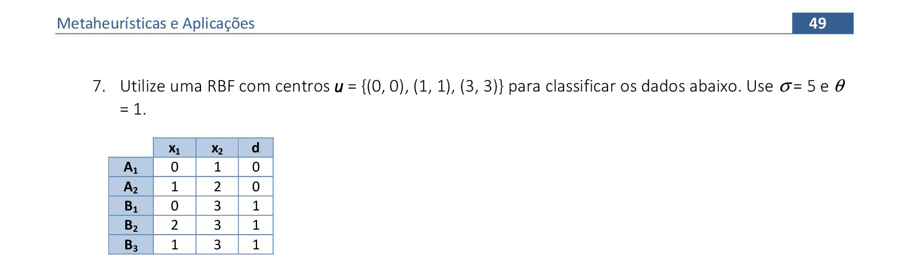
  
&#x1f4d1; Atividade 3.2

  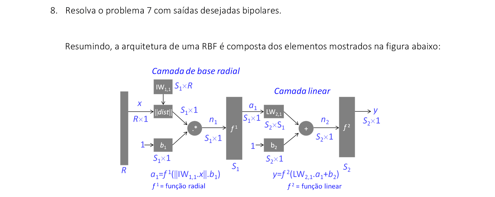
  

		<iframe width="100%" src="https://www.youtube.com/embed/FAi5oc0HEPg" frameborder="0" allow="accelerometer; clipboard-write; encrypted-media; gyroscope; picture-in-picture" allowfullscreen></iframe>
   
 
  
<a href="#parte3" class="topo">voltar ao topo</a>

  
  

&#x1f4c3; Algoritmo comentado

   <figcaption>Algoritmo da Rede Neural de Hebb:
<pre><code>0. <a alt="pesos iniciam nulos">Inicialize os pesos wi = 0</a>, onde i = 1, 2, ..., n
    1. <a alt="atualização de pesos parecida com a do Perceptron">Para cada par de treinamento (x,d),</a> faça:
    2. wiatual = wianterior + &alpha;xidi 
       &theta;iatual = &theta;ianterior + &alpha;di 
    3. <a alt="calculamos a saída y*">Faça y* = wixi + &theta;,</a> onde i = 1, 2, ..., n
4. <a alt="teste de convergência similar ao que usamos no Perceptron e MLP">Teste a convergência.</a> Se necessário, repita os passos 1-3.

</code></pre></figcaption>
   

  
  

&#x1f4c3; Resolução

	
Vamos acompanhar os cálculos deste exercício de classificação de padrões da função "OU" utilizando a rede neural de Hebb, com <b>&alpha;</b> = 1.

	  <ul class="slider">
		  <li>
			   <input type="radio" id="091" name="sl">
			   <label for="091"></label>
			   
			   <figcaption>Vamos começar com a apresentação dos padrões de entrada (<b>x1</b>, <b>x2</b>) = (1, 1) e (1, -1) para a rede. As atualizações dos pesos são automáticas e produzem o vetor (<b>w1</b>, <b>w2</b>, <b>&theta;</b>) = (2, 0, 2).</figcaption>
		   </li>
		   <li>
			   <input type="radio" id="092" name="sl">
			   <label for="092"></label>
			   
			   <figcaption>Continuando a apresentação dos padrões de entrada: (-1, 1) e (-1, -1). As atualizações dos pesos produzem o vetor (<b>w1</b>, <b>w2</b>, <b>&theta;</b>) = (2, 2, 2).</figcaption>
		   </li>
		   <li>
			   <input type="radio" id="093" name="sl">
			   <label for="093"></label>
			   
			   <figcaption>Ao final da 1&ordf; iteração, temos todos os padrões classificados corretamente. Logo, o treinamento pode ser finalizado.</figcaption>
		   </li>
		</ul>
		
  

  
  

&#x1f4c3; Resolução

	
Vamos acompanhar os cálculos deste exercício de classificação de padrões com a rede neural de Hebb, com <b>&alpha;</b> = 1. Precisamos deixar os padrões de entrada no intervalo [-1, 1] para que a rede de Hebb funcione corretamente.

	  <ul class="slider">
		  <li>
			   <input type="radio" id="094" name="sl">
			   <label for="094"></label>
			   
			   <figcaption>Vamos começar com a apresentação dos padrões de entrada (<b>x1</b>, <b>x2</b>) = (-1, 0.33) e (-0.33, 0.33) para a rede. As atualizações dos pesos são automáticas e produzem o vetor (<b>w1</b>, <b>w2</b>, <b>&theta;</b>) = (-1.33, 0.66, 2).</figcaption>
		   </li>
		   <li>
			   <input type="radio" id="095" name="sl">
			   <label for="095"></label>
			   
			   <figcaption>Continuando a apresentação dos padrões de entrada: (-0.33, 1) e (-0.33, -1). As atualizações dos pesos produzem o vetor (<b>w1</b>, <b>w2</b>, <b>&theta;</b>) = (-1.33, 2.66, 2).</figcaption>
		   </li>
		   <li>
			   <input type="radio" id="096" name="sl">
			   <label for="096"></label>
			   
			   <figcaption>Ao final da 1&ordf; iteração, o vetor de pesos (<b>w1</b>, <b>w2</b>, <b>&theta;</b>) = (-1.66, 2.99, 1). Todos os padrões são classificados corretamente, e o treinamento da rede pode ser finalizado.</figcaption>
		   </li>
		</ul>
		
  

  
  
<a href="#parte3" class="topo">voltar ao topo</a>

  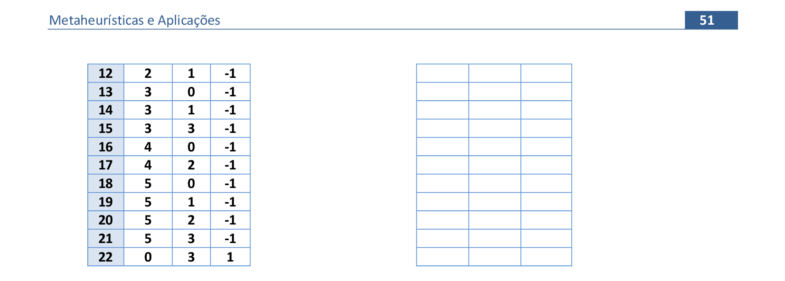
  
&#x1f4d1; Atividade 3.3

  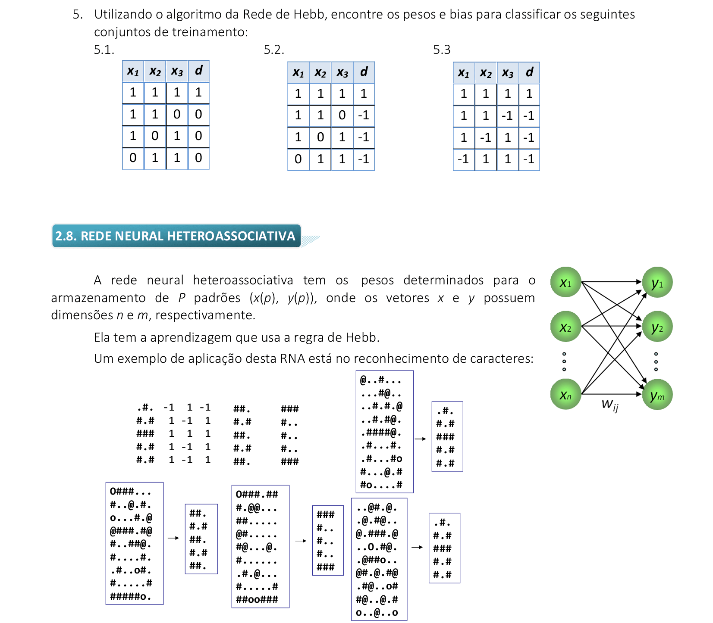
  
<a href="#parte3" class="topo">voltar ao topo</a>

  
  

&#x1f4c3; Algoritmo comentado

   <figcaption>Algoritmo da Rede Heteroassociativa:
<pre><code>0. <a alt="pesos iniciam nulos">Inicialize os pesos wij = 0</a>, onde i = 1, 2, ..., n, j = 1, 2, ..., m.
    1. Para cada par de treinamento (x,d),</a> faça os passos 2-4:
    2. <a alt="calculamos a saída y*">yj* = &sum;ixiwij</a>
    3. <a alt="calculamos a saída y">Se yj* &gt; 0</a>, yj = 1
       Se yj* = 0, yj = 0
       Se yj* &lt; 0, yj = -1
    4. <a alt="atualização de pesos parecida com a do Perceptron">wijatual = wijanterior + &alpha;xidi</a> 
5. <a alt="teste de convergência similar ao que usamos no Perceptron e MLP">Reduza &alpha; e teste a convergência.</a> Se necessário, repita os passos de 1-4.

</code></pre></figcaption>
   

  
  

&#x1f4c3; Resolução

	
Vamos acompanhar os cálculos deste exercício de classificação de padrões com a rede neural Heteroassociativa, com &alpha; = 1.

	  <ul class="slider">
		  <li>
			   <input type="radio" id="097" name="sl">
			   <label for="097"></label>
			   
			   <figcaption>Vamos começar com a apresentação dos padrões de entrada (<b>x1</b>, <b>x2</b>, <b>x3</b>, <b>x4</b>) = (1, 0, 0, 0) e (1, 1, 0, 0) para a rede. As atualizações dos pesos são automáticas e produzem a matriz de pesos indicada <b>wij</b>, com <b>i</b> = 1, 2, 3, 4 e <b>j</b> = 1, 2.</figcaption>
		   </li>
		   <li>
			   <input type="radio" id="098" name="sl">
			   <label for="098"></label>
			   
			   <figcaption>Continuando a apresentação dos padrões de entrada: (0, 0, 0 ,1) e (0, 0, 1, 1). As atualizações dos pesos produzem a matriz de pesos indicada <b>wij</b>, com <b>i</b> = 1, 2, 3, 4 e <b>j</b> = 1, 2.</figcaption>
		   </li>
		   <li>
			   <input type="radio" id="099" name="sl">
			   <label for="099"></label>
			   
			   <figcaption>Multiplicando-se a matriz de pesos <b>W</b> pelos vetores dos dados de entrada, temos o reconhecimento destes padrões. O processo de treinamento desta rede pode ser finalizado.</figcaption>
		   </li>
		</ul>
		
  

  
  
<a href="#parte3" class="topo">voltar ao topo</a>

  
4. Mapas auto-organizáveis

  
Material da página 53 até a página 66.

  
  

		<iframe width="100%" src="https://www.youtube.com/embed/P7cTrzBzE-Q" frameborder="0" allow="accelerometer; clipboard-write; encrypted-media; gyroscope; picture-in-picture" allowfullscreen></iframe>
  

  
<a href="#parte4" class="topo">voltar ao topo</a>

  
  
<a href="#parte4" class="topo">voltar ao topo</a>

  
  
<a href="#parte4" class="topo">voltar ao topo</a>

  
  
<a href="#parte4" class="topo">voltar ao topo</a>

  
  

&#x1f4c3; Algoritmo comentado

   <figcaption>Algoritmo da Rede de Kohonen:
<pre><code>0. <a alt="pesos iniciam com valores aleatórios">Iniciar os pesos dos n neurônios da rede com valores aleatórios baixos: wij</a>
1. Apresentar cada entrada x para a rede, e executar os passos 2 e 3:
   2. <a alt="cálculo das distâncias das entradas para os pesos dos neurônios">Determinar o neurônio i que possui a menor distância (euclidiana) do peso w com o vetor x.</a>
      di = &sum;j=1n(xj &minus; wij)2
      Este neurônio é denominado “vencedor”.
   3. <a alt="atualização de pesos e dos neurônios vizinhos">Ajustar os pesos do neurônio vencedor e de todos os neurônios que pertencem a uma vizinhança</a> 
      centrada nele, Vi.
      wijatual = wijanterior + &alpha;[xj &minus; wijanterior]
      onde i &isin; Vi.
5. <a alt="diminua a taxa de aprendizagem e o raio de vizinhança">Ajustar a taxa de aprendizado a e o raio de vizinhança.</a> 
   <a alt="teste de parada: quando os pesos têm poucas modificações de uma iteração para outra">Se não existirem mais mudanças substanciais no mapa, pare; caso contrário, volte ao passo 1.</a>

</code></pre></figcaption>
   

  
<a href="#parte4" class="topo">voltar ao topo</a>

  
  

&#x1f4c3; Resolução

	
Vamos acompanhar os cálculos deste exercício de treinamento de uma rede de Kohonen, com <b>&alpha;</b> = 0,5. Temos um mapa com 4 neurônios em formato quadrado, e os dados com valores no intervalo [-1, 1], o que garante a convergência mais rápida da rede.

	  <ul class="slider">
		  <li>
			   <input type="radio" id="100" name="sl">
			   <label for="100"></label>
			   
			   <figcaption>Vamos começar com a apresentação do padrão de entrada A(-0,15; 0,25). Calculamos as distâncias <b>di</b> entre as coordenadas deste padrão e as coordenadas <b>wij</b> dos pesos dos neurônios. O vencedor é o neurônio 2.</figcaption>
		   </li>
		   <li>
			   <input type="radio" id="100a" name="sl">
			   <label for="100a"></label>
			   
			   <figcaption>Neste exemplo, vamos usar o treinamento "hard", que só atualiza o neurônio vencedor.</figcaption>
		   </li>
		   <li>
			   <input type="radio" id="101" name="sl">
			   <label for="101"></label>
			   
			   <figcaption>Na apresentação do padrão de entrada B(-0,2; -0,2), calculamos as distâncias <b>di</b> entre as coordenadas deste padrão e as coordenadas <b>wij</b> dos pesos dos neurônios. O vencedor é o neurônio 3, que é atualizado.</figcaption>
		   </li>
		   <li>
			   <input type="radio" id="102" name="sl">
			   <label for="102"></label>
			   
			   <figcaption>Quando apresentamos o padrão de entrada C(0,2; 0,2), temos que o neurônio vencedor é o 4, que tem seus pesos atualizados.</figcaption>
		   </li>
		   <li>
			   <input type="radio" id="103" name="sl">
			   <label for="103"></label>
			   
			   <figcaption>Quando apresentamos o padrão de entrada D(0,15; 0,25), temos que o neurônio vencedor é o 4, que tem seus pesos atualizados.</figcaption>
		   </li>
		   <li>
			   <input type="radio" id="104" name="sl">
			   <label for="104"></label>
			   
			   <figcaption>Quando apresentamos o padrão de entrada E(-0,2; 0,3), temos que o neurônio vencedor é o 2, que tem seus pesos atualizados.</figcaption>
		   </li>
		   <li>
			   <input type="radio" id="105" name="sl">
			   <label for="105"></label>
			   
			   <figcaption>Quando apresentamos o padrão de entrada F(-0,25; 0,3), temos que o neurônio vencedor é o 2, que tem seus pesos atualizados.</figcaption>
		   </li>
		   <li>
			   <input type="radio" id="106" name="sl">
			   <label for="106"></label>
			   
			   <figcaption>Quando apresentamos o padrão de entrada G(-0,3; -0,2), temos que o neurônio vencedor é o 3, que tem seus pesos atualizados. Finalizamos a primeira iteração.</figcaption>
		   </li>
		   <li>
			   <input type="radio" id="107" name="sl">
			   <label for="107"></label>
			   
			   <figcaption>Na segunda iteração, reduzimos a taxa de aprendizagem <b>&alpha;</b> e apresentamos novamente os padrões de entrada para a rede. O critério de parada é a "convergência" da rede, ou seja, quando os pesos sofrem poucas modificações de uma iteração para outra.</figcaption>
		   </li>
		</ul>
		
  

  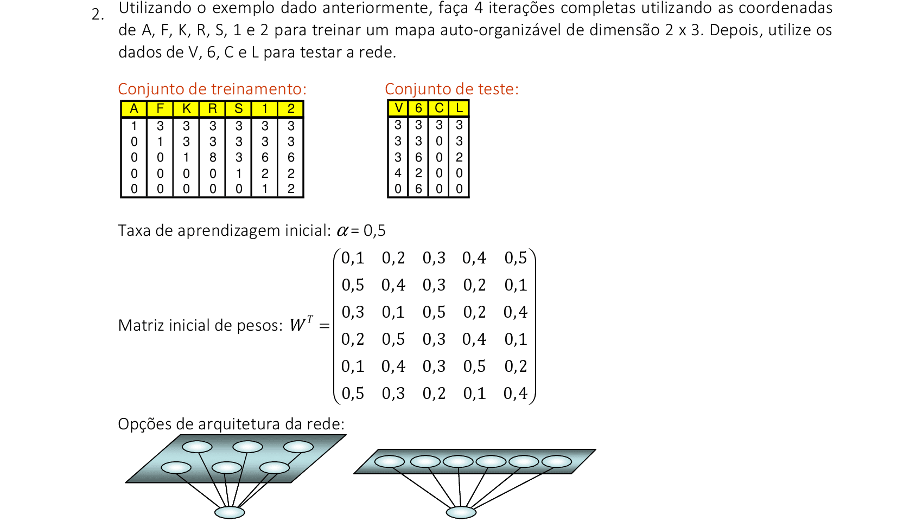
  
&#x1f4d1; Atividade 4.1

  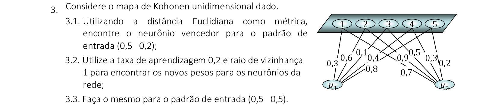
  
<a href="#parte4" class="topo">voltar ao topo</a>

  
  

		<iframe width="100%" src="https://www.youtube.com/embed/raKAQKjFzGM" frameborder="0" allow="accelerometer; clipboard-write; encrypted-media; gyroscope; picture-in-picture" allowfullscreen></iframe>
  
  
  
<a href="#parte4" class="topo">voltar ao topo</a>

  
  
<a href="#parte4" class="topo">voltar ao topo</a>

  
  

&#x1f4c3; Resolução

	
Vamos acompanhar os cálculos deste exercício de treinamento de uma rede de Kohonen para resolver o Problema do Caixeiro Viajante, com <b>&alpha;</b> = 0,5. Temos um mapa com 6 neurônios em formato retangular 2 x 3, e os dados com valores no intervalo [-1, 1], o que garante a convergência mais rápida da rede. O comprimento da rota inicial é igual a 4.

	  <ul class="slider">
		  <li>
			   <input type="radio" id="108" name="sl">
			   <label for="108"></label>
			   
			   <figcaption>Neste caso, vamos usar a vizinhança Gaussiana com a função <b>&Lambda;ii*</b> com as distâncias topológicas <b>dii*</b> entre os neurônios: por exemplo, o neurônio 1 tem distância topológica <b>d12</b> = 1 ao neurônio 2; já a distância até o neurônio 3 será <b>d13</b> = 2.</figcaption>
		   </li>
		   <li>
			   <input type="radio" id="109" name="sl">
			   <label for="109"></label>
			   
			   <figcaption>Apresentamos a cidade A(0,1; 0,1) para a rede, e o neurônio vencedor é o 4. Com a vizinhança Gaussiana, usamos a quarta linha e a quarta coluna da matriz de distâncias <b>&Lambda;ii*</b> para atualizar todos os pesos da rede.</figcaption>
		   </li>
		   <li>
			   <input type="radio" id="110" name="sl">
			   <label for="110"></label>
			   
			   <figcaption>O valor da rota com a atualização é de 3,7867. Apresentamos a cidade D(0,8; 0) para a rede, e o neurônio vencedor é o 6. Usamos a sexta linha e a sexta coluna da matriz de distâncias <b>&Lambda;ii*</b> para atualizar todos os pesos da rede.</figcaption>
		   </li>
		   <li>
			   <input type="radio" id="111" name="sl">
			   <label for="111"></label>
			   
			   <figcaption>O valor da rota com a atualização é de 3,5641. Apresentamos a cidade F(0,4; 0,9) para a rede, e o neurônio vencedor é o 2. Usamos a segunda linha e a segunda coluna da matriz de distâncias <b>&Lambda;ii*</b> para atualizar todos os pesos da rede.</figcaption>
		   </li>
		   <li>
			   <input type="radio" id="112" name="sl">
			   <label for="112"></label>
			   
			   <figcaption>O valor da rota com a atualização é de 3,4724. Apresentamos a cidade B(0,2; 0,8) para a rede, e o neurônio vencedor é o 3. Usamos a terceira linha e a terceira coluna da matriz de distâncias <b>&Lambda;ii*</b> para atualizar todos os pesos da rede.</figcaption>
		   </li>
		   <li>
			   <input type="radio" id="113" name="sl">
			   <label for="113"></label>
			   
			   <figcaption>O valor da rota com a atualização é de 3,2547. Apresentamos a cidade C(0,7; 0,7) para a rede, e o neurônio vencedor é o 1. Usamos a primeira linha e a primeira coluna da matriz de distâncias <b>&Lambda;ii*</b> para atualizar todos os pesos da rede.</figcaption>
		   </li>
		   <li>
			   <input type="radio" id="114" name="sl">
			   <label for="114"></label>
			   
			   <figcaption>O valor da rota com a atualização é de 2,9549. Apresentamos a cidade E(0,9; 0,8) para a rede, e o neurônio vencedor é o 1. Usamos a primeira linha e a primeira coluna da matriz de distâncias <b>&Lambda;ii*</b> para atualizar todos os pesos da rede.</figcaption>
		   </li>
		   <li>
			   <input type="radio" id="115" name="sl">
			   <label for="115"></label>
			   
			   <figcaption>O valor da rota com a atualização é de 2,8946. Apresentamos a cidade D(0,8; 0) para a rede, e o neurônio vencedor é o 6. Usamos a sexta linha e a sexta coluna da matriz de distâncias <b>&Lambda;ii*</b> para atualizar todos os pesos da rede.</figcaption>
		   </li>
		   <li>
			   <input type="radio" id="116" name="sl">
			   <label for="116"></label>
			   
			   <figcaption>O valor da rota com a atualização é de 2,8585. O processo continua até que os pesos sofram poucas alterações. Note que o neurônio 5 não está sendo utilizado adequadamente, e as cidade <b>C</b> e <b>E</b> estão competindo pelo neurônio 1. Sugestão: colocar mais neurônios do que o número de cidades.</figcaption>
		   </li>
		</ul>
		
  

  
  
&#x1f4d1; Atividade 4.2
  
Usando o mesmo raciocínio do Exercício 1, resolva o problema burma14 do TSPLIB com o mapa auto-organizável SOM. Utilize mais do que 14 neurônios nesta rede neural. As coordenadas das cidades estão na tabela a seguir:

  <table>
  <tr><th>cidade</th><th>x</th><th>y</th></tr>
  <tr><td>1</td><td>16.47</td><td>96.1</td></tr>
  <tr><td>2</td><td>16.47</td><td>94.44</td></tr>
  <tr><td>3</td><td>20.09</td><td>92.54</td></tr>
  <tr><td>4</td><td>22.39</td><td>93.37</td></tr>
  <tr><td>5</td><td>25.23</td><td>97.24</td></tr>
  <tr><td>6</td><td>22</td><td>96.05</td></tr>
  <tr><td>7</td><td>20.47</td><td>97.02</td></tr>
  <tr><td>8</td><td>17.2</td><td>96.29</td></tr>
  <tr><td>9</td><td>16.3</td><td>97.38</td></tr>
  <tr><td>10</td><td>14.05</td><td>98.12</td></tr>
  <tr><td>11</td><td>16.53</td><td>97.38</td></tr>
  <tr><td>12</td><td>21.52</td><td>95.59</td></tr>
  <tr><td>13</td><td>19.41</td><td>97.13</td></tr>
  <tr><td>14</td><td>20.09</td><td>94.55</td></tr>
  </table>
  

  
<a href="#parte4" class="topo">voltar ao topo</a>

  
  
<a href="#parte4" class="topo">voltar ao topo</a>

  
  

		<iframe width="100%" src="https://www.youtube.com/embed/vBxQH88EZgg" frameborder="0" allow="accelerometer; clipboard-write; encrypted-media; gyroscope; picture-in-picture" allowfullscreen></iframe>
  
 
  
<a href="#parte4" class="topo">voltar ao topo</a>

  
  
<a href="#parte4" class="topo">voltar ao topo</a>

  
  
<a href="#parte4" class="topo">voltar ao topo</a>

  
  

&#x1f4c3; Resolução

	
Vamos acompanhar os cálculos deste exercício de treinamento de classificação de padrões usando uma Rede LVQ, com <b>&alpha;</b> = 0,1. Temos 3 neurônios que representam 2 classes.

	  <ul class="slider">
		   <li>
			   <input type="radio" id="117" name="sl">
			   <label for="117"></label>
			   
			   <figcaption>Apresentamos o padrão <b>x1</b> = (0, 0, 1, 1) para a rede, e o neurônio vencedor é o 2, que representa a classe 2. Como o padrão <b>x1</b> também pertence à classe 2, a atualização é feita como <b>&Delta;w2j = + &alpha;(xj &minus; w2j)</b>.</figcaption>
		   </li>
		   <li>
			   <input type="radio" id="118" name="sl">
			   <label for="118"></label>
			   
			   <figcaption>Apresentamos o padrão <b>x2</b> = (1, 0, 0, 0) para a rede, e o neurônio vencedor é o 3, que representa a classe 2. Como o padrão <b>x2</b> pertence à classe 1, a atualização é feita como <b>&Delta;w3j = &minus; &alpha;(xj &minus; w3j)</b>.</figcaption>
		   </li>
		   <li>
			   <input type="radio" id="118a" name="sl">
			   <label for="118a"></label>
			   
			   <figcaption>Apresentamos o padrão <b>x3</b> = (0, 1, 1, 0) para a rede, e o neurônio vencedor é o 2, que representa a classe 2. Como o padrão <b>x3</b> pertence à classe 2, a atualização é feita como <b>&Delta;w3j = + &alpha;(xj &minus; w3j)</b>.</figcaption>
		   </li>
		   <li>
			   <input type="radio" id="119" name="sl">
			   <label for="119"></label>
			   
			   <figcaption>Apresentamos o padrão <b>x4</b> = (1, 1, 1, 0) para a rede, e o neurônio vencedor é o 2, que representa a classe 2. Como o padrão <b>x4</b> pertence à classe 2, a atualização é feita como <b>&Delta;w4j = + &alpha;(xj &minus; w4j)</b>.</figcaption>
		   </li>
		   <li>
			   <input type="radio" id="120" name="sl">
			   <label for="120"></label>
			   
			   <figcaption>No fim da 1&ordf; iteração, temos a matriz de pesos apresentada. Reduzimos o valor de <b>&alpha;</b> e continuamos os cálculos até que a rede tenha uma convergência: poucas alterações de pesos de uma iteração para a outra.</figcaption>
		   </li>
		</ul>
		
  

  
  
<a href="#parte4" class="topo">voltar ao topo</a>

  
5.1. Redes Temporais

  
Material da página 66 até a página 80.

  
  

		<iframe width="100%" src="https://www.youtube.com/embed/51VCh5UIOY0" frameborder="0" allow="accelerometer; clipboard-write; encrypted-media; gyroscope; picture-in-picture" allowfullscreen></iframe>
  

  
<a href="#parte5" class="topo">voltar ao topo</a>

  
  
<a href="#parte5" class="topo">voltar ao topo</a>

  
  
<a href="#parte5" class="topo">voltar ao topo</a>

  
  
<a href="#parte5" class="topo">voltar ao topo</a>

  
  
<a href="#parte5" class="topo">voltar ao topo</a>

  
  
<a href="#parte5" class="topo">voltar ao topo</a>

  
  
<a href="#parte5" class="topo">voltar ao topo</a>

  
  

&#x1f4c3; Resolução

	
Vamos acompanhar os cálculos deste exercício de treinamento de uma rede temporal MLP, com <b>&alpha;</b> = 1, sem camada escondida.

	  <ul class="slider">
		   <li>
			   <input type="radio" id="121" name="sl">
			   <label for="121"></label>
			   
			   <figcaption>Vamos utilizar os padrões de entrada <b>x</b> para prever 1 passo à frente: (1, 0.9) para prever 0.6; (0.9, 0.6) para prever 0.5; e assim sucessivamente.</figcaption>
		   </li>
		   <li>
			   <input type="radio" id="122" name="sl">
			   <label for="122"></label>
			   
			   <figcaption>Apresentamos o primeiro padrão de entrada para a rede: (1, 0.9).</figcaption>
		   </li>
		   <li>
			   <input type="radio" id="123" name="sl">
			   <label for="123"></label>
			   
			   <figcaption>Apresentamos o padrão de entrada (0.9, 0.6) para a rede.</figcaption>
		   </li>
		   <li>
			   <input type="radio" id="124" name="sl">
			   <label for="124"></label>
			   
			   <figcaption>Apresentamos o padrão de entrada (0.6, 0.5) para a rede.</figcaption>
		   </li>
		   <li>
			   <input type="radio" id="125" name="sl">
			   <label for="125"></label>
			   
			   <figcaption>Apresentamos o padrão de entrada (0.5, 0.3) para a rede.</figcaption>
		   </li>
		   <li>
			   <input type="radio" id="126" name="sl">
			   <label for="126"></label>
			   
			   <figcaption>Apresentamos o padrão de entrada (0.3, 0.2) para a rede.</figcaption>
		   </li>
		   <li>
			   <input type="radio" id="127" name="sl">
			   <label for="127"></label>
			   
			   <figcaption>Apresentamos o último padrão de entrada da rede: (0.2, 0.1).</figcaption>
		   </li>
		   <li>
			   <input type="radio" id="128" name="sl">
			   <label for="128"></label>
			   
			   <figcaption>No final da 1&ordf; iteração, temos o erro quadrático <b>E = 0,521</b>.</figcaption>
		   </li>
		   <li>
			   <input type="radio" id="129" name="sl">
			   <label for="129"></label>
			   
			   <figcaption>Iniciamos a 2&ordf; iteração com a atualização da taxa de aprendizagem, com os cálculos na sequência de apresentação da Série Temporal. </figcaption>
		   </li>
		   <li>
			   <input type="radio" id="130" name="sl">
			   <label for="130"></label>
			   
			   <figcaption>No final da 4&ordf; iteração, temos o erro quadrático <b>E = 0,099</b>.</figcaption>
		   </li>
		</ul>
		
  

  

		<iframe width="100%" src="https://www.youtube.com/embed/ALcIqwL-qKU" frameborder="0" allow="accelerometer; clipboard-write; encrypted-media; gyroscope; picture-in-picture" allowfullscreen></iframe>
  

  
<a href="#parte5" class="topo">voltar ao topo</a>

  
  

&#x1f4c3; Resolução

	
Vamos acompanhar os cálculos deste exercício de treinamento de uma rede temporal MLP, com <b>&alpha;</b> = 1, sem camada escondida.

	  <ul class="slider">
		   <li>
			   <input type="radio" id="131" name="sl">
			   <label for="131"></label>
			   
			   <figcaption>Vamos utilizar os padrões de entrada <b>t</b> para prever 1 passo à frente: (0.1, 0.2) para prever 0.6; (0.2, 0.3) para prever 0.5; e assim sucessivamente.</figcaption>
		   </li>
		   <li>
			   <input type="radio" id="132" name="sl">
			   <label for="132"></label>
			   
			   <figcaption>Apresentamos o primeiro padrão de entrada para a rede: (0.1, 0.2).</figcaption>
		   </li>
		   <li>
			   <input type="radio" id="133" name="sl">
			   <label for="133"></label>
			   
			   <figcaption>Apresentamos o padrão de entrada (0.2, 0.3) para a rede.</figcaption>
		   </li>
		   <li>
			   <input type="radio" id="134" name="sl">
			   <label for="134"></label>
			   
			   <figcaption>Apresentamos o padrão de entrada (0.3, 0.4) para a rede.</figcaption>
		   </li>
		   <li>
			   <input type="radio" id="135" name="sl">
			   <label for="135"></label>
			   
			   <figcaption>Apresentamos o padrão de entrada (0.4, 0.5) para a rede.</figcaption>
		   </li>
		   <li>
			   <input type="radio" id="136" name="sl">
			   <label for="136"></label>
			   
			   <figcaption>Apresentamos o padrão de entrada (0.5, 0.6) para a rede.</figcaption>
		   </li>
		   <li>
			   <input type="radio" id="137" name="sl">
			   <label for="137"></label>
			   
			   <figcaption>Apresentamos o último padrão de entrada da rede: (0.6, 0.7).</figcaption>
		   </li>
		   <li>
			   <input type="radio" id="138" name="sl">
			   <label for="138"></label>
			   
			   <figcaption>No final da 1&ordf; iteração, temos o erro quadrático <b>E = 0,092</b>.</figcaption>
		   </li>
		   <li>
			   <input type="radio" id="139" name="sl">
			   <label for="139"></label>
			   
			   <figcaption>Iniciamos a 2&ordf; iteração com a atualização da taxa de aprendizagem, com os cálculos na sequência de apresentação da Série Temporal. </figcaption>
		   </li>
		   <li>
			   <input type="radio" id="140" name="sl">
			   <label for="140"></label>
			   
			   <figcaption>No final da 4&ordf; iteração, temos o erro quadrático <b>E = 0,046</b>.</figcaption>
		   </li>
		</ul>
		
  

  
  

&#x1f4c3; Resolução

	
Vamos acompanhar os cálculos deste exercício de treinamento de uma rede temporal MLP, com <b>&alpha;</b> = 1, com uma camada escondida com função sigmoidal.

	  <ul class="slider">
		   <li>
			   <input type="radio" id="141" name="sl">
			   <label for="141"></label>
			   
			   <figcaption>Vamos utilizar os padrões de entrada <b>x</b> para prever 1 passo à frente: (1, 0.9) para prever 0.6; (0.9, 0.6) para prever 0.5; e assim sucessivamente.</figcaption>
		   </li>
		   <li>
			   <input type="radio" id="142" name="sl">
			   <label for="142"></label>
			   
			   <figcaption>Apresentamos o primeiro padrão de entrada para a rede: (1, 0.9).</figcaption>
		   </li>
		   <li>
			   <input type="radio" id="143" name="sl">
			   <label for="143"></label>
			   
			   <figcaption>Apresentamos o padrão de entrada (0.9, 0.6) para a rede.</figcaption>
		   </li>
		   <li>
			   <input type="radio" id="144" name="sl">
			   <label for="144"></label>
			   
			   <figcaption>Apresentamos o padrão de entrada (0.6, 0.5) para a rede.</figcaption>
		   </li>
		   <li>
			   <input type="radio" id="145" name="sl">
			   <label for="145"></label>
			   
			   <figcaption>Apresentamos o padrão de entrada (0.5, 0.3) para a rede.</figcaption>
		   </li>
		   <li>
			   <input type="radio" id="146" name="sl">
			   <label for="146"></label>
			   
			   <figcaption>Apresentamos o padrão de entrada (0.3, 0.2) para a rede.</figcaption>
		   </li>
		   <li>
			   <input type="radio" id="147" name="sl">
			   <label for="147"></label>
			   
			   <figcaption>Apresentamos o padrão de entrada (0.2, 0.1) para a rede.</figcaption>
		   </li>
		   <li>
			   <input type="radio" id="148" name="sl">
			   <label for="148"></label>
			   
			   <figcaption>No final da 1&ordf; iteração, temos o erro quadrático <b>E = 0,036</b>.</figcaption>
		   </li>
		   <li>
			   <input type="radio" id="149" name="sl">
			   <label for="149"></label>
			   
			   <figcaption>Iniciamos a 2&ordf; iteração com a atualização da taxa de aprendizagem, com os cálculos na sequência de apresentação da Série Temporal. </figcaption>
		   </li>
		   <li>
			   <input type="radio" id="150" name="sl">
			   <label for="150"></label>
			   
			   <figcaption>No final da 4&ordf; iteração, temos o erro quadrático <b>E = 0,008</b>.</figcaption>
		   </li>
		</ul>
		
  

  
  

&#x1f4c3; Resolução

	
Vamos acompanhar os cálculos deste exercício de treinamento de uma rede temporal MLP, com <b>&alpha;</b> = 1, com uma camada escondida com função sigmoidal.

	  <ul class="slider">
		   <li>
			   <input type="radio" id="151" name="sl">
			   <label for="151"></label>
			   
			   <figcaption>Vamos utilizar os padrões de entrada <b>t</b> para prever 1 passo à frente: (0.1, 0.2) para prever 0.6; (0.2, 0.3) para prever 0.5; e assim sucessivamente.</figcaption>
		   </li>
		   <li>
			   <input type="radio" id="152" name="sl">
			   <label for="152"></label>
			   
			   <figcaption>Apresentamos o primeiro padrão de entrada para a rede: (0.1, 0.2).</figcaption>
		   </li>
		   <li>
			   <input type="radio" id="153" name="sl">
			   <label for="153"></label>
			   
			   <figcaption>Apresentamos o padrão de entrada (0.2, 0.3) para a rede.</figcaption>
		   </li>
		   <li>
			   <input type="radio" id="154" name="sl">
			   <label for="154"></label>
			   
			   <figcaption>Apresentamos o padrão de entrada (0.3, 0.4) para a rede.</figcaption>
		   </li>
		   <li>
			   <input type="radio" id="155" name="sl">
			   <label for="155"></label>
			   
			   <figcaption>Apresentamos o padrão de entrada (0.4, 0.5) para a rede.</figcaption>
		   </li>
		   <li>
			   <input type="radio" id="156" name="sl">
			   <label for="156"></label>
			   
			   <figcaption>Apresentamos o padrão de entrada (0.5, 0.6) para a rede.</figcaption>
		   </li>
		   <li>
			   <input type="radio" id="157" name="sl">
			   <label for="157"></label>
			   
			   <figcaption>Apresentamos o padrão de entrada (0.6, 0.7) para a rede.</figcaption>
		   </li>
		   <li>
			   <input type="radio" id="158" name="sl">
			   <label for="158"></label>
			   
			   <figcaption>No final da 1&ordf; iteração, temos o erro quadrático <b>E = 0,050</b>.</figcaption>
		   </li>
		   <li>
			   <input type="radio" id="159" name="sl">
			   <label for="159"></label>
			   
			   <figcaption>Iniciamos a 2&ordf; iteração com a atualização da taxa de aprendizagem, com os cálculos na sequência de apresentação da Série Temporal. </figcaption>
		   </li>
		   <li>
			   <input type="radio" id="160" name="sl">
			   <label for="160"></label>
			   
			   <figcaption>No final da 4&ordf; iteração, temos o erro quadrático <b>E = 0,035</b>.</figcaption>
		   </li>
		</ul>
		
  

  
  

&#x1f4c3; Resolução

	
Vamos acompanhar os cálculos deste exercício de treinamento de uma rede temporal MLP, com <b>&alpha;</b> = 1, com uma camada escondida com função tangente hiperbólica.

	  <ul class="slider">
		   <li>
			   <input type="radio" id="161" name="sl">
			   <label for="161"></label>
			   
			   <figcaption>Vamos utilizar os padrões de entrada <b>x</b> para prever 1 passo à frente: (1, 0.9) para prever 0.6; (0.9, 0.6) para prever 0.5; e assim sucessivamente.</figcaption>
		   </li>
		   <li>
			   <input type="radio" id="162" name="sl">
			   <label for="162"></label>
			   
			   <figcaption>Apresentamos o primeiro padrão de entrada para a rede: (1, 0.9).</figcaption>
		   </li>
		   <li>
			   <input type="radio" id="163" name="sl">
			   <label for="163"></label>
			   
			   <figcaption>Apresentamos o padrão de entrada (0.9, 0.6) para a rede.</figcaption>
		   </li>
		   <li>
			   <input type="radio" id="164" name="sl">
			   <label for="164"></label>
			   
			   <figcaption>Apresentamos o padrão de entrada (0.6, 0.5) para a rede.</figcaption>
		   </li>
		   <li>
			   <input type="radio" id="165" name="sl">
			   <label for="165"></label>
			   
			   <figcaption>Apresentamos o padrão de entrada (0.5, 0.3) para a rede.</figcaption>
		   </li>
		   <li>
			   <input type="radio" id="166" name="sl">
			   <label for="166"></label>
			   
			   <figcaption>Apresentamos o padrão de entrada (0.3, 0.2) para a rede.</figcaption>
		   </li>
		   <li>
			   <input type="radio" id="167" name="sl">
			   <label for="167"></label>
			   
			   <figcaption>Apresentamos o padrão de entrada (0.2, 0.1) para a rede.</figcaption>
		   </li>
		   <li>
			   <input type="radio" id="168" name="sl">
			   <label for="168"></label>
			   
			   <figcaption>No final da 1&ordf; iteração, temos o erro quadrático <b>E = 0,037</b>.</figcaption>
		   </li>
		   <li>
			   <input type="radio" id="169" name="sl">
			   <label for="169"></label>
			   
			   <figcaption>Iniciamos a 2&ordf; iteração com a atualização da taxa de aprendizagem, com os cálculos na sequência de apresentação da Série Temporal. </figcaption>
		   </li>
		   <li>
			   <input type="radio" id="170" name="sl">
			   <label for="170"></label>
			   
			   <figcaption>No final da 4&ordf; iteração, temos o erro quadrático <b>E = 0,008</b>.</figcaption>
		   </li>
		</ul>
		
  

  
<a href="#parte5" class="topo">voltar ao topo</a>

  
  

&#x1f4c3; Resolução

	
Vamos acompanhar os cálculos deste exercício de treinamento de uma rede temporal MLP, com <b>&alpha;</b> = 1, com uma camada escondida com função tangente hiperbólica.

	  <ul class="slider">
		   <li>
			   <input type="radio" id="171" name="sl">
			   <label for="171"></label>
			   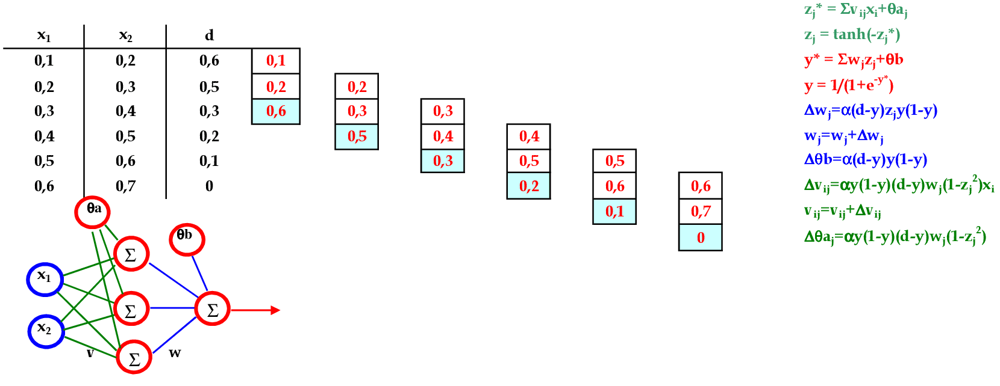
			   <figcaption>Vamos utilizar os padrões de entrada <b>t</b> para prever 1 passo à frente: (0.1, 0.2) para prever 0.6; (0.2, 0.3) para prever 0.5; e assim sucessivamente.</figcaption>
		   </li>
		   <li>
			   <input type="radio" id="172" name="sl">
			   <label for="172"></label>
			   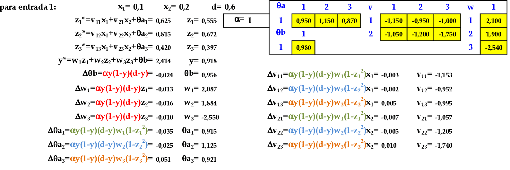
			   <figcaption>Apresentamos o primeiro padrão de entrada para a rede: (0.1, 0.2).</figcaption>
		   </li>
		   <li>
			   <input type="radio" id="173" name="sl">
			   <label for="173"></label>
			   
			   <figcaption>Apresentamos o padrão de entrada (0.2, 0.3) para a rede.</figcaption>
		   </li>
		   <li>
			   <input type="radio" id="174" name="sl">
			   <label for="174"></label>
			   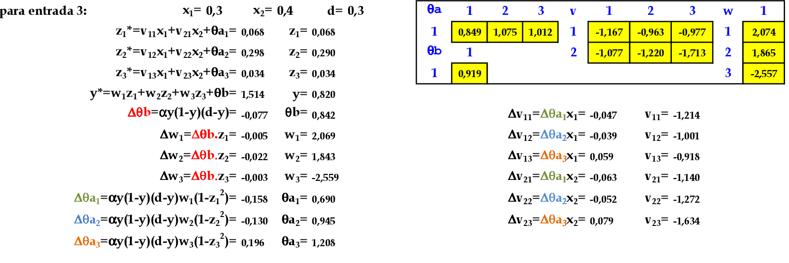
			   <figcaption>Apresentamos o padrão de entrada (0.3, 0.4) para a rede.</figcaption>
		   </li>
		   <li>
			   <input type="radio" id="175" name="sl">
			   <label for="175"></label>
			   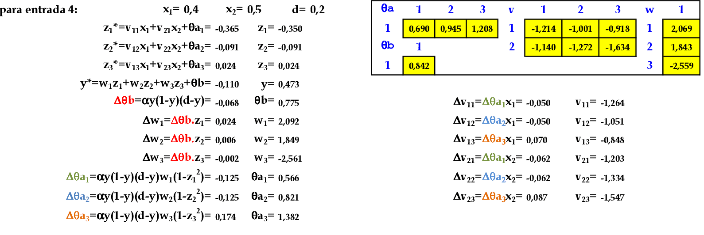
			   <figcaption>Apresentamos o padrão de entrada (0.4, 0.5) para a rede.</figcaption>
		   </li>
		   <li>
			   <input type="radio" id="176" name="sl">
			   <label for="176"></label>
			   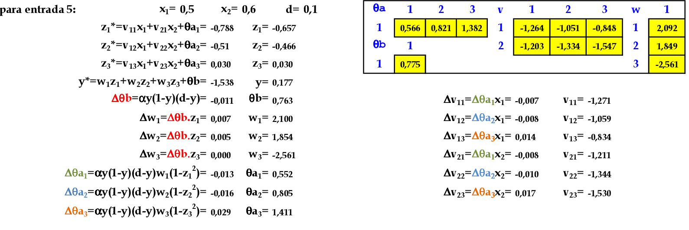
			   <figcaption>Apresentamos o padrão de entrada (0.5, 0.6) para a rede.</figcaption>
		   </li>
		   <li>
			   <input type="radio" id="177" name="sl">
			   <label for="177"></label>
			   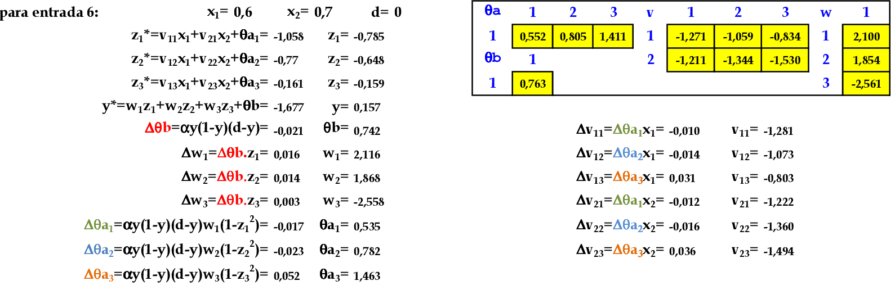
			   <figcaption>Apresentamos o padrão de entrada (0.6, 0.7) para a rede.</figcaption>
		   </li>
		   <li>
			   <input type="radio" id="178" name="sl">
			   <label for="178"></label>
			   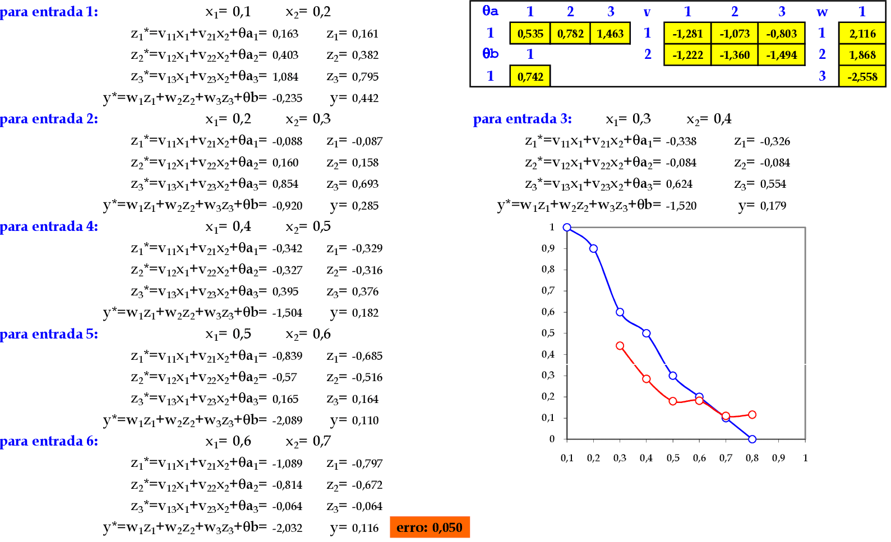
			   <figcaption>No final da 1&ordf; iteração, temos o erro quadrático <b>E = 0,050</b>.</figcaption>
		   </li>
		   <li>
			   <input type="radio" id="179" name="sl">
			   <label for="179"></label>
			   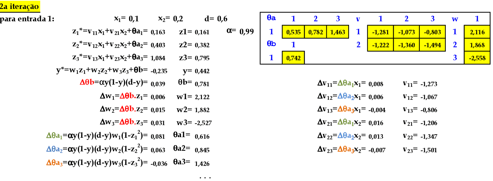
			   <figcaption>Iniciamos a 2&ordf; iteração com a atualização da taxa de aprendizagem, com os cálculos na sequência de apresentação da Série Temporal. </figcaption>
		   </li>
		   <li>
			   <input type="radio" id="180" name="sl">
			   <label for="180"></label>
			   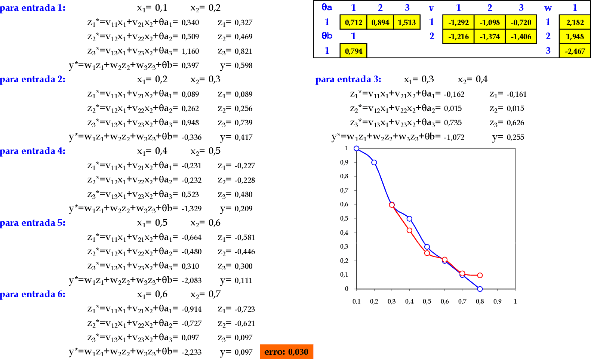
			   <figcaption>No final da 4&ordf; iteração, temos o erro quadrático <b>E = 0,030</b>.</figcaption>
		   </li>
		</ul>
		
  

  
  

&#x1f4c3; Resolução

	
Vamos acompanhar os cálculos deste exercício de treinamento de uma rede temporal RBF, com 2 centros: (1, 0.9) e (0.6, 0.4).

	  <ul class="slider">
		   <li>
			   <input type="radio" id="181" name="sl">
			   <label for="181"></label>
			   
			   <figcaption>Vamos utilizar os padrões de entrada <b>x</b> para prever 1 passo à frente: (1, 0.9) para prever 0.75; (0.9, 0.75) para prever 0.6; e assim sucessivamente. Apresentamos o primeiro padrão de entrada para a rede: (1, 0.9).</figcaption>
		   </li>
		   <li>
			   <input type="radio" id="182" name="sl">
			   <label for="182"></label>
			   
			   <figcaption>Apresentamos os padrões de entrada (0.9, 0.75) e (0.75, 0,6) para a rede.</figcaption>
		   </li>
		   <li>
			   <input type="radio" id="183" name="sl">
			   <label for="183"></label>
			   
			   <figcaption>Apresentamos os padrões de entrada (0.6, 0.55) e (0.55, 0,6) para a rede.</figcaption>
		   </li>
		   <li>
			   <input type="radio" id="184" name="sl">
			   <label for="184"></label>
			   
			   <figcaption>Apresentamos o padrão de entrada (0.6, 0.4) para a rede e podemos calcular os pesos.</figcaption>
		   </li>
		   <li>
			   <input type="radio" id="185" name="sl">
			   <label for="185"></label>
			   
			   <figcaption>Utilizando as 6 linhas da matriz <b>G</b>, calculamos os pesos para a Rede RBF.</figcaption>
		   </li>
		   <li>
			   <input type="radio" id="186" name="sl">
			   <label for="186"></label>
			   
			   <figcaption>Apresentamos os padrões de entrada (1, 0.9) e (0.9, 0.75) para a rede.</figcaption>
		   </li>
		   <li>
			   <input type="radio" id="187" name="sl">
			   <label for="187"></label>
			   
			   <figcaption>Apresentamos os padrões de entrada (0.75, 0.6) e (0.6, 0.55) para a rede.</figcaption>
		   </li>
		   <li>
			   <input type="radio" id="188" name="sl">
			   <label for="188"></label>
			   
			   <figcaption>Apresentamos os padrões de entrada (0.55, 0.6) e (0.6, 0.4) para a rede.</figcaption>
		   </li>
		   <li>
			   <input type="radio" id="189" name="sl">
			   <label for="189"></label>
			   
			   <figcaption>Apresentamos os padrões do conjunto de testes: (0.4, 0.3) e (0.3, 0.2) para a rede.</figcaption>
		   </li>
		   <li>
			   <input type="radio" id="190" name="sl">
			   <label for="190"></label>
			   
			   <figcaption>Temos o erro quadrático desta rede <b>E = 0,0483</b>.</figcaption>
		   </li>
		</ul>
		
  

  
  

&#x1f4c3; Resolução

	
Vamos acompanhar os cálculos deste exercício de treinamento de uma rede temporal RBF, com 2 centros: (0.2, 0.3) e (0.5, 0.6).

	  <ul class="slider">
		   <li>
			   <input type="radio" id="191" name="sl">
			   <label for="191"></label>
			   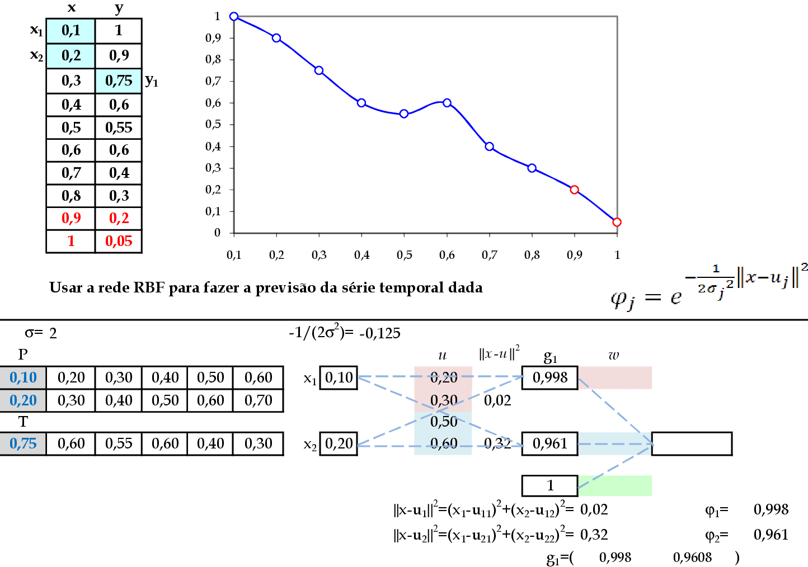
			   <figcaption>Vamos utilizar os padrões de entrada <b>t</b> para prever 1 passo à frente: (0.1, 0.2) para prever 0.75; (0.2, 0.3) para prever 0.6; e assim sucessivamente. Apresentamos o primeiro padrão de entrada para a rede: (0.1, 0.2).</figcaption>
		   </li>
		   <li>
			   <input type="radio" id="192" name="sl">
			   <label for="192"></label>
			   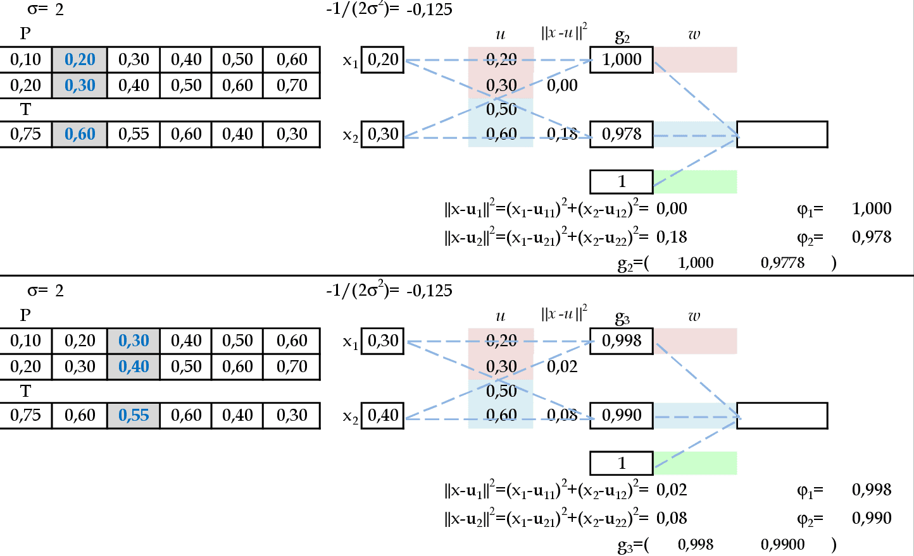
			   <figcaption>Apresentamos os padrões de entrada (0.2, 0.3) e (0.3, 0.4) para a rede.</figcaption>
		   </li>
		   <li>
			   <input type="radio" id="193" name="sl">
			   <label for="193"></label>
			   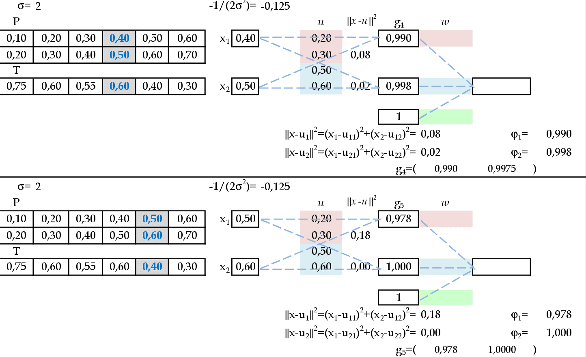
			   <figcaption>Apresentamos os padrões de entrada (0.4, 0.5) e (0.5, 0.6) para a rede.</figcaption>
		   </li>
		   <li>
			   <input type="radio" id="194" name="sl">
			   <label for="194"></label>
			   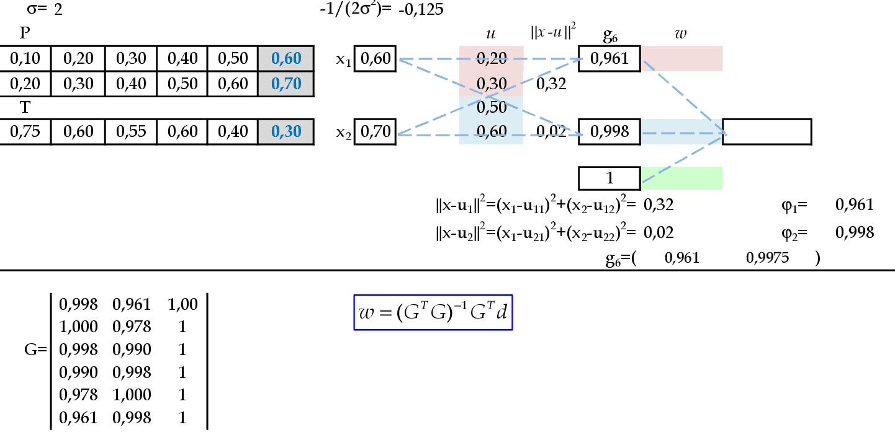
			   <figcaption>Apresentamos o padrão de entrada (0.6, 0.7) para a rede e podemos calcular os pesos.</figcaption>
		   </li>
		   <li>
			   <input type="radio" id="195" name="sl">
			   <label for="195"></label>
			   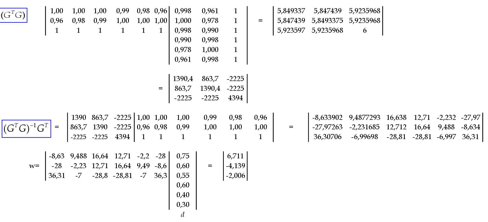
			   <figcaption>Utilizando as 6 linhas da matriz <b>G</b>, calculamos os pesos para a Rede RBF.</figcaption>
		   </li>
		   <li>
			   <input type="radio" id="196" name="sl">
			   <label for="196"></label>
			   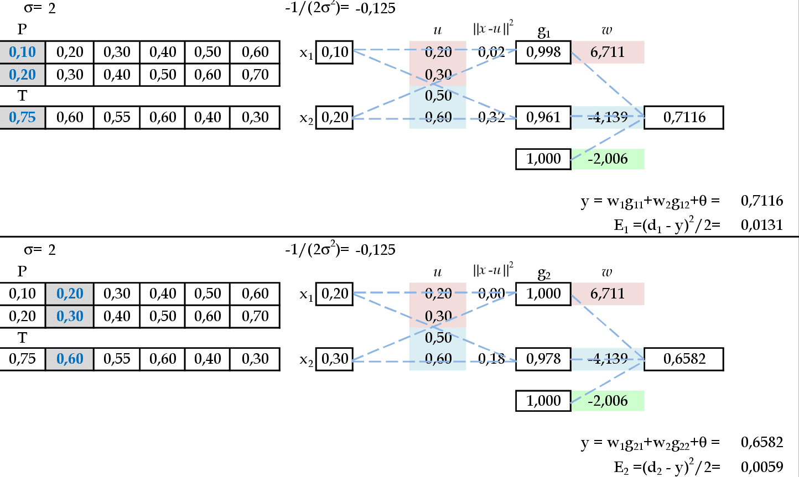
			   <figcaption>Apresentamos os padrões de entrada (0.1, 0.2) e (0.2, 0.3) para a rede.</figcaption>
		   </li>
		   <li>
			   <input type="radio" id="197" name="sl">
			   <label for="197"></label>
			   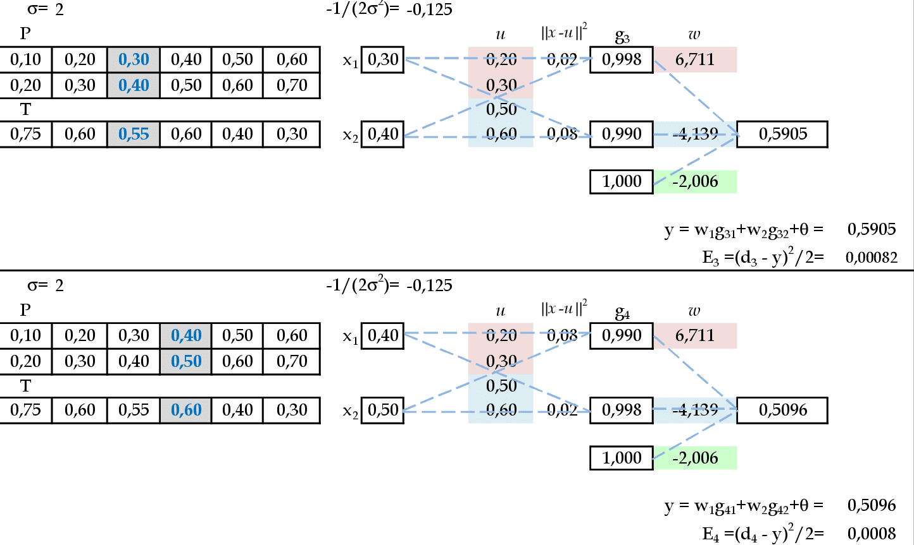
			   <figcaption>Apresentamos os padrões de entrada (0.3, 0.4) e (0.4, 0.5) para a rede.</figcaption>
		   </li>
		   <li>
			   <input type="radio" id="198" name="sl">
			   <label for="198"></label>
			   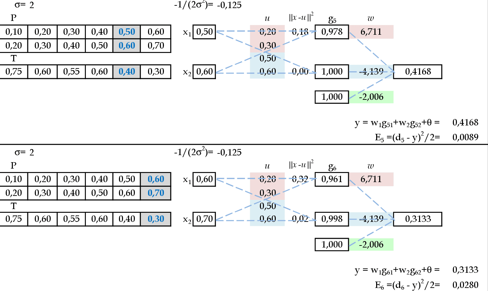
			   <figcaption>Apresentamos os padrões de entrada (0.5, 0.6) e (0.6, 0.7) para a rede.</figcaption>
		   </li>
		   <li>
			   <input type="radio" id="199" name="sl">
			   <label for="199"></label>
			   
			   <figcaption>Apresentamos os padrões do conjunto de testes: (0.7, 0.8) e (0.8, 0.9) para a rede.</figcaption>
		   </li>
		   <li>
			   <input type="radio" id="200" name="sl">
			   <label for="200"></label>
			   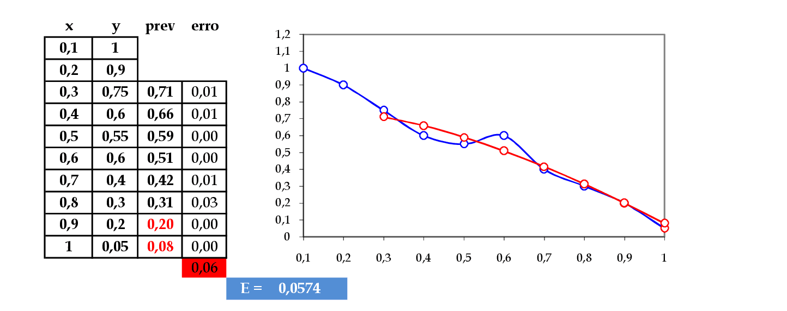
			   <figcaption>Temos o erro quadrático desta rede <b>E = 0,0574</b>.</figcaption>
		   </li>
		</ul>
		
  

  
  

&#x1f4c3; Resolução

	
Vamos acompanhar os cálculos deste exercício de treinamento de uma rede temporal RBF, com 2 centros: (1, 0.9) e (0.55, 0.6).

	  <ul class="slider">
		   <li>
			   <input type="radio" id="201" name="sl">
			   <label for="201"></label>
			   
			   <figcaption>Vamos utilizar os padrões de entrada <b>x</b> para prever 2 passos à frente: (1, 0.9) para prever (0.75, 0.6); (0.75, 0.6) para prever (0.6, 0.55); e assim sucessivamente. Apresentamos o primeiro padrão de entrada para a rede: (1, 0.9).</figcaption>
		   </li>
		   <li>
			   <input type="radio" id="202" name="sl">
			   <label for="202"></label>
			   
			   <figcaption>Apresentamos os padrões de entrada (0.9, 0.75) e (0.75, 0.6) para a rede.</figcaption>
		   </li>
		   <li>
			   <input type="radio" id="203" name="sl">
			   <label for="203"></label>
			   
			   <figcaption>Apresentamos os padrões de entrada (0.6, 0.55) e (0.55, 0.6) para a rede.</figcaption>
		   </li>
		   <li>
			   <input type="radio" id="204" name="sl">
			   <label for="204"></label>
			   
			   <figcaption>Utilizando as 6 linhas da matriz <b>G</b>, calculamos os pesos para a Rede RBF.</figcaption>
		   </li>
		   <li>
			   <input type="radio" id="205" name="sl">
			   <label for="205"></label>
			   
			   <figcaption>Apresentamos os padrões de entrada (1, 0.9) e (0.9, 0.75) para a rede.</figcaption>
		   </li>
		   <li>
			   <input type="radio" id="206" name="sl">
			   <label for="206"></label>
			   
			   <figcaption>Apresentamos os padrões de entrada (0.75, 0.6) e (0.6, 0.55) para a rede.</figcaption>
		   </li>
		   <li>
			   <input type="radio" id="207" name="sl">
			   <label for="207"></label>
			   
			   <figcaption>Apresentamos o padrão de entrada (0.55, 0.6) para a rede, finalizando o conjunto de treinamento.</figcaption>
		   </li>
		   <li>
			   <input type="radio" id="208" name="sl">
			   <label for="208"></label>
			   
			   <figcaption>Apresentamos os padrões do conjunto de testes: (0.6, 0.5) e (0.5, 0.4).</figcaption>
		   </li>
		   <li>
			   <input type="radio" id="209" name="sl">
			   <label for="209"></label>
			   
			   <figcaption>A rede RBF fica com um erro quadrático <b>E = 0,2205</b>.</figcaption>
		   </li>
		</ul>
		
  

  
  

&#x1f4c3; Resolução

	
Vamos acompanhar os cálculos deste exercício de treinamento de uma rede temporal RBF, com 2 centros: (0.1, 0.2) e (0.4, 0.5).

	  <ul class="slider">
		   <li>
			   <input type="radio" id="211" name="sl">
			   <label for="211"></label>
			   
			   <figcaption>Vamos utilizar os padrões de entrada <b>t</b> para prever 2 passos à frente: (0.1, 0.2) para prever (0.75, 0.6); (0.2, 0.3) para prever (0.6, 0.55); e assim sucessivamente. Apresentamos o primeiro padrão de entrada para a rede: (0.1, 0.2).</figcaption>
		   </li>
		   <li>
			   <input type="radio" id="212" name="sl">
			   <label for="212"></label>
			   
			   <figcaption>Apresentamos os padrões de entrada (0.2, 0.3) e (0.3, 0.4) para a rede.</figcaption>
		   </li>
		   <li>
			   <input type="radio" id="213" name="sl">
			   <label for="213"></label>
			   
			   <figcaption>Apresentamos os padrões de entrada (0.4, 0.5) e (0.5, 0.6) para a rede.</figcaption>
		   </li>
		   <li>
			   <input type="radio" id="214" name="sl">
			   <label for="214"></label>
			   
			   <figcaption>Utilizando as 6 linhas da matriz <b>G</b>, calculamos os pesos para a Rede RBF.</figcaption>
		   </li>
		   <li>
			   <input type="radio" id="215" name="sl">
			   <label for="215"></label>
			   
			   <figcaption>Apresentamos os padrões de entrada (0.1, 0.2) e (0.2, 0.3) para a rede.</figcaption>
		   </li>
		   <li>
			   <input type="radio" id="216" name="sl">
			   <label for="216"></label>
			   
			   <figcaption>Apresentamos os padrões de entrada (0.3, 0.4) e (0.4, 0.5) para a rede.</figcaption>
		   </li>
		   <li>
			   <input type="radio" id="217" name="sl">
			   <label for="217"></label>
			   
			   <figcaption>Apresentamos o padrão de entrada (0.5, 0.6) para a rede, finalizando o conjunto de treinamento.</figcaption>
		   </li>
		   <li>
			   <input type="radio" id="218" name="sl">
			   <label for="218"></label>
			   
			   <figcaption>Apresentamos os padrões do conjunto de testes: (0.6, 0.7) e (0.7, 0.8).</figcaption>
		   </li>
		   <li>
			   <input type="radio" id="219" name="sl">
			   <label for="219"></label>
			   
			   <figcaption>A rede RBF fica com um erro quadrático <b>E = 0,2271</b>.</figcaption>
		   </li>
		</ul>
		
  

  
  

		<iframe width="100%" src="https://www.youtube.com/embed/qF2pMRocZp8" frameborder="0" allow="accelerometer; clipboard-write; encrypted-media; gyroscope; picture-in-picture" allowfullscreen></iframe>
  

  
<a href="#parte5" class="topo">voltar ao topo</a>

  
  
<a href="#parte5" class="topo">voltar ao topo</a>

  
  
<a href="#parte5" class="topo">voltar ao topo</a>

  
  
&#x1f4d1; Atividade 5.1

  
<a href="#parte5" class="topo">voltar ao topo</a>

  
  

&#x1f4c3; Resolução

	
Vamos acompanhar os cálculos deste exercício de treinamento de uma rede recorrente de Elman, com 2 neurônios na camada escondida.

	  <ul class="slider">
		   <li>
			   <input type="radio" id="221" name="sl">
			   <label for="221"></label>
			   
			   <figcaption>Vamos utilizar os padrões de entrada <b>x</b> para prever 1 passo à frente: (1, 0.9) para prever 0.6; (0.9, 0.6) para prever 0.5; e assim sucessivamente.</figcaption>
		   </li>
		   <li>
			   <input type="radio" id="222" name="sl">
			   <label for="222"></label>
			   
			   <figcaption>Apresentamos o padrão de entrada (1, 0.9) para a rede. O peso inicial dos neurônios recorrentes <b>z1(t&minus;1)</b> e <b>z2(t&minus;1)</b> começa com valor 1.</figcaption>
		   </li>
		   <li>
			   <input type="radio" id="223" name="sl">
			   <label for="223"></label>
			   
			   <figcaption>Apresentamos o padrão de entrada (0.9, 0.6) para a rede.</figcaption>
		   </li>
		   <li>
			   <input type="radio" id="224" name="sl">
			   <label for="224"></label>
			   
			   <figcaption>Apresentamos o padrão de entrada (0.6, 0.5) para a rede.</figcaption>
		   </li>
		   <li>
			   <input type="radio" id="225" name="sl">
			   <label for="225"></label>
			   
			   <figcaption>Apresentamos o padrão de entrada (0.5, 0.3) para a rede.</figcaption>
		   </li>
		   <li>
			   <input type="radio" id="226" name="sl">
			   <label for="226"></label>
			   
			   <figcaption>Apresentamos o padrão de entrada (0.3, 0.2) para a rede.</figcaption>
		   </li>
		   <li>
			   <input type="radio" id="227" name="sl">
			   <label for="227"></label>
			   
			   <figcaption>Apresentamos o padrão de entrada (0.2, 0.1) para a rede.</figcaption>
		   </li>
		   <li>
			   <input type="radio" id="228" name="sl">
			   <label for="228"></label>
			   
			   <figcaption>No final da 1&ordf; iteração, temos o erro médio <b>E = 0,137</b>.</figcaption>
		   </li>
		   <li>
			   <input type="radio" id="229" name="sl">
			   <label for="229"></label>
			   
			   <figcaption>Iniciamos a 2&ordf; iteração com a apresentação do padrão (1, 0.9) para a rede.</figcaption>
		   </li>
		   <li>
			   <input type="radio" id="230" name="sl">
			   <label for="230"></label>
			   
			   <figcaption>No final da 7&ordf; iteração, temos o erro médio <b>E = 0,004</b>.</figcaption>
		   </li>
		</ul>
		
  

  
  

&#x1f4c3; Resolução

	
Vamos acompanhar os cálculos deste exercício de treinamento de uma rede recorrente de Elman, com 2 neurônios na camada escondida.

	  <ul class="slider">
		   <li>
			   <input type="radio" id="231" name="sl">
			   <label for="231"></label>
			   
			   <figcaption>Vamos utilizar os padrões de entrada <b>t</b> para prever 1 passo à frente: (1, 2) para prever 0.6; (2, 3) para prever 0.5; e assim sucessivamente.</figcaption>
		   </li>
		   <li>
			   <input type="radio" id="232" name="sl">
			   <label for="232"></label>
			   
			   <figcaption>Apresentamos o padrão de entrada (1, 2) para a rede. O peso inicial dos neurônios recorrentes <b>z1(t&minus;1)</b> e <b>z2(t&minus;1)</b> começa com valor 1.</figcaption>
		   </li>
		   <li>
			   <input type="radio" id="233" name="sl">
			   <label for="233"></label>
			   
			   <figcaption>Apresentamos o padrão de entrada (2, 3) para a rede.</figcaption>
		   </li>
		   <li>
			   <input type="radio" id="234" name="sl">
			   <label for="234"></label>
			   
			   <figcaption>Apresentamos o padrão de entrada (3, 4) para a rede.</figcaption>
		   </li>
		   <li>
			   <input type="radio" id="235" name="sl">
			   <label for="235"></label>
			   
			   <figcaption>Apresentamos o padrão de entrada (4, 5) para a rede.</figcaption>
		   </li>
		   <li>
			   <input type="radio" id="236" name="sl">
			   <label for="236"></label>
			   
			   <figcaption>Apresentamos o padrão de entrada (5, 6) para a rede.</figcaption>
		   </li>
		   <li>
			   <input type="radio" id="237" name="sl">
			   <label for="237"></label>
			   
			   <figcaption>Apresentamos o padrão de entrada (6, 7) para a rede.</figcaption>
		   </li>
		   <li>
			   <input type="radio" id="238" name="sl">
			   <label for="238"></label>
			   
			   <figcaption>No final da 1&ordf; iteração, temos o erro médio <b>E = 0,198</b>.</figcaption>
		   </li>
		   <li>
			   <input type="radio" id="239" name="sl">
			   <label for="239"></label>
			   
			   <figcaption>Iniciamos a 2&ordf; iteração com a apresentação do padrão (1, 2) para a rede.</figcaption>
		   </li>
		   <li>
			   <input type="radio" id="240" name="sl">
			   <label for="240"></label>
			   
			   <figcaption>No final da 7&ordf; iteração, temos o erro médio <b>E = 0,026</b>.</figcaption>
		   </li>
		</ul>
		
  

  
  

&#x1f4c3; Resolução

	
Vamos acompanhar os cálculos deste exercício de treinamento de uma rede recorrente de Jordan, com 2 neurônios na camada escondida.

	  <ul class="slider">
		   <li>
			   <input type="radio" id="241" name="sl">
			   <label for="241"></label>
			   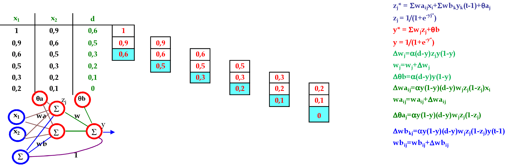
			   <figcaption>Vamos utilizar os padrões de entrada <b>x</b> para prever 1 passo à frente: (1, 0.9) para prever 0.6; (0.9, 0.6) para prever 0.5; e assim sucessivamente.</figcaption>
		   </li>
		   <li>
			   <input type="radio" id="242" name="sl">
			   <label for="242"></label>
			   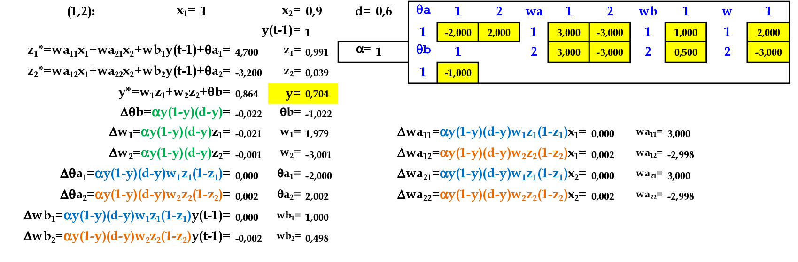
			   <figcaption>Apresentamos o padrão de entrada (1, 0.9) para a rede. O peso inicial do neurônio recorrente <b>y(t&minus;1)</b> começa com valor 1.</figcaption>
		   </li>
		   <li>
			   <input type="radio" id="243" name="sl">
			   <label for="243"></label>
			   
			   <figcaption>Apresentamos o padrão de entrada (0.9, 0.6) para a rede.</figcaption>
		   </li>
		   <li>
			   <input type="radio" id="244" name="sl">
			   <label for="244"></label>
			   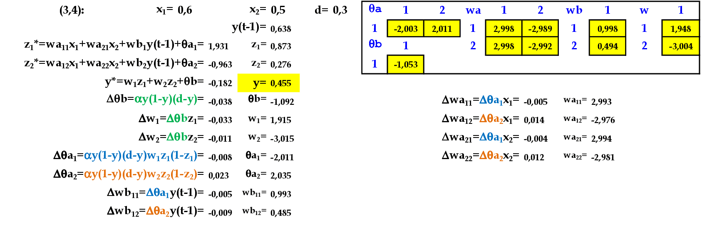
			   <figcaption>Apresentamos o padrão de entrada (0.6, 0.5) para a rede.</figcaption>
		   </li>
		   <li>
			   <input type="radio" id="245" name="sl">
			   <label for="245"></label>
			   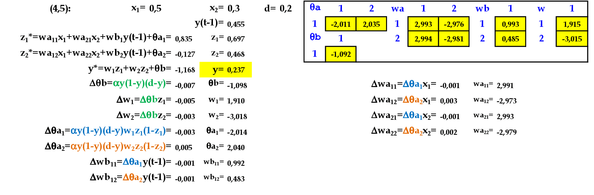
			   <figcaption>Apresentamos o padrão de entrada (0.5, 0.3) para a rede.</figcaption>
		   </li>
		   <li>
			   <input type="radio" id="246" name="sl">
			   <label for="246"></label>
			   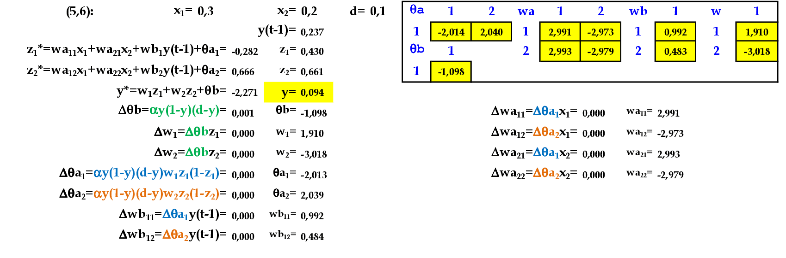
			   <figcaption>Apresentamos o padrão de entrada (0.3, 0.2) para a rede.</figcaption>
		   </li>
		   <li>
			   <input type="radio" id="247" name="sl">
			   <label for="247"></label>
			   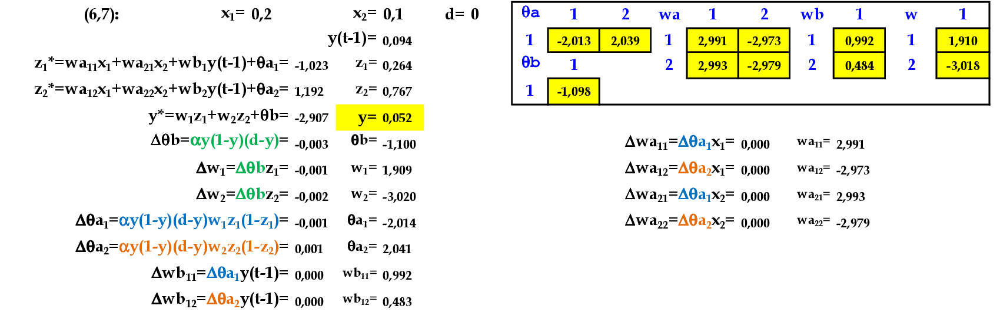
			   <figcaption>Apresentamos o padrão de entrada (0.2, 0.1) para a rede.</figcaption>
		   </li>
		   <li>
			   <input type="radio" id="248" name="sl">
			   <label for="248"></label>
			   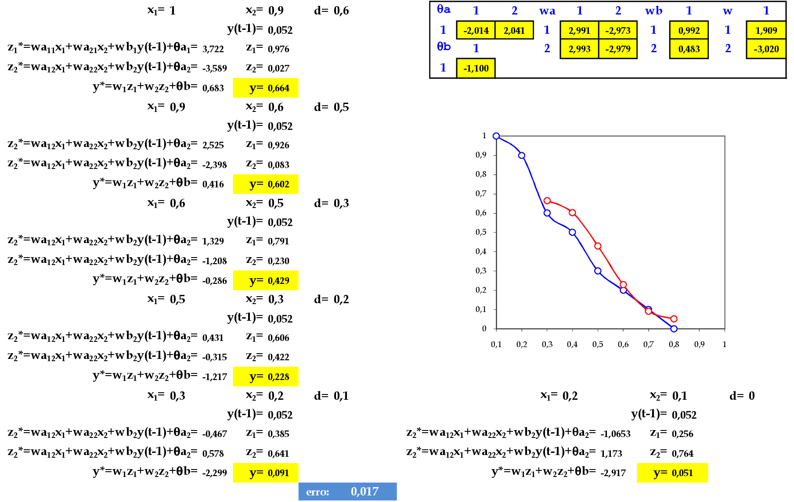
			   <figcaption>No final da 1&ordf; iteração, temos o erro médio <b>E = 0,017</b>.</figcaption>
		   </li>
		   <li>
			   <input type="radio" id="249" name="sl">
			   <label for="249"></label>
			   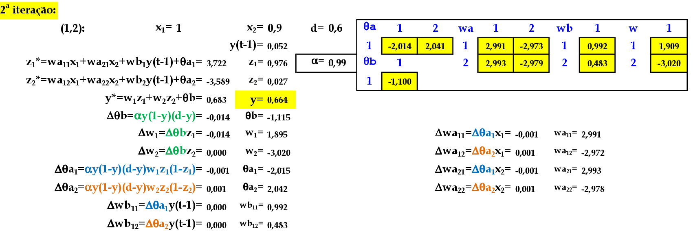
			   <figcaption>Iniciamos a 2&ordf; iteração com a apresentação do padrão (1, 0.9) para a rede.</figcaption>
		   </li>
		   <li>
			   <input type="radio" id="250" name="sl">
			   <label for="250"></label>
			   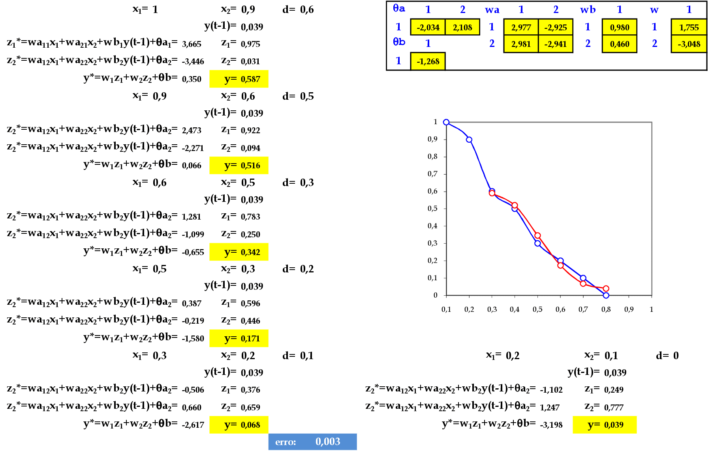
			   <figcaption>No final da 7&ordf; iteração, temos o erro médio <b>E = 0,003</b>.</figcaption>
		   </li>
		</ul>
		
  

  
  

&#x1f4c3; Resolução

	
Vamos acompanhar os cálculos deste exercício de treinamento de uma rede recorrente de Jordan, com 2 neurônios na camada escondida.

	  <ul class="slider">
		   <li>
			   <input type="radio" id="251" name="sl">
			   <label for="251"></label>
			   
			   <figcaption>Vamos utilizar os padrões de entrada <b>t</b> para prever 1 passo à frente: (1, 2) para prever 0.6; (2, 3) para prever 0.5; e assim sucessivamente.</figcaption>
		   </li>
		   <li>
			   <input type="radio" id="252" name="sl">
			   <label for="252"></label>
			   
			   <figcaption>Apresentamos o padrão de entrada (1, 2) para a rede. O peso inicial do neurônio recorrente <b>y(t&minus;1)</b> começa com valor 1.</figcaption>
		   </li>
		   <li>
			   <input type="radio" id="253" name="sl">
			   <label for="253"></label>
			   
			   <figcaption>Apresentamos o padrão de entrada (2, 3) para a rede.</figcaption>
		   </li>
		   <li>
			   <input type="radio" id="254" name="sl">
			   <label for="254"></label>
			   
			   <figcaption>Apresentamos o padrão de entrada (3, 4) para a rede.</figcaption>
		   </li>
		   <li>
			   <input type="radio" id="255" name="sl">
			   <label for="255"></label>
			   
			   <figcaption>Apresentamos o padrão de entrada (4, 5) para a rede.</figcaption>
		   </li>
		   <li>
			   <input type="radio" id="256" name="sl">
			   <label for="256"></label>
			   
			   <figcaption>Apresentamos o padrão de entrada (5, 6) para a rede.</figcaption>
		   </li>
		   <li>
			   <input type="radio" id="257" name="sl">
			   <label for="257"></label>
			   
			   <figcaption>Apresentamos o padrão de entrada (6, 7) para a rede.</figcaption>
		   </li>
		   <li>
			   <input type="radio" id="258" name="sl">
			   <label for="258"></label>
			   
			   <figcaption>No final da 1&ordf; iteração, temos o erro médio <b>E = 0,017</b>.</figcaption>
		   </li>
		   <li>
			   <input type="radio" id="259" name="sl">
			   <label for="259"></label>
			   
			   <figcaption>Iniciamos a 2&ordf; iteração com a apresentação do padrão (1, 2) para a rede.</figcaption>
		   </li>
		   <li>
			   <input type="radio" id="260" name="sl">
			   <label for="260"></label>
			   
			   <figcaption>No final da 7&ordf; iteração, temos o erro médio <b>E = 0,008</b>.</figcaption>
		   </li>
		</ul>
		
  

  
  
<a href="#parte5" class="topo">voltar ao topo</a>

  
  
<a href="#parte5" class="topo">voltar ao topo</a>

<h3>Outras Metaheurísticas</h3>

  
5.2. Busca Tabu

  
Material da página 82 até a página 84.

  
  
<a href="#parte6" class="topo">voltar ao topo</a>

  

		<iframe width="100%" src="https://www.youtube.com/embed/chI3-TdVYJc" frameborder="0" allow="accelerometer; clipboard-write; encrypted-media; gyroscope; picture-in-picture" allowfullscreen></iframe>
  

  
  

&#x1f4c3; Algoritmo comentado

   <figcaption>Algoritmo da Busca Tabu:
<pre><code>Faça i = 1 e <a alt="criar uma solução qualquer para o problema">crie aleatoriamente uma solução Si.</a> 
    <a alt="critério de parada: número de iterações">Enquanto iteração_atual &le; max_iterações, faça:</a>
        iteração_atual = iteração_atual + 1.
        <a alt="modificações na solução atual">Crie uma lista de movimentos M = {m1, m2, ..., mk}.</a>
        <a alt="calcule a função objetivo para cada mudança de M">Calcule a função objetivo do problema Si considerando a aplicação de cada movimento mj &isin; M.</a>
        <a alt="solução com movimento na lista tabu pode ser aceito eventualmente">Verifique se o critério de aspiração será usado (solução na lista tabu pode ser aceita?).</a>
        Escolha mj &isin; M que produz a melhor solução Si+1, tal que tabu(mj) = 0.
        <a alt="a nova solução é aceita desde que melhore a solução atual">Se f(Si+1) &le; f(Si), então </a>
           Si = Si+1
           tabu(mj) = 3
           i = i + 1
        Fim
        <a alt="atualização da lista tabu">Atualize a lista tabu: tabu(mq) = tabu(mq) – 1, onde tabu(mq) > 0.</a>
    Fim
Fim

</code></pre></figcaption>
   

  
  

&#x1f4c3; Resolução

	
Vamos acompanhar os cálculos deste exercício da aplicação da Busca Tabu para encontrar uma rota para o problema do Caixeiro Viajante. Vamos utilizar <b>k</b> = 3, ou seja, 3 movimentos para cada iteração.

	  <ul class="slider">
		   <li>
			   <input type="radio" id="261" name="sl">
			   <label for="261"></label>
			   
			   <figcaption>Com a solução aleatória <b>S1</b>, aplicamos 3 movimentos da lista <b>M</b>: o melhor movimento é <b>m3</b>, que será colocado na lista tabu por 3 iterações.</figcaption>
		   </li>
		   <li>
			   <input type="radio" id="262" name="sl">
			   <label for="262"></label>
			   
			   <figcaption>Com a solução modificada <b>S2</b>, aplicamos 3 movimentos da nova lista <b>M</b>: o melhor movimento é <b>m2</b>, que será colocado na lista tabu por 3 iterações. O movimento <b>m1</b> está na lista tabu, e não foi considerado nesta iteração.</figcaption>
		   </li>
		   <li>
			   <input type="radio" id="263" name="sl">
			   <label for="263"></label>
			   
			   <figcaption>Com a solução modificada <b>S3</b>, aplicamos 3 movimentos da nova lista <b>M</b>: nenhum dos movimentos melhora a solução. O movimento <b>m3</b> está na lista tabu, e não foi considerado nesta iteração.</figcaption>
		   </li>
		   <li>
			   <input type="radio" id="264" name="sl">
			   <label for="264"></label>
			   
			   <figcaption>Com a solução <b>S3</b>, aplicamos 3 movimentos da nova lista <b>M</b>: nenhum dos movimentos melhora a solução. O movimento <b>m2</b> está na lista tabu, e não foi considerado nesta iteração. Continuamos os cálculos até alcançar o número máximo de iterações.</figcaption>
		   </li>
		</ul>
		
  

  
<a href="#parte6" class="topo">voltar ao topo</a>

  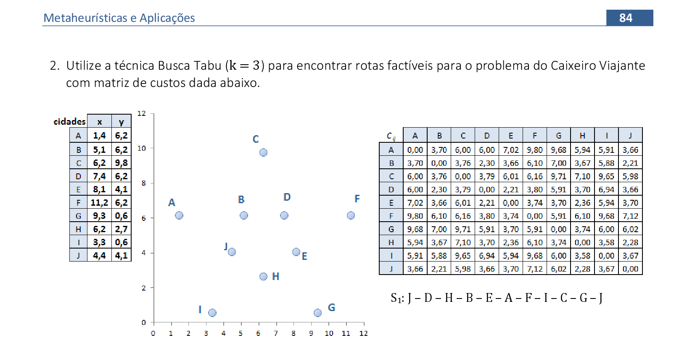
  
&#x1f4d1; Atividade 5.2

  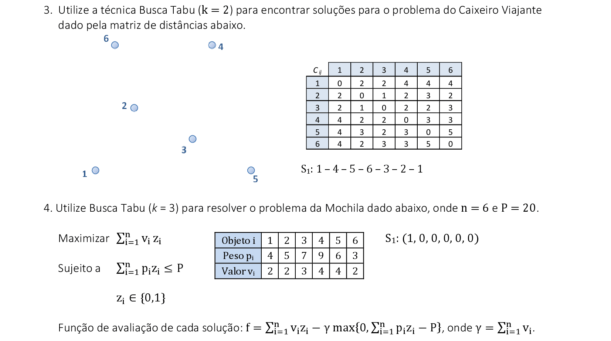
  

&#x1f4c3; Resolução

	
Vamos acompanhar os cálculos deste exercício da aplicação da Busca Tabu para encontrar uma solução do problema da Mochila. Vamos utilizar <b>k</b> = 3, ou seja, 3 movimentos para cada iteração.

	  <ul class="slider">
		   <li>
			   <input type="radio" id="265" name="sl">
			   <label for="265"></label>
			   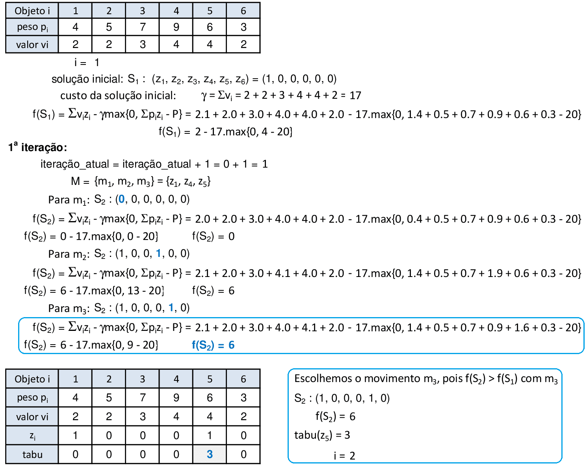
			   <figcaption>Com a solução aleatória <b>S1</b>, aplicamos 3 movimentos da lista <b>M</b>: o melhor movimento é <b>m3</b>, que será colocado na lista tabu por 3 iterações.</figcaption>
		   </li>
		   <li>
			   <input type="radio" id="266" name="sl">
			   <label for="266"></label>
			   
			   <figcaption>Com a solução modificada <b>S2</b>, aplicamos 3 movimentos da nova lista <b>M</b>: o melhor movimento é <b>m3</b>, que será colocado na lista tabu por 3 iterações. O movimento <b>m2</b> está na lista tabu, e não foi considerado nesta iteração.</figcaption>
		   </li>
		   <li>
			   <input type="radio" id="267" name="sl">
			   <label for="267"></label>
			   
			   <figcaption>Com a solução modificada <b>S3</b>, aplicamos 3 movimentos da nova lista <b>M</b>: o melhor movimento é <b>m1</b>, que será colocado na lista tabu por 3 iterações. O movimento <b>m2</b> está na lista tabu, e não foi considerado nesta iteração.</figcaption>
		   </li>
		   <li>
			   <input type="radio" id="268" name="sl">
			   <label for="268"></label>
			   
			   <figcaption>Com a solução <b>S4</b>, aplicamos 3 movimentos da nova lista <b>M</b>: nenhum dos movimentos melhora a solução. O movimento <b>m2</b> está na lista tabu, e não foi considerado nesta iteração. Continuamos os cálculos até alcançar o número máximo de iterações.</figcaption>
		   </li>
		</ul>
		
  

  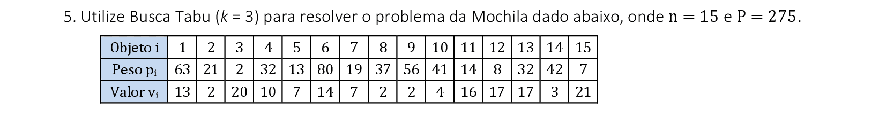
  
<a href="#parte6" class="topo">voltar ao topo</a>

  
6. Nuvem de Partículas e Simulated Annealing

  
Material da página 85 até a página 97.

  
  
<a href="#parte7" class="topo">voltar ao topo</a>

  

		<iframe width="100%" src="https://www.youtube.com/embed/GIdntpSX4JY" frameborder="0" allow="accelerometer; clipboard-write; encrypted-media; gyroscope; picture-in-picture" allowfullscreen></iframe>
  

  
  
<a href="#parte7" class="topo">voltar ao topo</a>

  
  
<a href="#parte7" class="topo">voltar ao topo</a>

  
  
<a href="#parte7" class="topo">voltar ao topo</a>

  
  
<a href="#parte7" class="topo">voltar ao topo</a>

  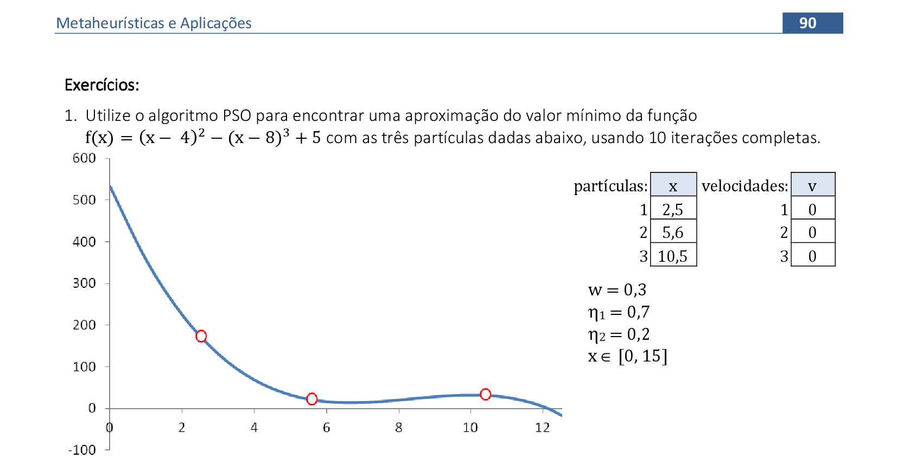
  

&#x1f4c3; Resolução

	
Vamos acompanhar os cálculos deste exercício da aplicação da Nuvem de Partículas para encontrar o valor mínimo da função <b>f(x)</b>. Vamos utilizar 3 partículas que representam soluções do problema.

	  <ul class="slider">
		   <li>
			   <input type="radio" id="269" name="sl">
			   <label for="269"></label>
			   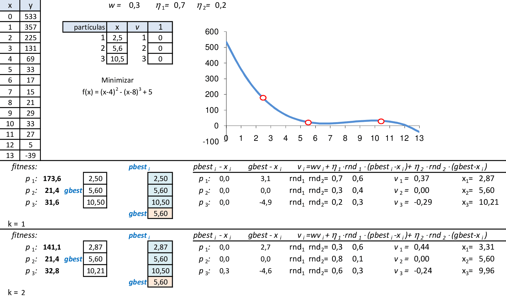
			   <figcaption>Com os parâmetros indicados, temos as 2 primeiras iterações da técnica. A melhor partícula é <b>p2</b> nestas iterações, com <b>f(x)</b> = 21,4. As melhores posições de cada partícula <b>pbesti</b> são suas novas posições.</figcaption>
		   </li>
		   <li>
			   <input type="radio" id="270" name="sl">
			   <label for="270"></label>
			   
			   <figcaption>Nas 4 iterações seguintes, temos que a melhor partícula continua sendo <b>p2</b>, com <b>f(x)</b> = 21,4.</figcaption>
		   </li>
		   <li>
			   <input type="radio" id="271" name="sl">
			   <label for="271"></label>
			   
			   <figcaption>Na 7&ordf; iteração, a melhor partícula é <b>p3</b>, com <b>f(x)</b> = 21,3. Porém, com as atualizações de velocidades, a partícula <b>p2</b>, volta a ser a melhor com <b>f(x)</b> = 15,6 na 8&ordf; iteração.</figcaption>
		   </li>
		   <li>
			   <input type="radio" id="272" name="sl">
			   <label for="272"></label>
			   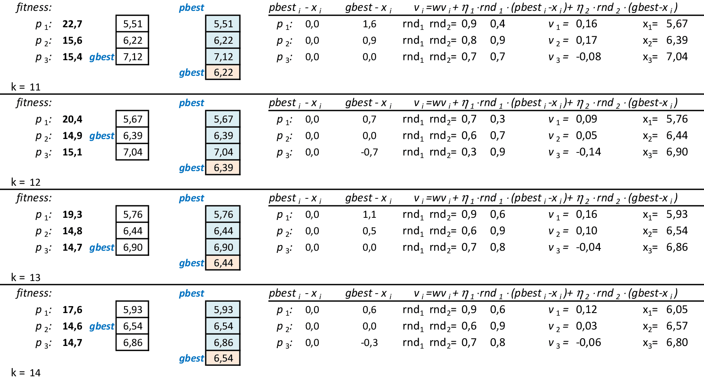
			   <figcaption>Na 11&ordf; iteração, a melhor partícula é <b>p3</b>, com <b>f(x)</b> = 15,4. Porém, com as atualizações de velocidades, a partícula <b>p2</b>, volta a ser a melhor com <b>f(x)</b> = 14,6 na 14&ordf; iteração.</figcaption>
		   </li>
		   <li>
			   <input type="radio" id="273" name="sl">
			   <label for="273"></label>
			   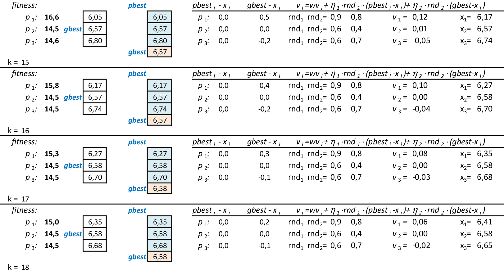
			   <figcaption>Nas 4 iterações seguintes, temos que a melhor partícula é <b>p2</b>, com <b>f(x)</b> = 14,5.</figcaption>
		   </li>
		   <li>
			   <input type="radio" id="274" name="sl">
			   <label for="274"></label>
			   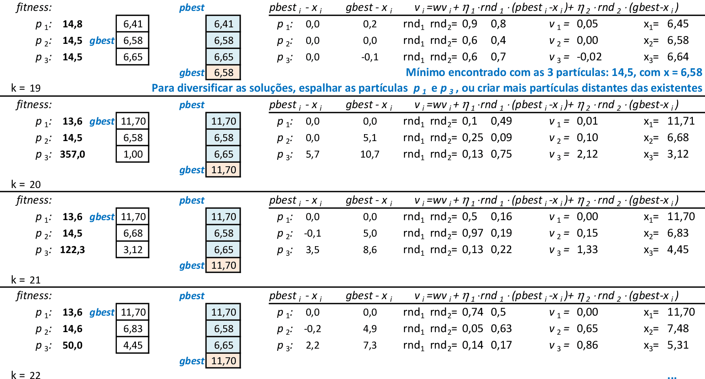
			   <figcaption>Com as partículas agrupadas, temos uma solução ótima local <b>f(x)</b> = 14,5. Espalhando-se as partículas e mantendo-se a melhor delas (<b>p2</b>), podemos explorar o espaço de busca da técnica. O critério de parada mais usado em PSO é o número máximo de iterações alcançado.</figcaption>
		   </li>
		</ul>
		
  

  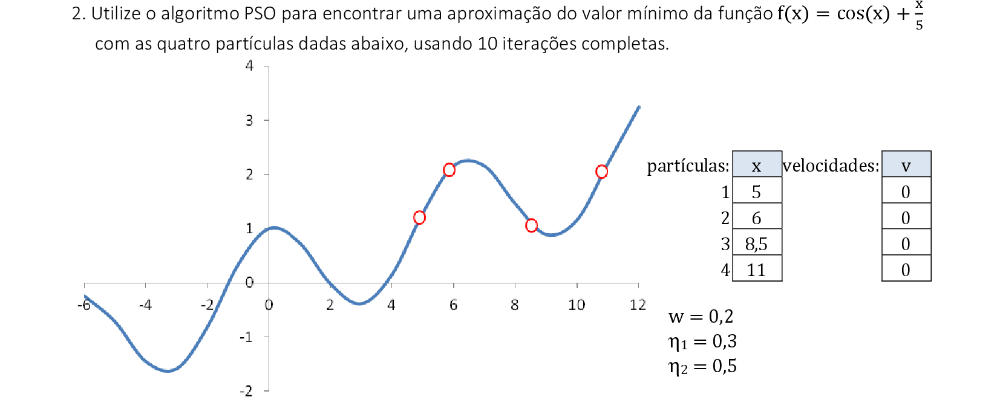
  

&#x1f4c3; Resolução

	
Vamos acompanhar os cálculos deste exercício da aplicação da Nuvem de Partículas para encontrar o valor máximo da função <b>f(x,y)</b>. Vamos utilizar 4 partículas que representam soluções do problema.

	  <ul class="slider">
		   <li>
			   <input type="radio" id="269x" name="sl">
			   <label for="269x"></label>
			   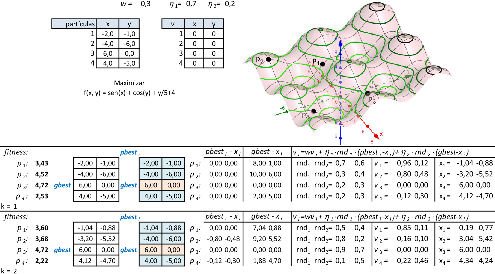
			   <figcaption>Com os parâmetros indicados, temos as 2 primeiras iterações da técnica. A melhor partícula é <b>p3</b> nestas iterações, com <b>f(x,y)</b> = 4,72. As melhores posições de cada partícula <b>pbesti</b> são suas novas posições na primeira iteração.</figcaption>
		   </li>
		   <li>
			   <input type="radio" id="270x" name="sl">
			   <label for="270x"></label>
			   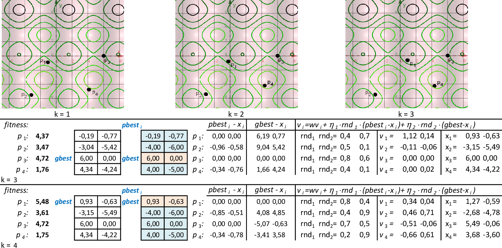
			   <figcaption>Podemos observar as posições das partículas nas 3 primeiras iterações por meio das curvas de nível da função <b>f</b>. Na quarta iteração, a partícula <b>p1</b>, torna-se a melhor, com <b>f(x,y)</b> = 5,48.</figcaption>
		   </li>
		   <li>
			   <input type="radio" id="271x" name="sl">
			   <label for="271x"></label>
			   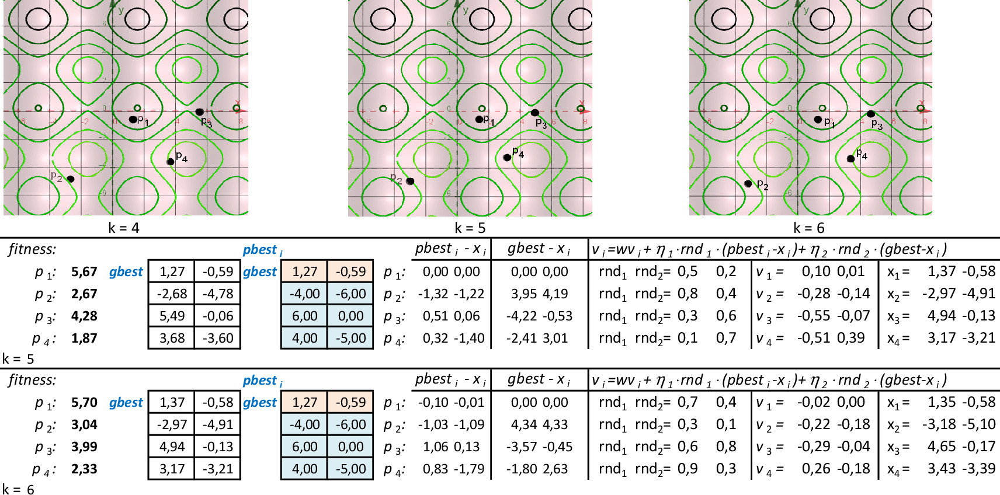
			   <figcaption>As partículas começam a reagir, combinando as novas posições com as respectivas melhores posições <b>pbesti</b> e a melhor posição da partícula do grupo <b>gbest</b>.</figcaption>
		   </li>
		   <li>
			   <input type="radio" id="272x" name="sl">
			   <label for="272x"></label>
			   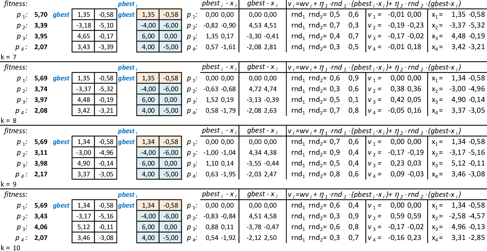
			   <figcaption>Nas 4 iterações seguintes, temos que melhor partícula continua sendo <b>p1</b>, com <b>f(x,y)</b> = 5,71.</figcaption>
		   </li>
		   <li>
			   <input type="radio" id="273x" name="sl">
			   <label for="273x"></label>
			   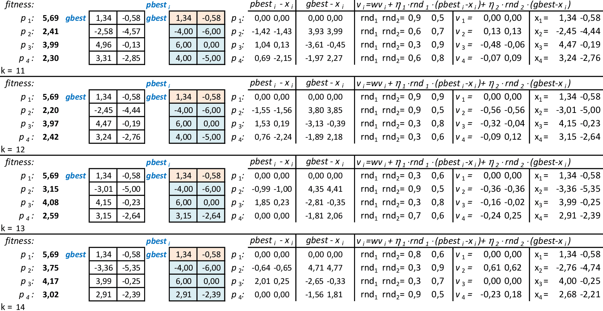
			   <figcaption>Nas 4 iterações seguintes, temos que melhor partícula continua sendo <b>p1</b>, com <b>f(x,y)</b> = 5,71.</figcaption>
		   </li>
		   <li>
			   <input type="radio" id="274x" name="sl">
			   <label for="274x"></label>
			   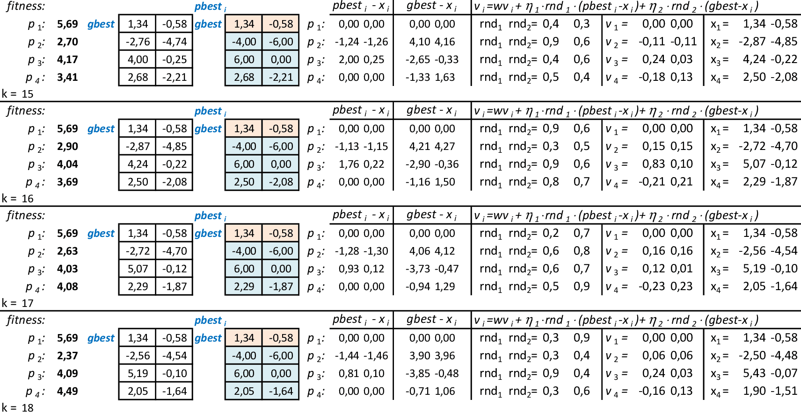
			   <figcaption>Nas 4 iterações seguintes, temos que melhor partícula continua sendo <b>p1</b>, com <b>f(x,y)</b> = 5,71.</figcaption>
		   </li>
		   <li>
			   <input type="radio" id="275x" name="sl">
			   <label for="275x"></label>
			   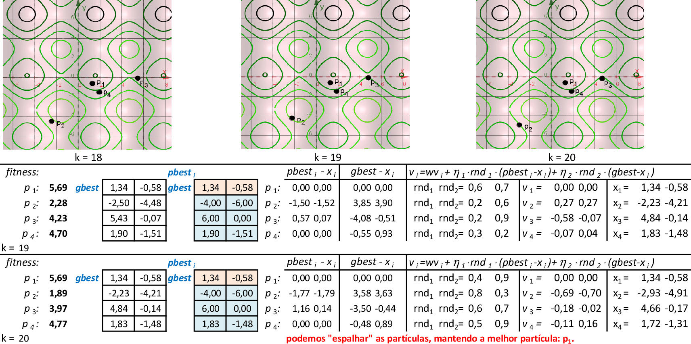
			   <figcaption>Com as partículas mostrando a tendência de agrupamento, encontramos uma solução ótima local <b>f(x,y)</b> = 5,71. Espalhando-se as partículas e mantendo-se a melhor delas (<b>p1</b>), podemos explorar o espaço de busca da técnica. O critério de parada mais usado em PSO é o número máximo de iterações alcançado.</figcaption>
		   </li>
		   <li>
			   <input type="radio" id="276x" name="sl">
			   <label for="276x"></label>
			   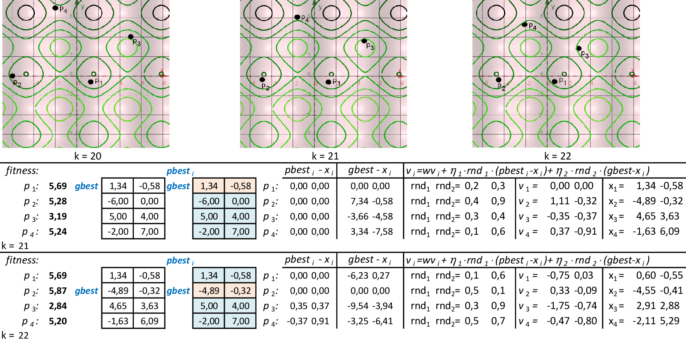
			   <figcaption>Na 22&ordf; iteração, temos que melhor partícula é <b>p2</b>, com <b>f(x,y)</b> = 5,87.</figcaption>
		   </li>
		   <li>
			   <input type="radio" id="277x" name="sl">
			   <label for="277x"></label>
			   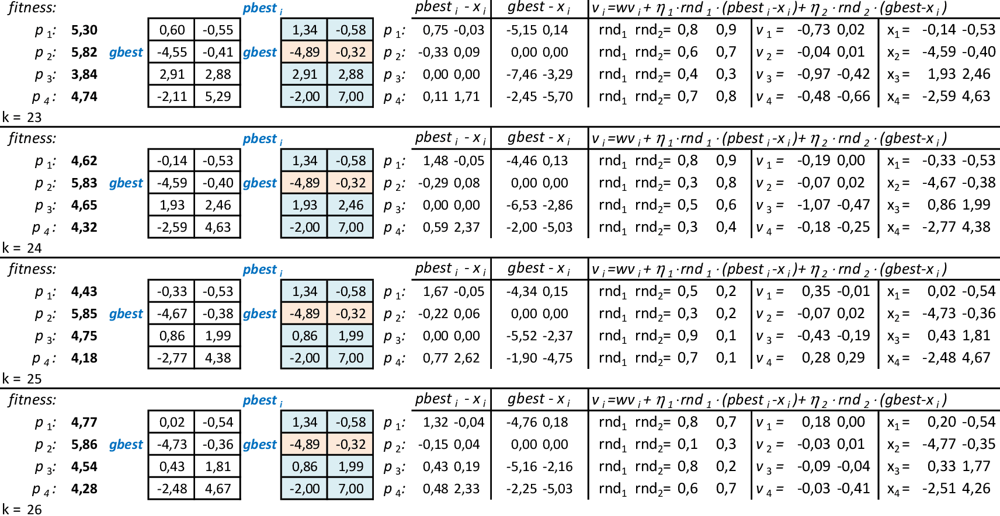
			   <figcaption>Nas 4 iterações seguintes, temos que melhor partícula continua sendo <b>p2</b>, com <b>f(x,y)</b> = 5,87.</figcaption>
		   </li>
		   <li>
			   <input type="radio" id="278x" name="sl">
			   <label for="278x"></label>
			   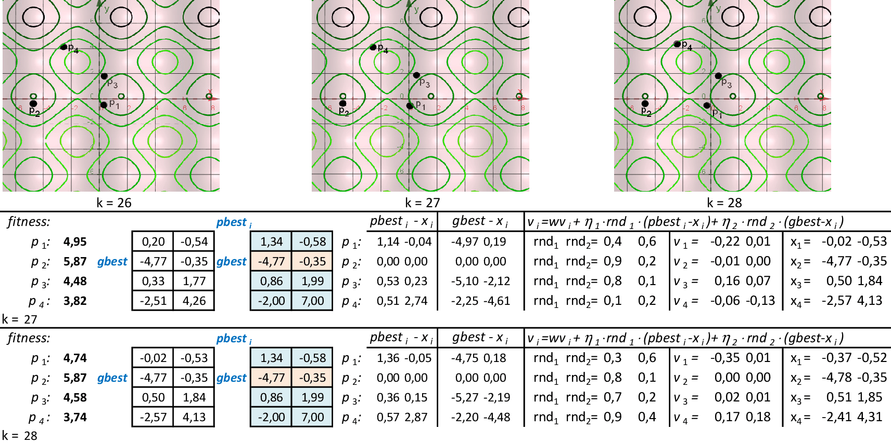
			   <figcaption>Na 28&ordf; iteração temos a solução ótima local <b>f(x,y)</b> = 5,87. O método continua até atingir um número máximo de iterações.</figcaption>
		   </li>
		</ul>
		
  

  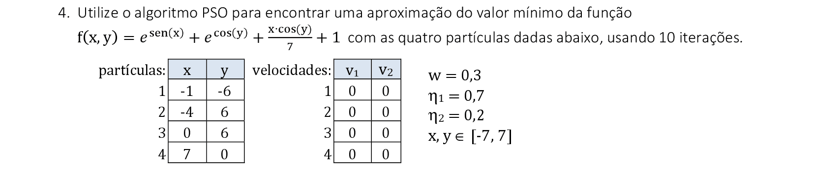
  

&#x1f4c3; Resolução

	
Vamos acompanhar os cálculos deste exercício da aplicação da Nuvem de Partículas para encontrar o valor mínimo da função <b>f(x,y)</b>. Vamos utilizar 4 partículas que representam soluções do problema.

	  <ul class="slider">
		   <li>
			   <input type="radio" id="269y" name="sl">
			   <label for="269y"></label>
			   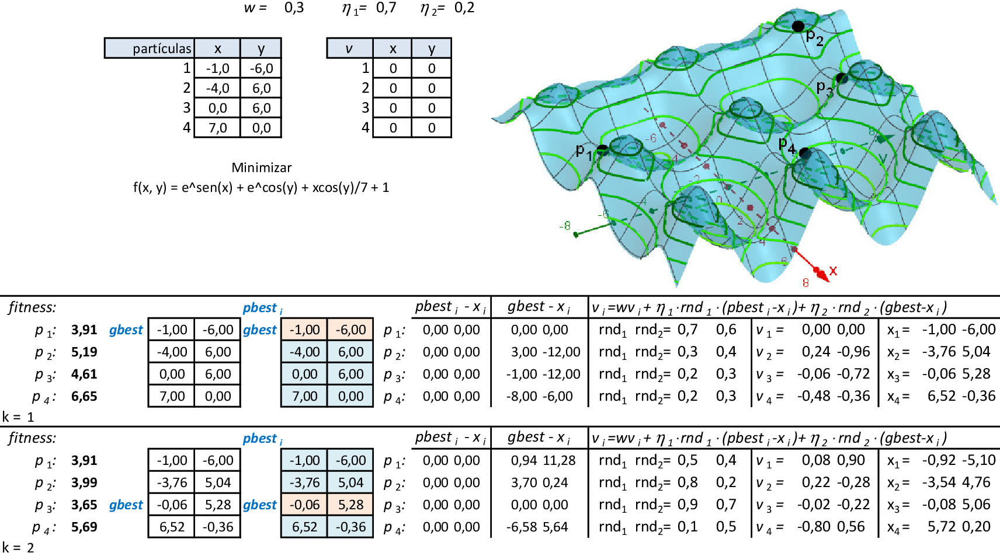
			   <figcaption>Com os parâmetros indicados, temos as 2 primeiras iterações da técnica. As melhores partículas são <b>p1</b> na 1&ordf; iteração e <b>p3</b> na 2&ordf; iteração. As melhores posições de cada partícula <b>pbesti</b> são suas novas posições na primeira iteração.</figcaption>
		   </li>
		   <li>
			   <input type="radio" id="270y" name="sl">
			   <label for="270y"></label>
			   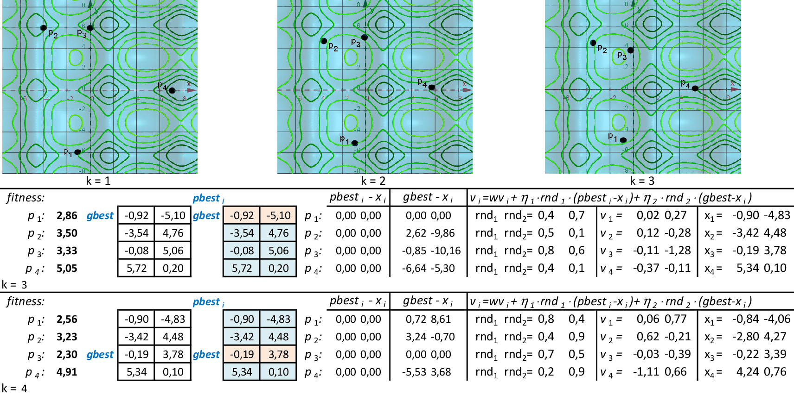
			   <figcaption>Podemos observar as posições das partículas nas 3 primeiras iterações por meio das curvas de nível da função <b>f</b>. Na quarta iteração, a partícula <b>p3</b>, torna-se a melhor, com <b>f(x,y)</b> = 2,30.</figcaption>
		   </li>
		   <li>
			   <input type="radio" id="271y" name="sl">
			   <label for="271y"></label>
			   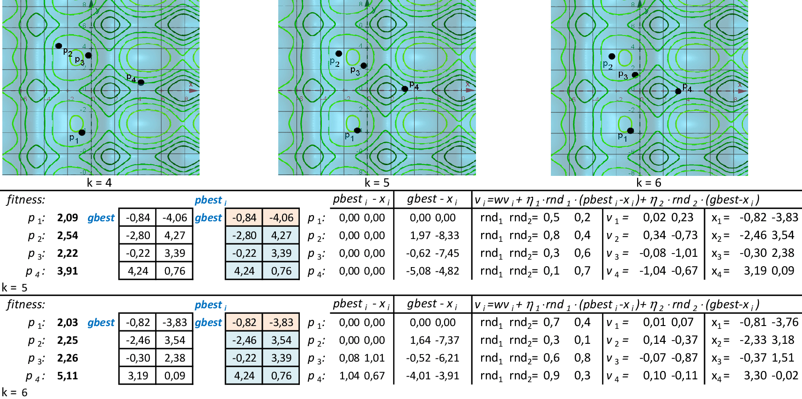
			   <figcaption>As partículas começam a reagir, combinando as novas posições com as respectivas melhores posições <b>pbesti</b> e a melhor posição da partícula do grupo <b>gbest</b>.</figcaption>
		   </li>
		   <li>
			   <input type="radio" id="272y" name="sl">
			   <label for="272y"></label>
			   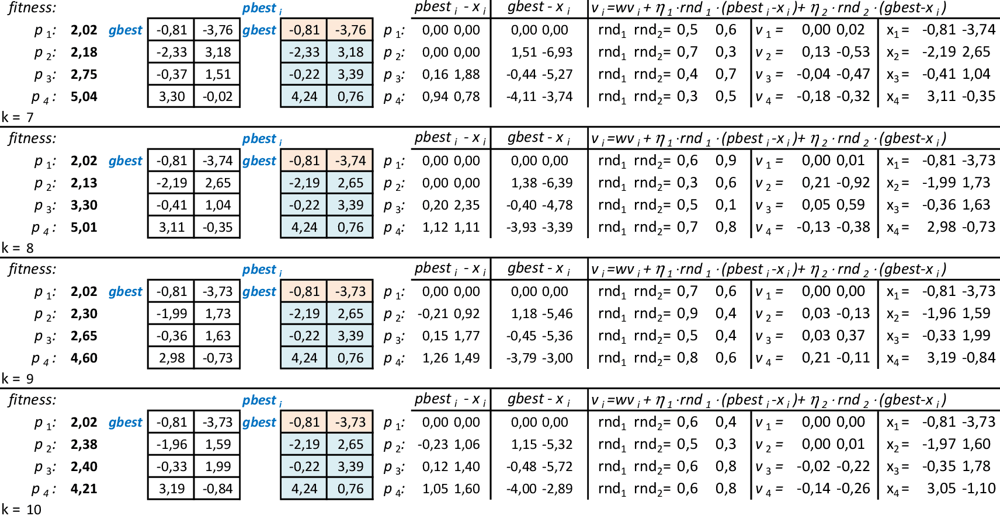
			   <figcaption>Nas 4 iterações seguintes, temos que a melhor partícula é <b>p1</b> com <b>f(x,y) = 2,02</b>.</figcaption>
		   </li>
		   <li>
			   <input type="radio" id="273y" name="sl">
			   <label for="273y"></label>
			   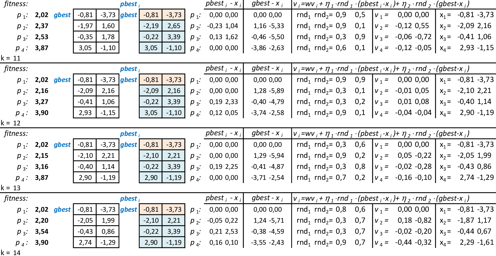
			   <figcaption>Nas 4 iterações seguintes, temos que a melhor partícula é <b>p1</b> com <b>f(x,y) = 2,02</b>.</figcaption>
		   </li>
		   <li>
			   <input type="radio" id="274y" name="sl">
			   <label for="274y"></label>
			   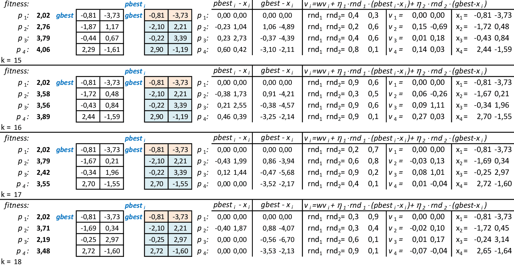
			   <figcaption>Nas 4 iterações seguintes, temos que a melhor partícula é <b>p1</b> com <b>f(x,y) = 2,02</b>.</figcaption>
		   </li>
		   <li>
			   <input type="radio" id="275y" name="sl">
			   <label for="275y"></label>
			   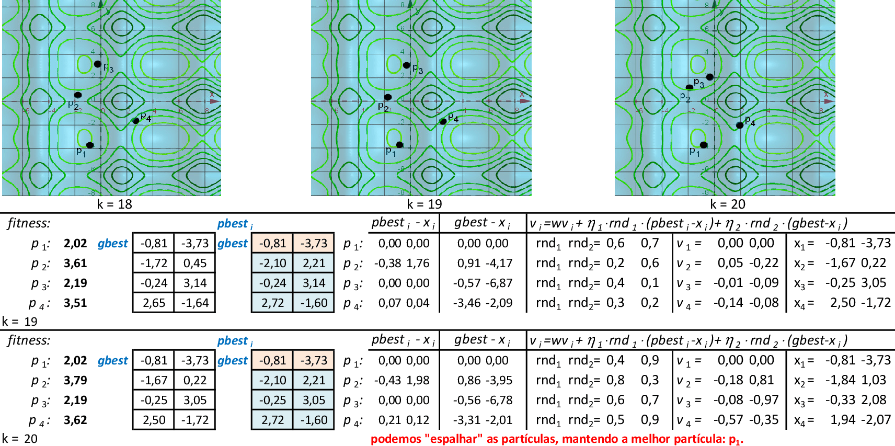
			   <figcaption>Com as partículas mostrando tendência de agrupamento, encontramos uma solução ótima local <b>f(x,y)</b> = 2,02. Espalhando-se as partículas e mantendo-se a melhor delas (<b>p1</b>), podemos explorar o espaço de busca da técnica. O critério de parada mais usado em PSO é o número máximo de iterações alcançado.</figcaption>
		   </li>
		   <li>
			   <input type="radio" id="276y" name="sl">
			   <label for="276y"></label>
			   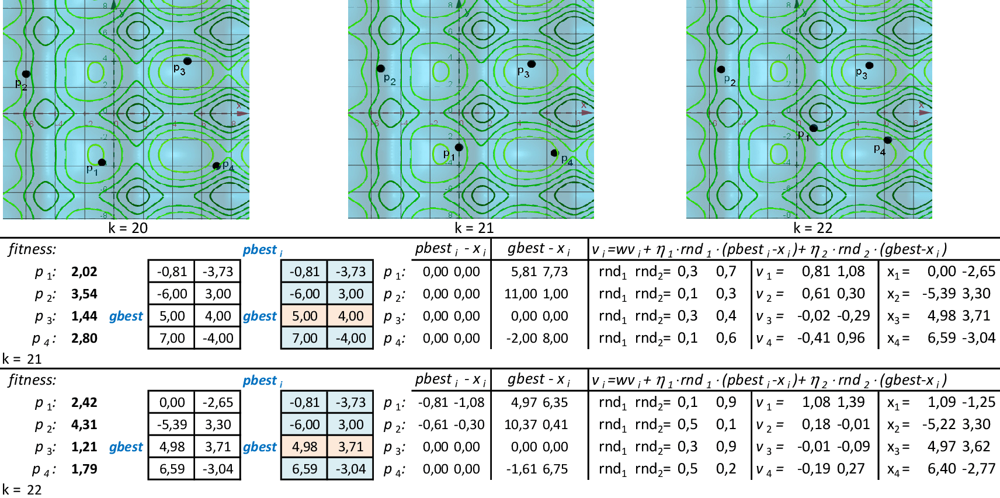
			   <figcaption>Na 22&ordf; iteração, temos que melhor partícula é <b>p3</b>, com <b>f(x,y)</b> = 1,21.</figcaption>
		   </li>
		   <li>
			   <input type="radio" id="277y" name="sl">
			   <label for="277y"></label>
			   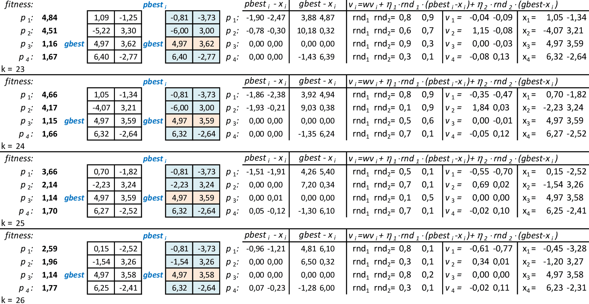
			   <figcaption>Nas 4 iterações seguintes, temos que a melhor partícula é <b>p3</b>, com <b>f(x,y) = 1,14</b>.</figcaption>
		   </li>
		   <li>
			   <input type="radio" id="278y" name="sl">
			   <label for="278y"></label>
			   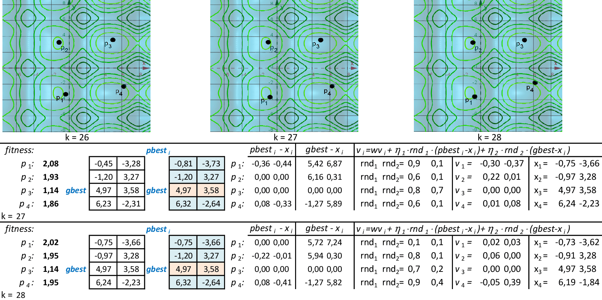
			   <figcaption>Na 28&ordf; iteração temos a solução ótima local <b>f(x,y)</b> = 1,14. O método continua até atingir um número máximo de iterações.</figcaption>
		   </li>
		</ul>
		
  

  
<a href="#parte7" class="topo">voltar ao topo</a>

  
  
<a href="#parte7" class="topo">voltar ao topo</a>

  

		<iframe width="100%" src="https://www.youtube.com/embed/5LYDJJ-EFXE" frameborder="0" allow="accelerometer; clipboard-write; encrypted-media; gyroscope; picture-in-picture" allowfullscreen></iframe>
  

  
  

&#x1f4c3; Resolução

	
Vamos acompanhar os cálculos deste exercício da aplicação da Nuvem de Partículas para encontrar rotas do Problema do Caixeiro Viajante. Vamos utilizar 3 partículas que representam soluções do problema.

	  <ul class="slider">
		   <li>
			   <input type="radio" id="275" name="sl">
			   <label for="275"></label>
			   
			   <figcaption>As velocidades são aplicadas com as trocas de posições dos vértices, tentando "imitar" as rotas <b>pbesti</b> e <b>gbest</b>.</figcaption>
		   </li>
		   <li>
			   <input type="radio" id="276a" name="sl">
			   <label for="276a"></label>
			   
			   <figcaption>Para fazermos as trocas do PCV com a técnica PSO, podemos utilizar índices para <b>gbest - xi</b>. Na partícula 1, a cidade <b>F</b> está na posição 6; porém, na partícula <b>gbest</b> a cidade <b>F</b> está na posição 1. Logo, a posição 1 de <b>gbest - x1</b> tem índice 6.</figcaption>
		   </li>
		   <li>
			   <input type="radio" id="276b" name="sl">
			   <label for="276b"></label>
			   
			   <figcaption>A cidade <b>B</b> está na posição 2 da partícula 1; porém, na partícula <b>gbest</b> a cidade <b>B</b> está na posição 5. Logo, a posição 5 de <b>gbest - x1</b> tem índice 2. Quando a partícula é a <b>gbest</b>, temos que os índices de <b>gbest - xi</b> estão na ordem 1, 2, 3, 4, 5, 6.</figcaption>
		   </li>
		   <li>
			   <input type="radio" id="276" name="sl">
			   <label for="276"></label>
			   
			   <figcaption>Com os parâmetros indicados, temos a 1&ordf; iteração da técnica. A melhor partícula é <b>p2</b>, com solução 39,89. Calculamos as velocidades por meio de trocas de posições dos vértices, deixando as rotas parecidas com a <b>gbest</b>.</figcaption>
		   </li>
		   <li>
			   <input type="radio" id="277" name="sl">
			   <label for="277"></label>
			   
			   <figcaption>Na 2&ordf; iteração, a melhor partícula é <b>p3</b>, com solução 36,05. Calculamos as velocidades por meio de trocas de posições dos vértices, deixando as rotas parecidas com a <b>gbest</b>.</figcaption>
		   </li>
		   <li>
			   <input type="radio" id="278" name="sl">
			   <label for="278"></label>
			   
			   <figcaption>Na 3&ordf; iteração, a melhor partícula é <b>p3</b>, com solução 36,05. Calculamos as velocidades por meio de trocas de posições dos vértices, deixando as rotas parecidas com a <b>gbest</b>.</figcaption>
		   </li>
		   <li>
			   <input type="radio" id="279" name="sl">
			   <label for="279"></label>
			   
			   <figcaption>A técnica prossegue até que as rotas fiquem todas iguais à <b>gbest</b>. Neste momento, podemos criar 2 novas partículas, mantendo-se a partícula <b>gbest</b> para não perdermos boas soluções. Esta técnica de "espalhar" as partículas pode ser feita algumas vezes, até alcançarmos um número máximo de iterações.</figcaption>
		   </li>
		</ul>
		
  

  
  
<a href="#parte7" class="topo">voltar ao topo</a>

  
  

&#x1f4c3; Resolução

	
Vamos acompanhar os cálculos deste exercício da aplicação da Nuvem de Partículas para encontrar uma solução para o problema da Mochila. Vamos utilizar 3 partículas que representam soluções do problema.

	  <ul class="slider">
		   <li>
			   <input type="radio" id="280" name="sl">
			   <label for="280"></label>
			   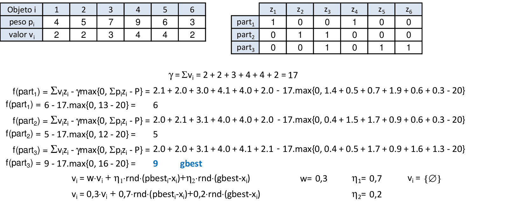
			   <figcaption>Começamos calculando os valores da função objetivo de cada partícula. As velocidades são aplicadas com as trocas de valores dos objetos (0 ou 1), tentando "imitar" as soluções <b>pbesti</b> e <b>gbest</b>.</figcaption>
		   </li>
		   <li>
			   <input type="radio" id="281" name="sl">
			   <label for="281"></label>
			   
			   <figcaption>Com os parâmetros indicados, temos a 1&ordf; iteração da técnica. A melhor partícula é <b>p3</b>, com solução 9. Calculamos as velocidades por meio de trocas de valores dos objetos, deixando as soluções parecidas com a <b>gbest</b>.</figcaption>
		   </li>
		   <li>
			   <input type="radio" id="281a" name="sl">
			   <label for="281a"></label>
			   
			   <figcaption>Escolhemos 1 troca de <b>gbest - x1</b>: na posição 3, que a partícula <b>gbest</b> tem valor 1. Escolhemos 1 troca de <b>gbest - x2</b>: na posição 2, que a partícula <b>gbest</b> tem valor 0.</figcaption>
		   </li>
		   <li>
			   <input type="radio" id="282" name="sl">
			   <label for="282"></label>
			   
			   <figcaption>Na 2&ordf; iteração, a melhor partícula é <b>p1</b>, com solução 9. Calculamos as velocidades por meio de trocas de valores dos objetos, deixando as soluções parecidas com <b>pbest</b> e <b>gbest</b>.</figcaption>
		   </li>
		   <li>
			   <input type="radio" id="281b" name="sl">
			   <label for="281b"></label>
			   
			   <figcaption>Escolhemos 1 troca de <b>gbest - x2</b>: na posição 4, que a partícula <b>gbest</b> tem valor 1. Escolhemos 1 troca de <b>gbest - x3</b>: na posição 5, que a partícula <b>gbest</b> tem valor 0.</figcaption>
		   </li>
		   <li>
			   <input type="radio" id="283" name="sl">
			   <label for="283"></label>
			   
			   <figcaption>Na 3&ordf; iteração, a melhor partícula é <b>p1</b>, com solução 9. Calculamos as velocidades por meio de trocas de valores dos objetos, deixando as soluções parecidas com <b>pbest</b> e <b>gbest</b>.</figcaption>
		   </li>
		   <li>
			   <input type="radio" id="281c" name="sl">
			   <label for="281c"></label>
			   
			   <figcaption>Escolhemos 1 troca de <b>gbest - x2</b>: na posição 5, que a partícula <b>gbest</b> tem valor 0. Escolhemos 1 troca de <b>gbest - x3</b>: na posição 4, que a partícula <b>gbest</b> tem valor 1.</figcaption>
		   </li>
		   <li>
			   <input type="radio" id="284" name="sl">
			   <label for="284"></label>
			   
			   <figcaption>A técnica prossegue até que as soluções fiquem todas iguais à <b>gbest</b>. Depois disso, podemos criar 2 novas partículas, mantendo-se a partícula <b>gbest</b> para não perdermos boas soluções. Esta técnica de "espalhar" as partículas pode ser feita algumas vezes, até alcançarmos um número máximo de iterações.</figcaption>
		   </li>
		</ul>
		
  

  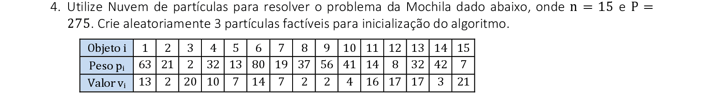
  
&#x1f4d1; Atividade 6.1

  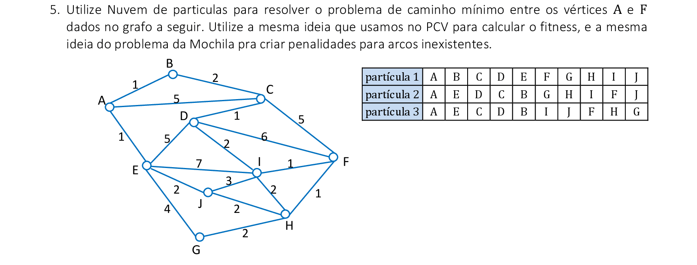
  
<a href="#parte7" class="topo">voltar ao topo</a>

  

		<iframe width="100%" src="https://www.youtube.com/embed/58_ZRAM4e0U" frameborder="0" allow="accelerometer; clipboard-write; encrypted-media; gyroscope; picture-in-picture" allowfullscreen></iframe>
  

  
  
<a href="#parte7" class="topo">voltar ao topo</a>

  
  
<a href="#parte7" class="topo">voltar ao topo</a>

  
  

&#x1f4c3; Algoritmo comentado

   <figcaption>Algoritmo de Simulated Annealing:
<pre><code>Inicialização: <a alt="parâmetros da técnica">S0 (solução inicial), M (máximo de iterações), V (máximo de vizinhos),</a> 
L (máximo de sucessos), S = S0, T = T0, iteração = 1 
Repita
    i = 1 (número de soluções vizinhas encontradas), nsucess = 0
    Repita
        <a alt="solução vizinha, com poucas modificações da solução Si">Crie uma solução Si+1, vizinha de Si</a>
        Calcule a função objetivo para Si+1
        <a alt="probabilidade de aceitar soluções piores do que Si">Calcule a probabilidade P de aceitação de nova solução: P = e-&Delta;E/T</a>
        <a alt="critério de escolha da próxima solução">Se &Delta;E = f(Si+1) - f(Si) &le; 0 ou P &gt; rnd, então</a>
            S = Si+1 (melhor solução)
            nsucess = nsucess + 1
        fim
        i = i + 1 (tentativas)
    <a alt="exploramos a vizinhança da solução Si antes passar para a próxima iteração">Até nsucess &ge; L ou i &gt; V</a>
    <a alt="redução de temperatura para a próxima iteração">T = &alpha;T</a> 
    iteração = iteração + 1
Até nsucess = 0 ou iteração &ge; M

</code></pre></figcaption>
   

  
  

&#x1f4c3; Resolução

	
Vamos acompanhar os cálculos deste exercício da aplicação do Simulated Annealing para encontrar rotas para o problema do Caixeiro Viajante. Vamos utilizar a solução inicial <b>S0</b> indicada.

	  <ul class="slider">
		   <li>
			   <input type="radio" id="285" name="sl">
			   <label for="285"></label>
			   
			   <figcaption>Na 1&ordf; iteração, encontramos a solução vizinha <b>S1</b> com uma troca de arcos de <b>S0</b>. Como <b>f(S1) &le; f(S0)</b>, então a solução é aceita e podemos atualizar a temperatura para a próxima iteração.</figcaption>
		   </li>
		   <li>
			   <input type="radio" id="286" name="sl">
			   <label for="286"></label>
			   
			   <figcaption>Na 2&ordf; iteração, encontramos a solução vizinha <b>S2</b> com uma troca de arcos de <b>S1</b>. Como <b>f(S2) &gt; f(S1)</b>, então utilizamos a probabilidade <b>P</b> para verificar a aceitação desta solução.</figcaption>
		   </li>
		   <li>
			   <input type="radio" id="288" name="sl">
			   <label for="288"></label>
			   
			   <figcaption>Como <b>P &lt; rnd</b>, a solução não é aceita e podemos encontrar mais uma vizinha de <b>S1</b> (o máximo é <b>V</b> = 2). Como <b>f(S2) &le; f(S1)</b>, então aceitamos a solução e podemos atualizar a temperatura para a próxima iteração.</figcaption>
		   </li>
		   <li>
			   <input type="radio" id="287" name="sl">
			   <label for="287"></label>
			   
			   <figcaption>Na 3&ordf; iteração, encontramos a solução vizinha <b>S3</b> com uma troca de arcos de <b>S2</b>. Como <b>f(S3) &gt; f(S2)</b>, então utilizamos a probabilidade <b>P</b> para verificar a aceitação desta solução.</figcaption>
		   </li>
		   <li>
			   <input type="radio" id="289" name="sl">
			   <label for="289"></label>
			   
			   <figcaption>Como <b>P &gt; rnd</b>, a solução é aceita e podemos  podemos atualizar a temperatura para a próxima iteração. O processo continua até atingir um número máximo de iterações.</figcaption>
		   </li>
		</ul>
		
  

  
<a href="#parte7" class="topo">voltar ao topo</a>

  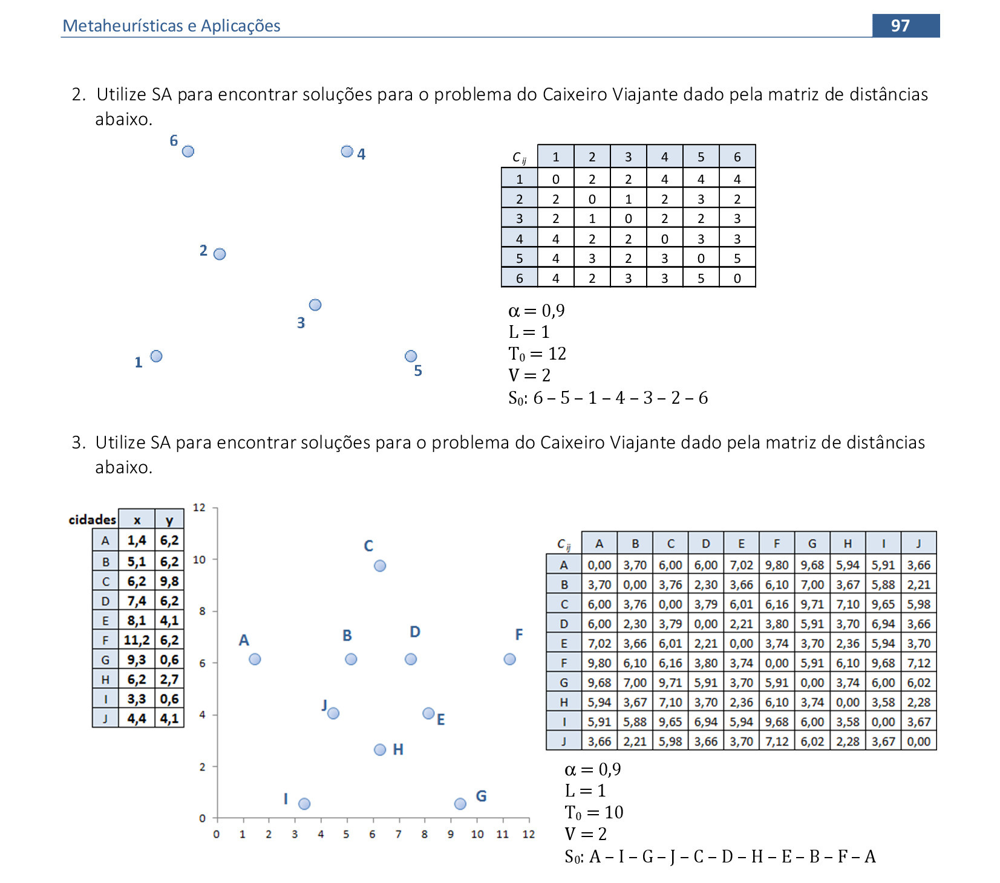
  
&#x1f4d1; Atividade 6.2

  
  

&#x1f4c3; Resolução

	
Vamos acompanhar os cálculos deste exercício da aplicação do Simulated Annealing para encontrar soluções para o problema da Mochila. Vamos utilizar a solução inicial <b>S0</b> indicada.

	  <ul class="slider">
		   <li>
			   <input type="radio" id="290" name="sl">
			   <label for="290"></label>
			   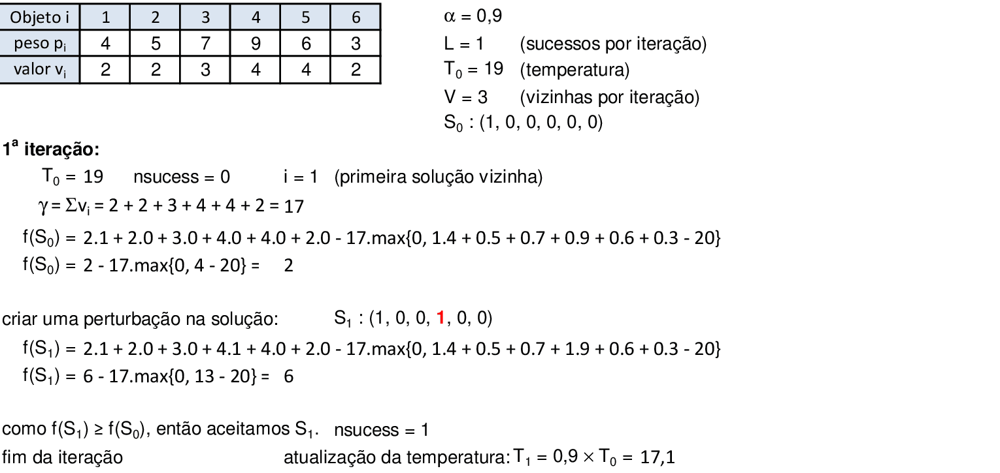
			   <figcaption>Na 1&ordf; iteração, encontramos a solução vizinha <b>S1</b> com uma troca de objetos em <b>S0</b>. Como <b>f(S1) &ge; f(S0)</b>, então a solução é aceita e podemos atualizar a temperatura para a próxima iteração.</figcaption>
		   </li>
		   <li>
			   <input type="radio" id="291" name="sl">
			   <label for="291"></label>
			   
			   <figcaption>Na 2&ordf; iteração, encontramos a solução vizinha <b>S2</b> com uma troca de objetos em <b>S1</b>. Como <b>f(S2) &lt; f(S1)</b>, então utilizamos a probabilidade <b>P</b> para verificar a aceitação desta solução.</figcaption>
		   </li>
		   <li>
			   <input type="radio" id="292" name="sl">
			   <label for="292"></label>
			   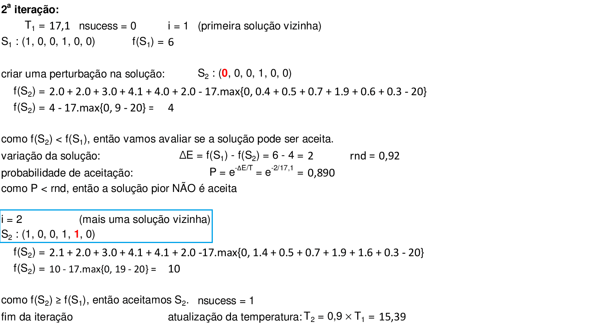
			   <figcaption>Como <b>P &lt; rnd</b>, a solução não é aceita e podemos encontrar mais uma vizinha de <b>S1</b> (o máximo é <b>V</b> = 2). Como <b>f(S2) &ge; f(S1)</b>, então aceitamos a solução e podemos atualizar a temperatura para a próxima iteração.</figcaption>
		   </li>
		   <li>
			   <input type="radio" id="293" name="sl">
			   <label for="293"></label>
			   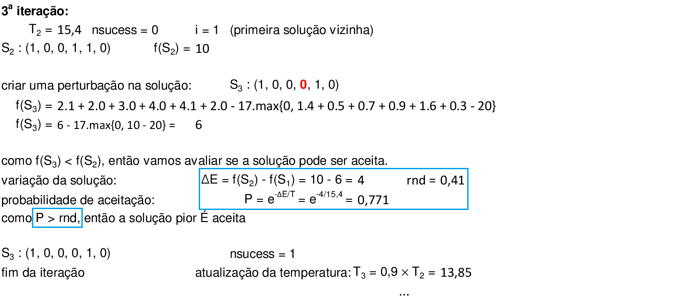
			   <figcaption>Na 3&ordf; iteração, encontramos a solução vizinha <b>S3</b> com uma troca de objetos em <b>S2</b>. Como <b>f(S3) &lt; f(S2)</b>, então utilizamos a probabilidade <b>P</b> para verificar a aceitação desta solução.</figcaption>
		   </li>
		   <li>
			   <input type="radio" id="294" name="sl">
			   <label for="294"></label>
			   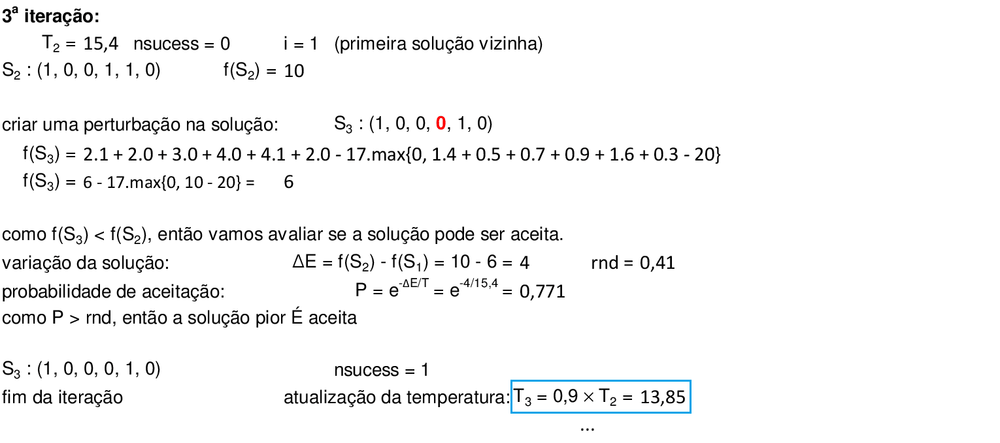
			   <figcaption>Como <b>P &gt; rnd</b>, a solução é aceita e podemos  podemos atualizar a temperatura para a próxima iteração. O processo continua até atingir um número máximo de iterações.</figcaption>
		   </li>
		</ul>
		
  

  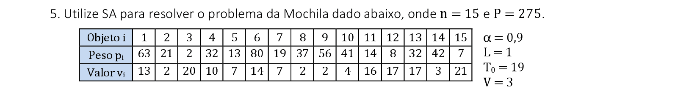
  
<a href="#parte7" class="topo">voltar ao topo</a>

  
7. ILS, GRASP, Colônia de Formigas e VNS

  
Material da página 98 até a página 106.

  
  

&#x1f4c3; Algoritmo comentado

   <figcaption>Algoritmo de ILS - Iterated Local Search:
<pre><code><a alt="começamos com uma solução qualquer">x0 = Solução_Inicial</a>
<a alt="técnica de melhoria aplicada na solução inicial">x = busca_local(x0) aplica uma melhoria na solução inicial</a>
Repita
    <a alt="perturbação na solução: trocas de alguns arcos">x' = perturbação(x, histórico) encontra uma nova solução, guiada por um histórico de trocas</a>
    <a alt="técnica de melhoria em x'">x'' = busca_local(x') aplica uma melhoria na solução x'</a>
    <a alt="armazenamos a melhor solução">Se f(x'') &lt; f(x), então</a> 
        x = x'' (aceita a melhor solução)
    Caso contrário, se f(x') &lt; f(x), então
        x = x' (aceita a melhor solução)
    Fim
<a alt="critério de parada: número máximo de iterações ou valor mínimo encontrado">Enquanto o critério de parada não for satisfeito</a>

</code></pre></figcaption>
   

  
  
<a href="#parte8" class="topo">voltar ao topo</a>

  
  

&#x1f4c3; Algoritmo comentado

   <figcaption>Algoritmo de GRASP - Greedy Randomized Adaptative Search: Procedure:
<pre><code><a alt="começamos com uma solução M">Melhor_solução = M, função de avaliação: f.</a>
Repita
    <a alt="solução gulosa: por exemplo, usar os arcos de menores custos do PCV">X = solução_grasp (criar uma solução aleatória por inserção gulosa de elementos)</a>
    <a alt="modificações da solução X com trocas de arcos">X = busca_local(X) (aplicar uma busca de vizinhança para melhorar a solução X: trocas de arcos)</a>
	<a alt="armazenar a melhor solução">Se f(X) &lt; Melhor_solução, então </a>
		Melhor_solução = X (aceita a melhor solução)
	Fim
<a alt="critério de parada: número máximo de iterações ou valor mínimo encontrado">Enquanto o critério de parada não for satisfeito</a>
 
</code></pre></figcaption>
   

  
  
<a href="#parte8" class="topo">voltar ao topo</a>

  
  
<a href="#parte8" class="topo">voltar ao topo</a>

  

		<iframe width="100%" src="https://www.youtube.com/embed/-uZmt_ErimY" frameborder="0" allow="accelerometer; clipboard-write; encrypted-media; gyroscope; picture-in-picture" allowfullscreen></iframe>
  

  
  
<a href="#parte8" class="topo">voltar ao topo</a>

  
  
<a href="#parte8" class="topo">voltar ao topo</a>

  
  

&#x1f4c3; Algoritmo comentado

   <figcaption>Algoritmo de Colônia de Formigas:
<pre><code><a alt="criamos m soluções: cada formiga faz uma rota começando em uma cidade">Coloque cada formiga em uma cidade aleatória</a>
    <a alt="critério de parada: número máximo de iterações">Para t = 1 até o número máximo de iterações</a>
        Para k = 1 até m (nº de formigas)
            Enquanto a formiga k não construir a viagem Sk
                <a alt="regra de probabilidade de escolha de arcos baseada em vizinhanças">Selecione a próxima cidade pela regra da probabilidade:</a>
                pijk = &tau;ij&alpha;&eta;ij&beta; / &sum;l&isin;Njk &tau;il&alpha;&eta;jl&beta;, quando j &isin; Njk. 
            Fim
            <a alt="cálculo da rota de cada formiga k">Calcule a distância Lk da viagem Sk</a>
            <a alt="armazene a melhor rota encontrada">Se Lk &lt; L* então</a>
                S* = Sk, L* = Lk
            Fim
        Fim
        <a alt="usamos as contribuições de cada formiga que usa o arco (i,j)">Atualize os feromônios: &tau;ij = (1-&rho;)&tau;ij + &sum;k=1m&Delta;&tau;ijk, onde:</a>
        &Delta;&tau;ijk = Q / Lk quando a aresta (i, j) pertence Sk, onde Q é uma constante.
        &Delta;&tau;ijk = 0 em caso contrário. 
    Fim
O resultado é a rota S*.

</code></pre></figcaption>
   

  
  

&#x1f4c3; Resolução

	
Vamos acompanhar os cálculos deste exercício da aplicação da Colônia de Formigas para encontrar soluções para o problema do Caixeiro Viajante. Vamos utilizar os parâmetros indicados de <b>&alpha;</b> e <b>&beta;</b>.

	  <ul class="slider">
		   <li>
			   <input type="radio" id="303" name="sl">
			   <label for="303"></label>
			   
			   <figcaption>O valor de <b>&eta;ij</b> é o inverso do custo <b>cij</b>. Desta forma, os menores custos têm maior atratividade para a técnica. A formiga 1 começa a rota pela cidade 1.</figcaption>
		   </li>
		   <li>
			   <input type="radio" id="304" name="sl">
			   <label for="304"></label>
			   
			   <figcaption>Para decidir se a formiga 1 vai da cidade 1 para a cidade 2, note que calculamos os valores de <b>&tau;1l</b> e <b>&eta;2l</b>, para todas as cidades <b>l</b> ainda não visitadas. Desta forma, a técnica prevê o que acontece com a decisão de usar a cidade 2 analisando todas as cidades ainda não visitadas.</figcaption>
		   </li>
		   <li>
			   <input type="radio" id="305" name="sl">
			   <label for="305"></label>
			   
			   <figcaption>Escolhemos a maior probabilidade, e podemos calcular da mesma forma a sequência da rota: da cidade 2 para a cidade 3, e assim sucessivamente. A rota encontrada da formiga 1 tem custo <b>L1 = 9,8</b>. Devemos guardar quais arcos são usados por cada formiga.</figcaption>
		   </li>
		   <li>
			   <input type="radio" id="306" name="sl">
			   <label for="306"></label>
			   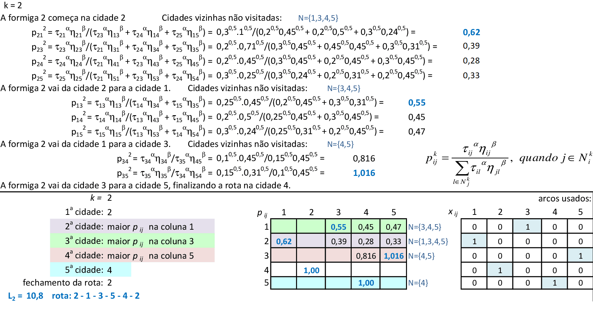
			   <figcaption>Os cálculos são feitos de forma similar para as demais formigas. A formiga 2 começa a rota pela cidade 2, com custo <b>L2 = 10,8</b>.</figcaption>
		   </li>
		   <li>
			   <input type="radio" id="307" name="sl">
			   <label for="307"></label>
			   
			   <figcaption>A formiga 3 começa a rota pela cidade 3, com custo <b>L3 = 10,9</b>.</figcaption>
		   </li>
		   <li>
			   <input type="radio" id="308" name="sl">
			   <label for="308"></label>
			   
			   <figcaption>A formiga 4 começa a rota pela cidade 4, com custo <b>L4 = 10,9</b>.</figcaption>
		   </li>
		   <li>
			   <input type="radio" id="309" name="sl">
			   <label for="309"></label>
			   
			   <figcaption>A formiga 5 começa a rota pela cidade 5, com custo <b>L5 = 9,8</b>.</figcaption>
		   </li>
		   <li>
			   <input type="radio" id="310" name="sl">
			   <label for="310"></label>
			   
			   <figcaption>A melhor solução encontrada foi com custo <b>L* = 9,8</b>. As "contribuições" de feromônios são feitas com base nos arcos que cada formiga utilizou. As contribuições de cada formiga <b>k</b> são calculadas por meio do inverso do custo de cada rota: <b>&Delta;ijk = Q / Lk</b>.</figcaption>
		   </li>
		   <li>
			   <input type="radio" id="310a" name="sl">
			   <label for="310a"></label>
			   
			   <figcaption>Por exemplo, o arco (1, 2) foi usado pelas formigas 1, 4 e 5: logo, o feromônio <b>&tau;12</b> terá as contribuições <b>&Delta;12</b> de cada formiga. O valor <b>&rho;</b> é da taxa de evaporação do feromônio.</figcaption>
		   </li>
		   <li>
			   <input type="radio" id="310b" name="sl">
			   <label for="310b"></label>
			   
			   <figcaption>O arco (1, 4) não foi usado pelas formigas, e tem atualização somente da evaporação do feromônio. Os cálculos das demais atualizações de feromônios são feitos da mesma forma.</figcaption>
		   </li>
		   <li>
			   <input type="radio" id="311" name="sl">
			   <label for="311"></label>
			   
			   <figcaption>Com as novas taxas de feromônios calculadas, podemos começar a 2&ordf; iteração. A formiga 1 começa a rota na cidade 1.</figcaption>
		   </li>
		   <li>
			   <input type="radio" id="312" name="sl">
			   <label for="312"></label>
			   
			   <figcaption>A formiga 2 começa a rota na cidade 2, e assim sucessivamente. A técnica pode ser executada até que as soluções fiquem todas com mesmo valor da função objetivo.</figcaption>
		   </li>
		</ul>
		
  

  
<a href="#parte8" class="topo">voltar ao topo</a>

  
  

&#x1f4c3; Resolução

	
Vamos acompanhar os cálculos deste exercício da aplicação da Colônia de Formigas para encontrar soluções para o problema da Mochila. Vamos utilizar os parâmetros indicados de <b>&alpha;</b> e <b>&beta;</b>. A fórmula da probabilidade fica mais simplificada, com apenas o índice <b>i</b>.

	  <ul class="slider">
		   <li>
			   <input type="radio" id="295" name="sl">
			   <label for="295"></label>
			   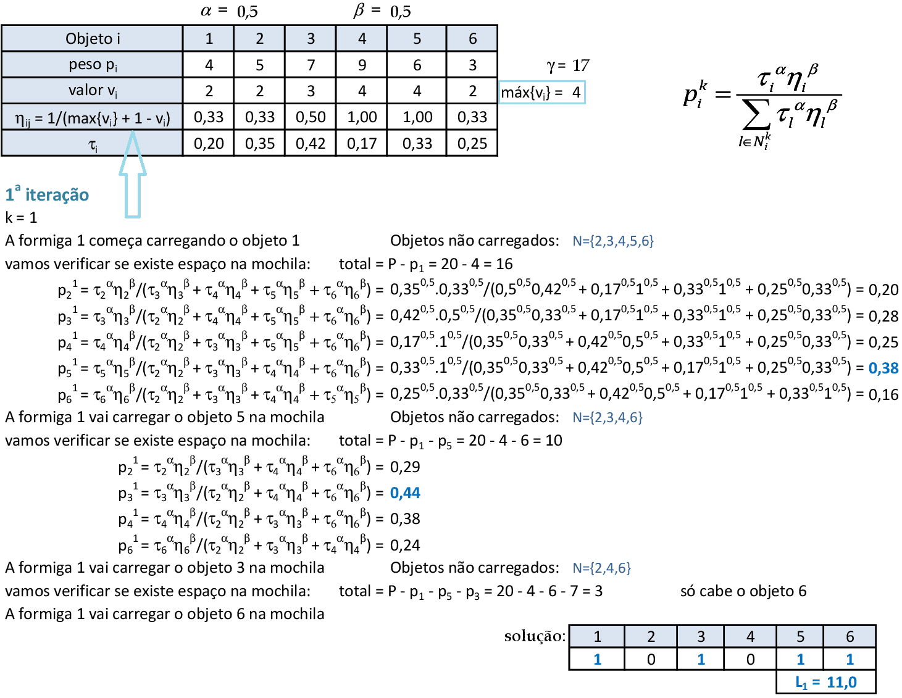
			   <figcaption>Os valores de <b>&eta;</b> são calculados utilizando o valor máximo <b>vi</b>, pois temos um problema de maximização. A formiga 1 começa carregando o objeto 1, e fazemos os cálculos de forma parecida com os cálculos feitos para o PCV.</figcaption>
		   </li>
		   <li>
			   <input type="radio" id="295a" name="sl">
			   <label for="295a"></label>
			   
			   <figcaption>A vizinhança <b>N</b> contém os objetos ainda não carregados pela formiga, e a probabilidade utiliza apenas um índice de feromônio <b>&tau;</b> e atratividade <b>&eta;</b>. Podemos verificar sempre a capacidade da mochila antes de fazer os cálculos de probabilidades. Nesta situação, a formiga consegue colocar os objetos 2, 3, 5 e 6 na mochila, com custo <b>L1 = 11</b>. </figcaption>
		   </li>
		   <li>
			   <input type="radio" id="296" name="sl">
			   <label for="296"></label>
			   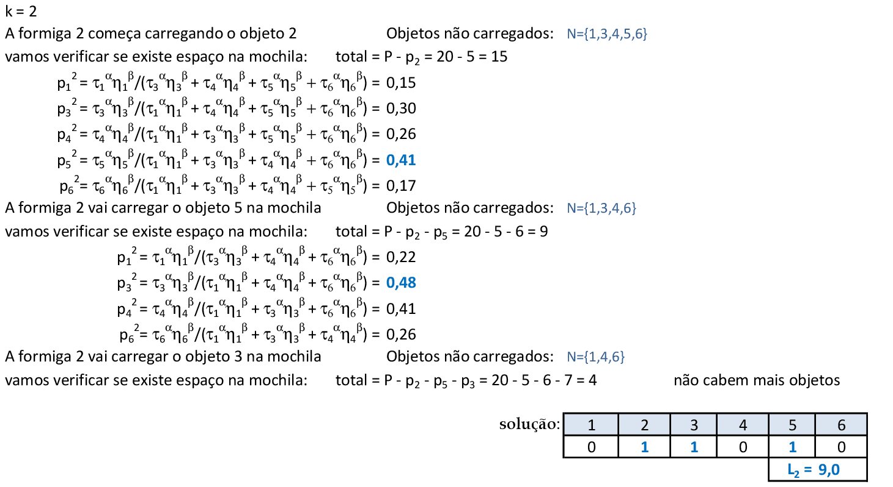
			   <figcaption>A formiga 2 começa com o segundo objeto, e consegue carregar os objetos 2, 3 e 5 na mochila, com custo <b>L2 = 9</b>.</figcaption>
		   </li>
		   <li>
			   <input type="radio" id="297" name="sl">
			   <label for="297"></label>
			   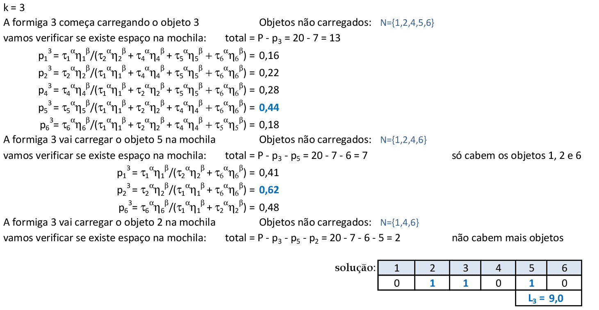
			   <figcaption>A formiga 3 começa com o terceiro objeto, e consegue carregar os objetos 2, 3 e 5 na mochila, com custo <b>L3 = 9</b>.</figcaption>
		   </li>
		   <li>
			   <input type="radio" id="298" name="sl">
			   <label for="298"></label>
			   
			   <figcaption>A formiga 4 começa com o quarto objeto, e consegue carregar os objetos 2, 4 e 5 na mochila, com custo <b>L4 = 10</b>.</figcaption>
		   </li>
		   <li>
			   <input type="radio" id="299" name="sl">
			   <label for="299"></label>
			   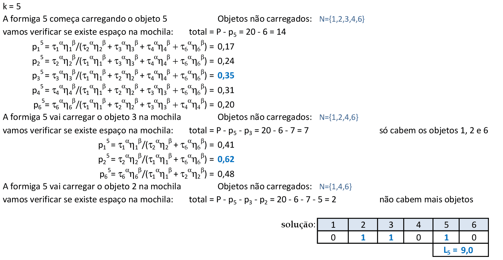
			   <figcaption>A formiga 5 começa com o quinto objeto, e consegue carregar os objetos 2, 3 e 5 na mochila, com custo <b>L5 = 9</b>.</figcaption>
		   </li>
		   <li>
			   <input type="radio" id="300" name="sl">
			   <label for="300"></label>
			   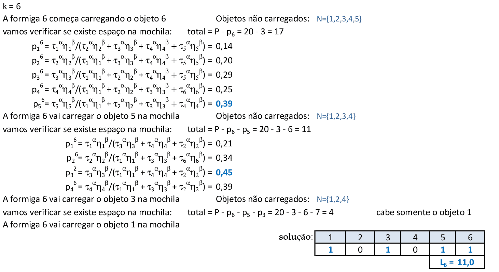
			   <figcaption>Para finalizar a iteração, a formiga 6 começa com o sexto objeto, e consegue carregar os objetos 1, 3, 5 e 6 na mochila, com custo <b>L6 = 11</b>.</figcaption>
		   </li>
		   <li>
			   <input type="radio" id="301" name="sl">
			   <label for="301"></label>
			   
			   <figcaption>A melhor solução encontrada foi com custo <b>L* = 11</b>. As "contribuições" de feromônios são feitas com base nos objetos que cada formiga carregou. Como o problema é de maximização, podemos utilizar o valor de <b>&gamma;</b> para atribuir maiores feromônios às soluções com custos maiores.</figcaption>
		   </li>
		   <li>
			   <input type="radio" id="301a" name="sl">
			   <label for="301a"></label>
			   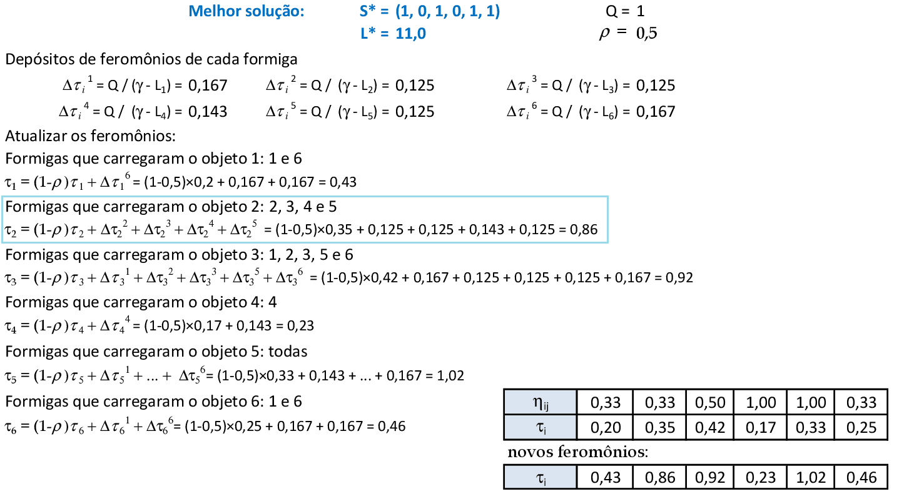
			   <figcaption>Por exemplo, o objeto 2 foi carregado pelas formigas 2, 3, 4 e 5: logo, o feromônio <b>&tau;2</b> terá as contribuições <b>&Delta;2</b> de cada formiga. O valor <b>&rho;</b> é da taxa de evaporação do feromônio.</figcaption>
		   </li>
		   <li>
			   <input type="radio" id="302" name="sl">
			   <label for="302"></label>
			   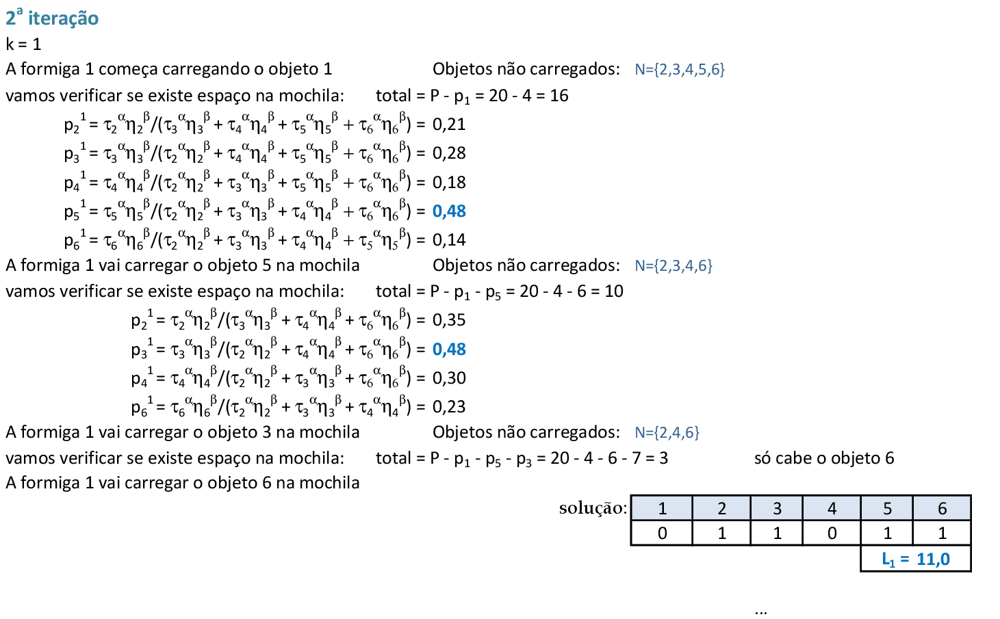
			   <figcaption>Com as novas taxas de feromônios calculadas, podemos começar a 2&ordf; iteração. A técnica pode ser executada até que as soluções fiquem todas com mesmo valor da função objetivo.</figcaption>
		   </li>
		</ul>
		
  

  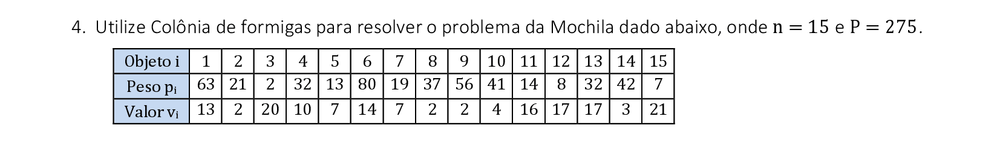
  
&#x1f4d1; Atividade 7.1

  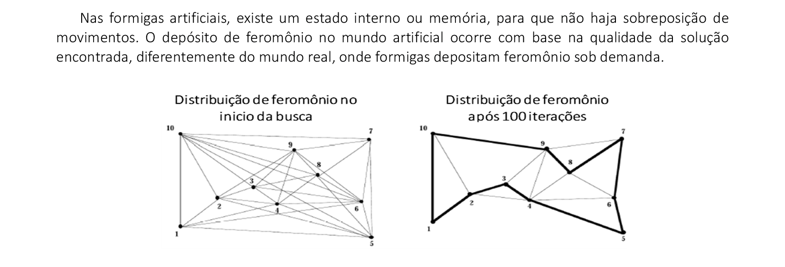
  
<a href="#parte8" class="topo">voltar ao topo</a>

  
  
<a href="#parte8" class="topo">voltar ao topo</a>

  
  

&#x1f4c3; Algoritmo comentado

   <figcaption>Algoritmo de VNS - Variable Neighborhood Search:
<pre><code><a alt="crie uma solução qualquer para o problema">x0 = Solução_Inicial.</a>
<a alt="utilize uma técnica para modificar a solução inicial">x = busca_local(x0) aplica uma melhoria na solução inicial</a>
Repita
    <a alt="busca de uma solução vizinha, como fizemos em SA e BT">x' = vizinho(x) encontra uma nova solução, vizinha de x através de 1 troca de arcos</a>
    <a alt="melhoria com uma técnica de busca local">x'' = busca_local(x') aplica uma melhoria na solução x'</a>
    <a alt="substitui a melhor solução encontrada">Se f(x'') &lt; f(x), então</a> 
        x = x'' (aceita a melhor solução)
    Caso contrário, se f(x') &lt; f(x), então
        x = x' (aceita a melhor solução)
    Fim
<a alt="critérios de parada: número máximo de iterações ou valor mínimo encontrado">Enquanto o critério de parada não for satisfeito</a>

</code></pre></figcaption>
   

  
<a href="#parte8" class="topo">voltar ao topo</a>

  
8. Algoritmos Genéticos e Busca Local

  
Material da página 106 até a página 119.

  
  
<a href="#parte9" class="topo">voltar ao topo</a>

  

		<iframe width="100%" src="https://www.youtube.com/embed/aOQ3QhSqLdY" frameborder="0" allow="accelerometer; clipboard-write; encrypted-media; gyroscope; picture-in-picture" allowfullscreen></iframe>
  
 
  
  
<a href="#parte9" class="topo">voltar ao topo</a>

  
  
<a href="#parte9" class="topo">voltar ao topo</a>

  
  
<a href="#parte9" class="topo">voltar ao topo</a>

  
  
<a href="#parte9" class="topo">voltar ao topo</a>

  
  
<a href="#parte9" class="topo">voltar ao topo</a>

  
  
<a href="#parte9" class="topo">voltar ao topo</a>

  
  

&#x1f4c3; Resolução

	
Vamos acompanhar os cálculos deste exercício da aplicação de Algoritmos Genéticos para encontrar o valor máximo da função <b>f(x)</b>, com uma população de 4 indivíduos. Utilizaremos 1 ponto de cruzamento e mutação apenas se um número aleatório for maior do que 0,5.

	  <ul class="slider">
		   <li>
			   <input type="radio" id="313" name="sl">
			   <label for="313"></label>
			   
			   <figcaption>Em problemas de maximização, usamos o valor da função objetivo como fitness, pois soluções com maiores valores nos fornecem maiores probabilidades <b>pj</b>. Como os indivíduos serão usados em formato binário, encontramos os respectivos valores decimais e calculamos o valor da função <b>f</b> para cada indivíduo.</figcaption>
		   </li>
		   <li>
			   <input type="radio" id="314" name="sl">
			   <label for="314"></label>
			   
			   <figcaption>Utilizando o método da roleta, encontramos 4 números aleatórios que definem quais serão os indivíduos que participam dos cruzamentos: para o primeiro par de indivíduos (<b>i1</b> e <b>i3</b>), encontramos um número aleatório entre 0 e 5 (2,51), que indica o ponto de cruzamento está entre o terceiro e o quarto bit.</figcaption>
		   </li>
		   <li>
			   <input type="radio" id="315" name="sl">
			   <label for="315"></label>
			   
			   <figcaption>Trocamos os materiais genéticos entre o ponto de cruzamento e o final de cada indivíduo, gerando os novos filhos <b>i1</b> e <b>i2</b>. Para o segundo par de indivíduos (<b>i2</b> e <b>i1</b>), encontramos um número aleatório entre 0 e 5 (1,23), que indica o ponto de cruzamento está entre o segundo e o terceiro bit.</figcaption>
		   </li>
		   <li>
			   <input type="radio" id="316" name="sl">
			   <label for="316"></label>
			   
			   <figcaption>Trocamos os materiais genéticos entre o ponto de cruzamento e o final de cada indivíduo, gerando os novos filhos <b>i3</b> e <b>i4</b>. Agora vamos fazer as mutações nestes novos indivíduos.</figcaption>
		   </li>
		   <li>
			   <input type="radio" id="317" name="sl">
			   <label for="317"></label>
			   
			   <figcaption>Podemos sortear um número <b>n1</b> que define quando será feita a mutação. No caso do indivíduo <b>i3</b>, temos <b>n1 &gt; 0,5</b>, e <b>n2 = 2,66</b> nos fornece o ponto de mutação no terceiro bit do indivíduo. Logo, a terceira posição de <b>i3</b> torna-se 1.</figcaption>
		   </li>
		   <li>
			   <input type="radio" id="318" name="sl">
			   <label for="318"></label>
			   
			   <figcaption>No caso do indivíduo <b>i4</b>, temos <b>n1 &gt; 0,5</b>, e <b>n2 = 0,71</b> nos fornece o ponto de mutação no primeiro bit do indivíduo. Logo, a primeira posição de <b>i4</b> torna-se 0. Os outros indivíduos não sofrem mutações pois <b>n1 &lt; 0,5</b>. Substituindo a população, temos uma nova iteração.</figcaption>
		   </li>
		   <li>
			   <input type="radio" id="319" name="sl">
			   <label for="319"></label>
			   
			   <figcaption>Encontramos os valores dos fitness dos novos indivíduos e as respectivas probabilidades de escolhas para usarmos na roleta: <b>pj</b>.</figcaption>
		   </li>
		   <li>
			   <input type="radio" id="320" name="sl">
			   <label for="320"></label>
			   
			   <figcaption>Selecionamos os indivíduos por meio de 4 números aleatórios, e criamos os pontos de cruzamentos. Trocamos os materiais genéticos dos indivíduos escolhidos e podemos avançar para a fase de mutações.</figcaption>
		   </li>
		   <li>
			   <input type="radio" id="321" name="sl">
			   <label for="321"></label>
			   
			   <figcaption>Usando o mesmo critério da primeira iteração, temos as mutações nos indivíduos <b>i1</b>, <b>i2</b> e <b>i4</b>. Desta forma, criamos a nova população e podemos concluir a iteração. O processo continua até que um critério de parada seja satisfeito (solução máxima encontrada ou número máximo de iterações).</figcaption>
		   </li>
		</ul>
		
  

  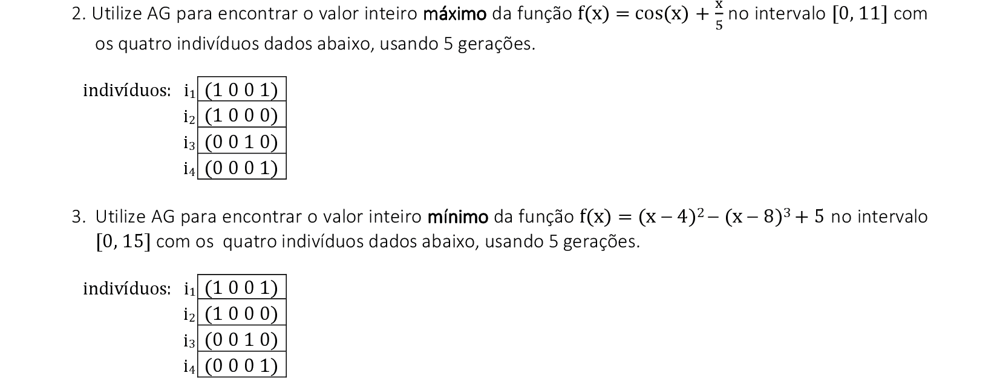
  

&#x1f4c3; Resolução

	
Vamos acompanhar os cálculos deste exercício da aplicação de Algoritmos Genéticos para encontrar soluções para o problema da Mochila, com uma população de 4 indivíduos. Utilizaremos 2 pontos de cruzamento e mutação apenas se um número aleatório for maior do que 0,5.

	  <ul class="slider">
		   <li>
			   <input type="radio" id="323" name="sl">
			   <label for="323"></label>
			   
			   <figcaption>Utilizamos o valor da função objetivo como fitness de cada indivíduo, pois soluções com maiores valores nos fornecem maiores probabilidades <b>pj</b>.</figcaption>
		   </li>
		   <li>
			   <input type="radio" id="324" name="sl">
			   <label for="324"></label>
			   
			   <figcaption>Utilizando o método da roleta, encontramos 4 números aleatórios que definem quais serão os indivíduos que participam dos cruzamentos: para o primeiro par de indivíduos (<b>i4</b> e <b>i3</b>), encontramos dois números aleatórios entre 0 e 6 (1,88 e 4,3), que indicam os pontos de cruzamento entre o segundo e o terceiro bit (1,88) e entre o quinto e o sexto bit (4,3).</figcaption>
		   </li>
		   <li>
			   <input type="radio" id="325" name="sl">
			   <label for="325"></label>
			   
			   <figcaption>Trocamos os materiais genéticos entre os pontos de cruzamento, gerando os novos filhos <b>i1</b> e <b>i2</b>. Para o segundo par de indivíduos (<b>i2</b> e <b>i3</b>), encontramos dois números aleatórios entre 0 e 6 (0,65 e 3,15), que indicam os pontos de cruzamento entre o primeiro e o segundo bit (0,65) e entre o quarto e o quinto bit (3,15).</figcaption>
		   </li>
		   <li>
			   <input type="radio" id="326" name="sl">
			   <label for="326"></label>
			   
			   <figcaption>Trocamos os materiais genéticos entre os pontos de cruzamento, gerando os novos filhos <b>i3</b> e <b>i4</b>. Agora vamos fazer as mutações nestes novos indivíduos.</figcaption>
		   </li>
		   <li>
			   <input type="radio" id="327" name="sl">
			   <label for="327"></label>
			   
			   <figcaption>Podemos sortear um número <b>n1</b> que define quando será feita a mutação. No caso do indivíduo <b>i1</b>, temos <b>n1 &gt; 0,5</b>, e <b>n2 = 3,77</b> nos fornece o ponto de mutação no quarto bit do indivíduo. Logo, a quarta posição de <b>i1</b> torna-se 0.</figcaption>
		   </li>
		   <li>
			   <input type="radio" id="328" name="sl">
			   <label for="328"></label>
			   
			   <figcaption>No caso do indivíduo <b>i4</b>, temos <b>n1 &gt; 0,5</b>, e <b>n2 = 2,8</b> nos fornece o ponto de mutação no terceiro bit do indivíduo. Logo, a terceira posição de <b>i4</b> torna-se 1. Os outros indivíduos não sofrem mutações pois <b>n1 &lt; 0,5</b>. Substituindo a população, temos uma nova iteração.</figcaption>
		   </li>
		   <li>
			   <input type="radio" id="329" name="sl">
			   <label for="329"></label>
			   
			   <figcaption>Encontramos os valores dos fitness dos novos indivíduos e as respectivas probabilidades de escolhas para usarmos na roleta: <b>pj</b>.</figcaption>
		   </li>
		   <li>
			   <input type="radio" id="330" name="sl">
			   <label for="330"></label>
			   
			   <figcaption>Selecionamos os indivíduos por meio de 4 números aleatórios, e criamos os pontos de cruzamentos. Trocamos os materiais genéticos dos indivíduos escolhidos e podemos avançar para a fase de mutações.</figcaption>
		   </li>
		   <li>
			   <input type="radio" id="331" name="sl">
			   <label for="331"></label>
			   
			   <figcaption>Usando o mesmo critério da primeira iteração, temos as mutações nos indivíduos <b>i1</b> e <b>i2</b>. Desta forma, criamos a nova população e podemos concluir a iteração. O processo continua até que um critério de parada seja satisfeito (solução máxima encontrada ou número máximo de iterações).</figcaption>
		   </li>
		</ul>
		
  

  
  
<a href="#parte9" class="topo">voltar ao topo</a>

  

		<iframe width="100%" src="https://www.youtube.com/embed/e-JwBasWVGo" frameborder="0" allow="accelerometer; clipboard-write; encrypted-media; gyroscope; picture-in-picture" allowfullscreen></iframe>
  

  
  

&#x1f4c3; Resolução

	
Vamos acompanhar os cálculos deste exercício da aplicação de Algoritmos Genéticos para encontrar soluções para o problema do Caixeiro Viajante, com uma população de 4 indivíduos. Utilizaremos 2 pontos de cruzamento e mutação apenas se um número aleatório for maior do que 0,5.

	  <ul class="slider">
		   <li>
			   <input type="radio" id="333" name="sl">
			   <label for="333"></label>
			   
			   <figcaption>Como o problema é de minimização, vamos usar como fitness <b>fj = (max{rotak} + 1) - rotaj</b>. Desta forma, soluções com menores valores nos fornecem maiores probabilidades <b>pj</b>.</figcaption>
		   </li>
		   <li>
			   <input type="radio" id="334" name="sl">
			   <label for="334"></label>
			   
			   <figcaption>Utilizando o método da roleta, encontramos 4 números aleatórios que definem quais serão os indivíduos que participam dos cruzamentos: para o primeiro par de indivíduos (<b>i1</b> e <b>i3</b>), encontramos dois números aleatórios entre 0 e 6 (2,13 e 4,81), que indicam os pontos de cruzamento entre o terceiro e o quarto bit (2,13) e entre o quinto e o sexto bit (4,81).</figcaption>
		   </li>
		   <li>
			   <input type="radio" id="335" name="sl">
			   <label for="335"></label>
			   
			   <figcaption>Trocamos os materiais genéticos entre os pontos de cruzamento, gerando os novos filhos <b>i1</b> e <b>i2</b>. Para evitar soluções infactíveis, devemos trocar as cidades repetidas que entraram nas novas rotas: na terceira posição de <b>i1</b>, trocamos a cidade 3 pela cidade 5, e na segunda posição de <b>i2</b>, trocamos a cidade 5 pela cidade 3.</figcaption>
		   </li>
		   <li>
			   <input type="radio" id="335a" name="sl">
			   <label for="335a"></label>
			   
			   <figcaption>Para o segundo par de indivíduos (<b>i2</b> e <b>i1</b>), encontramos dois números aleatórios entre 0 e 6 (3,87 e 1,55), que indicam os pontos de cruzamento entre o segundo e o terceiro bit (1,55) e entre o quarto e o quinto bit (3,87).</figcaption>
		   </li>
		   <li>
			   <input type="radio" id="336" name="sl">
			   <label for="336"></label>
			   
			   <figcaption>Trocamos os materiais genéticos entre os pontos de cruzamento, gerando os novos filhos <b>i3</b> e <b>i4</b>. Para evitar soluções infactíveis, devemos trocar as cidades repetidas que entraram nas novas rotas: na segunda posição de <b>i3</b>, trocamos a cidade 4 pela cidade 1 e na quinta posição trocamos a cidade 3 pela cidade 6; na primeira posição de <b>i4</b>, trocamos a cidade 1 pela cidade 4 e na sexta posição trocamos a cidade 6 pela cidade 3.</figcaption>
		   </li>
		   <li>
			   <input type="radio" id="337" name="sl">
			   <label for="337"></label>
			   
			   <figcaption>Podemos sortear um número <b>n1</b> que define quando será feita a mutação. No caso do indivíduo <b>i4</b>, temos <b>n1 &gt; 0,5</b>, <b>n2 = 3,2</b> (quarta posição) e <b>n3 = 0,71</b> (primeira posição). Logo, podemos trocar as cidades da primeira com a quarta posição do indivíduo. Substituímos a população e podemos começar a 2&ordf; iteração. </figcaption>
		   </li>
		   <li>
			   <input type="radio" id="339" name="sl">
			   <label for="339"></label>
			   
			   <figcaption>Encontramos os valores dos fitness dos novos indivíduos e as respectivas probabilidades de escolhas para usarmos na roleta: <b>pj</b>.</figcaption>
		   </li>
		   <li>
			   <input type="radio" id="340" name="sl">
			   <label for="340"></label>
			   
			   <figcaption>Selecionamos os indivíduos por meio de 4 números aleatórios, e criamos os pontos de cruzamentos. Trocamos os materiais genéticos dos indivíduos escolhidos, fazendo as trocas de cidades repetidas, e podemos avançar para a fase de mutações.</figcaption>
		   </li>
		   <li>
			   <input type="radio" id="341" name="sl">
			   <label for="341"></label>
			   
			   <figcaption>Usando o mesmo critério da primeira iteração, temos as mutações nos indivíduos <b>i1</b> e <b>i2</b>. Desta forma, criamos a nova população e podemos concluir a iteração. O processo continua até que um critério de parada seja satisfeito (solução máxima encontrada ou número máximo de iterações).</figcaption>
		   </li>
		</ul>
		
  

  
<a href="#parte9" class="topo">voltar ao topo</a>

  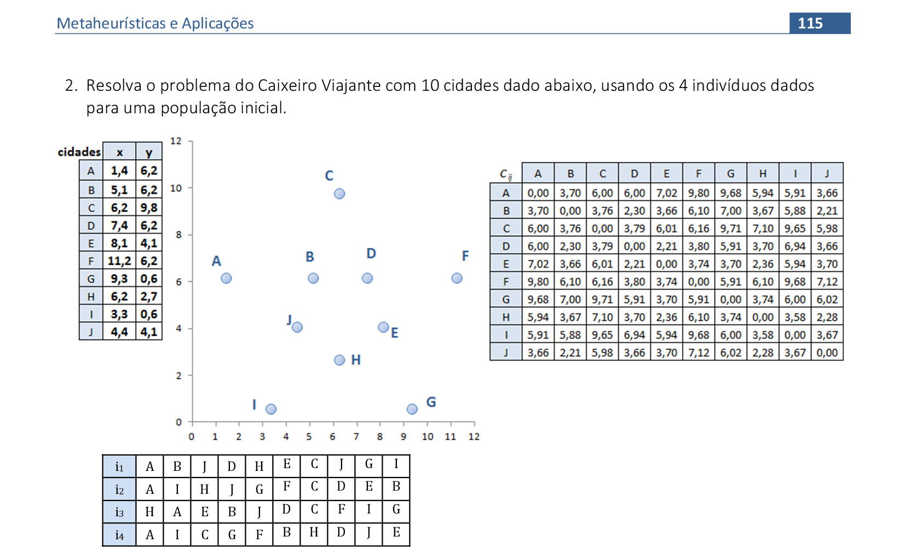
  
&#x1f4d1; Atividade 8.1

  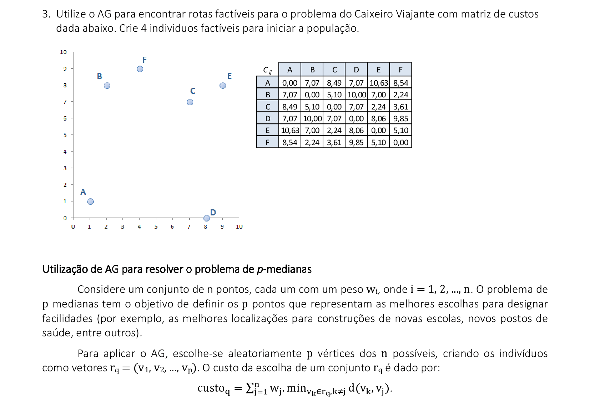
  
<a href="#parte9" class="topo">voltar ao topo</a>

  
  

&#x1f4c3; Resolução

	
Vamos acompanhar os cálculos deste exercício da aplicação de Algoritmos Genéticos para encontrar soluções para o problema das p-medianas, com uma população de 5 indivíduos. Utilizaremos 1 ponto de cruzamento e mutação apenas se um número aleatório for maior do que 0,5.

	  <ul class="slider">
		   <li>
			   <input type="radio" id="343" name="sl">
			   <label for="343"></label>
			   
			   <figcaption>Como o problema é de minimização, vamos usar como fitness <b>fj = (max{custok} + 1) - custoj</b>. Desta forma, soluções com menores valores nos fornecem maiores probabilidades <b>pj</b>.</figcaption>
		   </li>
		   <li>
			   <input type="radio" id="344" name="sl">
			   <label for="344"></label>
			   
			   <figcaption>Utilizando o método da roleta, encontramos 4 números aleatórios que definem quais serão os indivíduos que participam dos cruzamentos. O primeiro par de indivíduos (<b>r1</b> e <b>r5</b>) tem as medianas 2 e 4 pertencentes apenas à solução <b>r5</b>, e as medianas 1 e 5 pertencentes apenas à solução <b>r1</b>.</figcaption>
		   </li>
		   <li>
			   <input type="radio" id="345" name="sl">
			   <label for="345"></label>
			   
			   <figcaption>Podemos gerar um número aleatório entre 0 e 2 que define quais serão as medianas que devem ser trocadas: 0,54 indica que trocaremos as medianas 2 e 1 entre os indivíduos <b>r1</b> e <b>r5</b>, gerando os filhos <b>r2</b> e <b>r3</b>.</figcaption>
		   </li>
		   <li>
			   <input type="radio" id="345a" name="sl">
			   <label for="345a"></label>
			   
			   <figcaption>O segundo par de indivíduos (<b>r4</b> e <b>r3</b>) tem as medianas 2 e 3 pertencentes apenas à solução <b>r4</b>, e as medianas 1 e 4 pertencentes apenas à solução <b>r3</b>.</figcaption>
		   </li>
		   <li>
			   <input type="radio" id="346" name="sl">
			   <label for="346"></label>
			   
			   <figcaption>Podemos gerar um número aleatório entre 0 e 2 que define quais serão as medianas que devem ser trocadas: 1,3 indica que trocaremos as medianas 3 e 4 entre os indivíduos <b>r4</b> e <b>r3</b>, gerando os filhos <b>r4</b> e <b>r5</b>.</figcaption>
		   </li>
		   <li>
			   <input type="radio" id="347" name="sl">
			   <label for="347"></label>
			   
			   <figcaption>Podemos sortear um número <b>n1</b> que define quando será feita a mutação. No caso do indivíduo <b>r2</b>, temos <b>n1 &gt; 0,5</b>, <b>n2 = 0,21</b> (primeira posição) e <b>n3 = 3,2</b> (mediana 4). Logo, o indivíduo  <b>r2</b> tem a primeira mediana trocada por 4.</figcaption>
		   </li>
		   <li>
			   <input type="radio" id="349" name="sl">
			   <label for="349"></label>
			   
			   <figcaption>No caso do indivíduo <b>r3</b>, temos <b>n1 &gt; 0,5</b>, <b>n2 = 1,3</b> (segunda posição) e <b>n3 = 1,61</b> (mediana 2). Logo, o indivíduo <b>r3</b> tem a segunda mediana trocada por 2. Podemos manter o melhor indivíduo e substituir os outros 4 da população para começar a próxima iteração.</figcaption>
		   </li>
		   <li>
			   <input type="radio" id="348" name="sl">
			   <label for="348"></label>
			   
			   <figcaption>Encontramos os valores dos fitness dos novos indivíduos e as respectivas probabilidades de escolhas para usarmos na roleta: <b>pj</b>.</figcaption>
		   </li>
		   <li>
			   <input type="radio" id="350" name="sl">
			   <label for="350"></label>
			   
			   <figcaption>Selecionamos os indivíduos por meio de 4 números aleatórios, e criamos os pontos de cruzamentos. Trocamos os materiais genéticos dos indivíduos escolhidos, fazendo as trocas de medianas e depois as mutações nos novos indivíduos.  O processo continua até que um critério de parada seja satisfeito (solução máxima encontrada ou número máximo de iterações).</figcaption>
		   </li>
		</ul>
		
  

  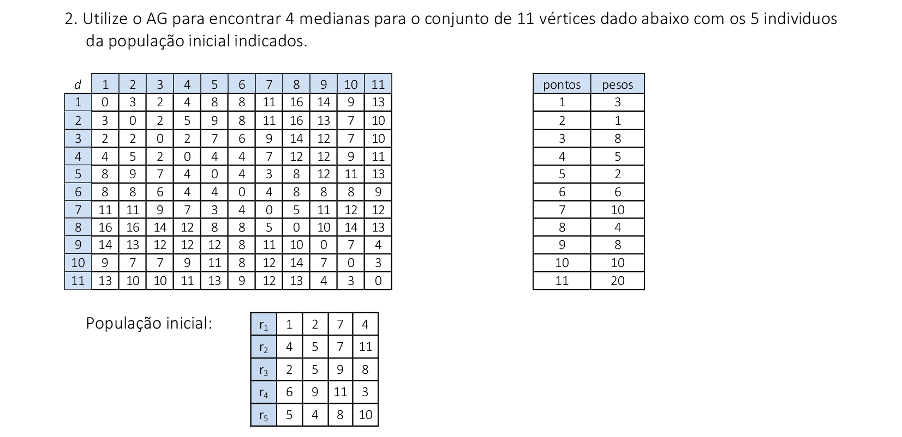
  
<a href="#parte9" class="topo">voltar ao topo</a>

  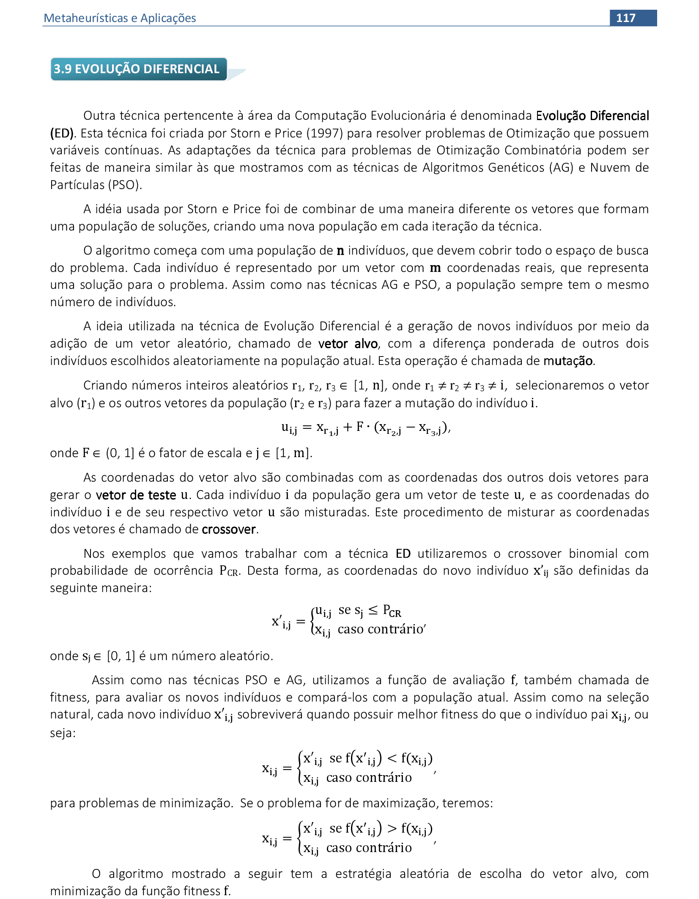
  
<a href="#parte9" class="topo">voltar ao topo</a>

  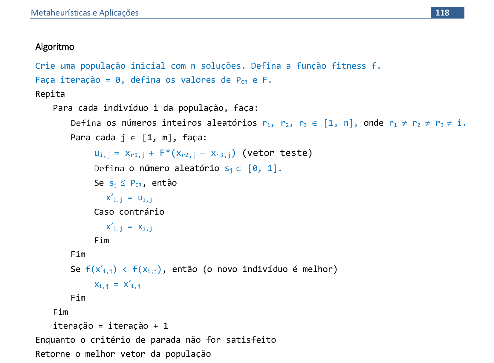
  

&#x1f4c3; Algoritmo comentado

   <figcaption>Evolução Diferencial:
<pre><code><a alt="A população com n indivíduos deve cobrir o espaço de busca">Crie uma população inicial com n soluções. Defina a função fitness f.</a> 
<a alt="Defina os parâmetros da técnica">Faça iteração = 0, defina os valores de PCR e F.</a>
Repita
   Para cada indivíduo i da população, faça:
      <a alt="Mutação: defina os índices do vetor alvo e dos vetores aleatórios">Crie os números inteiros aleatórios r1, r2, r3 &isin; [1, n], onde r1 &ne; r2 &ne; r3 &ne; i.</a>
     <a alt="Componentes do vetor de teste u">Para cada j &isin; [1, m], faça:</a>
         ui,j = xr1,j + F*(xr2,j - xr3,j) (vetor teste)
		 Crie o número aleatório sj &isin; [0, 1].
         <a alt="Crossover: mistura de coordenadas de x e u">Se sj &le; PCR, então</a> 
            x'i,j = ui,j
         Caso contrário
            x'i,j = xi,j
         Fim
      Fim
      <a alt="O novo indivíduo substitui o indivíduo i se tiver melhor fitness">Se f(x'i,j) &lt; f(xi,j), então</a> 
         xi,j = x'i,j
      Fim
   Fim
   iteração = iteração + 1  
<a alt="critérios de parada: número máximo de iterações, estagnação, valor mínimo encontrado">Enquanto o critério de parada não for satisfeito</a>
Retorne o melhor vetor da população
</code></pre></figcaption>
   

  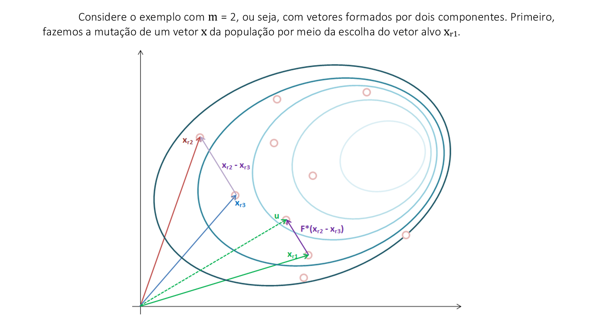
  
<a href="#parte9" class="topo">voltar ao topo</a>

  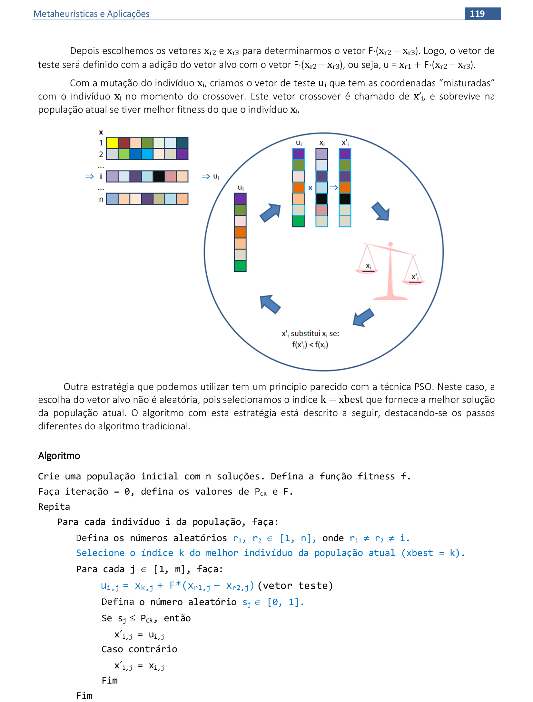
  
<a href="#parte9" class="topo">voltar ao topo</a>

  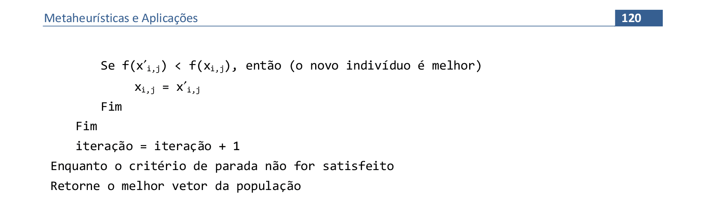
  

&#x1f4c3; Algoritmo comentado

   <figcaption>Evolução Diferencial:
<pre><code><a alt="A população com n indivíduos deve cobrir o espaço de busca">Crie uma população inicial com n soluções. Defina a função fitness f.</a> 
<a alt="Defina os parâmetros da técnica">Faça iteração = 0, defina os valores de PCR e F.</a>
Repita
   Para cada indivíduo i da população, faça:
      <a alt="Mutação: defina os índices dos vetores aleatórios">Crie os números inteiros aleatórios r1, r2 &isin; [1, n], onde r1 &ne; r2 &ne; i.</a>
      <a alt="O vetor alvo tem a melhor solução da população atual">Selecione o índice k do melhor indivíduo da população atual (xbest = k).</a>
      <a alt="Componentes do vetor de teste u">Para cada j &isin; [1, m], faça:</a>
         ui,j = xk,j + F*(xr1,j - xr2,j) (vetor teste)
         Crie o número aleatório sj &isin; [0, 1].
         <a alt="Crossover: mistura de coordenadas de x e u">Se sj &le; PCR, então</a> 
            x'i,j = ui,j
         Caso contrário
            x'i,j = xi,j
         Fim 
      Fim
      <a alt="O novo indivíduo substitui o indivíduo i quanto tem melhor fitness">Se f(x'i,j) &lt; f(xi,j), então</a> 
        xi,j = x'i,j
      Fim
   Fim
   iteração = iteração + 1  
<a alt="critérios de parada: número máximo de iterações, estagnação, valor mínimo encontrado">Enquanto o critério de parada não for satisfeito</a>
Retorne o melhor vetor da população
</code></pre></figcaption>
   

   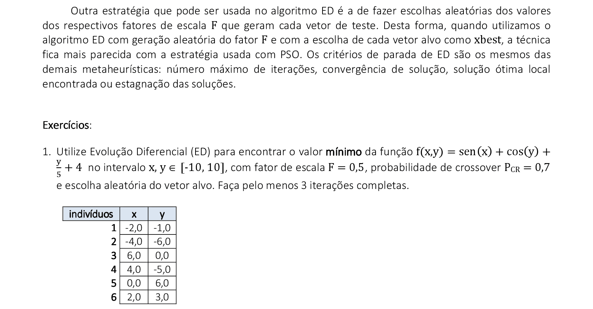
   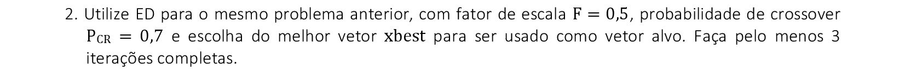
   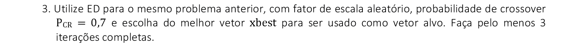
  
<a href="#parte9" class="topo">voltar ao topo</a>

  
  
<a href="#parte9" class="topo">voltar ao topo</a>

  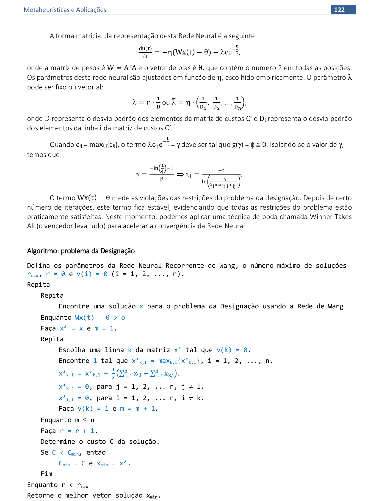
  
<a href="#parte9" class="topo">voltar ao topo</a>

  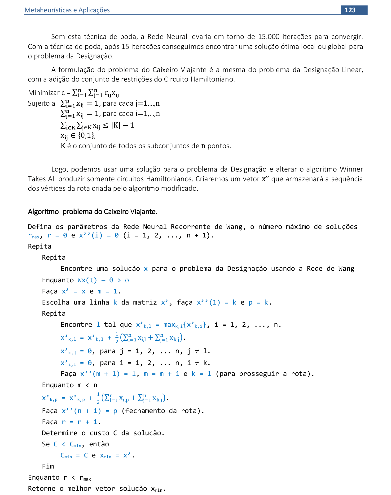
  
<a href="#parte9" class="topo">voltar ao topo</a>

<h4>página desenvolvida por:</h4> 

Paulo Henrique Siqueira
  

<b>contato:</b> paulohscwb@gmail.com 

<h4>O desenvolvimento deste material faz parte do Grupo de Estudos em Expressão Gráfica (GEEGRAF) da Universidade Federal do Paraná (UFPR)</h4>  

 Metaheurísticas e Aplicações de <a xmlns:cc="http://creativecommons.org/ns#" href="https://paulohscwb.github.io/metaheuristicas/" property="cc:attributionName" rel="cc:attributionURL">Paulo Henrique Siqueira</a> está licenciado com uma Licença <a rel="license" href="http://creativecommons.org/licenses/by-nc-nd/4.0/">Creative Commons Atribuição-NãoComercial-SemDerivações 4.0 Internacional</a>.

<h4>Como citar este trabalho:</h4> 

Siqueira, P.H., "Metaheurísticas e Aplicações". Disponível em: <https://paulohscwb.github.io/metaheuristicas/>, Janeiro de 2021.

<h4>Referências:</h4>
<ol>
	<li>FAUSETT, L. Fundamentals of Neural Networks. Prentice Hall, 1994.</li>
	<li>HAYKIN, S. Neural Networks – A Compreensive Foundation. Macmillan College Publishing, 1994.</li>
	<li>KOHONEN, T. Self-Organizing Maps. Springer, 1995.</li>
	<li>SILVA, I.N.; SPATTI, D.H.; FLAUZINO, R.A. Redes Neurais Artificiais para engenharia e ciências aplicadas. Artliber, 2010.</li>
	<li>TAFNER, M.A.; XEREZ, M.; RODRÍGUEZ FILHO, I.W. Redes Neurais Artificiais: introdução e princípios da neurocomputação. FURB, 1996.</li>
	<li>BOÇOIS, A., OLIVEIRA, A. A., SIQUEIRA, P. H., TELLES, F. Q. Diagnóstico de Doenças Dermatológicas usando a Rede Neural de Kohonen. In: IX Encontro Nacional de Inteligência Artificial (ENIA 2012), 2012, Curitiba. Proceedings Brazilian Conference on Intelligent Systems, v. 1. p. 1-8, 2012.</li>
	<li>SIQUEIRA, P. H., SCHEER, S., STEINER, M. T. A. Application of the Winner Takes All Principle in Wang’s Recurrent Neural Network for the Assignment problem. Lecture Notes in Computer Science, Berlin, v. 3496, n. 1, p. 731-738, 2005.</li>
	<li>SIQUEIRA, P. H., SCHEER, S., STEINER, M. T. A. A new approach to solve the Traveling Salesman Problem. Neurocomputing (Amsterdam), v. 70, p. 1013-1021, 2007.</li>
	<li>SIQUEIRA, P. H., STEINER, M. T. A., SCHEER, S. Recurrent Neural Network with Soft 'Winner Takes All' principle for the TSP. In: ICNC 2010 - International Conference on Neural Computation, 2010, Valencia. Proceedings of the International Conference on Fuzzy Computation and International Conference on Neural Computation, v. 1. p. 265-270, 2010. </li>
	<li>ROSA, C. R. M. ; STEINER, M. T. A. ; STEINER NETO, P. J. Técnicas de Mineração de Dados aplicadas a um Problema de Diagnóstico Médico. Espacios (Caracas), v. 37, p. 1, 2016.</li>
	<li>TEIXEIRA, L. L., TEIXEIRA JUNIOR, L. A., SIQUEIRA, P. H. Previsões de vazões mensais via combinação híbrida ARIMA_NEURAL com encolhimento e decomposição Wavelet. REVISTA DE ENGENHARIA E TECNOLOGIA, v. 7, p. 144-161, 2015.</li>
	<li>DEMUTH, H., BEALE, M. Neural Network Toolbox User's Guide (For Use with MATLAB), The MathWorks, Inc., MA, USA, 1994.</li>
	<li>SOUTO, M. Multi-layer Perceptrons e Backpropagation. DIMAp/UFRN, 2020. Disponível em: <https://slideplayer.com.br/slide/3258057/></li>
	<li>BENEDIKTSSON, J. A., SWAIN, P. H., ERSOY, O. K. Neural network approaches versus statistical methods in classification of multisource remote sensing data. In: 12th Canadian Symposium on Remote Sensing Geoscience and Remote Sensing Symposium, IEEE, 1989. p. 489-492.</li>
	<li>HEPNER, G., LOGAN, T., RITTER, N., BRYANT, N. Artificial neural network classification using a minimal training set- Comparison to conventional supervised classification. Photogrammetric Engineering and Remote Sensing, v. 56, n. 4, p. 469-473, 1990.</li>
	<li>GORNI, A. A.  Redes  neurais  artificiais  -  uma  abordagem  revolucionária  em  inteligência  artificial. São Paulo, Micro Sistemas, 1993.</li>
	<li>KRÖSE, B., KRÖSE, B., SMAGT, P. An introduction to neural networks, 1993.</li>
	<li>BOSER, B. E., GUYON, I. M., VAPNIK, V. N. A training algorithm for optimal margin classifiers. In: Proceedings of the fifth annual workshop on Computational learning theory, p. 144-152, 1992.</li>
	<li>GAHEGAN, M., WEST, G. The classification of complex geographic datasets: An operational comparison of artificial neural network and decision tree classifiers. In: Third International Conference on GeoComputation, p. 17-19, 1998.</li>
	<li>CORTES, C., VAPNIK, V. Support-vector networks. Machine learning, v. 20, n.3, p. 273-297, 1995.</li>
	<li>POWELL, M. J. D. Radial basis functions for multivariate interpolation: a review. In: J.C. Mason, M.G. Cox (Eds.), Algorithms for Approximation, Clarendon Press, Oxford, 1987</li>
	<li>VIEIRA, F. C., DÓRIA NETO, A. D., COSTA, J. A. F. An Efficient Approach to the Travelling Salesman Problem Using Self-Organizing Maps. International Journal of Neural Systems, London, UK, v. 13, n.2, p. 59-66, 2003</li>
	<li>Le COADOU, BENABDESLEM, K. Optimizing local modeling for times series prediction. International Journal of Computational Intelligence Research, v. 2, n. 1, p. 81-85, 2006.</li>
	<li>DORIGO, M.; GARAMBARDELLA, L.M., Ant Colonies for the Traveling Salesman Problem. Biosystems, v. 43, n. 2, p. 73-81, 1997.</li>
	<li>ENGELBRECHT, A. P., Computational Intelligence, John Wiley & Sons, 2007.</li>
	<li>EBERHART, R. C., SHI, Y., Comparison between genetic algorithms and particle swarm optimization, Evolutionary Programming VII: Lecture Notes in Computer Science, vol 1447, p. 611-616, 1998</li>
	<li>LIN, S., KERNIGHAN, B. W. An effective heuristic algorithm for the traveling-salesman problem, Operations research, v. 21, n. 2, p. 498-516, 1973.</li>
	<li>HU, X. PSO Tutorial. Disponível em: http://www.swarmintelligence.org/tutorials.php</li>
	<li>GLOVER, F. Multilevel tabu search and embedded search neighborhoods for the traveling salesman problem. Graduate School of Business, University of Colorado, 1991.</li>
	<li>LOPES, H. S. Algoritmos genéticos em projetos de engenharia: aplicações e perspectivas futuras. Anais do IV Simpósio Brasileiro de Automação Inteligente, p. 64-74, 1999.</li>
	<li>MICHALEWICZ, Z., SCHOENAUER, M. Evolutionary algorithms for constrained parameter optimization problems. Evolutionary computation, v. 4, n. 1, p. 1-32, 1999.</li>
	<li>VAN LAARHOVEN, P. J., AARTS, E. H. Simulated annealing. In Simulated annealing: Theory and applications p. 7-15. Springer, Dordrecht, 1987.</li>
	<li>MITRA, D., ROMEO, F., SANGIOVANNI-VINCENTELLI, A. Convergence and finite-time behavior of simulated annealing. Advances in applied probability, v. 18, n. 3, p. 747-771, 1986.</li>
	<li>KIRKPATRICK, S., GELATT, C. D., VECCHI, M. P. Optimization by simulated annealing. science, v. 220, n. 4598, p. 671-680, 1983.</li>
	<li>ARAGON, C. R., JOHNSON, D. S., McGEOCH, L. A., SCHEVON, C. Optimization by simulated annealing: an experimental evaluation. In: Workshop on Statistical Physics in Engineering and Biology. Yorktown Heights, 1984.</li>
	<li>BOZORG-HADDAD, O., SOLGI, M., LOÁICIGA, H. A. Meta-heuristic and evolutionary algorithms for engineering optimization. Hoboken, John Wiley & Sons, 2017.</li>
	<li>STORN, R., PRICE, K. Differential Evolution - a Simple and Efficient Heuristic for Global Optimization over Continuous Spaces, Journal of Global Optimization, v. 11, p. 341–359, 1997.</li>
	<li>TALBI, E. G. Metaheuristics: from design to implementation (Vol. 74). John Wiley & Sons, 2009.</li>
<ol>