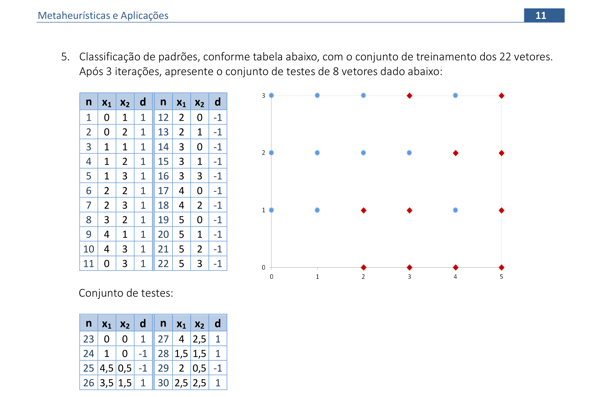
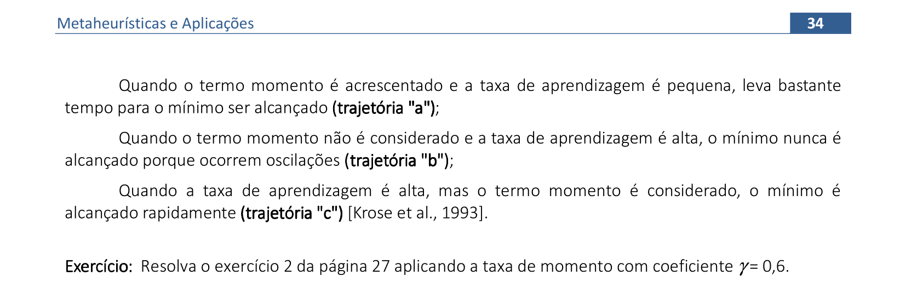

<link rel="stylesheet" href="imagens/style.css">

<h2 id="inicio">Algoritmos, exemplos e aplicações</h2>

Esta página contém os algoritmos e exemplos de algumas Metaheurísticas. Além disso, são mostradas as aplicações destas técnicas em várias áreas da Pesquisa Operacional.

A apostila está disponível no link: <a href="#" target="_blank">apostila de Metaheurísticas</a>

<h3>Redes Neurais Artificiais</h3>

  
Perceptron e Adaline

  
Material da página 1 até a página 19.

   
   
<a href="#parte1" class="topo">voltar ao topo</a>

   
   
<a href="#parte1" class="topo">voltar ao topo</a>

   
   
<a href="#parte1" class="topo">voltar ao topo</a>

   
   
<a href="#parte1" class="topo">voltar ao topo</a>

   
   
<a href="#parte1" class="topo">voltar ao topo</a>

   
   
<a href="#parte1" class="topo">voltar ao topo</a>

   
   
<a href="#parte1" class="topo">voltar ao topo</a>

   
   
<a href="#parte1" class="topo">voltar ao topo</a>

   
   

&#x1f4c3; Algoritmo comentado

   <figcaption>Algoritmo da Rede Neural Perceptron:
<pre><code>0. Inicializar os pesos, o bias e a taxa de aprendizado: <a alt="vetor de pesos">w = 0</a>, <a alt="bias">&theta; = 0</a>, <a alt="taxa de aprendizagem">&alpha; = 1</a> 
	1. Enquanto o <a alt="critérios de parada mais usados:&#10;número máximo de iterações, erro mínimo alcançado,&#10;ou número máximo de iterações sem modificações nos pesos">critério de parada</a> não for satisfeito, execute os passos 2-6:
		2. <a alt="cada par de treinamento deve ser apresentado à rede">Para cada par de dados de treinamento (x,d)</a>, execute os passos 3-5:
		3. <a alt="calculamos o valor da variável y* sem a função de ativação">Calcule y* = &theta; + &sum;ixiwi</a> 
		4. <a alt="Neste passo, calculamos a função de ativação em y*">Se y* &gt; &delta;, então y = 1</a> 
		   Se -&delta; ≤ y* ≤ &delta;, então y = 0
		   Se y* &lt; -&delta;, então y = -1 
		5. <a alt="A atualização dos pesos só é feita quando a rede erra a classificação">Atualize os pesos e a tendência:</a>
		   Se y ≠ d, faça
		     wiatual = wianterior + &alpha;dxi e &theta;atual = &theta;anterior + &alpha;d 
		   Caso contrário
		     wiatual = wianterior e &theta;atual = &theta;anterior
6. <a alt="Neste passo, podemos calcular o erro quantitativo da rede">Teste a condição de parada.</a>

</code></pre></figcaption>
   

   
   
<a href="#parte1" class="topo">voltar ao topo</a>

   
   

&#x1f4c3; Resolução: 1&ordf; e 2&ordf; iterações

	
Vamos acompanhar os cálculos e as interpretações geométricas das 2 primeiras iterações deste exercício da Rede Neural Perceptron.

	  <ul class="slider">
		  <li>
			   <input type="radio" id="001" name="sl" checked>
			   <label for="001"></label>
			   
			   <figcaption>Apresentação do primeiro padrão para a rede (x1, x2) = (1, 1). Como y = &theta; + x1w1 + x2w2 = 0 + 1.0 + 1.0 = 0 &ne; d = 1, então os pesos são atualizados (passo 5 do algoritmo).</figcaption>
		   </li>
		   <li>
			   <input type="radio" id="002" name="sl">
			   <label for="002"></label>
			   
			   <figcaption>Os coeficientes de w1, w2 e &theta; definem as equações das retas usadas para a classificação. O parâmetro &delta; cria uma região de indefinição para a classificação.</figcaption>
		   </li>
		   <li>
			   <input type="radio" id="003" name="sl">
			   <label for="003"></label>
			   
			   <figcaption>Apresentação do segundo padrão para a rede (1, 0). Como y = &theta; + x1w1 + x2w2 = 1 + 1.1 + 0.1 = 2 &ne; d = -1, então os pesos são atualizados.</figcaption>
		   </li>
		   <li>
			   <input type="radio" id="004" name="sl">
			   <label for="004"></label>
			   
			   <figcaption>Note que as equações definidas com os coeficientes de w1, w2 e &theta; ainda não classificam corretamente todos dos padrões.</figcaption>
		   </li>
		   <li>
			   <input type="radio" id="005" name="sl">
			   <label for="005"></label>
			   
			   <figcaption>Apresentação do terceiro padrão para a rede (0, 1). Como y &ne; d, então os pesos são atualizados. Como os coeficientes das variáveis x1 e x2 ficaram nulos, não temos a interpretação geométrica nesta apresentação de padrões.</figcaption>
		   </li>
		   <li>
			   <input type="radio" id="006" name="sl">
			   <label for="006"></label>
			   
			   <figcaption>Apresentação do último padrão para a rede (0, 0). Como y = d, então os pesos são mantidos. Usando esta combinação de pesos, podemos calcular o erro da primeira iteração.</figcaption>
		   </li>
		   <li>
			   <input type="radio" id="006a" name="sl">
			   <label for="006a"></label>
			   
			   <figcaption>Usamos a combinação de pesos (w1 = 0, w2 = 0, &theta; = -1) da última apresentação de padrões para calcular o erro. Apenas o primeiro padrão está classificado incorretamente: logo, o erro quantitativo nesta primeira iteração é de 25%.</figcaption>
		   </li>
		   <li>
			   <input type="radio" id="007" name="sl">
			   <label for="007"></label>
			   
			   <figcaption>Recomeçamos a apresentação de cada padrão para a rede na próxima iteração. O primeiro padrão (1, 1) é apresentado à rede, com a combinação de parâmetros (0, 0, 1). Como y &ne; d, então os pesos são atualizados.</figcaption>
		   </li>
		   <li>
			   <input type="radio" id="008" name="sl">
			   <label for="008"></label>
			   
			   <figcaption>Note que as equações definidas com os coeficientes de w1, w2 e &theta; ainda não classificam corretamente todos dos padrões.</figcaption>
		   </li>
		   <li>
			   <input type="radio" id="009" name="sl">
			   <label for="009"></label>
			   
			   <figcaption>Apresentação do segundo padrão para a rede (1, 0). Como y &ne; d, então os pesos são atualizados.</figcaption>
		   </li>
		   <li>
			   <input type="radio" id="010" name="sl">
			   <label for="010"></label>
			   
			   <figcaption>Note que as equações definidas com os coeficientes de w1, w2 e &theta; ainda não classificam corretamente todos dos padrões.</figcaption>
		   </li>
		   <li>
			   <input type="radio" id="011" name="sl">
			   <label for="011"></label>
			   
			   <figcaption>Apresentação do terceiro padrão para a rede (0, 1). Como y &ne; d, então os pesos são atualizados.</figcaption>
		   </li>
		   <li>
			   <input type="radio" id="012" name="sl">
			   <label for="012"></label>
			   
			   <figcaption>Apresentação do último padrão para a rede (0, 0). Como y = d, então os pesos são mantidos. Usando esta combinação de pesos, podemos calcular o erro da segunda iteração.</figcaption>
		   </li>
		   <li>
			   <input type="radio" id="012a" name="sl">
			   <label for="012a"></label>
			   
			   <figcaption>Usamos a combinação de pesos (w1 = 0, w2 = 0, &theta; = -2) da última apresentação de padrões para calcular o erro. Apenas o primeiro padrão está classificado incorretamente: logo, o erro quantitativo da segunda iteração é de 25%.</figcaption>
		   </li>
		</ul>
		
  

  

&#x1f4c3; Resolução: 3&ordf; ~ 9&ordf; iterações

	
Vamos acompanhar os resultados e as interpretações geométricas das 7 próximas iterações deste exercício da Rede Neural Perceptron.

	  <ul class="slider">
		  <li>
			   <input type="radio" id="013" name="sl">
			   <label for="013"></label>
			   
			   <figcaption>Recomeçamos a apresentação de cada padrão para a rede na próxima iteração. O primeiro padrão (1, 1) é apresentado à rede, com a combinação de parâmetros (0, 0, -2). Como y &ne; d, então os pesos são atualizados.</figcaption>
		   </li>
		   <li>
			   <input type="radio" id="014" name="sl">
			   <label for="014"></label>
			   
			   <figcaption>Os coeficientes de w1, w2 e &theta;  definem as equações das retas usadas para a classificação. Note que temos 2 padrões classificados corretamente e os outros 2 na região de indefinição.</figcaption>
		   </li>
		   <li>
			   <input type="radio" id="015" name="sl">
			   <label for="015"></label>
			   
			   <figcaption>Fazendo os cálculos da mesma forma mostrada nas duas primeiras iterações, temos as classificações da quarta e da quinta iteração. Nestes casos, 3 padrões estão classificados corretamente.</figcaption>
		   </li>
		   <li>
			   <input type="radio" id="016" name="sl">
			   <label for="016"></label>
			   
			   <figcaption>Fazendo os cálculos da mesma forma mostrada nas duas primeiras iterações, temos as classificações da sexta e da sétima iteração. Nestes casos, 3 padrões estão classificados corretamente.</figcaption>
		   </li>
		   <li>
			   <input type="radio" id="017" name="sl">
			   <label for="017"></label>
			   
			   <figcaption>Fazendo os cálculos da mesma forma mostrada nas duas primeiras iterações, temos as classificações da oitava e da nona iteração. Os padrões ficam separados corretamente com a combinação de pesos da nona iteração.</figcaption>
		   </li>
		   <li>
			   <input type="radio" id="018" name="sl">
			   <label for="018"></label>
			   
			   <figcaption>Usamos a combinação de pesos (w1 = 2, w2 = 3, &theta; = -4) da última apresentação de padrões para calcular o erro. Todos os padrões estão classificados corretamente. Logo, podemos finalizar o processo de aprendizagem desta Rede Neural.</figcaption>
		   </li>
		</ul>
		
  

  
  

&#x1f4c3; Resolução

	
Vamos acompanhar os resultados e as interpretações geométricas deste exercício da Rede Neural Perceptron. Vamos usar entradas e saídas bipolares.

	  <ul class="slider">
		  <li>
			   <input type="radio" id="019" name="sl">
			   <label for="019"></label>
			   
			   <figcaption>O primeiro padrão (1, 1) é apresentado à rede. Como y &ne; d, então os pesos são atualizados.</figcaption>
		   </li>
		   <li>
			   <input type="radio" id="020" name="sl">
			   <label for="020"></label>
			   
			   <figcaption>Usando os coeficientes de w1, w2 e &theta; que definem as equações das retas usadas para a classificação, temos apenas 1 padrão classificado corretamente.</figcaption>
		   </li>
		   <li>
			   <input type="radio" id="021" name="sl">
			   <label for="021"></label>
			   
			   <figcaption>O segundo padrão (1, -1) é apresentado à rede. Como y &ne; d, então os pesos são atualizados.</figcaption>
		   </li>
		   <li>
			   <input type="radio" id="022" name="sl">
			   <label for="022"></label>
			   
			   <figcaption>Usando os coeficientes de w1, w2 e &theta; que definem as equações das retas usadas para a classificação, temos 2 padrões classificados corretamente.</figcaption>
		   </li>
		   <li>
			   <input type="radio" id="023" name="sl">
			   <label for="023"></label>
			   
			   <figcaption>O terceiro padrão (-1, 1) é apresentado à rede. Como y &ne; d, então os pesos são atualizados. Na apresentação do último padrão, temos que y = d e os valores dos pesos são mantidos.</figcaption>
		   </li>
		   <li>
			   <input type="radio" id="024" name="sl">
			   <label for="024"></label>
			   
			   <figcaption>Usamos a combinação de pesos (w1 = 1, w2 = 1, &theta; = -1) da última apresentação de padrões para calcular o erro. Todos os padrões estão classificados corretamente. Logo, podemos finalizar o processo de aprendizagem desta Rede Neural.</figcaption>
		   </li>
		</ul>
		
  

  
   
<a href="#parte1" class="topo">voltar ao topo</a>

  
   
<a href="#parte1" class="topo">voltar ao topo</a>

  
  

&#x1f4c3; Algoritmo comentado

   <figcaption>Algoritmo da Rede Neural Perceptron com bolso:
<pre><code>0. Inicializar os pesos, o bias e a taxa de aprendizado: w = 0, <a alt="vetor de pesos do bolso">wbolso = 0</a>, &theta; = 0, &alpha; = 1 
	1. Enquanto o critério de parada</a> não for satisfeito, execute os passos 2-7:
		2. Para cada par de dados de treinamento (x,d), execute os passos 3-5:
		3. Calcule y* = &theta; + &sum;ixiwi
		4. Se y* &gt; &delta;, então y = 1
		   Se -&delta; ≤ y* ≤ &delta;, então y = 0
		   Se y* &lt; -&delta;, então y = -1 
		5. Atualize os pesos e a tendência:
		   Se y ≠ d, faça
		     wiatual = wianterior + &alpha;dxi e &theta;atual = &theta;anterior + &alpha;d 
		   Caso contrário
		     wiatual = wianterior e &theta;atual = &theta;anterior
		6. <a alt="guardamos no bolso a melhor combinação de pesos&#10;esta tática é muito usada nas Metaheurísticas para não perder bons pesos">Se w classifica corretamente mais exemplos do que wbolso:</a>  
		     wbolso = w; grave o número de exemplos corretos 
6. Teste a condição de parada.
</code></pre></figcaption>
   

   
   <figcaption>Para separar os dados em mais classes, podemos inserir mais neurônios na Rede Neural</figcaption>
   
<a href="#parte1" class="topo">voltar ao topo</a>

   
  
<a href="#parte1" class="topo">voltar ao topo</a>

  
   
<a href="#parte1" class="topo">voltar ao topo</a>

  
   
<a href="#parte1" class="topo">voltar ao topo</a>

  
  <figcaption>Vamos utilizar a Regra Delta para deduzir as formas de atualizações dos pesos em algumas Redes Neurais. O princípio é sempre de buscar a minimização do erro de classificação de cada Rede Neural Artificial.</figcaption>
   
<a href="#parte1" class="topo">voltar ao topo</a>

  
   
<a href="#parte1" class="topo">voltar ao topo</a>

  
  

&#x1f4c3; Algoritmo comentado

   <figcaption>Algoritmo da Rede Neural Adaline:
<pre><code>0. Inicializar os pesos <a alt="pesos com valores aleatórios">(w = rnd)</a>, a tendência <a alt="bias nulo">(&theta; = 0)</a>
e a taxa de aprendizagem <a alt="taxa de aprendizagem com valor entre 0 e 1">0 &lt; &alpha; &lt; 1</a> (convergência fica muito lenta quando a taxa é muito 
próxima de zero; e a convergência não é garantida para valores muito próximos de 1).
	1. Enquanto o critério de parada não for satisfeito, execute os passos 2-5:
		2. Para cada par de dados para treinamento (x,d), execute os passos 3-4:
			3. Faça <a alt="primeiro calculamos o valor de y*">y* = &theta; + &sum;ixiwi</a> 
			4. <a alt="os pesos e o bias são sempre atualizados">Atualize os pesos e a tendência:</a>
			    wiatual = wianterior + &alpha;(d – y*)xi  
			    &theta;atual = &theta;anterior + &alpha;(d – y*)
			    <a alt="função de ativação do tipo limiar">se y* ≥ 0, y = 1; caso contrário, y = 0 (ou y = -1 para bipolar)</a>
		5. <a alt="podem ser as mesmas condições usadas no Perceptron">Teste a condição de parada.</a> 
	6. Se a maior alteração de pesos não ultrapassa um limite mínimo de tolerância, pare; 
	caso contrário, continue. 
</code></pre></figcaption>
   

  
  

&#x1f4c3; Resolução

	
Vamos acompanhar os resultados e as interpretações geométricas deste exercício da Rede Neural Adaline. Vamos usar entradas e saídas bipolares.

	  <ul class="slider">
		  <li>
			   <input type="radio" id="025" name="sl">
			   <label for="025"></label>
			   
			   <figcaption>A arquitetura da Rede Neural Adaline fica análoga à arquitetura que usamos no caso do Perceptron. O resumo dos cálculos está mostrado nesta imagem. Vamos inicializar com os pesos indicados de w e &theta; e a taxa de aprendizagem &alpha;.</figcaption>
		   </li>
		   <li>
			   <input type="radio" id="026" name="sl">
			   <label for="026"></label>
			   
			   <figcaption>O primeiro padrão (1, 1) é apresentado à rede, com a atualização automática dos pesos. Note que o termo &#9651;&theta; é comum na atualização dos pesos w1 e w2; logo, podemos aplicar uma simplificação para estes cálculos.</figcaption>
		   </li>
		   <li>
			   <input type="radio" id="027" name="sl">
			   <label for="027"></label>
			   
			   <figcaption>O padrão (1, -1) é apresentado à rede, com a atualização automática dos pesos. Note que a simplificação na atualização dos pesos foi aplicada neste passo.</figcaption>
		   </li>
		   <li>
			   <input type="radio" id="028" name="sl">
			   <label for="028"></label>
			   
			   <figcaption>O padrão (-1, 1) é apresentado à rede, com a atualização automática dos pesos.</figcaption>
		   </li>
		   <li>
			   <input type="radio" id="029" name="sl">
			   <label for="029"></label>
			   
			   <figcaption>O padrão (-1, -1) é apresentado à rede, com a atualização automática dos pesos. Note que a reta com os coeficientes dos pesos classifica todos os padrões corretamente.</figcaption>
		   </li>
		   <li>
			   <input type="radio" id="030" name="sl">
			   <label for="030"></label>
			   
			   <figcaption>Usando a equação do erro, similar à usada para deduzir a Regra Delta, temos que: E = &sum;k((dk - y)2)/2 = (1 - 1)2 + (1 - 1)2 + (1 - 1)2 + (-1 - (-1))2 = 0. O erro quantitativo também fica nulo, logo, podemos finalizar a aprendizagem desta Rede Neural.</figcaption>
		   </li>
		</ul>
		
  

  
   
<a href="#parte1" class="topo">voltar ao topo</a>

  
   
<a href="#parte1" class="topo">voltar ao topo</a>

  
Multi Layer Perceptron (MLP)

  
Material da página 19 até a página 40.

  
   
<a href="#parte2" class="topo">voltar ao topo</a>

  
   
<a href="#parte2" class="topo">voltar ao topo</a>

  
  

&#x1f4c3; Resolução

   <figcaption>
Neste caso, o parâmetro &beta; da função sigmoidal é igual a 1.
    A derivada da função yk = tanh(yk*) com parâmetro &beta; = 1 é y'k = (1 - yk2). 
    Logo, a atualização de pesos w será <b>&#9651;wjk = &alpha;(1 - yk2)(dk - yk)zj</b>.
</figcaption>
   

  
   
<a href="#parte2" class="topo">voltar ao topo</a>

  
  

&#x1f4c3; Resolução

   <figcaption>
As derivadas das funções yk = tanh(yk*) e zj = tanh(zj*) com parâmetro &beta; = 1 são:
    y'k = tanh(yk*) = (1 - yk2) e z'j = tanh(zj*) = (1 - zj2). 
    Logo, a atualização de pesos v será <b>&#9651;vij = &alpha;&sum;k[(dk - yk)(1 - yk2)wjk](1 - zj2)xi</b>.
</figcaption>
   

  
   
<a href="#parte2" class="topo">voltar ao topo</a>

  
   
<a href="#parte2" class="topo">voltar ao topo</a>

  
   
<a href="#parte2" class="topo">voltar ao topo</a>

  
   
<a href="#parte2" class="topo">voltar ao topo</a>

  
  

&#x1f4c3; Algoritmo comentado

   <figcaption>Algoritmo 1 de Rede Neural MLP: 1 camada escondida, funções de ativação sigmoidais, m saídas
<pre><code>0. Inicialize os <a alt="pesos w e bias &theta; com valores aleatórios">pesos das conexões e do bias com valores aleatórios</a>; 
inicialize a taxa de aprendizagem &alpha;. Para cada padrão de entrada, execute os passos de 1 a 3:
	1. <a alt="calculamos as saídas z da camada escondida de cada padrão de entrada&#10;depois, com os valores z encontramos os valores de cada saída yk">Calcule as entradas na camada escondida</a>, e a saída da rede:
	   zj* = &sum;ivijxi + &theta;aj  &rArr;  zj = 1/(1 + e-zj*), onde j = 1, ..., p, i = 1, ..., n
	   yk* = &sum;jwjkzj + &theta;bk  &rArr;  yk = 1/(1 + e-yk*), onde k = 1, 2, ..., m 
	2. <a alt="as correções da camada de saída são feitas antes&#10;os valores encontrados são repassados para a camada escondida (backpropagation)">Calcule as correções das conexões da camada de saída:</a>
	   &#9651;wjk = &alpha;yk(1 – yk)(dk – yk)zj  &rArr;  wjk = wjk + &#9651;wjk 
	   &#9651;&theta;bk = &alpha;yk(1 – yk)(dk – yk)  &rArr;  &theta;bk = &theta;bk + &#9651;&theta;bk 
	3. <a alt="as correções da camada escondida são feitas por último">Calcule as correções das conexões da camada escondida:</a>
	   &#9651;vij = &alpha;&sum;k[(dk – yk)yk(1 – yk)wjk]zj(1 - zj)xi  &rArr;  vij = vij + &#9651;vij 
	   &#9651;&theta;aj = &alpha;&sum;k[(dk – yk)yk(1 – yk)wjk]zj(1 - zj)  &rArr;  &theta;aj = &theta;aj + &#9651;&theta;aj 
	4. <a alt="atualização linear: &alpha; = 0,95.&alpha; ou &alpha; = 0,9.&alpha;">Atualize a taxa de aprendizagem</a>, verifique os erros para todos os padrões de entrada, 
	e teste o <a alt="erro mínimo ou número máximo de iterações">critério de parada.</a>
 
</code></pre></figcaption>
   

   
   

&#x1f4c3; Algoritmo comentado

   <figcaption>Algoritmo 2 de Rede Neural MLP: 1 camada escondida, funções de ativação sigmoidais, 1 saída
<pre><code>0. Inicialize os <a alt="pesos w e bias &theta; com valores aleatórios">pesos das conexões e do bias com valores aleatórios</a>; 
inicialize a taxa de aprendizagem &alpha;. Para cada padrão de entrada, execute os passos de 1 a 3:
	1. <a alt="calculamos as saídas z da camada escondida de cada padrão de entrada&#10;depois, com os valores z encontramos os valores da saída y">Calcule as entradas na camada escondida</a>, e a saída da rede:
	   zj* = &sum;ivijxi + &theta;aj  &rArr;  zj = 1/(1 + e-zj*), onde j = 1, ..., p, i = 1, ..., n
	   y = &sum;jwjzj + &theta;b  &rArr;  y = 1/(1 + e-y*), onde k = 1, 2, ..., m 
	2. <a alt="as correções da camada de saída são feitas antes&#10;os valores encontrados são repassados para a camada escondida (backpropagation)">Calcule as correções das conexões da camada de saída:</a>
	   &#9651;wj = &alpha;y(1 – y)(d – y)zj  &rArr;  wj = wj + &#9651;wj 
	   &#9651;&theta;b = &alpha;y(1 – y)(d – y)  &rArr;  &theta;b = &theta;b + &#9651;&theta;b 
	3. <a alt="as correções da camada escondida são feitas por último">Calcule as correções das conexões da camada escondida:</a>
	   &#9651;vij = &alpha;(d – y)y(1 – y)wjzj(1 - zj)xi  &rArr;  vij = vij + &#9651;vij 
	   &#9651;&theta;aj = &alpha;(d – y)y(1 – y)wjzj(1 - zj)  &rArr;  &theta;aj = &theta;aj + &#9651;&theta;aj 
	4. <a alt="atualização linear: &alpha; = 0,95.&alpha; ou &alpha; = 0,9.&alpha;">Atualize a taxa de aprendizagem</a>, verifique os erros para todos os padrões de entrada, 
	e teste o <a alt="erro mínimo ou número máximo de iterações">critério de parada.</a>
 
</code></pre></figcaption>
   

   
   
<a href="#parte2" class="topo">voltar ao topo</a>

  
  

&#x1f4c3; Algoritmo comentado

   <figcaption>Algoritmo 1 de Rede Neural MLP: 1 camada escondida, funções de ativação tanh, m saídas
<pre><code>0. Inicialize os <a alt="pesos w e bias &theta; com valores aleatórios">pesos das conexões e do bias com valores aleatórios</a>; 
inicialize a taxa de aprendizagem &alpha;. Para cada padrão de entrada, execute os passos de 1 a 3:
	1. <a alt="calculamos as saídas z da camada escondida de cada padrão de entrada&#10;depois, com os valores z encontramos os valores de cada saída yk">Calcule as entradas na camada escondida</a>, e a saída da rede:
	   zj* = &sum;ivijxi + &theta;aj  &rArr;  zj = tanh(zj*), onde j = 1, ..., p, i = 1, ..., n
	   yk* = &sum;jwjkzj + &theta;bk  &rArr;  yk = tanh(yk*), onde k = 1, 2, ..., m 
	2. <a alt="as correções da camada de saída são feitas antes&#10;note que usamos a derivada da função tanh em todas as correções">Calcule as correções das conexões da camada de saída:</a>
	   &#9651;wjk = &alpha;(1 – yk2)(dk – yk)zj  &rArr;  wjk = wjk + &#9651;wjk 
	   &#9651;&theta;bk = &alpha;(1 – yk2)(dk – yk)  &rArr;  &theta;bk = &theta;bk + &#9651;&theta;bk 
	3. <a alt="as correções da camada escondida são feitas por último&#10;note que usamos as derivadas da função tanh">Calcule as correções das conexões da camada escondida:</a>
	   &#9651;vij = &alpha;&sum;k[(dk – yk)(1 – yk2)wjk](1 - zj2)xi  &rArr;  vij = vij + &#9651;vij 
	   &#9651;&theta;aj = &alpha;&sum;k[(dk – yk)(1 – yk2)wjk](1 - zj2)  &rArr;  &theta;aj = &theta;aj + &#9651;&theta;aj 
	4. <a alt="atualização linear: &alpha; = 0,95.&alpha; ou &alpha; = 0,9.&alpha;">Atualize a taxa de aprendizagem</a>, verifique os erros para todos os padrões de entrada, 
	e teste o <a alt="erro mínimo ou número máximo de iterações">critério de parada.</a>
 
</code></pre></figcaption>
  

  
  

&#x1f4c3; Resolução

	
Vamos acompanhar os resultados e as interpretações geométricas deste exercício da Rede Neural Multi Layer Perceptron (MLP). Vamos usar saídas binárias para classificar os padrões de entrada em dois conjuntos: A e B.

	  <ul class="slider">
		  <li>
			   <input type="radio" id="031" name="sl">
			   <label for="031"></label>
			   
			   <figcaption>A arquitetura da Rede Neural deste primeiro exercício fica análoga à arquitetura que usamos nos exemplos Perceptron e Adaline. O resumo dos cálculos está mostrado nesta imagem. Vamos inicializar com os pesos indicados de w e &theta; e a taxa de aprendizagem &alpha; = 1.</figcaption>
		   </li>
		   <li>
			   <input type="radio" id="032" name="sl">
			   <label for="032"></label>
			   
			   <figcaption>O primeiro padrão (0, 2) é apresentado à rede. Calculamos a saída y* e aplicamos a função de ativação sigmóide (pois a saída está no intervalo [0,1]). Note que podemos simplificar a atualização dos pesos, pois o termo &#9651;&theta; é comum nas atualizações dos pesos w1, w2. </figcaption>
		   </li>
		   <li>
			   <input type="radio" id="033" name="sl">
			   <label for="033"></label>
			   
			   <figcaption>O padrão (1, 2) é apresentado à rede, com a atualização automática dos pesos. Aplicando a simplificação de atualização dos pesos, podemos calcular as atualizações para usarmos na próxima apresentação de padrão de entrada.</figcaption>
		   </li>
		   <li>
			   <input type="radio" id="034" name="sl">
			   <label for="034"></label>
			   
			   <figcaption>O padrão (1, 3) é apresentado à rede, com a atualização automática dos pesos. Este é o último padrão de entrada do conjunto com d = 1.</figcaption>
		   </li>
		   <li>
			   <input type="radio" id="035" name="sl">
			   <label for="035"></label>
			   
			   <figcaption>O padrão (2, 1) é apresentado à rede, com a atualização automática dos pesos. Este é o primeiro padrão de entrada do conjunto com d = 0.</figcaption>
		   </li>
		   <li>
			   <input type="radio" id="036" name="sl">
			   <label for="036"></label>
			   
			   <figcaption>O padrão (1, 0) é apresentado à rede, com a atualização automática dos pesos. Este é o último padrão de entrada nesta rede, finalizando a primeira iteração.</figcaption>
		   </li>
		   <li>
			   <input type="radio" id="037" name="sl">
			   <label for="037"></label>
			   
			   <figcaption>Calculamos as saídas y* e y de cada padrão de entrada para encontrarmos o erro desta iteração. A equação do erro é a mesma que foi usada para deduzir a Regra Delta: E = &sum;k((dk - y)2)/2 = 0,937. A interpretação geométrica da MLP pode ser melhor compreendida usando o gráfico em 3 dimensões.</figcaption>
		   </li>
		   <li>
			   <input type="radio" id="038" name="sl">
			   <label for="038"></label>
			   
			   <figcaption>Na segunda iteração, precisamos atualizar a taxa de aprendizagem: &alpha; = &alpha;.0,95. O primeiro padrão (0, 2) é apresentado à rede, com atualização automática dos pesos.</figcaption>
		   </li>
		   <li>
			   <input type="radio" id="039" name="sl">
			   <label for="039"></label>
			   
			   <figcaption>O padrão (1, 2) é apresentado à rede, com atualização automática dos pesos.</figcaption>
		   </li>
		   <li>
			   <input type="radio" id="040" name="sl">
			   <label for="040"></label>
			   
			   <figcaption>O padrão (1, 3) é apresentado à rede, com atualização automática dos pesos.</figcaption>
		   </li>
		   <li>
			   <input type="radio" id="041" name="sl">
			   <label for="041"></label>
			   
			   <figcaption>O padrão (1, 0) é apresentado à rede, com atualização automática dos pesos.</figcaption>
		   </li>
		   <li>
			   <input type="radio" id="042" name="sl">
			   <label for="042"></label>
			   
			   <figcaption>O padrão (2, 1) é apresentado à rede, com atualização automática dos pesos.</figcaption>
		   </li>
		   <li>
			   <input type="radio" id="043" name="sl">
			   <label for="043"></label>
			   
			   <figcaption>Calculamos as saídas y* e y de cada padrão de entrada para encontrarmos o erro desta iteração. A equação do erro é a mesma que foi usada para deduzir a Regra Delta: E = &sum;k((dk - y)2)/2 = 0,859.</figcaption>
		   </li>
		   <li>
			   <input type="radio" id="044" name="sl">
			   <label for="044"></label>
			   
			   <figcaption>Ao final da 10&ordf; iteração, temos esta combinação de pesos. O erro nesta iteração é E = &sum;k((dk - y)2)/2 = 0,222, que representa uma grande redução quando comparada com as duas primeiras iterações.</figcaption>
		   </li>
		</ul>
		
  

  
  

&#x1f4c3; Resolução

	
Vamos acompanhar os resultados e as interpretações geométricas deste exercício da Rede Neural Multi Layer Perceptron (MLP). Vamos usar saídas binárias para classificar os padrões de entrada em dois conjuntos A e B, além de uma camada escondida para acelerar a convergência.

	  <ul class="slider">
		  <li>
			   <input type="radio" id="045" name="sl">
			   <label for="045"></label>
			   
			   <figcaption>A arquitetura da Rede Neural deste exercício tem 3 neurônios na camada escondida. O resumo dos cálculos está mostrado nesta imagem. Vamos inicializar com os pesos indicados de v, w &theta;a e &theta;b e a taxa de aprendizagem &alpha; = 1.</figcaption>
		   </li>
		   <li>
			   <input type="radio" id="046" name="sl">
			   <label for="046"></label>
			   
			   <figcaption>O primeiro padrão (0, 2) é apresentado à rede. Calculamos a saída z* e aplicamos a função de ativação sigmóide (na camada escondida, podemos aplicar a função tanh ou limiar). Com os valores z, calculamos a saída da rede y* com a função de ativação sigmóide.</figcaption>
		   </li>
		   <li>
			   <input type="radio" id="047" name="sl">
			   <label for="047"></label>
			   
			   <figcaption>De acordo com o algoritmo Backpropagation, atualizamos primeiro os pesos da camada de saída w. Podemos simplificar a atualização dos pesos w, pois o termo &#9651;&theta;b é comum nas atualizações dos pesos w. </figcaption>
		   </li>
		   <li>
			   <input type="radio" id="048" name="sl">
			   <label for="048"></label>
			   
			   <figcaption>De acordo com o algoritmo Backpropagation, atualizamos a seguir os pesos da camada de entrada v. Podemos simplificar a atualização dos pesos v, pois os termos &#9651;&theta;a1 &#9651;&theta;a2 e &#9651;&theta;a3 são comuns nestas atualizações de pesos. </figcaption>
		   </li>
		   <li>
			   <input type="radio" id="049" name="sl">
			   <label for="049"></label>
			   
			   <figcaption>O padrão (1, 2) é apresentado à rede, com a atualização automática dos pesos. Aplicando a simplificação de atualização dos pesos, podemos calcular as atualizações para a próxima apresentação de padrão de entrada.</figcaption>
		   </li>
		   <li>
			   <input type="radio" id="050" name="sl">
			   <label for="050"></label>
			   
			   <figcaption>O padrão (1, 3) é apresentado à rede, com a atualização automática dos pesos. Este é o último padrão de entrada do conjunto com d = 1.</figcaption>
		   </li>
		   <li>
			   <input type="radio" id="051" name="sl">
			   <label for="051"></label>
			   
			   <figcaption>O padrão (2, 1) é apresentado à rede, com a atualização automática dos pesos. Este é o primeiro padrão de entrada do conjunto com d = 0.</figcaption>
		   </li>
		   <li>
			   <input type="radio" id="052" name="sl">
			   <label for="052"></label>
			   
			   <figcaption>O padrão (1, 0) é apresentado à rede, com a atualização automática dos pesos. Este é o último padrão de entrada nesta rede, finalizando a primeira iteração.</figcaption>
		   </li>
		   <li>
			   <input type="radio" id="053" name="sl">
			   <label for="053"></label>
			   
			   <figcaption>Calculamos as saídas z* e z para determinar as saídas y* e y de cada padrão de entrada. A equação do erro é a mesma que foi usada para deduzir a Regra Delta: E = &sum;k((dk - y)2)/2 = 0,268. A interpretação geométrica da MLP pode ser melhor compreendida usando o gráfico em 3 dimensões.</figcaption>
		   </li>
		   <li>
			   <input type="radio" id="054" name="sl">
			   <label for="054"></label>
			   
			   <figcaption>Na segunda iteração, precisamos atualizar a taxa de aprendizagem: &alpha; = &alpha;.0,95. O primeiro padrão (0, 2) é apresentado à rede, com atualização automática dos pesos.</figcaption>
		   </li>
		   <li>
			   <input type="radio" id="055" name="sl">
			   <label for="055"></label>
			   
			   <figcaption>No final da 10&ordf;  iteração, temos esta configuração de pesos. O erro nesta iteração é E = &sum;k((dk - y)2)/2 = 0,102.</figcaption>
		   </li>
		</ul>
		
  

   
<a href="#parte2" class="topo">voltar ao topo</a>

  
  

&#x1f4c3; Resolução

	
Vamos acompanhar os resultados e as interpretações geométricas deste exercício da Rede Neural Multi Layer Perceptron (MLP). Vamos usar saídas binárias para classificar os padrões de entrada com duas variáveis de saída y e uma camada escondida.

	  <ul class="slider">
		  <li>
			   <input type="radio" id="056" name="sl">
			   <label for="056"></label>
			   
			   <figcaption>A arquitetura da Rede Neural deste exercício tem 3 neurônios na camada escondida. O resumo dos cálculos está mostrado nesta imagem. Vamos inicializar com os pesos indicados de v, w, &theta;a e &theta;b e a taxa de aprendizagem &alpha; = 1.</figcaption>
		   </li>
		   <li>
			   <input type="radio" id="057" name="sl">
			   <label for="057"></label>
			   
			   <figcaption>O primeiro padrão (-1, -1) é apresentado à rede. Calculamos a saída z* e aplicamos a função de ativação sigmóide (na camada escondida, podemos aplicar a função tanh ou limiar). Com os valores z, calculamos a saída da rede y* com a função de ativação sigmóide.</figcaption>
		   </li>
		   <li>
			   <input type="radio" id="058" name="sl">
			   <label for="058"></label>
			   
			   <figcaption>De acordo com o algoritmo Backpropagation, atualizamos primeiro os pesos da camada de saída w. Podemos simplificar a atualização dos pesos w, pois os termos &#9651;&theta;b1 e &#9651;&theta;b2 são comuns nas atualizações dos pesos w. </figcaption>
		   </li>
		   <li>
			   <input type="radio" id="059" name="sl">
			   <label for="059"></label>
			   
			   <figcaption>De acordo com o algoritmo Backpropagation, atualizamos a seguir os pesos da camada de entrada v. Podemos simplificar a atualização dos pesos v, pois os termos &#9651;&theta;a1 &#9651;&theta;a2 e &#9651;&theta;a3 são comuns nestas atualizações de pesos. </figcaption>
		   </li>
		   <li>
			   <input type="radio" id="060" name="sl">
			   <label for="060"></label>
			   
			   <figcaption>O padrão (-1, 1) é apresentado à rede, com a atualização automática dos pesos. Aplicando a simplificação de atualização dos pesos, podemos calcular as atualizações para a próxima apresentação de padrão de entrada.</figcaption>
		   </li>
		   <li>
			   <input type="radio" id="061" name="sl">
			   <label for="061"></label>
			   
			   <figcaption>O padrão (1, -1) é apresentado à rede, com a atualização automática dos pesos.</figcaption>
		   </li>
		   <li>
			   <input type="radio" id="062" name="sl">
			   <label for="062"></label>
			   
			   <figcaption>O padrão (1, 1) é apresentado à rede, com a atualização automática dos pesos. Este é o último padrão de entrada nesta rede, finalizando a primeira iteração.</figcaption>
		   </li>
		   <li>
			   <input type="radio" id="063" name="sl">
			   <label for="063"></label>
			   
			   <figcaption>Calculamos as saídas z* e z para determinar as saídas y* e y de cada padrão de entrada. A equação do erro é a mesma que foi usada para deduzir a Regra Delta: E = &sum;k((dk - y)2)/2 = 0,753.</figcaption>
		   </li>
		   <li>
			   <input type="radio" id="064" name="sl">
			   <label for="064"></label>
			   
			   <figcaption>Na segunda iteração, precisamos atualizar a taxa de aprendizagem: &alpha; = &alpha;.0,99. O primeiro padrão (-1, -1) é apresentado à rede, com atualização automática dos pesos.</figcaption>
		   </li>
		   <li>
			   <input type="radio" id="065" name="sl">
			   <label for="065"></label>
			   
			   <figcaption>No final da 7&ordf;  iteração, temos esta configuração de pesos. O erro nesta iteração é E = &sum;k((dk - y)2)/2 = 0,523.</figcaption>
		   </li>
		</ul>
		
  

  
   
<a href="#parte2" class="topo">voltar ao topo</a>

  
   
<a href="#parte2" class="topo">voltar ao topo</a>

  
   
<a href="#parte2" class="topo">voltar ao topo</a>

  
   
<a href="#parte2" class="topo">voltar ao topo</a>

  
   
<a href="#parte2" class="topo">voltar ao topo</a>

  
   
<a href="#parte2" class="topo">voltar ao topo</a>

  
   
<a href="#parte2" class="topo">voltar ao topo</a>
 
  
   
<a href="#parte2" class="topo">voltar ao topo</a>

  
   
<a href="#parte2" class="topo">voltar ao topo</a>

  
   
<a href="#parte2" class="topo">voltar ao topo</a>

  
   
<a href="#parte2" class="topo">voltar ao topo</a>

  
   
<a href="#parte2" class="topo">voltar ao topo</a>

  
   
<a href="#parte2" class="topo">voltar ao topo</a>

  
SVM, RBF e Hebb

  
Material da página 40 até a página 52.

  
  
<a href="#parte3" class="topo">voltar ao topo</a>

  
  
<a href="#parte3" class="topo">voltar ao topo</a>

  
  
<a href="#parte3" class="topo">voltar ao topo</a>

  
  

&#x1f4c3; Resolução

	
Vamos acompanhar os resultados e as interpretações geométricas deste exercício de Support Vector Machine (SVM). A rede deve separar os dados de entrada em duas classes.

	  <ul class="slider">
		  <li>
			   <input type="radio" id="066" name="sl">
			   <label for="066"></label>
			   
			   <figcaption>Utilizando a função de núcleo (1 + xTx), temos o problema de Programação Quadrática apresentado. Os valores de &alpha;i diferentes de zero nos mostram quais serão os vetores suporte: 2, 4 e 6.</figcaption>
		   </li>
		   <li>
			   <input type="radio" id="067" name="sl">
			   <label for="067"></label>
			   
			   <figcaption>Substituindo os valores de x na função de decisão, encontramos a função de 2&ordm; grau. A parábola faz a separação dos dados nas classes 1 e 2.</figcaption>
		   </li>
		</ul>
		
  

  
<a href="#parte3" class="topo">voltar ao topo</a>

  
  

&#x1f4c3; Resolução

	
Vamos acompanhar os resultados e as interpretações geométricas deste exercício de Support Vector Machine (SVM). A rede deve separar os dados de entrada em duas classes.

	  <ul class="slider">
		  <li>
			   <input type="radio" id="068" name="sl">
			   <label for="068"></label>
			   
			   <figcaption>Utilizando a função de núcleo (1 + xTx), precisamos desenvolvê-la para inserir os dados de entrada das variáveis x1 e x2.</figcaption>
		   </li>
		   <li>
			   <input type="radio" id="069" name="sl">
			   <label for="069"></label>
			   
			   <figcaption>Substituindo os valores de x1 e x2 na função de decisão, encontramos os vetores de decisão.</figcaption>
		   </li>
		   <li>
			   <input type="radio" id="070" name="sl">
			   <label for="070"></label>
			   
			   <figcaption>Resolvendo o problema de programação quadrática, todas as variáveis de decisão ficam com os respectivos valores $\mathsf{\alpha_i = {1 \over 8}}$, ou seja, todas as variáveis representam vetores suportes. Substituindo estes valores, temos o vetor w.</figcaption>
		   </li>
		   <li>
			   <input type="radio" id="071" name="sl">
			   <label for="071"></label>
			   
			   <figcaption>A função decisão fica representada por f(x) = &minus;x1x2. Todos os dados de entrada ficam classificados corretamente com a SVM apresentada.</figcaption>
		   </li>
		</ul>
		
  

  
  
<a href="#parte3" class="topo">voltar ao topo</a>

  
  
<a href="#parte3" class="topo">voltar ao topo</a>

  
  
<a href="#parte3" class="topo">voltar ao topo</a>

  
  
<a href="#parte3" class="topo">voltar ao topo</a>

  
  

&#x1f4c3; Algoritmo comentado

   <figcaption>Algoritmo da Rede Neural de bases radiais (RBF):
<pre><code>0. Considere uma base de dados (xi, di), i = 1, 2,..., p, onde xi é um exemplo da base de dados 
   e d é o vetor de saídas desejadas correspondentes.
1. Defina o número <a alt="centros das bases radiais">q de neurônios ocultos (bases radiais)</a>, em geral escolhe-se q &le; n. 
   Selecione aleatoriamente q exemplos do conjunto de dados, e faça a seguinte atribuição:
   uj = xj, j = 1, 2,..., q.
2. Especifique <a alt="raios das bases radiais">o(s) valor(es) do(s) raio(s) da função de base radial</a>, &sigma;j. 
   Cada neurônio pode ter um raio diferente, para termos maior diversificação da RBF.
3. Para cada exemplo da base de dados xi, onde i = 1, 2, ..., p, execute os passos 4 e 5:
	4. Calcule <a alt="função gaussiana de cada neurônio">a ativação de cada neurônio j</a> da camada escondida:
	   &phiv;j = e-1/(2&sigma;2)‖xi&minus;uj‖2 
	5. <a alt="matriz G das ativações dos neurônios">Atribua os valores das ativações dos neurônios</a> na matriz G:
	   Gi,j = &phiv;j, e Gi,q+1 = &theta;
6. Após a apresentação de todos os exemplos, <a alt="vetor de pesos">calcule os pesos da saída:</a>
   w = (GTG)-1GTd
<a alt="dedução do cálculo para o vetor de pesos">Temos essa expressão de w, pois:</a>
   Gw = d  &rArr;  GTGw = GTd  &rArr;  (GTG)-1(GTG)w = (GTG)-1GTd  &rArr;  w = (GTG)-1GTd.
7. <a alt="saída da rede">Calcule a saída de cada exemplo:</a> yk = &sum;j=1q+1wjk&phiv;j. Calcule o erro de classificação.

</code></pre></figcaption>
   

  
  

&#x1f4c3; Resolução

	
Vamos acompanhar os cálculos deste exercício de classificação de padrões com a rede neural Radial Basis Function (RBF). A rede deve separar os dados de entrada em duas classes usando 2 centros.

	  <ul class="slider">
		  <li>
			   <input type="radio" id="072" name="sl">
			   <label for="072"></label>
			   
			   <figcaption>Vamos começar com a apresentação do padrão de entrada (x1, x2) = (0, 2), com &sigma; = $\mathsf{\sqrt {0,5}}$. O resultado da ativação de cada neurônio da camada escondida será guardado na primeira linha da matriz G: g1.</figcaption>
		   </li>
		   <li>
			   <input type="radio" id="073" name="sl">
			   <label for="073"></label>
			   
			   <figcaption>Agora temos as apresentações dos padrões de entrada (1, 2) e (1, 3). O resultado da ativação de cada neurônio da camada escondida será guardado nas linhas da matriz G: g2 e g3.</figcaption>
		   </li>
		   <li>
			   <input type="radio" id="074" name="sl">
			   <label for="074"></label>
			   
			   <figcaption>Agora temos as apresentações dos padrões de entrada (1, 0) e (2, 1). O resultado da ativação de cada neurônio da camada escondida será guardado nas linhas da matriz G: g4 e g5.</figcaption>
		   </li>
		   <li>
			   <input type="radio" id="075" name="sl">
			   <label for="075"></label>
			   
			   <figcaption>Agora podemos calcular o vetor de pesos usando a matriz G. Note que a terceira coluna desta matriz tem valores iguais a 1, pois são as ativações de &theta;. Temos o vetor de pesos calculado da seguinte maneira: w = (GTG)-1GTd.</figcaption>
		   </li>
		   <li>
			   <input type="radio" id="076" name="sl">
			   <label for="076"></label>
			   
			   <figcaption>Podemos calcular as saídas e os erros quadráticos desta rede para os dois primeiros padrões de entrada: y = w1&phiv;1 + w2&phiv;2 + &theta; e Ek = (dk &minus; y)2)/2.</figcaption>
		   </li>
		   <li>
			   <input type="radio" id="077" name="sl">
			   <label for="077"></label>
			   
			   <figcaption>Seguem os cálculos das saídas e os erros quadráticos desta rede mais dois padrões de entrada.</figcaption>
		   </li>
		   <li>
			   <input type="radio" id="078" name="sl">
			   <label for="078"></label>
			   
			   <figcaption>Para finalizar, são mostrados os cáculos da saída e do erro quadrático da rede para o último padrão de entrada. O erro quadrático total desta RBF ficou em E = 0,219.</figcaption>
		   </li>
		</ul>
		
  

  
  

&#x1f4c3; Resolução

	
Vamos acompanhar os cálculos deste exercício de classificação de padrões com a rede neural Radial Basis Function (RBF). A rede deve separar os dados de entrada em duas classes com 3 centros.

	  <ul class="slider">
		  <li>
			   <input type="radio" id="079" name="sl">
			   <label for="079"></label>
			   
			   <figcaption>Vamos começar com a apresentação do padrão de entrada (x1, x2) = (0, 2), com &sigma; = $\mathsf{\sqrt {0,5}}$. O resultado da ativação de cada neurônio da camada escondida será guardado na primeira linha da matriz G: g1.</figcaption>
		   </li>
		   <li>
			   <input type="radio" id="080" name="sl">
			   <label for="080"></label>
			   
			   <figcaption>Agora temos as apresentações dos padrões de entrada (1, 2) e (1, 3). O resultado da ativação de cada neurônio da camada escondida será guardado nas linhas da matriz G: g2 e g3.</figcaption>
		   </li>
		   <li>
			   <input type="radio" id="081" name="sl">
			   <label for="081"></label>
			   
			   <figcaption>Agora temos as apresentações dos padrões de entrada (1, 0) e (2, 1). O resultado da ativação de cada neurônio da camada escondida será guardado nas linhas da matriz G: g4 e g5.</figcaption>
		   </li>
		   <li>
			   <input type="radio" id="082" name="sl">
			   <label for="082"></label>
			   
			   <figcaption>Agora podemos calcular o vetor de pesos usando a matriz G. Note que a quarta coluna desta matriz tem valores iguais a 1, pois são as ativações de &theta;. Temos o vetor de pesos calculado da seguinte maneira: w = (GTG)-1GTd.</figcaption>
		   </li>
		   <li>
			   <input type="radio" id="083" name="sl">
			   <label for="083"></label>
			   
			   <figcaption>Podemos calcular as saídas e os erros quadráticos desta rede para os dois primeiros padrões de entrada: y = w1&phiv;1 + w2&phiv;2 + w3&phiv;3 + &theta; e Ek = (dk &minus; y)2)/2.</figcaption>
		   </li>
		   <li>
			   <input type="radio" id="084" name="sl">
			   <label for="084"></label>
			   
			   <figcaption>Seguem os cálculos das saídas e os erros quadráticos desta rede mais dois padrões de entrada.</figcaption>
		   </li>
		   <li>
			   <input type="radio" id="085" name="sl">
			   <label for="085"></label>
			   
			   <figcaption>Para finalizar, são mostrados os cáculos da saída e do erro quadrático da rede para o último padrão de entrada. O erro quadrático total desta RBF ficou em E = 0,0057.</figcaption>
		   </li>
		</ul>
		
  

  
  

&#x1f4c3; Resolução

	
Vamos acompanhar os cálculos deste exercício de classificação de padrões da função "OU EXCLUSIVO" com a rede neural Radial Basis Function (RBF). Vamos utilizar 2 centros.

	  <ul class="slider">
		  <li>
			   <input type="radio" id="086" name="sl">
			   <label for="086"></label>
			   
			   <figcaption>Vamos começar com a apresentação dos padrões de entrada (x1, x2) = (1, 1) e (-1, 1), com &sigma; = $\mathsf{\sqrt {0,5}}$. O resultado da ativação de cada neurônio da camada escondida será guardado nas duas primeiras linha da matriz G: g1 e g2.</figcaption>
		   </li>
		   <li>
			   <input type="radio" id="087" name="sl">
			   <label for="087"></label>
			   
			   <figcaption>Agora temos as apresentações dos padrões de entrada (-1, -1) e (1, -1). O resultado da ativação de cada neurônio da camada escondida será guardado nas linhas da matriz G: g3 e g4.</figcaption>
		   </li>
		   <li>
			   <input type="radio" id="088" name="sl">
			   <label for="088"></label>
			   
			   <figcaption>Agora podemos calcular o vetor de pesos usando a matriz G. Note que a terceira coluna desta matriz tem valores iguais a 1, pois são as ativações de &theta;. Temos o vetor de pesos calculado da seguinte maneira: w = (GTG)-1GTd.</figcaption>
		   </li>
		   <li>
			   <input type="radio" id="089" name="sl">
			   <label for="089"></label>
			   
			   <figcaption>Podemos calcular as saídas e os erros quadráticos desta rede para os dois primeiros padrões de entrada: y = w1&phiv;1 + w2&phiv;2 + &theta; e Ek = (dk &minus; y)2)/2.</figcaption>
		   </li>
		   <li>
			   <input type="radio" id="090" name="sl">
			   <label for="090"></label>
			   
			   <figcaption>Temos que o erro é igual a ZERO para este problema de classificação usando a RBF de 2 centros.</figcaption>
		   </li>
		</ul>
		
  

  
  
<a href="#parte3" class="topo">voltar ao topo</a>

  
  
<a href="#parte3" class="topo">voltar ao topo</a>

  
  

&#x1f4c3; Algoritmo comentado

   <figcaption>Algoritmo da Rede Neural de Hebb:
<pre><code>0. <a alt="pesos iniciam nulos">Inicialize os pesos wi = 0</a>, onde i = 1, 2, ..., n
	1. <a alt="atualização de pesos parecida com a do Perceptron">Para cada par de treinamento (x,d),</a> faça:
	2. wiatual = wianterior + &alpha;xidi 
	   &theta;iatual = &theta;ianterior + &alpha;di 
	3. <a alt="calculamos a saída y*">Faça y* = wixi + &theta;,</a> onde i = 1, 2, ..., n
4. <a alt="teste de convergência similar ao que usamos no Perceptron e MLP">Teste a convergência.</a> Se necessário, repita os passos 1-3.

</code></pre></figcaption>
   

  
  

&#x1f4c3; Resolução

	
Vamos acompanhar os cálculos deste exercício de classificação de padrões da função "OU" com a rede neural de Hebb, com &alpha; = 1.

	  <ul class="slider">
		  <li>
			   <input type="radio" id="091" name="sl">
			   <label for="091"></label>
			   
			   <figcaption>Vamos começar com a apresentação dos padrões de entrada (x1, x2) = (1, 1) e (1, -1) para a rede. As atualizações dos pesos são automáticas e produzem o vetor (w1, w2, &theta;) = (2, 0, 2).</figcaption>
		   </li>
		   <li>
			   <input type="radio" id="092" name="sl">
			   <label for="092"></label>
			   
			   <figcaption>Continuando a apresentação dos padrões de entrada: (-1, 1) e (-1, -1). As atualizações dos pesos produzem o vetor (w1, w2, &theta;) = (2, 2, 2).</figcaption>
		   </li>
		   <li>
			   <input type="radio" id="093" name="sl">
			   <label for="093"></label>
			   
			   <figcaption>Ao final da 1&ordf; iteração, temos todos os padrões classificados corretamente. Logo, o treinamento pode ser finalizado.</figcaption>
		   </li>
		</ul>
		
  

  
  

&#x1f4c3; Resolução

	
Vamos acompanhar os cálculos deste exercício de classificação de padrões com a rede neural de Hebb, com &alpha; = 1. Precisamos deixar os padrões de entrada no intervalo [-1, 1] para que a rede de Hebb funcione adequadamente.

	  <ul class="slider">
		  <li>
			   <input type="radio" id="094" name="sl">
			   <label for="094"></label>
			   
			   <figcaption>Vamos começar com a apresentação dos padrões de entrada (x1, x2) = (-1, 0.33) e (-0.33, 0.33) para a rede. As atualizações dos pesos são automáticas e produzem o vetor (w1, w2, &theta;) = (-1.33, 0.66, 2).</figcaption>
		   </li>
		   <li>
			   <input type="radio" id="095" name="sl">
			   <label for="095"></label>
			   
			   <figcaption>Continuando a apresentação dos padrões de entrada: (-0.33, 1) e (-0.33, -1). As atualizações dos pesos produzem o vetor (w1, w2, &theta;) = (-1.33, 2.66, 2).</figcaption>
		   </li>
		   <li>
			   <input type="radio" id="096" name="sl">
			   <label for="096"></label>
			   
			   <figcaption>Ao final da 1&ordf; iteração, o vetor de pesos (w1, w2, &theta;) = (-1.66, 2.99, 1). Todos os padrões são classificados corretamente, e o treinamento da rede pode ser finalizado.</figcaption>
		   </li>
		</ul>
		
  

  
  
<a href="#parte3" class="topo">voltar ao topo</a>

  
  
<a href="#parte3" class="topo">voltar ao topo</a>

  
  

&#x1f4c3; Algoritmo comentado

   <figcaption>Algoritmo da Rede Heteroassociativa:
<pre><code>0. <a alt="pesos iniciam nulos">Inicialize os pesos wij = 0</a>, onde i = 1, 2, ..., n, j = 1, 2, ..., m.
	1. Para cada par de treinamento (x,d),</a> faça os passos 2-4:
	2. <a alt="calculamos a saída y*">yj* = &sum;ixiwij</a>
	3. <a alt="calculamos a saída y">Se yj* &gt; 0</a>, yj = 1
	   Se yj* = 0, yj = 0
	   Se yj* &lt; 0, yj = -1
	4. <a alt="atualização de pesos parecida com a do Perceptron">wijatual = wijanterior + &alpha;xidi</a> 
5. <a alt="teste de convergência similar ao que usamos no Perceptron e MLP">Reduza &alpha; e teste a convergência.</a> Se necessário, repita os passos de 1-4.

</code></pre></figcaption>
   

  
  

&#x1f4c3; Resolução

	
Vamos acompanhar os cálculos deste exercício de classificação de padrões com a rede neural Heteroassociativa, com &alpha; = 1.

	  <ul class="slider">
		  <li>
			   <input type="radio" id="097" name="sl">
			   <label for="097"></label>
			   
			   <figcaption>Vamos começar com a apresentação dos padrões de entrada (x1, x2, x3, x4) = (1, 0, 0, 0) e (1, 1, 0, 0) para a rede. As atualizações dos pesos são automáticas e produzem a matriz de pesos indicada wij, com i = 1, 2, 3, 4 e j = 1, 2.</figcaption>
		   </li>
		   <li>
			   <input type="radio" id="098" name="sl">
			   <label for="098"></label>
			   
			   <figcaption>Continuando a apresentação dos padrões de entrada: (0, 0, 0 ,1) e (0, 0, 1, 1). As atualizações dos pesos produzem a matriz de pesos indicada wij, com i = 1, 2, 3, 4 e j = 1, 2.</figcaption>
		   </li>
		   <li>
			   <input type="radio" id="099" name="sl">
			   <label for="099"></label>
			   
			   <figcaption>Multiplicando-se a matriz de pesos W pelos vetores dos dados de entrada, temos o reconhecimento destes padrões. O processo de treinamento desta rede pode ser finalizado.</figcaption>
		   </li>
		</ul>
		
  

  
  
<a href="#parte3" class="topo">voltar ao topo</a>

  
Mapas auto-organizáveis

  
Material da página 53 até a página 66.

  
  
<a href="#parte4" class="topo">voltar ao topo</a>

  
  
<a href="#parte4" class="topo">voltar ao topo</a>

  
  
<a href="#parte4" class="topo">voltar ao topo</a>

  
  
<a href="#parte4" class="topo">voltar ao topo</a>

  
  
<a href="#parte4" class="topo">voltar ao topo</a>

  
  
  
<a href="#parte4" class="topo">voltar ao topo</a>

  
  
<a href="#parte4" class="topo">voltar ao topo</a>

  
  
<a href="#parte4" class="topo">voltar ao topo</a>

  
  
  
<a href="#parte4" class="topo">voltar ao topo</a>

  
  
<a href="#parte4" class="topo">voltar ao topo</a>

  
  
<a href="#parte4" class="topo">voltar ao topo</a>

  
  
<a href="#parte4" class="topo">voltar ao topo</a>

  
  
<a href="#parte4" class="topo">voltar ao topo</a>

  
  
  
<a href="#parte4" class="topo">voltar ao topo</a>

  
Redes Temporais

  
Material da página 66 até a página 81.

  
  
<a href="#parte5" class="topo">voltar ao topo</a>

  
  
<a href="#parte5" class="topo">voltar ao topo</a>

  
  
<a href="#parte5" class="topo">voltar ao topo</a>

  
  
<a href="#parte5" class="topo">voltar ao topo</a>

  
  
<a href="#parte5" class="topo">voltar ao topo</a>

  
  
<a href="#parte5" class="topo">voltar ao topo</a>

  
  
<a href="#parte5" class="topo">voltar ao topo</a>

  
  
<a href="#parte5" class="topo">voltar ao topo</a>

  
  
  
  
  
<a href="#parte5" class="topo">voltar ao topo</a>

  
  
  
  
  
  
  
<a href="#parte5" class="topo">voltar ao topo</a>

  
  
<a href="#parte5" class="topo">voltar ao topo</a>

  
  
<a href="#parte5" class="topo">voltar ao topo</a>

  
  
<a href="#parte5" class="topo">voltar ao topo</a>

  
  
  
  
<a href="#parte5" class="topo">voltar ao topo</a>

  
  
<a href="#parte5" class="topo">voltar ao topo</a>

<h3>Outras Metaheurísticas</h3>

  
Título

  
Material da página xx até a página xxx.

  
  
<a href="#parte6" class="topo">voltar ao topo</a>

  
Título

  
Material da página xx até a página xxx.

  
  
<a href="#parte7" class="topo">voltar ao topo</a>

  
Título

  
Material da página xx até a página xxx.

  
  
<a href="#parte8" class="topo">voltar ao topo</a>

  
Título

  
Material da página xx até a página xxx.

  
  
<a href="#parte9" class="topo">voltar ao topo</a>

  
Título

  
Material da página xx até a página xxx.

  
  
<a href="#parte10" class="topo">voltar ao topo</a>

<h4>página desenvolvida por:</h4> 

Paulo Henrique Siqueira
  

<b>contato:</b> paulohscwb@gmail.com 

<h4>O desenvolvimento deste material de construções geométricas faz parte do Grupo de Estudos em Expressão Gráfica (GEEGRAF) da Universidade Federal do Paraná (UFPR)</h4>  

 Metaheurísticas e Aplicações de <a xmlns:cc="http://creativecommons.org/ns#" href="https://paulohscwb.github.io/ia/" property="cc:attributionName" rel="cc:attributionURL">Paulo Henrique Siqueira</a> está licenciado com uma Licença <a rel="license" href="http://creativecommons.org/licenses/by-nc/4.0/">Creative Commons - Atribuição-NãoComercial 4.0 Internacional</a>.

<h4>Como citar este trabalho:</h4> 

Siqueira, P.H., "Metaheurísticas e Aplicações". Disponível em: <https://paulohscwb.github.io/ia/>, Janeiro de 2021.

<h4>Referências:</h4>
<ol>
	<li></li>
	<li></li>
	<li></li>
	<li></li>
	<li></li>
	<li></li>
	<li></li>
	<li></li>
	<li></li>
<ol>